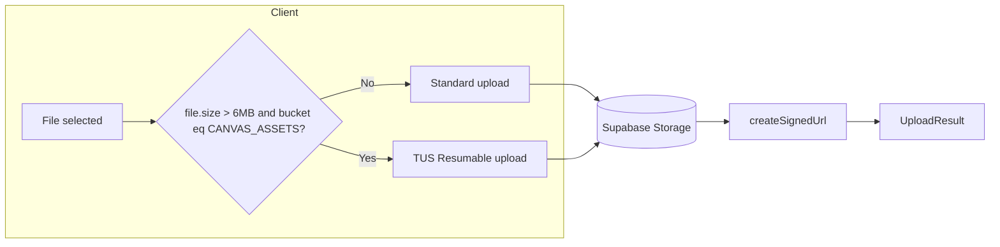

# 6MB 초과 시 TUS Resumable(멀티파트) 업로드 계획

## 현재 구조

- [use-supabase-storage.ts](apps/web/src/domains/storage/hooks/use-supabase-storage.ts): `upload()`가 항상 `supabase.storage.from(bucket).upload(path, file, ...)` 한 번에 전송.
- [validation.ts](apps/web/src/domains/storage/lib/validation.ts): 오디오/문서는 6MB 초과 시 에러.
- 호출처: FileRouterBlock, usePdfBlock, useAudioBlockData, audio-upload/record 툴바, clipboard paste, image block, settings-dialog 등. 모두 동일한 `upload(options)` → `UploadResult` 사용.

## 목표

- **≤6MB**: 기존 Standard Upload 유지.
- **>6MB** 이고 `bucket === CANVAS_ASSETS`인 경우: TUS Resumable Upload 사용(청크 6MB, 이어받기·진행률 지원).
- 반환 형태는 기존과 동일(`url`, `path`, `size`, `mimeType` 등)으로 유지해 호출부 수정 없음.

## 제약 사항 (Supabase 공식)

- Resumable 엔드포인트: `https://<projectId>.storage.supabase.co/storage/v1/upload/resumable` (direct hostname 권장).
- 청크 크기: **6MB 고정**.
- 인증: `Authorization: Bearer <session.access_token>`.
- 메타데이터: `bucketName`, `objectName`(= storage path), `contentType`, `cacheControl`.
- 업로드 URL 유효기간: 24시간.

---

## 구현 계획

### 1. 의존성 추가

- **apps/web**: `tus-js-client` 추가 (Supabase 문서 권장, Uppy는 선택 사항).
- 패키지: `pnpm add tus-js-client` (타입은 `@types/tus-js-client` 있으면 추가, 없으면 타입 선언만).

### 2. Supabase Project ID 유틸

- **위치**: [apps/web/src/domains/storage/lib/](apps/web/src/domains/storage/lib/) 또는 `@/config` 활용.
- **역할**: `NEXT_PUBLIC_SUPABASE_URL`(또는 `config.supabase.url`)에서 project ref 추출.
- **로직**: `new URL(url).hostname.split('.')[0]` (예: `https://abcdefgh.supabase.co` → `abcdefgh`).
- **사용처**: Resumable 엔드포인트 URL 생성. 클라이언트 전용이므로 `config.supabase.url`이 브라우저에서 접근 가능한지 확인(필요 시 `NEXT_PUBLIC_` 사용).

### 3. 검증(validation) 완화

- **파일**: [apps/web/src/domains/storage/lib/validation.ts](apps/web/src/domains/storage/lib/validation.ts).
- **변경**: `MAX_AUDIO_SIZE`, `MAX_DOCUMENT_SIZE`를 **50MB**로 상향 (현재 6MB).
- **이유**: 6MB 초과 파일을 Resumable로 받기 위해 허용 상한을 올림. 50MB는 Supabase Free tier bucket 한도와 맞추기 위함(필요 시 상수로 분리해 Pro에서 더 크게 설정 가능).

### 4. useSupabaseStorage.upload 분기 및 Resumable 구현

- **파일**: [apps/web/src/domains/storage/hooks/use-supabase-storage.ts](apps/web/src/domains/storage/hooks/use-supabase-storage.ts).

**분기 조건**

- `bucket === StorageBucket.CANVAS_ASSETS && file.size > 6 * 1024 * 1024` → Resumable.
- 그 외(다른 버킷 또는 ≤6MB) → 기존 Standard Upload 그대로.

**공통 유지**

- 경로 생성: 기존처럼 `providedPath` 또는 `generateCanvasAssetPath({ orgId, workspaceId, fileName: file.name })` 사용.
- `validateFile(file)` 먼저 호출(위에서 50MB까지 허용하므로 6MB~50MB 통과).

**Resumable 전용 로직 (새 함수 또는 upload 내부 분기)**

1. `supabase.auth.getSession()` → `session.access_token`.
2. `endpoint = \`https://${projectId}.storage.supabase.co/storage/v1/upload/resumable`.
3. `new tus.Upload(file, { ... })`:

- `endpoint`, `retryDelays: [0, 3000, 5000, 10000, 20000]`,
- `headers`: `authorization: Bearer ${access_token}`, `x-upsert: 'false'`(기본 덮어쓰기 방지),
- `uploadDataDuringCreation: true`, `removeFingerprintOnSuccess: true`,
- `metadata`: `bucketName`, `objectName: path`, `contentType: file.type`, `cacheControl: 3600`,
- `chunkSize: 6 * 1024 * 1024`,
- `onProgress(bytesUploaded, bytesTotal)`: `setProgress` 및 `onProgress?.(percentage)` 호출,
- `onSuccess`: 업로드 완료 후 `supabase.storage.from(bucket).createSignedUrl(path, ONE_DAY_IN_SECONDS)` 호출해 `url` 획득 → `{ url, path, size: file.size, mimeType: file.type }` 반환(기존 `UploadResult` 형태),
- `onError`: 기존과 동일한 `StorageError` 형태로 `setError` 후 reject.

1. `upload.findPreviousUploads().then(...)` 후 `upload.start()` (이어받기 지원).
2. `setIsUploading(true/false)` 및 `setProgress(0/100)`는 Resumable 경로에서도 동일하게 처리.

**USER_AVATARS 등 다른 버킷**

- Resumable 적용 대상에서 제외(기존처럼 항상 Standard). 아바타는 보통 5MB 이하로 제한되어 있음.

### 5. UI 쪽 크기 한도 (PDF/오디오/파일 라우터)

- **현재**: PDF/오디오/FileRouter에서 `maxSize`를 6MB로 두어 6MB 초과 파일 선택 자체가 막혀 있음.
- **변경**: Resumable을 쓰려면 **50MB**(또는 validation과 동일한 상한)까지 선택 가능하게 올림.
- **파일**:
  - [use-pdf-block.ts](apps/web/src/domains/block-management/frontend/components/block/block-type/pdf/core/use-pdf-block.ts): `MAX_SIZE_MB = 6` → **50** (또는 공통 상수로 분리).
  - [use-audio-block-data.ts](apps/web/src/domains/block-management/frontend/components/block/block-type/audio/core/use-audio-block-data.ts): 동일하게 **50**.
  - [file-router-block.tsx](apps/web/src/domains/canvas-management/frontend/components/react-flow-wrapper/components/router-block/file-router-block.tsx): `maxSizeMB = 6` → **50**.
  - [pdf-empty-state.tsx](apps/web/src/domains/block-management/frontend/components/block/block-type/pdf/components/block-ui/pdf-empty-state.tsx): 표시 문구 "Max 6MB" → "Max 50MB" (또는 동일 상수 참조).
- **이미지**: 기존 10MB 유지(Resumable 대상 아님).

### 6. 버킷/전역 한도 (선택)

- Supabase 대시보드 또는 마이그레이션에서 `canvas-assets` 버킷 `file_size_limit`이 50MB 이상인지 확인. 현재 [20251121141354_setup_storage_buckets.sql](apps/web/supabase/migrations/20251121141354_setup_storage_buckets.sql)에 50MB로 되어 있으면 그대로 사용 가능. Pro 이상에서 더 큰 파일을 허용할 경우 전역/버킷 한도와 validation·UI 상한을 함께 올리면 됨.

### 7. 테스트 포인트

- 6MB 이하 PDF/오디오: 기존처럼 Standard 업로드로 성공.
- 6MB 초과(예: 10MB) PDF/오디오: Resumable로 업로드, 진행률 표시, 완료 후 signed URL로 재생/다운로드 가능.
- 업로드 중 새로고침 후 재시도 시 TUS 이어받기 동작 확인(선택).
- 다른 버킷(user-avatars) 또는 이미지 업로드: 변경 없음.

---

## 데이터 흐름 (요약)

- **Standard**: 기존과 동일. `supabase.storage.from(bucket).upload(path, file)` → signed URL.
- **Resumable**: `tus.Upload` → direct hostname으로 청크 전송 → 완료 후 동일하게 `createSignedUrl(path)` → 동일 `UploadResult` 반환.

---

## 작업 순서 제안

1. 의존성 추가 및 Project ID 유틸 구현.
2. validation에서 오디오/문서 상한 50MB로 완화.
3. useSupabaseStorage에 Resumable 분기 및 TUS 업로드 구현.
4. PDF/오디오/FileRouter의 maxSize(및 UI 문구) 50MB로 변경.
5. 수동 테스트(6MB 이하/초과, 다른 버킷).
6. (선택) canvas-assets 버킷 file_size_limit 확인/문서화.
