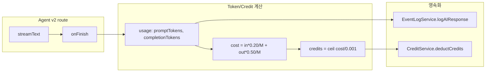

# AI 에이전트 토큰 기반 크레딧 차감 로직

## 현재 상태


| 구성요소         | 상태                                                                                                                                                                    |
| ------------ | --------------------------------------------------------------------------------------------------------------------------------------------------------------------- |
| Agent v2 API | `[route.ts](apps/web/src/app/api/agent/v2/route.ts)` - `onFinish`에서 `usage`(promptTokens, completionTokens, totalTokens) 수신, 단 **logAIResponse에 토큰 미전달**              |
| Event Log    | `[logAIResponse](apps/web/src/domains/event-management/backend/services/event-log.service.ts)` - `tokens?: { input, output }` 지원, aggregate는 `reasoning`, `cached` 지원 |
| 크레딧 시스템      | **미구현** - Stripe 구독 계획만 존재, `credit_balances`, `credit_transactions`, `CreditService` 없음                                                                              |


---

## plan.md 정산 규칙 (요약)

- **1 credit = $0.001** (원가)
- 공식: `credits = ceil(cost / 0.001)`
- Grok 4.1 Fast: **input $0.20/M**, **output $0.50/M** (reasoning 토큰도 output 단가)
- Agent Chat은 **Flexible credits** 소비

---

## 데이터 흐름




---

## 구현 계획

### 1. 토큰 → 크레딧 계산 유틸

새 파일: `apps/web/src/domains/subscription/shared/utils/token-credit-calculator.ts`

- **입력**: `{ promptTokens, completionTokens }` (xAI reasoning은 completion에 포함)
- **출력**: `{ costUsd: number, credits: number }`
- 공식:
  - `costUsd = (promptTokens * 0.20 / 1_000_000) + (completionTokens * 0.50 / 1_000_000)`
  - `credits = Math.ceil(costUsd / 0.001)`
- 모델별 단가를 나중에 확장 가능하도록 상수/맵 형태로 분리

### 2. Event Log 토큰 전달

`[event-log.service.ts](apps/web/src/domains/event-management/backend/services/event-log.service.ts)`의 `logAIResponse`:

- `tokens` 타입 확장: `{ input: number; output: number; reasoning?: number; cached?: number }` 또는 `number`
- `logAIResponse` 호출 시 `usage`에서 `{ input: promptTokens, output: completionTokens }` 전달
- Aggregate는 이미 `TokenUsage`(input, output, reasoning, cached) 지원하므로 service만 확장

### 3. Agent v2 route 수정

`[route.ts](apps/web/src/app/api/agent/v2/route.ts)` `onFinish` 내부:

1. `usage`로 `calculateCreditsFromTokens(usage)` 호출
2. `eventLogService.logAIResponse`에 `tokens`, `model` 전달
3. `CreditService.deductCredits(userId, credits, metadata)` 호출

### 4. 크레딧 차감 인터페이스 (Facade)

크레딧 시스템이 아직 없으므로:

- **옵션 A**: `CreditDeductionService` 인터페이스 정의 + **No-op 구현**
  - 실제 차감 로직은 Stripe 구독 Phase 5 완료 후 교체
- **옵션 B**: 차감 호출을 주석/조건부로 두고, 계획만 명시

권장: **옵션 A** — 인터페이스와 No-op 구현으로 통합 포인트를 명확히 두고, 이후 `DeductCreditsService`를 실제 DB 연동으로 교체.

```typescript
// apps/web/src/domains/subscription/backend/services/credit-deduction.interface.ts
export interface CreditDeductionService {
  deductForAIUsage(params: {
    userId: string;
    credits: number;
    metadata: { agentExecutionId: string; model: string; tokens: TokenUsage };
  }): Promise<{ success: boolean; balanceAfter?: number; error?: string }>;
}
```

### 5. 바디 단위 결정

- **User vs Org**: Stripe 계획의 `credit_balances`는 `user_id` 기준. plan.md는 “Billing unit: Organization”이지만, 구현 단계에서는 **userId** 기준 차감으로 진행 (이후 org 기반 정책으로 확장 가능).
- **차감 실패 시 동작**: 잔액 부족 시 `success: false` 반환 → 에이전트 응답은 이미 스트리밍 완료된 상태. 따라서 **사후 차감**이며, 부족 시:
  - 차감 실패 로그 기록
  - (선택) 사용자에게 “크레딧 부족” 알림 또는 다음 요청 시 사전 체크

---

## 파일 변경 요약


| 파일                                                                | 변경 내용                                        |
| ----------------------------------------------------------------- | -------------------------------------------- |
| `subscription/shared/utils/token-credit-calculator.ts`            | 신규 — 토큰 → cost → credits 계산                  |
| `subscription/backend/services/credit-deduction.interface.ts`     | 신규 — 차감 인터페이스                                |
| `subscription/backend/services/no-op-credit-deduction.service.ts` | 신규 — No-op 구현                                |
| `event-management/.../event-log.service.ts`                       | `logAIResponse`에 tokens, model 전달            |
| `app/api/agent/v2/route.ts`                                       | onFinish에서 계산 → event log → credit deduct 호출 |


---

## 열린 결정

1. **사전 잔액 체크**: 에이전트 실행 전 `checkBalance`로 크레딧 부족 시 요청 거부할지, 아니면 사후 차감만 할지
2. **멀티 스텝**: `onFinish`는 전체 run 기준 1회 호출이므로, 멀티 스텝이어도 1회만 차감 — 추가 조치 불필요
3. **xAI reasoning 분리**: provider가 `reasoningTokens`를 별도로 주면 output 단가 적용해 계산에 포함. 현재 AI SDK `usage`가 reasoning을 분리하는지 확인 후, 필요 시 calculator 확장

