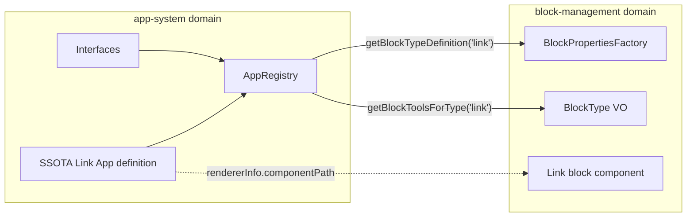

# 앱 도메인 기본 시스템 및 링크 블록 연결 계획

## 목표

- **app-system 도메인**: 블록 타입의 “정의 레이어” (AppDefinition, BlockTypeDefinition, AppRegistry)를 담당.
- **block-management**: 기존처럼 블록 인스턴스·퍼시스턴스·UI를 담당하되, app-system을 **참조**하여 link 타입의 스키마/도구 정보를 가져온다.
- **첫 번째 예제**: SSOTA Link App 한 개만 built-in으로 등록하고, link 블록과만 연동한다.

## 아키텍처 관계

- app-system은 block-management를 import하지 않는다 (경로 문자열만 참조).
- block-management만 app-system을 import하여 레지스트리 조회.

---

## 1. app-system 도메인 구조 생성

**경로**: [apps/web/src/domains/app-system/](apps/web/src/domains/app-system/)

- `shared/` — 다른 도메인과 공유하는 계약(인터페이스·타입·레지스트리). 백엔드 전용 서비스는 이번 범위에 포함하지 않음.
- `frontend/` — 다른 시스템(block-management, 에이전트 등)이 참여·소비하는 쪽. GUI 프론트엔드가 아니라 “참여자 입장의 프론트”를 의미함.

구조:

- `shared/interfaces/` — 앱/블록 타입/도구 인터페이스
- `shared/types/` — AppCategory 등 공통 타입
- `shared/registry/` — AppRegistry 싱글턴
- `frontend/apps/built-in/` — SSOTA Link App 정의 (다른 도메인이 참조하는 앱 정의)
- `frontend/apps/index.ts` — BUILT_IN_APPS export

---

## 2. 인터페이스 및 타입 정의

참고: [Architecture.md §9.2 Step A-1](docs/plans/app-system/Architecture.md), [Architecture.md §7.1](docs/plans/app-system/Architecture.md).

### 2.1 타입 ([shared/types/app.types.ts](apps/web/src/domains/app-system/shared/types/app.types.ts))

- `AppCategory`: `'built-in' | 'first-party' | 'community'`
- Block view mode(original / note / card)는 캔버스·블록 공통 개념으로, block-management 전역 enum에서 이미 정의되어 있음. 대부분 블록이 original·note·card 모두 지원하므로 앱 정의에서 따로 두지 않음. app-system에는 정의하지 않음.

### 2.2 도구 정의 ([shared/interfaces/tool-definition.interface.ts](apps/web/src/domains/app-system/shared/interfaces/tool-definition.interface.ts))

- `IToolDefinition`: `name`, `description`, `inputSchema` (JSON Schema 형태 또는 단순 Record), `executionSide`: `'server' | 'client'`
- 에이전트 툴 설명·입력 스키마에 사용.

### 2.3 블록 타입 정의 ([shared/interfaces/block-type-definition.interface.ts](apps/web/src/domains/app-system/shared/interfaces/block-type-definition.interface.ts))

- `IBlockTypeDefinition`:  
`typeName`, `displayName`, `icon`, `propertiesSchema`, `defaultProperties` (선택), `blockTools: IToolDefinition[]`, `isEditable`, `openType`, `sourceCapability?` (선택)
- view mode(original/note/card)는 앱 정의에 넣지 않음 — 전역 블록 뷰 모드이므로 block-management에서만 사용.
- `sourceCapability`: `{ sourceType: string; extractable: boolean; summarizable: boolean }` (SSOTA-Link-App §2, Architecture §6.3).

### 2.4 앱 정의 ([shared/interfaces/app-definition.interface.ts](apps/web/src/domains/app-system/shared/interfaces/app-definition.interface.ts))

- `IAppDefinition`:  
`id`, `name`, `slug`, `description`, `category: AppCategory`, `blockTypeDefinitions: IBlockTypeDefinition[]`, `producibleBlockTypes: string[]`, `appTools: IToolDefinition[]`, `rendererInfo: { componentPath: string; editorPath?: string }`
- 이번 단계에서 `blockContextActions`, `subAgents`는 제외해도 됨 (추후 Phase에서 추가).

---

## 3. AppRegistry 구현

**파일**: [shared/registry/app-registry.ts](apps/web/src/domains/app-system/shared/registry/app-registry.ts)

- **싱글턴** (또는 정적 메서드만 사용하는 클래스).
- **메서드**:
  - `registerApp(app: IAppDefinition): void`
  - `getApp(appId: string): IAppDefinition | undefined`
  - `getAppByBlockType(typeName: string): IAppDefinition | undefined` — blockTypeDefinitions 중 typeName 일치하는 앱 반환
  - `getBlockTypeDefinition(typeName: string): IBlockTypeDefinition | undefined`
  - `getBlockToolsForType(typeName: string): IToolDefinition[]` — 해당 블록 타입의 blockTools
  - `getAllApps(): IAppDefinition[]`
  - `initialize(): void` — BUILT_IN_APPS.forEach(registerApp)
- **초기화**: BUILT_IN_APPS는 `frontend/apps/index.ts`에서 import. 첫 조회 시 레지스트리가 비어 있으면 `initialize()` 호출 (lazy init). 별도 앱 진입점에서 호출하지 않아도 됨.

---

## 4. SSOTA Link App 정의 (링크 블록 연결의 “정의” 측)

**파일**: [frontend/apps/built-in/ssota-link.app.ts](apps/web/src/domains/app-system/frontend/apps/built-in/ssota-link.app.ts)

[SSOTA-Link-App.md §2, §5, §8](docs/plans/app-system/SSOTA-Link-App.md) 기준으로 한 개의 `IAppDefinition` 객체 export.

- **id / name / slug**: 예: `ssota-link`, `SSOTA Link App`, `ssota-link`
- **category**: `'built-in'`
- **blockTypeDefinitions**: 길이 1, typeName `'link'`
  - **propertiesSchema**: 기획 §8 구조를 JSON Schema 스타일로 표현 (url, og, domain, **tabs** 포함). 현재 [LinkBlockProperties](apps/web/src/domains/block-management/shared/value-objects/block-properties/link.vo.ts)에 tabs가 없으므로, 기획서 §8의 tabs 구조를 그대로 스키마에 반영 (실제 VO 확장은 다음 단계에서 block-management에서 수행).
  - **defaultProperties**: `LinkBlockPropertiesVO.createDefault().toJSON()`과 호환되는 형태. tabs는 빈 객체 또는 기획 §8 기본 구조.
  - **blockTools**: §5 기준 — `summarize`, `screenshot`, `extractImages`, `extractDesign`, `extractJSON` (각각 name, description, inputSchema, executionSide: `'server'`).
  - **isEditable**: false
  - view mode는 앱 정의에 두지 않음 (전역 original/note/card는 block-management에서 공통 처리).
  - **openType**: true
  - **sourceCapability**: `{ sourceType: 'link', extractable: true, summarizable: true }`
- **producibleBlockTypes**: `['link']`
- **appTools**: `[]`
- **rendererInfo.componentPath**: block-management의 link 블록 컴포넌트 경로 (예: `@/domains/block-management/.../block-type/link` 또는 상대 경로 규칙에 맞는 문자열). 실제 렌더링은 block-management가 하므로 경로만 참조.

[frontend/apps/index.ts](apps/web/src/domains/app-system/frontend/apps/index.ts)에서 `BUILT_IN_APPS = [SSotaLinkApp]` export (이번 계획에서는 링크 앱만 등록).

---

## 5. block-management와 app-system 연동

### 5.1 의존성

- block-management에서 app-system의 `AppRegistry` (또는 getter 함수)만 import.
- app-system은 block-management를 import하지 않음.

### 5.2 BlockPropertiesFactory ([factory.ts](apps/web/src/domains/block-management/shared/value-objects/block-properties/factory.ts))

- **createForBlockType(blockTypeVO)** 동작 변경:
  - `AppRegistry.getBlockTypeDefinition(blockTypeVO.value)` 로 정의 조회.
  - 정의가 있고 `defaultProperties`가 있으면, 해당 블록 타입의 기존 VO에 맞춰 `fromJSON(defaultProperties)` 호출하여 반환 (link의 경우 `LinkBlockPropertiesVO.fromJSON`).
  - 정의가 없거나 defaultProperties가 없으면 **기존처럼** 현재 registry Map에서 factory 함수로 `createDefault()` 호출 — 기존 동작 유지.
- **createFromJSON** / **getSupportedBlockTypes** / **isSupported** / **register** 는 이번에 변경하지 않음 (외부 인터페이스 유지).

이렇게 하면 link 타입은 app-system에 정의된 defaultProperties를 쓰고, 나머지 타입은 기존 VO.createDefault()를 그대로 사용한다.

### 5.3 BlockType VO의 getAvailableTools ([block-type.vo.ts](apps/web/src/domains/block-management/shared/value-objects/block-type.vo.ts))

- `getAvailableTools()` 내부:
  - `AppRegistry.getBlockToolsForType(this._value)` 를 호출해서 길이가 0보다 크면, 해당 도구들의 `name` 배열을 반환.
  - 없으면 기존 하드코딩 맵 `tools[this._value]` 반환.
- 결과: link 타입의 “사용 가능한 도구”가 앱 정의의 blockTools와 일치하며, 에이전트/BlockToolService가 나중에 이 목록을 사용할 수 있다.

### 5.4 순환 의존성 방지

- app-system이 block-management를 참조하지 않으므로, app-system은 block-management의 LinkBlockPropertiesVO를 직접 import하지 않는다.
- frontend/apps/built-in/ssota-link.app.ts의 `defaultProperties`는 **plain object** (기획 §8 구조 또는 현재 LinkBlockProperties와 호환되는 형태)로만 정의.
- BlockPropertiesFactory 쪽에서만 `LinkBlockPropertiesVO.fromJSON(appRegistryDefault)` 를 호출.

---

## 6. 초기화 및 진입점

- AppRegistry는 **lazy initialize**: `getApp`, `getBlockTypeDefinition`, `getBlockToolsForType` 등 첫 호출 시 `registry.size === 0`이면 `initialize()` 실행.
- Next.js에서 서버/클라이언트 모두에서 사용 가능하도록, app-system은 순수 모듈만 두고, 레지스트리 접근 시점에 한 번만 초기화되게 하면 된다.
- (선택) instrumentation 또는 layout에서 `AppRegistry.initialize()` 를 한 번 호출해 두어도 된다. 필수는 아니다.

---

## 7. 이번 계획에서 하지 않는 것

- **DB 스키마 변경**: blocks.app_id, app_definitions, app_installations 테이블 미추가.
- **block_type enum → TEXT 전환**: 하지 않음.
- **에이전트 executeBlockTool 추가**: Phase C로 미룸. 이번에는 “정의와 레지스트리 + block-management 연동”만.
- **Link block UI/탭/Block Tool 실행 로직**: properties.tabs 확장, 에디터 탭, summarize/screenshot 등 실제 실행은 별도 작업.
- **다른 built-in 앱**(youtube, markdown 등) 정의: 패턴만 확립하고, 링크 앱 하나만 등록.

---

## 8. 검증

- app-system 도메인만 단독으로: `AppRegistry.initialize()` 후 `getApp('ssota-link')`, `getBlockTypeDefinition('link')`, `getBlockToolsForType('link')` 호출 시 기대값 반환.
- block-management: link 타입으로 새 블록 생성 시 `BlockPropertiesFactory.createForBlockType(link)` 가 앱 정의의 defaultProperties 기반으로 VO를 만드는지 확인.
- `BlockType('link').getAvailableTools()` 가 앱 정의의 blockTools 이름 배열과 동일한지 확인.

---

## 9. 파일 변경 요약

| 구분  | 경로                                                              | 작업                                                             |
| --- | --------------------------------------------------------------- | -------------------------------------------------------------- |
| 신규  | app-system/shared/types/app.types.ts                            | AppCategory 등 타입 정의                                            |
| 신규  | app-system/shared/interfaces/tool-definition.interface.ts       | IToolDefinition                                                |
| 신규  | app-system/shared/interfaces/block-type-definition.interface.ts | IBlockTypeDefinition                                           |
| 신규  | app-system/shared/interfaces/app-definition.interface.ts        | IAppDefinition                                                 |
| 신규  | app-system/shared/registry/app-registry.ts                      | AppRegistry + lazy init                                        |
| 신규  | app-system/frontend/apps/built-in/ssota-link.app.ts             | SSOTA Link App 정의                                              |
| 신규  | app-system/frontend/apps/index.ts                               | BUILT_IN_APPS export                                           |
| 수정  | block-management/.../block-properties/factory.ts                | createForBlockType에서 AppRegistry defaultProperties 사용 (link 등) |
| 수정  | block-management/.../block-type.vo.ts                           | getAvailableTools에서 AppRegistry.getBlockToolsForType 우선 사용     |

이렇게 하면 “앱 도메인의 기본 시스템”과 “링크 블록을 그 정의와 연결”하는 부분까지 한 번에 정리된다.