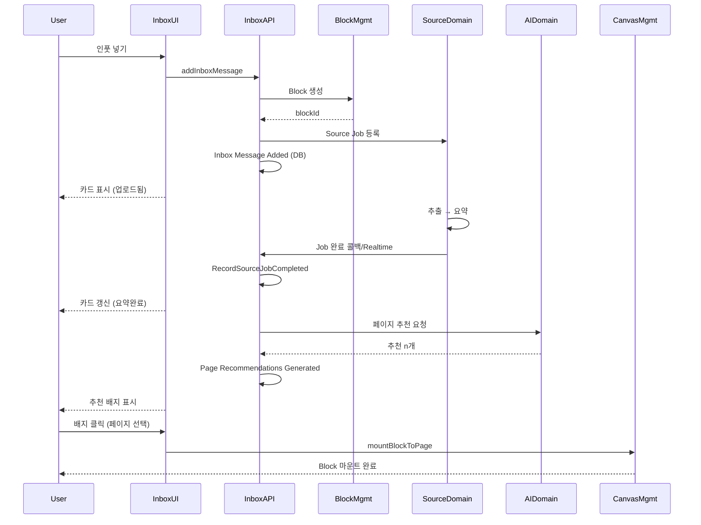

# Inbox 전체 구현 계획

## 1. 배경 및 범위

**목표**: "복붙 지옥 해결" 소구의 체감 와우를 제공하는 Quick Capture Inbox 구현

**핵심 가치**: `넣는 순간 정리된다` — 3~10초 내 제목 추출, 한 줄 요약, 소스 타입 분류 표시

**현재 코드베이스 활용**:

- `blocks`, `block_mounts`, `sources`, `source_jobs`, `source_summaries` 스키마 존재
- [ensureSourceAndJobAction](apps/web/src/domains/source-management/actions/source/ensure-source-and-job.action.ts) — Source Job 등록 패턴
- [createAndMountBlockAction](apps/web/src/domains/canvas-management/actions/block-mount/create-and-mount-block.action.ts) — Block 생성 + 마운트
- `useSourceJobRealtime`, `useSourceJobForBlock` — Source Job 상태 실시간 구독

---

## 2. 아키텍처 개요

```mermaid
flowchart TB
    subgraph Frontend [Frontend - /inbox]
        InboxPage[/inbox 페이지]
        InputButton[인풋 넣기 버튼]
        ChatBubbles[채팅 버블 목록]
        CardView[카드 뷰]
        BottomSheet[바텀시트 상세]
        RecChips[추천 페이지 배지]
    end

    subgraph InboxDomain [Inbox Management Domain]
        InboxSessionAgg[Inbox Session Aggregate]
        PageRecHandler[Page Recommendation Handler]
    end

    subgraph External [External Domains / ACL]
        BlockACL[Block Management ACL]
        SourceACL[Source Domain Job ACL]
        WorkspaceACL[Workspace Page ACL]
        CanvasACL[Canvas Block Mount ACL]
        AIACL[AI Recommendation ACL]
        StorageACL[Storage ACL]
    end

    InboxPage --> InputButton
    InputButton --> ChatBubbles
    ChatBubbles --> CardView
    CardView --> BottomSheet
    CardView --> RecChips
    InboxSessionAgg --> BlockACL
    InboxSessionAgg --> SourceACL
    PageRecHandler --> WorkspaceACL
    PageRecHandler --> AIACL
    RecChips --> CanvasACL
```


---

## 3. Phase별 구현 계획

### Phase 0: 인프라 및 스키마

**목표**: Inbox 도메인에 필요한 DB 스키마 및 기본 구조 확보


| 작업                 | 상세                                                                                         | 참조 문서                                                                                                   |
| ------------------ | ------------------------------------------------------------------------------------------ | ------------------------------------------------------------------------------------------------------- |
| inbox_sessions 테이블 | `id`, `workspace_id`, `status`, `created_at`                                               | [03-software-design.md](docs/event-domain-design/domains/inbox-management-domain/03-software-design.md) |
| inbox_messages 테이블 | `id`, `session_id`, `source_type`, `source_ref`, `block_id`, `job_id`, `processing_status` | Software Design §InboxMessage                                                                           |
| Drizzle 스키마        | `inbox-management-schema.ts` 신규, 기존 `index.ts`에 등록                                         | source-management-schema 패턴 참고                                                                          |
| RLS 정책             | workspace 기반 격리, 활성 세션 1개 제약                                                               | Process Model §워크스페이스 격리                                                                                |


**처리 상태 enum**: `uploaded` | `extracting` | `summary_complete` | `failed`

---

### Phase 1: 백엔드 — Inbox Session Aggregate

**목표**: 세션 생성/복원, 메시지 추가, Source Job 결과 반영


| 작업                        | 상세                                                                                                        | Command/Event                                                                                                      |
| ------------------------- | --------------------------------------------------------------------------------------------------------- | ------------------------------------------------------------------------------------------------------------------ |
| Inbox Session Aggregate   | CreateInboxSession, RestoreInboxSession, AddInboxMessage, RecordSourceJobCompleted, RecordSourceJobFailed | [03-software-design.md](docs/event-domain-design/domains/inbox-management-domain/03-software-design.md) §Aggregate |
| Inbox Session Repository  | Drizzle 기반 CRUD, `findActiveByWorkspace`                                                                  | -                                                                                                                  |
| AddInboxMessage Service   | Block 생성(Block ACL) → blockId 연결 → Source Job 등록(Source ACL) → AddInboxMessage                            | Process Model Scenario 1 Seq 2                                                                                     |
| Source Job Result Handler | Job 완료/실패 Webhook 또는 Realtime 구독 → RecordSourceJobCompleted/Failed                                        | Process Model Scenario 0                                                                                           |


**ACL 구현**:

- **Block Management ACL**: 기존 createBlock + `ensureSourceAndJob` 패턴 활용
- **Source Domain ACL**: 기존 `ensureSourceJobService`, `createSourceJob` 활용
- **Storage ACL**: Supabase Storage 업로드 URL 획득

**Server Actions**:

- `createOrRestoreInboxSessionAction(workspaceId)`
- `addInboxMessageAction({ sessionId, sourceType, sourceData })` — 파일/URL/텍스트/오디오
- Source Job 결과는 Realtime 구독 또는 API route `/api/inbox/job-callback` (Webhook)

---

### Phase 2: 백엔드 — Page Recommendation Handler

**목표**: 요약 완료 후 LLM 기반 페이지 추천 생성


| 작업                                 | 상세                                                      | 참조                                       |
| ---------------------------------- | ------------------------------------------------------- | ---------------------------------------- |
| Page Recommendation Domain Service | Block 요약 + 사용자 Page 목록 → AI API → 추천 n개                 | Process Model Scenario 2                 |
| Workspace ACL                      | 페이지 목록 조회 (제목, 설명, 최근 블록)                               | Workspace Management                     |
| AI ACL                             | 추천 요청/응답 스키마 변환                                         | AI Management                            |
| page_recommendations Read Model    | `message_id`, `block_id`, `status`, `recommendations[]` | Software Design §PageRecommendationsView |


**트리거**: 요약 완료 시 (Source Job completed) → Page Recommendation Handler 호출

**Server Actions**:

- `getPageRecommendationsAction(messageId)` — 추천 조회
- `mountBlockToPageAction(blockId, pageId)` — 사용자 선택 시 Canvas ACL 호출

---

### Phase 3: 프론트엔드 — /inbox 페이지 및 기본 UX

**목표**: 채팅형 Inbox UI, 인풋 넣기, 카드 표시


| 작업             | 상세                                                    | 경로                                                             |
| -------------- | ----------------------------------------------------- | -------------------------------------------------------------- |
| /inbox 라우트     | `(dashboard)/inbox/` 또는 `(dashboard)/r/[orgId]/inbox` | Dashboard 레이아웃 내                                               |
| Inbox 페이지 컴포넌트 | 채팅형 레이아웃, 빈 상태 + "인풋 넣기" 버튼                           | -                                                              |
| 소스 타입 선택 UI    | 파일 / 링크 / 오디오 / 메모 / 유튜브                              | [inbox-feature-spec.md](docs/plans/inbox-feature-spec.md) §4.1 |
| 업로드/입력 플로우     | 파일 업로드 → Storage → addInboxMessage                    | -                                                              |
| 채팅 버블 목록       | InboxSessionView 기반, 메시지별 카드                          | Read Model §InboxSessionView                                   |
| 처리 상태 표시       | uploaded → extracting → summary_complete              | [inbox-feature-spec.md](docs/plans/inbox-feature-spec.md) §4.3 |


**실시간 상태**: Supabase Realtime `inbox_messages` + `source_jobs` 구독 (기존 `useSourceJobRealtime` 패턴 확장)

---

### Phase 4: 프론트엔드 — 바텀시트 및 추천 배지

**목표**: 카드 클릭 시 상세 보기, 추천 페이지 배지 + 마운트


| 작업        | 상세                                      | 참조                                                             |
| --------- | --------------------------------------- | -------------------------------------------------------------- |
| 바텀시트 상세   | 원문 메타, 추출 텍스트, 요약, 핵심 포인트               | [inbox-feature-spec.md](docs/plans/inbox-feature-spec.md) §5   |
| 추천 페이지 배지 | PageRecommendationsView 기반, 배지(chip) UI | [inbox-feature-spec.md](docs/plans/inbox-feature-spec.md) §6.3 |
| 마운트 액션    | 배지 클릭 → mountBlockToPageAction          | createAndMountBlockAction 활용                                   |


---

### Phase 5: 소스 타입별 처리 파이프라인

**목표**: 파일/링크/오디오/메모/유튜브별 추출·요약 연동


| 소스 타입   | 기존 연동                                 | 비고                               |
| ------- | ------------------------------------- | -------------------------------- |
| 파일(PDF) | ensureSourceAndJob (url: Storage URL) | sourceType: pdf                  |
| 링크      | ensureSourceAndJob                    | sourceType: link                 |
| 오디오     | ensureSourceAndJob (url: Storage URL) | sourceType: audio                |
| 메모      | Block만 생성, Source Job 없음              | text block, 요약은 Block content 기반 |
| 유튜브     | ensureSourceAndJob                    | sourceType: youtube              |


**메모 처리**: Block 생성 후 간단 요약(또는 원문 그대로) → PageRecommendationsView 생성

---

### Phase 6: 모바일 최적화 (Post-MVP)


| 작업        | 상세                                     |
| --------- | -------------------------------------- |
| 모바일 웹 최적화 | PWA, Share Target API (Share to SSOTA) |
| 음성 녹음     | 오디오 업로드 + sourceType: audio            |
| 모바일 UX    | "캔버스에 배치" 대신 "Page에 저장됨" 상태만 표시        |


---

### Phase 7: /chat 연동 (2단계)


| 작업               | 상세                      |
| ---------------- | ----------------------- |
| /chat에서 Block 저장 | 대화 결과를 노트/요약 Block으로 저장 |
| 소스 참조            | 명시적 선택(칩/멘션) + 자동 추천 혼합 |


---

## 4. 데이터 흐름 요약




---

## 5. 파일 구조 제안

```
apps/web/src/domains/inbox-management/
├── backend/
│   ├── services/
│   │   ├── inbox-session.service.ts      # Create/Restore/AddMessage
│   │   ├── source-job-result-handler.ts  # RecordSourceJobCompleted/Failed
│   │   └── page-recommendation-handler.ts
│   ├── repositories/
│   │   ├── implementations/drizzle-inbox-session.repository.ts
│   │   └── interfaces/inbox-session.repository.interface.ts
│   └── infrastructure/                   # ACL
│       ├── block-management.adapter.ts
│       ├── source-job.adapter.ts
│       ├── workspace-page.adapter.ts
│       ├── canvas-block-mount.adapter.ts
│       └── ai-recommendation.adapter.ts
├── frontend/
│   ├── components/
│   │   ├── inbox-page.tsx
│   │   ├── inbox-input-button.tsx
│   │   ├── inbox-message-list.tsx
│   │   ├── inbox-message-card.tsx
│   │   ├── inbox-bottom-sheet.tsx
│   │   └── page-recommendation-chips.tsx
│   └── hooks/
│       ├── use-inbox-session.ts
│       └── use-inbox-messages.ts
├── actions/
│   ├── create-or-restore-inbox-session.action.ts
│   ├── add-inbox-message.action.ts
│   ├── get-page-recommendations.action.ts
│   └── mount-block-to-page.action.ts
├── shared/
│   ├── entities/inbox-message.entity.ts
│   ├── aggregates/inbox-session.aggregate.ts
│   └── value-objects/
└── index.ts
```

---

## 6. 의존 관계 및 선행 조건


| Phase   | 선행 조건                                     |
| ------- | ----------------------------------------- |
| Phase 0 | -                                         |
| Phase 1 | Phase 0, Block/Source/Storage 기존 동작 확인    |
| Phase 2 | Phase 1, AI Management API (또는 유사 LLM 호출) |
| Phase 3 | Phase 1                                   |
| Phase 4 | Phase 2, Phase 3                          |
| Phase 5 | Phase 1~4, 소스 타입별 Extractor 확인            |
| Phase 6 | Phase 4                                   |
| Phase 7 | Phase 4, /chat 기존 구조                      |


---

## 7. 리스크 및 고려사항

1. **Source Job 콜백**: 현재 Source Domain이 Webhook을 제공하는지 확인 필요. 없으면 Realtime `source_jobs` 구독으로 대체
2. **메모 소스**: Source Job 없이 Block만 생성 시, 페이지 추천을 위한 "요약" 생성 경로 별도 필요 (간단 LLM 호출 또는 원문 일부 사용)
3. **inbox_messages ↔ source_jobs 매핑**: `inbox_messages.job_id` 또는 `inbox_messages.block_id`로 source_jobs 조회 (block_id 기준 unique)

---

## 8. 성공 지표

- [inbox-feature-spec.md](docs/plans/inbox-feature-spec.md) §13 개발 순서 1단계 체크리스트 충족
- 업로드 후 3~10초 내 요약 카드 표시
- 추천 배지 클릭 시 Block Mount 성공

