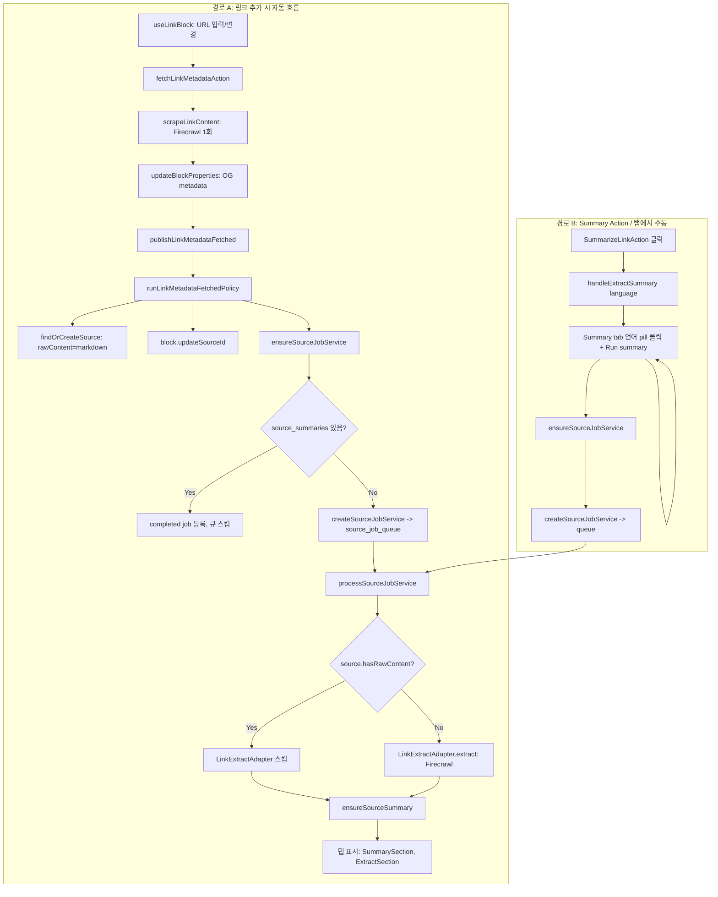

# 링크 관련 전체 흐름 분석 및 계획

## 1. 전체 흐름 개요

---

## 2. 경로별 상세 흐름

### 2.1 경로 A: 링크 추가 시 (자동)

| 단계                 | 파일                                                                                                                                                                                                                                                                                                                                                                                                                                            | 핵심 로직                                                                                                                  |
| ------------------ | --------------------------------------------------------------------------------------------------------------------------------------------------------------------------------------------------------------------------------------------------------------------------------------------------------------------------------------------------------------------------------------------------------------------------------------------- | ---------------------------------------------------------------------------------------------------------------------- |
| 1. 링크 추가           | [use-link-block.ts](apps/web/src/domains/block-management/frontend/components/block/block-type/link/core/use-link-block.ts)                                                                                                                                                                                                                                                                                                                   | `handleUrlSubmit` → `updateProperty('properties.url', draftUrl)` → `useEffect(url)` → `fetchMetadata(url)`             |
| 2. 메타데이터/스크래핑      | [fetch-link-metadata.action.ts](apps/web/src/domains/link-app-space/actions/metadata/fetch-link-metadata.action.ts)                                                                                                                                                                                                                                                                                                                           | `fetchLinkMetadataInternal`: `scrapeLinkContent(url)` → metadata + markdown 1회                                         |
| 3. 스크래핑 서비스        | [scrape-link-content.service.ts](apps/web/src/domains/link-app-space/backend/services/scrape-link-content.service.ts)                                                                                                                                                                                                                                                                                                                         | `app.scrape(url, { formats: ['markdown'] })` → metadata + markdown 반환                                                  |
| 4. 이벤트 정책          | [publish-link-metadata-fetched.service.ts](apps/web/src/domains/link-app-space/backend/services/link-metadata-fetched/publish-link-metadata-fetched.service.ts)                                                                                                                                                                                                                                                                               | `runLinkMetadataFetchedPolicy`: findOrCreateSource(rawContent: markdown), block.updateSourceId, ensureSourceJobService |
| 5. Job 등록          | [ensure-source-job.service.ts](apps/web/src/domains/source-management/backend/services/source-job/ensure-source-job.service.ts)                                                                                                                                                                                                                                                                                                               | source_summaries 있으면 completed job만, 없으면 createSourceJobService → pgmq                                                 |
| 6. Job 처리          | [process-source-job.service.ts](apps/web/src/domains/source-management/backend/services/source-job/process-source-job.service.ts)                                                                                                                                                                                                                                                                                                             | `!source.hasRawContent()` 일 때만 LinkExtractAdapter.extract (Firecrawl) 호출                                               |
| 7. Extract Adapter | [link-extract.adapter.ts](apps/web/src/domains/source-management/backend/services/extract/adapters/link-extract.adapter.ts)                                                                                                                                                                                                                                                                                                                   | Firecrawl `app.scrape(url, { formats: ['markdown'] })`                                                                 |
| 8. 탭 표시            | [link-editor-tabs.ts](apps/web/src/domains/block-management/frontend/components/block/block-type/link/config/link-editor-tabs.ts), [summary-section](apps/web/src/domains/block-management/frontend/components/block/block-type/link/components/section-tabs/summary-section/index.tsx), [extract-section](apps/web/src/domains/block-management/frontend/components/block/block-type/link/components/section-tabs/extract-section/index.tsx) | Note(기본), Summary, Extract. useSourceSummary, useSourceContent 사용                                                      |

### 2.2 경로 B: Summary Action / 탭에서 수동

| 단계            | 파일                                                                                                                                                                                                        | 핵심 로직                                                              |
| ------------- | --------------------------------------------------------------------------------------------------------------------------------------------------------------------------------------------------------- | ------------------------------------------------------------------ |
| 1. 요약 버튼      | [summarize-link-action.tsx](apps/web/src/domains/block-management/frontend/components/block/block-type/link/components/action-items/components/summarize-link-action.tsx)                                 | Sparkles 클릭 → `handleExtractSummary('ko')` (고정)                    |
| 2. Summary 탭  | [summary-section/index.tsx](apps/web/src/domains/block-management/frontend/components/block/block-type/link/components/section-tabs/summary-section/index.tsx)                                            | 언어 pill + "Run summary" → `handleExtractSummary(selectedLanguage)` |
| 3. Business 훅 | [use-link-summary-section.business.ts](apps/web/src/domains/block-management/frontend/components/block/block-type/link/components/section-tabs/summary-section/core/use-link-summary-section.business.ts) | `processSourceMutation.mutateAsync(language)`                      |
| 4. 서버 액션      | [process-source-summary.action.ts](apps/web/src/domains/source-management/actions/summary/process-source-summary.action.ts)                                                                               | `ensureSourceJobService({ blockId, sourceId, language })`          |
| 5. 이후         | 동일                                                                                                                                                                                                        | createSourceJobService → queue → processSourceJobService           |

---

## 3. Firecrawl 호출 구조

| 시점       | 조건                        | 호출 위치                                                                                                                       | Firecrawl 역할           |
| -------- | ------------------------- | --------------------------------------------------------------------------------------------------------------------------- | ---------------------- |
| 링크 추가 직후 | 항상                        | [scrape-link-content.service.ts](apps/web/src/domains/link-app-space/backend/services/scrape-link-content.service.ts)       | metadata + markdown 1회 |
| Job 처리 중 | `!source.hasRawContent()` | [link-extract.adapter.ts](apps/web/src/domains/source-management/backend/services/extract/adapters/link-extract.adapter.ts) | markdown 추출 (보완용)      |

정상 플로우에서는 `scrapeLinkContent`로 얻은 markdown을 `findOrCreateSource(..., rawContent: markdown)`에 넣어 Source에 저장하므로, `processSourceJobService`에서는 `source.hasRawContent() === true`가 되어 LinkExtractAdapter는 호출되지 않는다.  
markdown이 없을 때만 Job 처리 단계에서 LinkExtractAdapter로 Firecrawl을 한 번 더 호출한다.

---

## 4. 현재 구현 vs 계획 문서 차이

| 항목                      | [link-source-domain-integration-plan.md](docs/plans/app-system/link-source-domain-integration-plan.md) | 현재 구현                                                   |
| ----------------------- | ------------------------------------------------------------------------------------------------------ | ------------------------------------------------------- |
| 메타데이터 추출                | `fetchOpenGraphMetadata` (기존)                                                                          | `scrapeLinkContent` (Firecrawl, metadata + markdown 동시) |
| Source 생성 시 raw_content | plan에는 미언급                                                                                             | `findOrCreateSource(..., rawContent: markdown)` 로 전달    |
| Firecrawl 호출            | Job 처리 단계에서만 (LinkExtractAdapter)                                                                      | 링크 추가 시 1회 + 필요 시 Job에서 1회                              |
| link-block-tools Route  | 제거 예정                                                                                                  | 이미 제거된 것으로 보임 (git status 기준)                           |

---

## 5. 현재와 다른 점 정리 (개선·일관화 포인트)

### 5.1 문서와 구현 불일치

- 계획서는 OG 메타데이터 전용 fetch를 전제로 하고, Job 단계에서 Firecrawl으로 markdown 추출
- 실제로는 metadata fetch 단계부터 Firecrawl을 사용하고, markdown을 Source에 저장해 Job 단계에서 재스크래핑을 줄이는 형태
- 계획 문서를 현재 동작에 맞춰 업데이트할 필요가 있음

### 5.2 두 개의 Firecrawl 사용처

- [scrape-link-content.service.ts](apps/web/src/domains/link-app-space/backend/services/scrape-link-content.service.ts)
- [link-extract.adapter.ts](apps/web/src/domains/source-management/backend/services/extract/adapters/link-extract.adapter.ts)

두 곳 모두 Firecrawl `app.scrape(url, { formats: ['markdown'] })`를 사용한다.  
LinkExtractAdapter는 `source.hasRawContent()`가 false일 때만 실행되므로, 로직상 중복 호출은 최소화되어 있으나, 공통 유틸이나 어댑터로 추상화하면 유지보수가 쉬워진다.

### 5.3 언어 처리

- `publishLinkMetadataFetched`의 `language`는 `fetchLinkMetadataAction`의 `safeDto.language` (기본 `'en'`)를 사용
- Summary 탭에서는 `selectedLanguage`(언어 pill 선택)로 `processSourceSummaryAction` 호출
- Summarize 버튼은 항상 `'ko'` 고정 → UI와 데이터 모델의 언어 정책을 정리할 여지가 있음

### 5.4 SUPPORTED_LANGUAGES와 탭 표시

- [language-code.vo.ts](apps/web/src/domains/source-management/shared/value-objects/language-code.vo.ts): en, ko, ja, zh, es, fr, de, pt, ru, ar
- Summary 탭은 `availableSummaryLanguages`(이미 요약된 언어)만 pill로 표시
- "다른 언어로 요약"은 "Run summary"로 `handleExtractSummary(selectedLanguage)` 호출 시 해당 언어 job 등록

---

## 6. 제안하는 후속 작업

1. **계획 문서 업데이트**
  `link-source-domain-integration-plan.md`를 현재 플로우(metadata + markdown 동시 스크래핑, raw_content 사전 저장)에 맞게 수정
2. **Firecrawl 추상화 검토**
  `scrape-link-content.service`와 `link-extract.adapter`의 Firecrawl 호출을 공통 모듈 또는 어댑터로 통합 여부 검토
3. **언어 기본값 정리**
  Summarize 버튼의 `'ko'` 고정, metadata fetch 시 `language` 기본값(`'en'`) 등 정책을 문서화하고 필요 시 설정 가능하게 변경
4. **탭 UX 개선**
  아직 요약이 없는 언어도 선택 가능하도록 하고, 선택 시 "Run summary"를 더 명확하게 유도하는 방식 검토

---

## 7. YouTube vs Link Summary 탭 디자인 통일 계획

### 7.1 현재 차이점 비교

| 항목                | YouTube Summary Tab                                                                 | Link Summary Tab                                          |
| ----------------- | ----------------------------------------------------------------------------------- | --------------------------------------------------------- |
| **구조**            | Container → View 분리 (index → SummarySectionView)                                    | index에 모든 UI 포함, View 분리 없음                               |
| **컨테이너**          | SummarySectionContainer: pl-6 pr-12 py-3 min-h-[200px]                              | Box: px-6 py-4 space-y-4                                  |
| **sourceId 없음**   | error 표시 (defaultNoSourceMessage)                                                   | SectionEmptyState: "Enter a URL and load metadata first." |
| **언어 선택**         | LanguageSelector: Select 드롭다운, Globe 아이콘, 전체 SUPPORTED_LANGUAGES, available 시 Check | inline pill 버튼 (availableLanguages > 1일 때만), 제한적 매핑       |
| **Empty (요약 없음)** | SummaryNoSummaryState: Info 박스 + ExtractSummaryButton (full-width, Sparkles)        | SectionEmptyState: Info + "Run summary" Button            |
| **Loading**       | SummaryLoadingState: Skeleton 6줄 + 안내 텍스트                                           | "Loading..." 또는 "Extracting summary..." 단순 텍스트            |
| **Error**         | SummaryErrorState: bg-destructive/10, AlertCircle, ExtractSummaryButton             | Box + text-destructive                                    |
| **콘텐츠 영역**        | SummaryContent: TipTap readonly + SummaryKeywords + SummaryTableOfContents          | dangerouslySetInnerHTML + prose (키워드/TOC 없음)              |
| **Extract 버튼**    | ExtractSummaryButton: "Extract Summary (English)", Sparkles/Loader2                 | SectionEmptyState 내 Button                                |

### 7.2 YouTube 기준 컴포넌트 구조

- SummarySectionContainer
- LanguageSelector (Select, 전체 언어, Check 표시)
- SummaryLoadingState | SummaryErrorState | SummaryNoSummaryState
- SummaryContent: SummaryKeywords, TipTapEditor, SummaryTableOfContents

### 7.3 Link에 적용할 변경 사항 (YouTube와 동일하게)

1. 컨테이너: SummarySectionContainer 사용
2. Empty (no source): SectionEmptyState 유지하되 메시지/스타일 정렬
3. 언어 선택: LanguageSelector로 교체 (Select 드롭다운, 전체 SUPPORTED_LANGUAGES)
4. Empty (no summary): SummaryNoSummaryState 사용
5. Loading: SummaryLoadingState 사용 (Skeleton)
6. Error: SummaryErrorState 사용
7. 콘텐츠: SummaryContent 사용 (TipTap + SummaryKeywords + TOC). useSourceSummary가 keywords 반환
8. Extract 버튼: ExtractSummaryButton 사용

### 7.4 공유 가능 컴포넌트

SummarySectionContainer, LanguageSelector, SummaryLoadingState, SummaryErrorState, SummaryNoSummaryState, ExtractSummaryButton, SummaryContent, SummaryKeywords는 block-type에 무관하게 재사용 가능. Link에서 SummarySectionView를 import해 사용하고, useLinkSummarySectionBusiness 반환값을 View props 형식으로 매핑.

### 7.5 구현 순서 제안

1. Link Summary Section에서 YouTube의 SummarySectionView import 후 사용
2. useLinkSummarySectionBusiness 반환 형식을 SummarySectionViewProps에 맞게 조정 (hasAccessForSelectedLanguage, sourceSummaryAccessLanguages 등)
3. sourceId 없음 케이스: SummarySectionView에 전달 전 처리 (SectionEmptyState) 또는 View 내 분기

