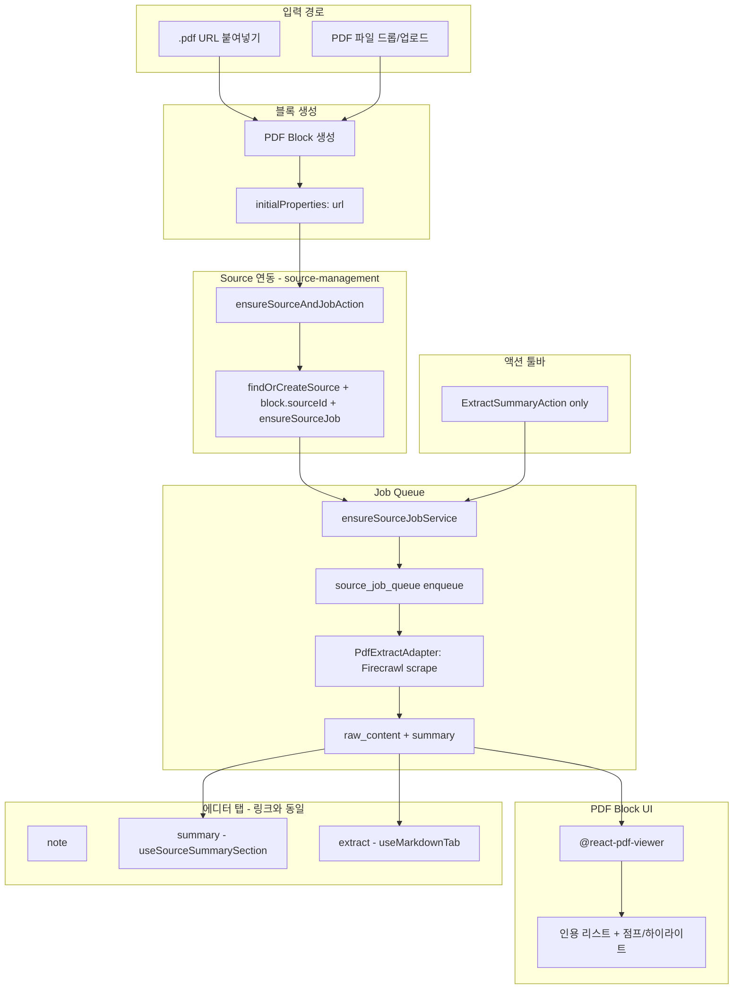

# PDF 블록 앱스페이스 설계 계획

## 핵심 결정 사항

- **PdfBlockProperties**: `currentPage`, `zoom`, `showPageNav`, `showToolbar` 삭제
- **에디터 탭**: note, summary, extract (링크 블록과 동일)
- **블록 액션 툴바**: summary만 (ExtractSummaryAction)
- **소스 컴포넌트**: source-management 도메인의 공통 컴포넌트 사용
- **PDF 추출 제한**: 기본 자동 추출 **최대 20페이지**. 유저 요청 시 추가 추출 가능. 추출 상태는 `sources.metadata`에 저장
- **pdf-app-space**: 별도 도메인 없이 source만으로 충분. 추후 PDF 전용 로직 필요 시 대비해 **폴더 구조만** 추가

---

## 아키텍처 개요




---

## Phase 1: PdfBlockProperties 단순화

**파일**: [pdf.vo.ts](apps/web/src/domains/block-management/shared/value-objects/block-properties/pdf.vo.ts)

**삭제할 필드**:

- `currentPage`
- `zoom`
- `showPageNav`
- `showToolbar`

**유지/추가**:

- `url`, `filename`, `pageCount`
- `sourceSummaryAccessLanguages`, `sourceRawContentAccessGranted` (링크 블록과 동일)
- `enableAnnotations` (선택적, 인용 하이라이트용)
- `sourceId`는 block 레벨 (DB `blocks.source_id`), node data에만 optional로 유지

---

## Phase 2: 에디터 탭 (note, summary, extract)

**파일**: `block-type/pdf/config/pdf-editor-tabs.ts` (신규)

링크 블록 [link-editor-tabs.ts](apps/web/src/domains/block-management/frontend/components/block/block-type/link/config/link-editor-tabs.ts) 패턴:

```ts
tabs: [
  { id: 'note', label: 'Note', componentPath: 'note-section', isDefault: true },
  { id: 'summary', label: 'Summary', componentPath: 'pdf/components/tab-sections/summary-tab' },
  { id: 'extract', label: 'Extract', componentPath: 'pdf/components/tab-sections/markdown-tab' },
],
defaultTabId: 'note',
```

**공통 컴포넌트 사용**:

- **Summary tab**: `useSourceSummarySection` + `SummarySectionView` (source-management)
- **Extract tab**: `useMarkdownTab` + `MarkdownTabView` (source-management)

**구조**:

- `pdf/components/tab-sections/summary-tab/index.tsx` → 링크의 SummaryTab과 동일, `PdfBlockProperties` 타입만 사용
- `pdf/components/tab-sections/markdown-tab/index.tsx` → 링크의 MarkdownTab과 동일, `useMarkdownTab` + `MarkdownTabView`
- **PDF 전용**: Extract 탭에서 `source.metadata.pdfExtraction` 확인 후, `!isComplete`이면 "21~40페이지 더 추출하기" CTA 노출 → `extractPdfMoreAction` 호출

---

## Phase 3: 블록 액션 툴바 (summary만)

**파일**: `block-type/pdf/components/action-items/index.tsx`

링크 블록 [action-items/index.tsx](apps/web/src/domains/block-management/frontend/components/block/block-type/link/components/action-items/index.tsx)와 동일:

```tsx
export function PdfActionItems({ blockId, blockData }) {
  return (
    <ExtractSummaryAction
      blockType={BlockType.PDF}
      blockId={blockId}
      blockData={blockData}
    />
  );
}
```

- **ExtractSummaryAction**: source-management 공통 컴포넌트
- BlockType.PDF 지원 여부 확인 후 필요 시 `ExtractSummaryAction`에 PDF 분기 추가

---

## Phase 4: 입력 경로 (클립보드 + 파일 업로드)

### 4.1 클립보드: .pdf URL → PDF 블록

**파일**: [clipboard-analyzer.ts](apps/web/src/domains/canvas-management/frontend/components/clipboard/utils/clipboard-analyzer.ts)

- `isPdfUrl(url)` 추가: `.pdf` 확장자 또는 Content-Type 힌트
- `isYouTubeUrl` → `isImageUrl` → `**isPdfUrl`** → `link-url` 순서로 체크 (PDF가 일반 링크보다 우선)
- 새 타입 `pdf-url` 반환: `{ type: 'pdf-url', data: { url } }`

**파일**: [clipboard.types.ts](apps/web/src/domains/canvas-management/frontend/components/clipboard/types/clipboard.types.ts)

- `ClipboardContentType`에 `'pdf-url'` 추가

**파일**: [clipboard-block-creator.ts](apps/web/src/domains/canvas-management/frontend/components/clipboard/utils/clipboard-block-creator.ts)

- `case 'pdf-url'`: `createPdfBlock(url, ...)` 호출
- `createPdfBlock`: `createAndMountBlock(BlockType.PDF, position, { url })`

**파일**: [use-clipboard-paste.ts](apps/web/src/domains/canvas-management/frontend/components/clipboard/hooks/use-clipboard-paste.ts)

- `createBlockFromClipboard` 호출 시 `initialProperties` 전달
- `createAndMountBlock` 시그니처: `(blockType, position, initialProperties?)` 확장

**파일**: create-and-mount-block 관련

- `initialProperties`를 `createBlock`에 전달

### 4.2 파일 업로드 (기존 PDF 블록 강화)

**파일**: [block-type/pdf/index.tsx](apps/web/src/domains/block-management/frontend/components/block/block-type/pdf/index.tsx)

현재: 파일 드롭 → Supabase Storage 업로드 → `updateProperty(url, filename)`.

**변경**:

1. 업로드 성공 시 `ensureSourceAndJobAction` 호출 (Supabase Storage public URL 사용)
2. `usePdfBlock`의 `url` 변경 감지 → `ensureSourceAndJobAction` → Source 생성 + Job enqueue

---

## Phase 5: pdf-app-space 폴더 구조 (추후 확장용)

**의도**: 현재는 source-management만 사용. 추후 PDF 전용 도메인 로직(예: 인용 정규화, 증분 추출 액션 등)이 필요할 수 있으므로 **폴더 구조만** 추가.

```
apps/web/src/domains/pdf-app-space/
├── actions/.gitkeep
├── backend/
│   └── services/.gitkeep
└── shared/.gitkeep
```

- `.gitkeep`으로 빈 폴더 구조 유지 (git은 빈 폴더를 추적하지 않음)
- **구현 없음**: fetchPdfMetadataAction, publishPdfMetadataFetched 등 없음
- **Source 연동**: source-management의 `ensureSourceAndJobAction` 사용
- **추후**: `extractPdfMoreAction`, PDF 인용 처리 등 필요 시 이 도메인에 추가

### 5.1 Source 연동 (source-management)

**파일**: `source-management/actions/ensure-source-and-job.action.ts` (신규 또는 기존 확장)

- **입력**: `{ workspaceId, blockId, orgId, url, sourceType: 'pdf', language? }`
- **로직**: `findOrCreateSource` → `block.updateSourceId` → `ensureSourceJobService`
- **반환**: `{ sourceId, blockUuid }`

---

## Phase 6: Source 추출 (PdfExtractAdapter)

### 6.1 Firecrawl PDF 지원

Firecrawl은 PDF URL을 `scrape(url, { formats: ['markdown'] })`로 처리. URL 확장자 또는 Content-Type으로 자동 감지.

### 6.2 PdfExtractAdapter

**파일**: [adapters/pdf-extract.adapter.ts](apps/web/src/domains/source-management/backend/services/extract/adapters/pdf-extract.adapter.ts)

- `IExtractAdapter` 구현
- `extract(url, metadata?)` → Firecrawl `scrape(url, { formats: ['markdown'], parsers: [{ type: 'pdf', maxPages: metadata?.maxPages ?? 20 }] })`
- 기본: `maxPages: 20` (첫 추출)
- 추가 추출 시: `metadata.fromPage`, `metadata.maxPages`로 페이지 범위 지정 (Firecrawl API 지원 범위 확인 필요)
- 반환: `{ rawContent: markdown, structuredPayload, contentLanguage }`
- `structuredPayload`에 `pdfExtraction: { extractedToPage, totalPages?, isComplete }` 포함 → `updateSourceRawContent` 시 `source.metadata`에 merge

**파일**: [process-source-job.service.ts](apps/web/src/domains/source-management/backend/services/source-job/process-source-job.service.ts)

- `adapters`에 `pdf: new PdfExtractAdapter()` 추가

### 6.3 PDF 증분 추출 (20페이지 기본 + 유저 요청 시 추가)

**정책**:

- **기본 자동 추출**: 최대 **20페이지** (`parsers: [{ type: 'pdf', maxPages: 20 }]`)
- **추가 추출**: 유저가 "더 추출하기" 요청 시, 이전 추출 상태를 기준으로 다음 페이지 범위 추출 → `raw_content`에 append (또는 별도 청크 저장 후 병합)

**추출 상태 저장 (`sources.metadata`)**:

```ts
// source.metadata (PDF source_type일 때)
{
  pdfExtraction?: {
    extractedToPage: number;   // 지금까지 추출 완료된 마지막 페이지 (1-based)
    totalPages?: number;       // PDF 전체 페이지 수 (알 수 있을 때)
    isComplete: boolean;       // 전체 추출 완료 여부
  }
}
```

**흐름**:

1. 첫 Job: `PdfExtractAdapter.extract(url, { maxPages: 20 })` → 1~20페이지 markdown → `raw_content` 저장, `metadata.pdfExtraction = { extractedToPage: 20, isComplete: totalPages <= 20 }`
2. 20페이지 초과 PDF: Extract 탭에 "21~40페이지 추출하기" 버튼 노출 (또는 Summary 탭 내 CTA)
3. 유저 클릭 → `extractPdfMoreAction` (신규) → source_job enqueue (payload에 `fromPage: 21, maxPages: 20`) → PdfExtractAdapter가 `fromPage`~`fromPage+19`추출 → 기존`raw_content`뒤에 append,`metadata.pdfExtraction` 갱신

**참고**: Firecrawl PDF API에 `fromPage`/offset 지원 여부 확인 필요. 미지원 시 대안(예: 21~40페이지만 추출하는 별도 PDF 생성 후 scrape) 검토.

**PdfExtractAdapter 시그니처 확장**:

- `extract(url, metadata?)`에서 `metadata.pdfExtraction`, `metadata.fromPage`, `metadata.maxPages` 사용
- `processSourceJobService` → `extractSourceContent` 호출 시 `source.metadata` 전달

### 6.4 TTL 소스 캐싱 (PDF 적용)

**참조**: [app-space-ttl-cache-design.md](apps/web/src/domains/source-management/docs/app-space-ttl-cache-design.md)

**TTL 정책 요약**:

- `sources.expires_at`: `updateSourceRawContent` 시 `source_type`별로 계산
- **블록 참조 중**: `blocks.source_id = sources.id`인 row가 1개라도 있으면 TTL 만료 무시, 영구 유지
- **블록 미참조**: `expires_at < now()` 이면 `raw_content` null 처리 또는 재스크래핑 (Cron/Job)

**PDF TTL 결정**:

- PDF 문서는 Link(웹페이지)보다 정적. 외부 URL·업로드 PDF 모두 변경 빈도 낮음.
- **TTL: 6개월** (YouTube와 동일). 문서 캐시는 저작권/정책상 "영구 아님" 전제.

**구현**:

- **파일**: [update-source-raw-content.service.ts](apps/web/src/domains/source-management/backend/services/source/content/update-source-raw-content.service.ts)
- `computeExpiresAt(sourceType, extractedAt)`에 `pdf` 분기 추가:
  - `sourceType === 'pdf'` → `extractedAt + 6개월`

---

## Phase 7: PDF 뷰어 UI (@react-pdf-viewer + 인용)

### 7.1 라이브러리 전환

- 기존: `react-pdf` (Document, Page)
- 목표: `@react-pdf-viewer/core` + `@react-pdf-viewer/highlight`

**설치**:

```bash
npm i @react-pdf-viewer/core @react-pdf-viewer/highlight pdfjs-dist
```

**스타일**:

```ts
import '@react-pdf-viewer/core/lib/styles/index.css';
import '@react-pdf-viewer/highlight/lib/styles/index.css';
```

### 7.2 인용 타입

```ts
type Rect = { x: number; y: number; width: number; height: number };

type Citation = {
  id: string;
  label: string;
  pageIndex: number;  // 0-based
  rects: Rect[];     // 0~100 퍼센트 좌표
};
```

### 7.3 PdfWithCitations 컴포넌트

- **파일**: `block-type/pdf/components/PdfWithCitations.tsx`
- Props: `fileUrl`, `citations`
- `highlightPlugin` + `jumpToHighlightArea`로 점프/하이라이트
- 인용 클릭 → 해당 `pageIndex` + `rects[0]`로 스크롤 + 하이라이트

### 7.4 레이아웃

- **캔버스 블록**: 미리보기 또는 기본 뷰어
- **에디터 패널 확장 시**: 왼쪽 인용 리스트 + 오른쪽 풀 PDF 뷰어 (2열)
- 초기에는 인용 없이 기본 뷰어만, 인용은 탭/섹션으로 확장

---

## Phase 8: use-pdf-block 훅

**파일**: `block-type/pdf/core/use-pdf-block.ts`

- `url` 변경 시 `ensureSourceAndJobAction` 호출 (source-management)
- `updateProperties`로 `sourceId`, `pageCount`, `filename` 반영
- `updateBlockTitle` (filename 기반)
- Link/YouTube와 동일하게 `setAutoSummaryBlockId` 호출

**업로드 후 플로우**:

1. 파일 드롭 → Supabase Storage 업로드 → `url` 반환
2. `updateProperty('properties.url', url)`
3. `usePdfBlock`의 `useEffect` 감지 → `ensureSourceAndJobAction({ url, sourceType: 'pdf', ... })`
4. Action → findOrCreateSource + block.sourceId + ensureSourceJob → Job enqueue

---

## 파일 변경 요약


| 영역        | 파일                                   | 변경 내용                                                                             |
| --------- | ------------------------------------ | --------------------------------------------------------------------------------- |
| Block     | pdf.vo.ts                            | currentPage, zoom, showPageNav, showToolbar 삭제; sourceSummaryAccessLanguages 등 추가 |
| Block     | pdf-editor-tabs.ts                   | note, summary, extract (신규)                                                       |
| Block     | pdf/tab-sections/summary-tab         | useSourceSummarySection, SummarySectionView (신규)                                  |
| Block     | pdf/tab-sections/markdown-tab        | useMarkdownTab, MarkdownTabView; pdfExtraction 미완료 시 "더 추출하기" CTA (신규)            |
| Block     | pdf/action-items                     | ExtractSummaryAction만 (신규)                                                        |
| Block     | block-type/pdf/index.tsx             | @react-pdf-viewer, usePdfBlock 연동                                                 |
| Block     | use-pdf-block.ts                     | 신규                                                                                |
| Clipboard | clipboard-analyzer.ts                | isPdfUrl, pdf-url 타입                                                              |
| Clipboard | clipboard.types.ts                   | pdf-url 추가                                                                        |
| Clipboard | clipboard-block-creator.ts           | createPdfBlock, initialProperties                                                 |
| Clipboard | use-clipboard-paste.ts               | initialProperties 전달                                                              |
| Source    | ensure-source-and-job.action.ts      | 신규 (또는 기존 서비스 확장); blockId, url, sourceType으로 Source+Job 연동                       |
| Source    | pdf-extract.adapter.ts               | 신규; maxPages 20 기본, metadata.pdfExtraction 반영                                     |
| Source    | process-source-job.service.ts        | pdf adapter 등록                                                                    |
| Source    | update-source-raw-content.service.ts | computeExpiresAt에 pdf 분기; structuredPayload.pdfExtraction → source.metadata 병합    |
| Domain    | pdf-app-space/                       | 폴더 구조만 (.gitkeep). actions/, backend/services/, shared/. 추후 PDF 전용 로직용            |


---

## TTL 소스 캐싱 전략 (상세)

**참조**: [app-space-ttl-cache-design.md](apps/web/src/domains/source-management/docs/app-space-ttl-cache-design.md)

### 적용 위치

- **sources**: `expires_at` 컬럼. `updateSourceRawContent`에서 `source_type`별로 설정.
- PDF는 app_space 없이 sources만 사용 (Link 패턴과 동일).

### TTL 기간 (source_type별)


| source_type | TTL                 | 비고             |
| ----------- | ------------------- | -------------- |
| link        | 2일                  | 웹페이지 변경 빈도 고려  |
| youtube     | 3개월 (구현) / 6개월 (설계) | 스크립트 등 거의 불변   |
| **pdf**     | **6개월**             | 문서는 정적, 저작권 전제 |


### 블록 참조 시 동작

- `blocks.source_id = sources.id`인 row가 1개라도 있으면 **expires_at 만료 무시**, 영구 유지.
- 블록에서 제거되어 참조가 없어지면, 이후 TTL 만료 시 정리 대상.

### 캐시 범위

- **링크별(전역)**: url_hash 기준 dedupe. 동일 PDF URL은 1 source만 유지.
- forceRefresh 등으로 TTL 우회·재추출 가능 (추후 확장).

---

## 마이그레이션 고려사항

- `source_type` enum에 `pdf` 이미 존재
- 기존 PDF 블록은 `sourceId` 없이 동작 가능 (호환 유지)
- 새 PDF 블록(URL 붙여넣기/업로드)만 Source 파이프라인 사용

---

## 이후 확장 (선택)

1. **추가 추출 UI/액션**: `extractPdfMoreAction` + Extract 탭 "더 추출하기" CTA. pdf-app-space에 추가 가능
2. **인용 다중 표시**: AI 요약의 인용들을 한 번에 하이라이트
3. **URL hash**: `#c=c2` 등으로 인용 상태 공유
4. **Citations 탭**: Summary, Extract 외 별도 인용 전용 탭
5. **LLM 인용 정규화**: (page, text) → (pageIndex, rects) 변환기. pdf-app-space에 추가 가능

