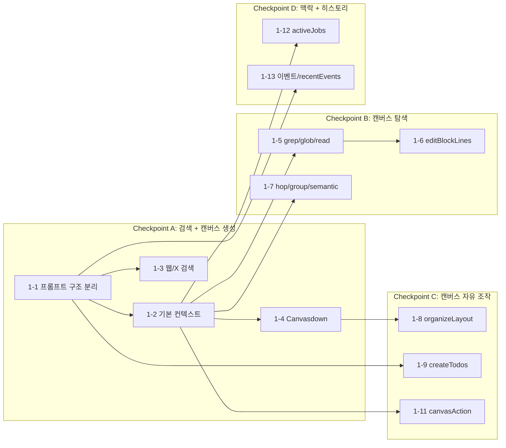

# Phase 1: 메인 에이전트 단독 구동 — 구현 계획

## Global Rules

- **All prompts in English**: Every system prompt, tool description, and DSL rule in `prompt.ts` and `tools.ts` MUST be written in English. Korean is only used in user-facing UI labels, NOT in LLM-facing prompts.
- **Reference Visual Summarizer prompt patterns**: The existing Visual Summarizer already has a well-structured Canvasdown prompt. Use the following files as the primary reference for Canvasdown DSL syntax, tool schema design, and prompt engineering patterns:
  - `[apps/web/src/domains/ai-actions/backend/prompt/visual-summary/tools.ts](apps/web/src/domains/ai-actions/backend/prompt/visual-summary/tools.ts)` — `renderCanvasdownTool` schema with full DSL syntax documentation, patch rules, ID mapping rules, error handling
  - `[apps/web/src/domains/ai-actions/backend/services/visual-summary/prompt-builder.service.ts](apps/web/src/domains/ai-actions/backend/services/visual-summary/prompt-builder.service.ts)` — `buildVisualSummarySystemPrompt()` with structured workflow (Plan -> Skeleton -> Fill -> Connect), Canvasdown block type reference, edge marker reference, critical rules section
  - Key patterns to reuse: DSL syntax block, available block types, edge markers table, patch @update critical rules (no `->` in content), blockIdMap mapping rules, error handling section

## Current State

- **Agent V2** (`/api/agent/v2/`): xAI Grok streaming, only 1 search sub-agent
- **Agent V1** (`/api/agent/`): OpenAI-based, client-side tool handler pattern + context assembly (legacy)
- **Canvasdown**: `@ssota-labs/canvasdown-reactflow` package + executor/renderer already implemented
- **Visual Summarizer**: Production-grade Canvasdown prompt + tool schemas (reference for Step 1-4)
- **DB**: `blocks`, `block_mounts`, `edges` tables with Drizzle ORM definitions
- **Search tools**: `searchByHop`, `searchBySemantic`, `searchByKeyword` — interfaces only, implementations mocked/TODO

## Checkpoint 구조




---

## Step 1-1. 프롬프트 캐싱 구조 분리

### 목표

system prompt(정적)와 user message metadata(동적) 분리. 프롬프트 캐싱 효율 보장.

### 변경 파일

- `**[apps/web/src/app/api/agent/v2/prompt.ts](apps/web/src/app/api/agent/v2/prompt.ts)**` — Static system prompt restructure (**ALL in English**)
  - Sophie character/personality
  - SSOTA core concepts (Block, Edge, Canvas, BlockMount)
  - Tool usage rules (per-tool schema rules) — incrementally added per Step
  - Work rules (communication, error handling, language matching)
- `**[apps/web/src/app/api/agent/v2/route.ts](apps/web/src/app/api/agent/v2/route.ts)**` — user message에 동적 컨텍스트 주입 구조
  - `lastUserMessage.metadata.clientContext` 파싱 (V1 패턴 참고)
  - 동적 컨텍스트를 user message 앞에 `[Context]` 블록으로 주입
- `**apps/web/src/app/api/agent/v2/context-builder.ts**` (신규) — 동적 컨텍스트 조립
  - `buildDynamicContext(clientContext)` 함수
  - 초기: 빈 컨텍스트 반환 (Step별로 필드 추가)

### 핵심 구현

```typescript
// context-builder.ts
export interface DynamicContext {
  // Step 1-2에서 추가
  // selectedBlockIds?: string[];
  // visibleBlocks?: VisibleBlockMeta[];
}

export function buildDynamicContext(clientContext: unknown): string {
  // 초기: 빈 문자열 반환
  return "";
}
```

```typescript
// route.ts 변경 — 동적 컨텍스트 주입 구조
const { messages, clientContext } = await req.json();
const dynamicCtx = buildDynamicContext(clientContext);

// user message의 마지막에 동적 컨텍스트 주입
const enrichedMessages = injectDynamicContext(modelMessages, dynamicCtx);
```

### 테스트

- system prompt가 변하지 않는 상태에서 여러 요청을 보내도 동일한 prefix 유지 확인
- `buildDynamicContext`가 빈 컨텍스트에서도 에러 없이 동작
- 기존 search 기능 regression 없음

---

## Step 1-2. 기본 컨텍스트 레이어 (Viewport + 선택 블록)

### 목표

에이전트가 "지금 캔버스에 뭐가 있는지" 알 수 있게 한다.

### 변경 파일

- `**apps/web/src/app/api/agent/v2/context-builder.ts**` — visibleBlocks + selectedBlockIds 추가
- `**[apps/web/src/app/api/agent/v2/route.ts](apps/web/src/app/api/agent/v2/route.ts)**` — clientContext 파싱
- `**[apps/web/src/app/api/agent/v2/prompt.ts](apps/web/src/app/api/agent/v2/prompt.ts)**` — 컨텍스트 해석 규칙 추가
- `**apps/web/src/domains/ai-management/frontend/components/chat-panel-sidebar/use-chat-v2.ts**` — 클라이언트에서 context 수집 및 전송
  - V1의 `use-ai-agent.ts` 패턴 참고: `getSelectedBlocks()`, `getNodes()`, `getViewport()` 활용
  - `sendMessage` 시 `metadata.clientContext`에 포함

### 핵심 구현

```typescript
// context-builder.ts
interface VisibleBlockMeta {
  blockMountId: string;
  blockType: string;
  title: string;
  connectedTo?: string[];
}

export interface DynamicContext {
  selectedBlockIds: string[];
  visibleBlocks: VisibleBlockMeta[];
  visibleEdges?: { source: string; target: string; label?: string }[];
}

export function buildDynamicContext(raw: unknown): string {
  const ctx = parseDynamicContext(raw);
  return formatContextBlock(ctx);
}
```

클라이언트 측 — `use-chat-v2.ts`에서 V1 패턴(`use-ai-agent.ts` lines 77-148)을 차용:

- `useReactFlow()`에서 `getNodes()`, `getViewport()`, `getEdges()` 가져오기
- `selectedBlockIds` = 현재 선택된 블록 ID
- `visibleBlocks` = viewport에 보이는 블록 메타데이터 (title, type, connectedTo)

### Prompt Addition (prompt.ts — in English)

```
## Context Interpretation
- visibleBlocks: Metadata of blocks currently visible on screen (content NOT included).
- selectedBlockIds: List of currently selected block IDs.
- When the user says "this block" or "this one" → refer to selectedBlockIds[0].
- If you need the detailed content of a block, use readBlockLines to retrieve it.
```

### 테스트

- 캔버스에 블록 3개 배치 후 "지금 캔버스에 뭐가 보여?" → 블록 목록으로 답변
- 블록 1개 선택 후 "이 블록이 뭐야?" → 선택된 블록 정보로 답변
- clientContext 없는 요청도 에러 없이 동작 (하위 호환)

---

## Step 1-3. Global Tool — 웹/X 검색 (메인 에이전트 직접 수행)

### 목표

검색 서브 에이전트를 제거하고, 메인 에이전트가 xAI 네이티브 도구로 직접 검색.

### 변경 파일

- `**[apps/web/src/app/api/agent/v2/route.ts](apps/web/src/app/api/agent/v2/route.ts)**` — tools에 `xai.tools.webSearch()`, `xai.tools.xSearch()` 등록, search 서브에이전트 제거
- `**[apps/web/src/app/api/agent/v2/prompt.ts](apps/web/src/app/api/agent/v2/prompt.ts)**` — 웹/X 검색 사용 규칙
- `**[apps/web/src/app/api/agent/v2/tools.ts](apps/web/src/app/api/agent/v2/tools.ts)**` — search 관련 타입 정리

### 핵심 구현

```typescript
// route.ts
const result = streamText({
  model: xai.responses(AGENT_MODEL),
  system: SOPHI_V2_SYSTEM_PROMPT,
  messages: enrichedMessages,
  tools: {
    web_search: xai.tools.webSearch(),
    x_search: xai.tools.xSearch(),
    // ... 이후 Step에서 추가되는 커스텀 툴
  },
});
```

### 테스트

- "AI 스타트업 최신 뉴스" → 웹 검색 결과 + 출처 표시
- "xAI에 대한 X 반응" → X 검색 결과 요약
- 검색 없이 일반 질문 → 검색 도구 호출 안 함

---

## Step 1-4. Global Tool — Canvasdown (renderCanvasdown + patchCanvasdown)

### 목표

에이전트가 캔버스에 블록을 생성/수정/연결/이동. **가장 핵심적인 Step**.

### 의존성

기존 Canvasdown 도메인 활용:

- `[apps/web/src/domains/canvasdown/frontend/hooks/use-canvasdown-executor.ts](apps/web/src/domains/canvasdown/frontend/hooks/use-canvasdown-executor.ts)`
- `[apps/web/src/domains/canvasdown/frontend/hooks/renderers/full-renderer.ts](apps/web/src/domains/canvasdown/frontend/hooks/renderers/full-renderer.ts)`
- `[apps/web/src/domains/canvasdown/frontend/hooks/renderers/patch-renderer.ts](apps/web/src/domains/canvasdown/frontend/hooks/renderers/patch-renderer.ts)`

### 변경 파일

- `**[apps/web/src/app/api/agent/v2/tools.ts](apps/web/src/app/api/agent/v2/tools.ts)**` — renderCanvasdownTool, patchCanvasdownTool 정의 (Zod schema)
- `**[apps/web/src/app/api/agent/v2/route.ts](apps/web/src/app/api/agent/v2/route.ts)**` — tools에 등록
- `**[apps/web/src/app/api/agent/v2/prompt.ts](apps/web/src/app/api/agent/v2/prompt.ts)**` — Canvasdown Full/Patch DSL 문법 + 예시
- `**apps/web/src/domains/ai-management/frontend/components/chat-panel-sidebar/use-chat-v2.ts**` — `onToolCall` 핸들러 추가, Canvasdown executor 연동
- `**apps/web/src/domains/ai-management/frontend/components/chat-panel-sidebar/tool-handlers.ts**` (신규) — V2용 클라이언트 도구 핸들러

### Tool 스키마 (tools.ts)

```typescript
export const renderCanvasdownTool = tool({
  description:
    "Create new blocks on the canvas with layout and edges in a single call. Uses Full DSL mode.",
  parameters: z.object({
    dsl: z.string().describe("Canvasdown Full DSL string"),
    anchorBlockMountId: z.string().optional(),
    position: z.enum(["right", "below"]).default("right").optional(),
  }),
});

export const patchCanvasdownTool = tool({
  description:
    "Modify, delete, connect, move, or resize existing blocks. Uses Patch DSL mode.",
  parameters: z.object({
    dsl: z
      .string()
      .describe(
        "Canvasdown Patch DSL (@update, @delete, @connect, @move, @resize)"
      ),
  }),
});
```

### 클라이언트 핸들러 (tool-handlers.ts)

```typescript
// use-chat-v2.ts의 onToolCall에서 분기
export async function handleRenderCanvasdown(args, canvasdownExecutor) {
  const result = await canvasdownExecutor.renderFull(args.dsl, {
    anchorBlockMountId: args.anchorBlockMountId,
    position: args.position,
  });
  return { success: true, createdBlockMountIds: result.blockMountIds };
}

export async function handlePatchCanvasdown(args, canvasdownExecutor) {
  const result = await canvasdownExecutor.applyPatch(args.dsl);
  return { success: true, patchedBlockMountIds: result.blockMountIds };
}
```

### Prompt Addition — Canvasdown DSL Grammar (in English)

Add Full DSL / Patch DSL complete grammar, examples, and rules to prompt.ts as static context.
**Reference**: Directly adapt the DSL syntax section from the Visual Summarizer's `renderCanvasdownTool` description in `[tools.ts](apps/web/src/domains/ai-actions/backend/prompt/visual-summary/tools.ts)` (lines 16-124) and the block type / edge marker / critical rules sections from `[prompt-builder.service.ts](apps/web/src/domains/ai-actions/backend/services/visual-summary/prompt-builder.service.ts)` (lines 24-127). Generalize from visual-summary-specific workflow to a general-purpose agent workflow.

### 테스트

- "마크다운 블록 3개 만들어줘" → `renderCanvasdown` 1회 호출로 3개 블록 배치
- "이 블록 제목 바꿔줘" → `patchCanvasdown`로 @update 실행
- "이 두 블록 연결해줘" → `patchCanvasdown`로 @connect 실행
- DSL 파싱 에러 시 에이전트가 재시도하는지 확인

---

## Step 1-5. Global Tool — 블록 검색/읽기 (grep + glob + read)

### 목표

에이전트가 블록 content를 검색하고 읽을 수 있게 한다. **서버사이드 도구**.

### 변경 파일

- `**[apps/web/src/app/api/agent/v2/tools.ts](apps/web/src/app/api/agent/v2/tools.ts)**` — grepBlockContentTool, globBlocksTool, readBlockLinesTool 정의
- `**apps/web/src/app/api/agent/v2/tool-executors/**` (신규 디렉토리)
  - `grep-block-content.ts` — DB 쿼리 + 서버 라인 파싱
  - `glob-blocks.ts` — 메타데이터 검색
  - `read-block-lines.ts` — 라인 범위 읽기
- `**[apps/web/src/app/api/agent/v2/route.ts](apps/web/src/app/api/agent/v2/route.ts)**` — tools 등록
- `**[apps/web/src/app/api/agent/v2/prompt.ts](apps/web/src/app/api/agent/v2/prompt.ts)**` — 검색/읽기 워크플로우 규칙

### 서버 구현 핵심 (grep-block-content.ts)

```typescript
// 1. 스코프 결정 → block_mounts JOIN blocks로 대상 확정
// 2. blocks.content_raw에서 ILIKE/regex 매칭 (DB 레벨 필터링)
// 3. 매칭된 블록의 content_raw를 라인 단위 split → 라인 번호 + contextLines 계산
// 4. blockMountId + 라인 정보 반환
```

DB 쿼리는 기존 Drizzle ORM 레포지토리 패턴 활용:

- `[apps/web/src/domains/canvas-management/backend/repositories/](apps/web/src/domains/canvas-management/backend/repositories/)`

### 테스트

- "마케팅이라는 단어가 어디에 있어?" → grep 결과 (blockMountId + 라인)
- "마크다운 블록 목록 보여줘" → glob 결과 (메타데이터)
- "그 블록 내용 보여줘" → read 결과 (라인 범위)
- 빈 페이지에서 검색 → 빈 결과 (에러 없음)

---

## Step 1-6. Global Tool — 블록 수정 (editBlockLines)

### 목표

에이전트가 기존 블록의 텍스트를 라인 단위로 수정. **클라이언트사이드 도구**.

### 변경 파일

- `**[apps/web/src/app/api/agent/v2/tools.ts](apps/web/src/app/api/agent/v2/tools.ts)**` — editBlockLinesTool 정의
- `**apps/web/src/domains/ai-management/frontend/components/chat-panel-sidebar/tool-handlers.ts**` — editBlockLines 핸들러
  - V1의 `updateContent` 핸들러 참고
  - content_raw 기반 라인 파싱 → 수정 → React Flow 노드 업데이트

### 테스트

- grep로 위치 찾기 → editBlockLines로 수정 → read로 확인
- "두 번째 문단을 한국어로 바꿔줘" 시나리오

---

## Step 1-7. Global Tool — 연결 검색 (hop + group + semantic)

### 목표

블록 간 연결 관계 탐색 + 의미 기반 검색. **서버사이드 도구**.

### 변경 파일

- `**[apps/web/src/app/api/agent/v2/tools.ts](apps/web/src/app/api/agent/v2/tools.ts)**` — hopSearchTool, searchGroupTool, searchBySemanticTool 정의
- `**apps/web/src/app/api/agent/v2/tool-executors/**`
  - `hop-search.ts` — edges 테이블 기반 N-hop 탐색 (기존 context-assembly의 `getConnectedBlocks` 참고)
  - `search-group.ts` — block_mounts.parent_block_mount_id 기반 그룹 검색
  - `search-by-semantic.ts` — 임베딩 기반 (초기: content_raw 유사도, 이후 벡터 업그레이드)

### 테스트

- "이 블록에 연결된 거 뭐가 있어?" → hopSearch 결과
- "이 그룹 안에 뭐가 있어?" → searchGroup 결과

---

## Step 1-8. Global Tool — 레이아웃 정리 (organizeLayout)

### 목표

기존 블록들 자동 레이아웃 재배치. **클라이언트사이드 도구**.

### 변경 파일

- `**[apps/web/src/app/api/agent/v2/tools.ts](apps/web/src/app/api/agent/v2/tools.ts)**` — organizeLayoutTool 정의
- `**apps/web/src/domains/ai-management/frontend/components/chat-panel-sidebar/tool-handlers.ts**` — organizeLayout 핸들러
  - React Flow 노드 재배치 로직 (grid/flow/tree/mindmap/stack)

### 테스트

- "3열로 정리해줘" → grid 레이아웃 적용

---

## Step 1-9. Global Tool — 작업 관리 (createTodos)

### 목표

에이전트가 복잡한 작업 시 투두 목록 생성. **클라이언트사이드 도구**.

### 변경 파일

- `**[apps/web/src/app/api/agent/v2/tools.ts](apps/web/src/app/api/agent/v2/tools.ts)**` — createTodosTool 정의
- `**apps/web/src/domains/ai-management/frontend/components/chat-panel-sidebar/tool-handlers.ts**` — createTodos 핸들러

### 테스트

- 복잡한 요청 시 투두 목록 생성 확인

---

## Step 1-11. 캔버스 UI 조작 (canvasAction)

### 목표

에이전트가 캔버스 UI를 직접 조작 (선택, 줌, 에디터 열기 등). **클라이언트사이드 도구**.

### 변경 파일

- `**[apps/web/src/app/api/agent/v2/tools.ts](apps/web/src/app/api/agent/v2/tools.ts)**` — canvasActionTool 정의
- `**apps/web/src/domains/ai-management/frontend/components/chat-panel-sidebar/tool-handlers.ts**` — canvasAction 핸들러
  - select, zoom-to, open-editor, navigate-page 등의 DSL 실행

### 테스트

- "저 블록 선택해줘" → select 실행
- "에디터 열어줘" → open-editor 실행

---

## Step 1-12. 작업 상태 컨텍스트 (Status Window 연동)

### 목표

에이전트가 현재 진행 중인 비동기 작업 상태를 알 수 있게 한다.

### 변경 파일

- `**apps/web/src/app/api/agent/v2/context-builder.ts**` — `activeJobs` 필드 추가
- `**[apps/web/src/app/api/agent/v2/route.ts](apps/web/src/app/api/agent/v2/route.ts)**` — clientContext에서 activeJobs 파싱
- `**[apps/web/src/app/api/agent/v2/prompt.ts](apps/web/src/app/api/agent/v2/prompt.ts)**` — activeJobs 해석 규칙

### 테스트

- "아까 요약 다 됐어?" → activeJobs 상태 기반 응답

---

## Step 1-13. 이벤트 저장/조회 + recentEvents 컨텍스트

### 목표

핵심 tool call을 이벤트로 저장 + 매 요청마다 recentEvents를 동적 컨텍스트로 전달.

### 변경 파일

- `**[apps/web/src/app/api/agent/v2/tools.ts](apps/web/src/app/api/agent/v2/tools.ts)**` — grepEventsTool, getPageEventsTool 정의
- `**apps/web/src/app/api/agent/v2/tool-executors/**` — event 관련 executor
- `**apps/web/src/app/api/agent/v2/context-builder.ts**` — `recentEvents` 필드 추가
- `**[apps/web/src/app/api/agent/v2/prompt.ts](apps/web/src/app/api/agent/v2/prompt.ts)**` — recentEvents 해석 규칙

### 테스트

- "어제 이 페이지에서 뭐 했어?" → 이벤트 로그 기반 응답
- 매 요청 시 recentEvents 포함 확인

---

## 파일 구조 최종 모습

```
apps/web/src/app/api/agent/v2/
├── route.ts                      # 메인 라우트 (동적 컨텍스트 주입)
├── prompt.ts                     # 정적 system prompt (캐싱 대상)
├── tools.ts                      # 모든 Tool 정의 (Zod schema)
├── context-builder.ts            # 동적 컨텍스트 조립 (신규)
├── search-sub-agent.ts           # Step 1-3에서 제거 또는 아카이브
└── tool-executors/               # 서버사이드 도구 실행기 (신규)
    ├── grep-block-content.ts
    ├── glob-blocks.ts
    ├── read-block-lines.ts
    ├── hop-search.ts
    ├── search-group.ts
    ├── search-by-semantic.ts
    ├── grep-events.ts
    └── get-page-events.ts

apps/web/src/domains/ai-management/frontend/components/chat-panel-sidebar/
├── use-chat-v2.ts                # 클라이언트 context 수집 + onToolCall
├── tool-handlers.ts              # 클라이언트사이드 도구 핸들러 (신규)
├── chat-panel-sidebar.tsx
├── chat-panel-messages.tsx
└── chat-panel-tool-part.tsx
```

---

## 실행 순서 및 병렬 작업 가이드

### Week 1 (Checkpoint A 목표)


| 순서  | Step | 작업                                | 예상 소요 | 병렬 가능   |
| --- | ---- | --------------------------------- | ----- | ------- |
| 1   | 1-1  | 프롬프트 구조 분리 + context-builder 스캐폴딩 | 1일    | -       |
| 2   | 1-2  | 기본 컨텍스트 (클라이언트 수집 + 서버 주입)        | 1.5일  | 1-3과 병렬 |
| 3   | 1-3  | 웹/X 검색 (xAI 네이티브 전환)              | 0.5일  | 1-2와 병렬 |
| 4   | 1-4  | Canvasdown 도구 (Full + Patch)      | 2-3일  | -       |


**Checkpoint A 데모**: "AI 스타트업 검색해서 캔버스에 정리해줘"

### Week 2 (Checkpoint B 목표)


| 순서  | Step | 작업                             | 예상 소요 | 병렬 가능   |
| --- | ---- | ------------------------------ | ----- | ------- |
| 5   | 1-5  | grep + glob + read (서버사이드)     | 2-3일  | 1-7과 병렬 |
| 6   | 1-7  | hop + group + semantic (서버사이드) | 1.5일  | 1-5와 병렬 |
| 7   | 1-6  | editBlockLines (클라이언트사이드)      | 1일    | -       |


**Checkpoint B 데모**: "마케팅 단어가 어디에 있어?" → grep → read → "연결된 블록 뭐야?" → hop

### Week 3 (Checkpoint C + D 목표)


| 순서  | Step | 작업                       | 예상 소요 | 병렬 가능         |
| --- | ---- | ------------------------ | ----- | ------------- |
| 8   | 1-8  | organizeLayout           | 1.5일  | 1-9, 1-11과 병렬 |
| 9   | 1-9  | createTodos              | 0.5일  | 1-8과 병렬       |
| 10  | 1-11 | canvasAction             | 2일    | 1-8과 병렬       |
| 11  | 1-12 | activeJobs 컨텍스트          | 1일    | 1-13과 병렬      |
| 12  | 1-13 | 이벤트 저장/조회 + recentEvents | 2일    | 1-12와 병렬      |


**Checkpoint C 데모**: "3열로 정리해줘" → layout / "에디터 열어줘" → canvasAction
**Checkpoint D 데모**: "요약 다 됐어?" → activeJobs / "어제 뭐 했어?" → 이벤트 로그

---

## Step별 진행 방식

각 Step은 다음 순서로 진행:

1. **Tool 정의** (tools.ts에 Zod schema 추가)
2. **서버 구현** (route.ts 등록 + tool-executors/ 구현) 또는 **클라이언트 구현** (tool-handlers.ts)
3. **프롬프트 업데이트** (prompt.ts에 Tool 사용법 추가)
4. **컨텍스트 업데이트** (필요 시 context-builder.ts)
5. **수동 테스트** (채팅으로 시나리오 검증)
6. **코드 리뷰 + 다음 Step**

