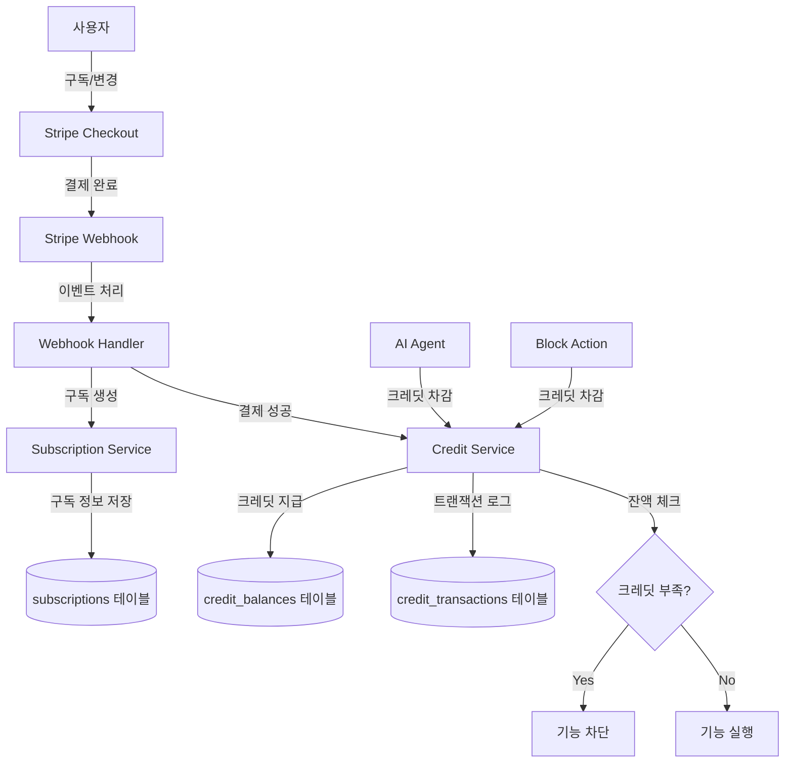

# Stripe 구독 시스템 통합 계획

## 아키텍처 개요




## 데이터베이스 스키마 설계

### 1. subscriptions 테이블

사용자의 구독 정보를 관리합니다.

```typescript
// 필드 구조
- id: uuid (PK)
- user_id: uuid (FK → profiles.id)
- organization_id: uuid (FK → organizations.id, nullable)
- stripe_customer_id: text (Stripe Customer ID)
- stripe_subscription_id: text (Stripe Subscription ID)
- stripe_price_id: text (현재 구독 중인 Price ID)
- plan_tier: enum('basic', 'pro', 'ultra')
- billing_interval: enum('monthly', 'yearly')
- status: enum('active', 'canceled', 'past_due', 'paused', 'trialing')
- current_period_start: timestamptz
- current_period_end: timestamptz
- cancel_at_period_end: boolean
- canceled_at: timestamptz (nullable)
- trial_end: timestamptz (nullable)
- metadata: jsonb (추가 정보)
- created_at: timestamptz
- updated_at: timestamptz
```

### 2. subscription_items 테이블

Pro 플랜의 크레딧 팩 구매를 관리합니다.

```typescript
// Pro 플랜 예시: 기본 Pro + 크레딧 팩 2개
- id: uuid (PK)
- subscription_id: uuid (FK → subscriptions.id)
- stripe_subscription_item_id: text
- stripe_price_id: text
- quantity: integer (크레딧 팩 개수)
- item_type: enum('base_plan', 'credit_pack')
- created_at: timestamptz
- updated_at: timestamptz
```

### 3. credit_balances 테이블

사용자의 현재 크레딧 잔액을 관리합니다.

```typescript
- user_id: uuid (PK, FK → profiles.id)
- balance: integer (현재 잔액)
- granted_this_period: integer (이번 기간에 지급된 총량)
- used_this_period: integer (이번 기간에 사용된 총량)
- period_start: timestamptz (현재 기간 시작일)
- period_end: timestamptz (현재 기간 종료일)
- last_grant_at: timestamptz (마지막 크레딧 지급 시간)
- updated_at: timestamptz
```

### 4. credit_transactions 테이블

모든 크레딧 지급/차감 이력을 기록합니다.

```typescript
- id: uuid (PK)
- user_id: uuid (FK → profiles.id)
- transaction_type: enum('grant', 'deduct', 'expire', 'refund')
- amount: integer (+ for grant, - for deduct)
- balance_after: integer (트랜잭션 후 잔액)
- reason: enum('subscription_grant', 'ai_usage', 'block_action', 'period_reset', 'manual_adjustment')
- metadata: jsonb {
    subscription_id?: uuid
    ai_model?: string
    block_action_type?: string
    agent_execution_id?: string
    event_log_id?: uuid
  }
- created_at: timestamptz
```

### 5. subscription_plans 테이블 (설정)

플랜별 크레딧 지급량 및 가격 정보를 관리합니다.

```typescript
- id: uuid (PK)
- plan_tier: enum('basic', 'pro', 'ultra')
- billing_interval: enum('monthly', 'yearly')
- stripe_price_id: text (Stripe에서 생성한 Price ID)
- price_amount: integer (센트 단위)
- currency: text (기본 'usd')
- credits_per_period: integer (기간당 지급 크레딧)
- display_name: text
- description: text
- is_active: boolean
- created_at: timestamptz
- updated_at: timestamptz
```

### 6. credit_pack_products 테이블

Pro 플랜에서 추가 구매 가능한 크레딧 팩 정보입니다.

```typescript
- id: uuid (PK)
- stripe_price_id: text
- credits_amount: integer (팩당 크레딧 수)
- price_amount: integer (센트 단위)
- currency: text
- display_name: text (예: "1000 Credits Pack")
- is_active: boolean
- created_at: timestamptz
```

## Stripe 제품/가격 설정

### Stripe Dashboard에서 생성할 제품들

**1. Basic Plan**

- Product: "Basic Plan"
- Prices:
  - Monthly: $10/month (500 credits)
  - Yearly: $100/year (500 credits/month, ~17% discount)

**2. Pro Plan (Base)**

- Product: "Pro Plan"
- Prices:
  - Monthly: $20/month (2000 credits)
  - Yearly: $200/year (2000 credits/month, ~17% discount)

**3. Credit Pack (Pro Add-on)**

- Product: "Credit Pack"
- Price: $10/month per pack (1000 credits each)
- Type: Recurring, quantity-based

**4. Ultra Plan**

- Product: "Ultra Plan"
- Prices:
  - Monthly: $200/month (20000 credits)
  - Yearly: $2000/year (20000 credits/month, ~17% discount)

### 크레딧 사용량 설정

```typescript
export const CREDIT_COSTS = {
  AI_CHAT: 10, // AI 채팅 1회
  AI_BLOCK_GENERATION: 15, // AI 블록 생성
  AI_IMAGE_GENERATION: 50, // AI 이미지 생성
  BLOCK_ACTION: 2, // 블록 액션 1회
  ADVANCED_SEARCH: 5, // 고급 검색
} as const;
```

## 구현 단계

### Phase 1: 데이터베이스 마이그레이션

- Drizzle 스키마에 subscription 관련 테이블 추가
- credit 관련 테이블 추가
- 마이그레이션 파일 생성 및 실행
- RLS 정책 설정

### Phase 2: Stripe 설정

- Stripe Dashboard에서 Products/Prices 생성
- Webhook endpoint 설정 (`/api/webhooks/stripe`)
- 환경변수 설정 (STRIPE_SECRET_KEY, STRIPE_WEBHOOK_SECRET)

### Phase 3: Stripe Checkout 통합

- Checkout Session 생성 API (`/api/subscriptions/create-checkout-session`)
- 구독 플랜 선택 UI 컴포넌트
- 연간/월간 토글 UI
- Pro 플랜 크레딧 팩 수량 선택 UI
- 성공/취소 리다이렉트 페이지

### Phase 4: Webhook 처리

- `checkout.session.completed` - 구독 생성 및 초기 크레딧 지급
- `customer.subscription.updated` - 구독 정보 업데이트
- `customer.subscription.deleted` - 구독 취소 처리
- `invoice.payment_succeeded` - 결제 성공 시 크레딧 지급
- `invoice.payment_failed` - 결제 실패 처리

### Phase 5: 크레딧 관리 시스템

- Credit Service 구현
  - `grantCredits()` - 크레딧 지급
  - `deductCredits()` - 크레딧 차감
  - `checkBalance()` - 잔액 확인
  - `resetMonthlyCredits()` - 월간 초기화
- Credit Transaction 로깅
- 크레딧 부족 시 에러 처리

### Phase 6: 구독 관리 기능

- 구독 업그레이드 API (즉시 적용 + proration)
- 구독 다운그레이드 API (다음 기간부터 적용)
- 구독 취소 API (기간 종료 시 취소)
- Pro 플랜 크레딧 팩 추가/제거 API
- 구독 정보 조회 API

### Phase 7: 프론트엔드 통합

- 크레딧 잔액 표시 컴포넌트
- 구독 관리 대시보드
- 결제 내역 페이지
- 크레딧 사용 내역 페이지
- 업그레이드/다운그레이드 플로우

### Phase 8: AI/Block Action 통합

- AI Agent에 크레딧 차감 로직 추가
- Block Action에 크레딧 차감 로직 추가
- 크레딧 부족 시 UI 피드백
- event_logs와 credit_transactions 연결

### Phase 9: 테스트 및 모니터링

- Stripe Test Mode로 전체 플로우 테스트
- Webhook 재시도 로직 테스트
- 크레딧 동시성 처리 테스트
- 에러 알림 설정 (Sentry, Slack 등)

## 핵심 구현 파일 구조

```
apps/web/src/domains/
├── billing-management/
│   ├── backend/
│   │   ├── repositories/
│   │   │   ├── subscription.repository.ts
│   │   │   └── credit.repository.ts
│   │   ├── services/
│   │   │   ├── stripe-checkout.service.ts
│   │   │   ├── subscription.service.ts
│   │   │   ├── credit.service.ts
│   │   │   └── webhook-handler.service.ts
│   │   └── utils/
│   │       └── stripe-client.ts
│   ├── frontend/
│   │   ├── components/
│   │   │   ├── pricing-table.tsx
│   │   │   ├── subscription-manager.tsx
│   │   │   ├── credit-balance-display.tsx
│   │   │   └── billing-history.tsx
│   │   └── hooks/
│   │       ├── use-subscription.ts
│   │       └── use-credit-balance.ts
│   ├── actions/
│   │   ├── create-checkout-session.action.ts
│   │   ├── update-subscription.action.ts
│   │   ├── cancel-subscription.action.ts
│   │   └── get-billing-portal-url.action.ts
│   └── shared/
│       ├── dtos/
│       │   ├── subscription.dto.ts
│       │   └── credit.dto.ts
│       └── types/
│           └── billing.types.ts
├── ai-management/
│   └── (기존 코드에 크레딧 차감 로직 추가)
└── block-management/
    └── (기존 코드에 크레딧 차감 로직 추가)

apps/web/src/app/api/
├── webhooks/
│   └── stripe/
│       └── route.ts
└── subscriptions/
    └── create-checkout-session/
        └── route.ts
```

## 주요 기술적 고려사항

### 1. Webhook 멱등성 처리

Stripe Webhook은 재시도가 발생할 수 있으므로 멱등성 보장이 필요합니다.

```typescript
// webhooks/stripe/route.ts에서
const event = stripe.webhooks.constructEvent(body, sig, webhookSecret);

// Stripe Event ID를 사용한 멱등성 체크
const existingEvent = await db
  .select()
  .from(processedWebhooks)
  .where(eq(processedWebhooks.stripeEventId, event.id));

if (existingEvent.length > 0) {
  return NextResponse.json({ received: true });
}
```

### 2. 크레딧 동시성 제어

여러 요청이 동시에 크레딧을 차감하려 할 때 race condition 방지가 필요합니다.

```typescript
// PostgreSQL Row-level locking 사용
await db.execute(sql`
  SELECT * FROM credit_balances 
  WHERE user_id = ${userId} 
  FOR UPDATE
`);

// 또는 Optimistic Locking
const result = await db
  .update(creditBalances)
  .set({
    balance: sql`balance - ${amount}`,
    used_this_period: sql`used_this_period + ${amount}`,
  })
  .where(
    and(
      eq(creditBalances.userId, userId),
      gte(creditBalances.balance, amount) // 잔액 충분 확인
    )
  )
  .returning();

if (result.length === 0) {
  throw new InsufficientCreditsError();
}
```

### 3. Stripe Checkout vs Billing Portal

- **Checkout**: 신규 구독, 플랜 변경
- **Billing Portal**: 결제 수단 변경, 청구서 다운로드, 구독 취소

### 4. Proration 처리

업그레이드 시 Stripe가 자동으로 proration을 계산하지만, 크레딧은 수동으로 계산해야 합니다.

```typescript
// 업그레이드 시 비례 배분 크레딧 지급
const daysRemaining = differenceInDays(periodEnd, now);
const totalDays = differenceInDays(periodEnd, periodStart);
const prorationFactor = daysRemaining / totalDays;

const additionalCredits = Math.floor(
  (newPlanCredits - oldPlanCredits) * prorationFactor
);
```

### 5. 월간 초기화 vs 구독 주기

크레딧은 구독 갱신 주기에 맞춰 초기화됩니다 (매월 1일이 아님).

```typescript
// invoice.payment_succeeded 이벤트에서
if (invoice.billing_reason === "subscription_cycle") {
  await creditService.resetAndGrantCredits(userId, subscription);
}
```

## 테스트 시나리오

1. **신규 구독**
  - Basic 월간 구독 → 500 크레딧 지급 확인
  - Pro 월간 + 크레딧 팩 2개 → 4000 크레딧 지급 확인
2. **업그레이드**
  - Basic → Pro (즉시 적용)
  - 크레딧 비례 배분 확인
  - Stripe proration invoice 생성 확인
3. **다운그레이드**
  - Pro → Basic
  - 다음 청구 주기까지 Pro 유지 확인
  - 기간 종료 후 Basic으로 전환 확인
4. **크레딧 사용**
  - AI 호출 10회 → 100 크레딧 차감
  - 잔액 부족 시 기능 차단 확인
5. **구독 취소**
  - 취소 시 기간 종료까지 유지 확인
  - 기간 종료 후 크레딧 0으로 초기화 확인
6. **결제 실패**
  - past_due 상태로 전환 확인
  - 재시도 성공 시 정상 복구 확인

## 환경변수 설정

```env
# Stripe
STRIPE_SECRET_KEY=sk_test_xxx
STRIPE_PUBLISHABLE_KEY=pk_test_xxx
STRIPE_WEBHOOK_SECRET=whsec_xxx

# Stripe Price IDs (Dashboard에서 생성 후 입력)
STRIPE_PRICE_BASIC_MONTHLY=price_xxx
STRIPE_PRICE_BASIC_YEARLY=price_xxx
STRIPE_PRICE_PRO_MONTHLY=price_xxx
STRIPE_PRICE_PRO_YEARLY=price_xxx
STRIPE_PRICE_ULTRA_MONTHLY=price_xxx
STRIPE_PRICE_ULTRA_YEARLY=price_xxx
STRIPE_PRICE_CREDIT_PACK=price_xxx

# URLs
NEXT_PUBLIC_APP_URL=http://localhost:3000
STRIPE_SUCCESS_URL=${NEXT_PUBLIC_APP_URL}/billing/success
STRIPE_CANCEL_URL=${NEXT_PUBLIC_APP_URL}/pricing
```

## 보안 고려사항

1. **Webhook 서명 검증**: 모든 Stripe Webhook은 서명 검증 필수
2. **PCI 컴플라이언스**: 결제 정보는 Stripe에만 저장, 우리 DB에는 ID만 저장
3. **RLS 정책**: 사용자는 자신의 구독/크레딧 정보만 조회 가능
4. **Rate Limiting**: Checkout Session 생성 API에 rate limit 적용
5. **CSRF 보호**: Server Action 사용으로 자동 보호

## 마이그레이션 전략

기존 사용자가 있다면:

1. 모든 기존 사용자에게 Basic 플랜 무료 적용 (grace period)
2. 30일 전환 기간 제공
3. 이메일 공지 발송
4. 크레딧 사용량 통계 제공하여 적정 플랜 추천

