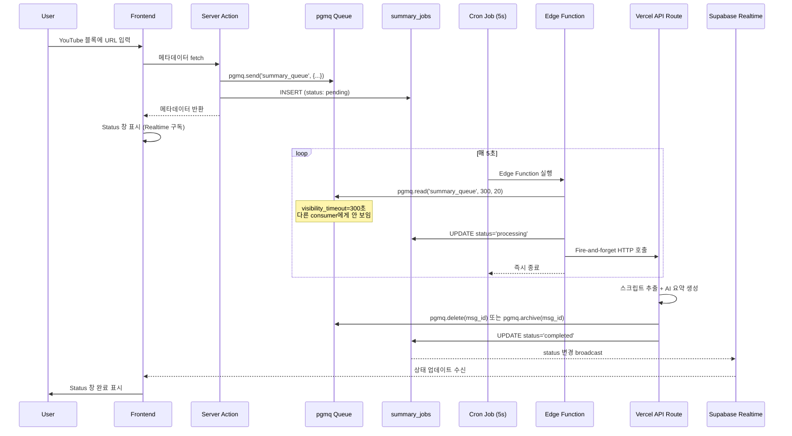

# YouTube 자동 요약 Queue 시스템 구축 (pgmq 하이브리드)

## 아키텍처 개요

**pgmq** (메시지 큐 신뢰성) + **summary_jobs** (프론트엔드 Realtime 상태 추적) 하이브리드 방식




## pgmq vs 직접 테이블 관리 비교


| 항목          | 직접 테이블 관리 | pgmq Extension (선택)      |
| ----------- | --------- | ------------------------ |
| 메시지 보장      | 직접 구현 필요  | Exactly-once delivery 보장 |
| 동시성 처리      | 직접 락킹 구현  | Visibility timeout 내장    |
| 재시도 로직      | 직접 구현 필요  | 자동 재처리 (timeout 후)       |
| Realtime 연동 | 쉬움        | 별도 테이블 필요 (하이브리드)        |


## 1. Database: pgmq + summary_jobs 설정

**파일**: [apps/web/supabase/migrations/YYYYMMDD_create_youtube_summary_queue.sql](apps/web/supabase/migrations/YYYYMMDD_create_youtube_summary_queue.sql)

```sql
-- ============================================
-- 1. pgmq Extension 활성화 및 Queue 생성
-- ============================================
CREATE EXTENSION IF NOT EXISTS pgmq;

-- summary_queue 생성 (Basic Queue - 내구성 보장)
SELECT pgmq.create('summary_queue');

-- ============================================
-- 2. summary_jobs 테이블 (Realtime 상태 추적용)
-- ============================================
CREATE TABLE youtube_app_space.summary_jobs (
  id UUID PRIMARY KEY DEFAULT gen_random_uuid(),

  -- 참조 정보
  block_id UUID NOT NULL REFERENCES public.blocks(id) ON DELETE CASCADE,
  org_id UUID NOT NULL REFERENCES public.organizations(id) ON DELETE CASCADE,
  youtube_id TEXT NOT NULL,  -- videos 테이블의 slug
  language TEXT NOT NULL DEFAULT 'en',

  -- pgmq 메시지 ID (연결용)
  pgmq_msg_id BIGINT,

  -- Job 상태 (Realtime 브로드캐스트용)
  status TEXT NOT NULL DEFAULT 'pending'
    CHECK (status IN ('pending', 'processing', 'completed', 'failed')),

  -- 타임스탬프
  created_at TIMESTAMPTZ NOT NULL DEFAULT NOW(),
  started_at TIMESTAMPTZ,
  completed_at TIMESTAMPTZ,

  -- 에러 정보
  error_message TEXT,

  -- Unique constraint: 같은 블록+언어 조합은 하나만
  UNIQUE(block_id, language)
);

-- 인덱스
CREATE INDEX idx_summary_jobs_block_id ON youtube_app_space.summary_jobs(block_id);
CREATE INDEX idx_summary_jobs_status ON youtube_app_space.summary_jobs(status);

-- Realtime 활성화 (프론트엔드 상태 추적용)
ALTER PUBLICATION supabase_realtime ADD TABLE youtube_app_space.summary_jobs;

-- RLS 활성화
ALTER TABLE youtube_app_space.summary_jobs ENABLE ROW LEVEL SECURITY;

-- RLS 정책: 인증된 사용자는 자신의 org의 jobs만 조회 가능
CREATE POLICY "Users can view their org's summary jobs"
  ON youtube_app_space.summary_jobs
  FOR SELECT
  TO authenticated
  USING (
    org_id IN (
      SELECT organization_id FROM public.organization_members
      WHERE user_id = auth.uid()
    )
  );
```

## 2. Edge Function: Dispatcher (pgmq 사용)

**파일**: [apps/web/supabase/functions/process-summary-queue/index.ts](apps/web/supabase/functions/process-summary-queue/index.ts)

```typescript
import { createClient } from "@supabase/supabase-js";

const BATCH_SIZE = 20;
const VISIBILITY_TIMEOUT = 300; // 5분
const API_URL = Deno.env.get("VERCEL_API_URL")!;
const API_SECRET = Deno.env.get("INTERNAL_API_SECRET")!;

Deno.serve(async () => {
  const supabase = createClient(
    Deno.env.get("SUPABASE_URL")!,
    Deno.env.get("SUPABASE_SERVICE_ROLE_KEY")!
  );

  try {
    // 1. pgmq에서 메시지 읽기 (visibility_timeout 동안 다른 consumer에게 안 보임)
    const { data: messages, error: readError } = await supabase.rpc(
      "pgmq_read",
      {
        queue_name: "summary_queue",
        sleep_seconds: VISIBILITY_TIMEOUT,
        n: BATCH_SIZE,
      }
    );

    if (readError || !messages?.length) {
      return new Response(JSON.stringify({ processed: 0 }));
    }

    // 2. summary_jobs 테이블 상태 업데이트 (processing)
    const jobIds = messages.map((msg: any) => msg.message.jobId);
    await supabase
      .from("summary_jobs")
      .update({ status: "processing", started_at: new Date().toISOString() })
      .in("id", jobIds);

    // 3. Fire-and-forget: API Route 호출 (await 없이)
    messages.forEach((msg: any) => {
      fetch(`${API_URL}/api/youtube/process-summary-job`, {
        method: "POST",
        headers: {
          "Content-Type": "application/json",
          "X-Internal-Secret": API_SECRET,
        },
        body: JSON.stringify({
          jobId: msg.message.jobId,
          msgId: msg.msg_id, // pgmq 메시지 ID (삭제용)
        }),
      }); // no await - fire and forget
    });

    return new Response(JSON.stringify({ dispatched: messages.length }));
  } catch (error) {
    console.error("Error processing queue:", error);
    return new Response(JSON.stringify({ error: error.message }), {
      status: 500,
    });
  }
});
```

## 3. Cron Job 설정

**Supabase Dashboard > Database > Cron Jobs** 에서 설정:

- **Name**: `process-summary-queue`
- **Schedule**: `*/5 * * * * *` (매 5초) - Dashboard에서 지원하는 최소 간격 확인 필요
- **Command**: Edge Function 호출

또는 **pg_cron** (1분 간격 제한):

```sql
-- 1분마다 실행 (pg_cron 최소 간격)
SELECT cron.schedule(
  'process-summary-queue',
  '* * * * *',
  $$SELECT net.http_post(
    url := 'https://your-project.supabase.co/functions/v1/process-summary-queue',
    headers := jsonb_build_object(
      'Authorization', 'Bearer ' || current_setting('app.settings.service_role_key')
    )
  );$$
);
```

**참고**: 5초 간격이 필요하면 Supabase Dashboard의 Cron 기능 또는 외부 Cron 서비스 사용

## 4. API Route: Job 처리

**파일**: [apps/web/src/app/api/youtube/process-summary-job/route.ts](apps/web/src/app/api/youtube/process-summary-job/route.ts)

```typescript
import { NextRequest, NextResponse } from "next/server";
import { createClient } from "@supabase/supabase-js";
import { DrizzleBlockRepository } from "@/domains/block-management/backend/repositories/implementations/drizzle-block.repository";
import { DrizzleVideoRepository } from "@/domains/youtube-app-space/backend/repositories/implementations/drizzle-video.repository";
import { DrizzleVideoSummaryRepository } from "@/domains/youtube-app-space/backend/repositories/implementations/drizzle-video-summary.repository";
import { DrizzleActionTransactionRepository } from "@/domains/youtube-app-space/backend/repositories/implementations/drizzle-action-transaction.repository";
import { extractAndUpdateSummary } from "@/domains/youtube-app-space/backend/services/video-summary";
import { YoutubeBlockPropertiesVO } from "@/domains/block-management/shared/value-objects/block-properties/youtube.vo";

export async function POST(request: NextRequest) {
  // 1. Internal secret 검증
  const secret = request.headers.get("X-Internal-Secret");
  if (secret !== process.env.INTERNAL_API_SECRET) {
    return NextResponse.json({ error: "Unauthorized" }, { status: 401 });
  }

  const { jobId, msgId } = await request.json();

  // Service Role Key로 Supabase 클라이언트 생성
  const supabase = createClient(
    process.env.NEXT_PUBLIC_SUPABASE_URL!,
    process.env.SUPABASE_SERVICE_ROLE_KEY!
  );

  try {
    // 2. Job 조회
    const { data: job, error: jobError } = await supabase
      .from("summary_jobs")
      .select("*")
      .eq("id", jobId)
      .single();

    if (jobError || !job) {
      // Job이 없으면 pgmq 메시지도 삭제
      if (msgId) {
        await supabase.rpc("pgmq_delete", {
          queue_name: "summary_queue",
          msg_id: msgId,
        });
      }
      return NextResponse.json({ error: "Job not found" }, { status: 404 });
    }

    // 3. Block 조회
    const { data: block, error: blockError } = await supabase
      .from("blocks")
      .select("*")
      .eq("id", job.block_id)
      .single();

    if (blockError || !block) {
      throw new Error("Block not found");
    }

    // 4. 요약 실행 (기존 서비스 재사용)
    const blockRepository = new DrizzleBlockRepository();
    const videoRepository = new DrizzleVideoRepository();
    const videoSummaryRepository = new DrizzleVideoSummaryRepository();
    const actionTransactionRepository =
      new DrizzleActionTransactionRepository();

    const youtubeProperties = YoutubeBlockPropertiesVO.fromJSON(
      block.properties
    );

    const result = await extractAndUpdateSummary({
      block,
      orgId: job.org_id,
      videoId: job.youtube_id,
      language: job.language,
      repositories: {
        videoRepository,
        blockRepository,
        videoSummaryRepository,
        actionTransactionRepository,
      },
      youtubeProperties,
    });

    // 5. 결과에 따라 상태 업데이트
    if (result.isSuccess()) {
      // 성공: pgmq 메시지 삭제 (또는 archive)
      if (msgId) {
        await supabase.rpc("pgmq_archive", {
          queue_name: "summary_queue",
          msg_id: msgId,
        });
      }

      // summary_jobs 상태 업데이트
      await supabase
        .from("summary_jobs")
        .update({
          status: "completed",
          completed_at: new Date().toISOString(),
        })
        .eq("id", jobId);

      return NextResponse.json({ success: true });
    } else {
      throw new Error(result.error.message);
    }
  } catch (error) {
    console.error("[process-summary-job] Error:", error);

    // 실패: pgmq 메시지는 삭제하지 않음 (visibility_timeout 후 자동 재시도)
    // summary_jobs는 failed로 업데이트
    await supabase
      .from("summary_jobs")
      .update({
        status: "failed",
        error_message: error instanceof Error ? error.message : "Unknown error",
      })
      .eq("id", jobId);

    return NextResponse.json(
      { error: error instanceof Error ? error.message : "Unknown error" },
      { status: 500 }
    );
  }
}
```

## 5. Job 생성 서버 액션

**파일**: [apps/web/src/domains/youtube-app-space/actions/summary/create-summary-job.action.ts](apps/web/src/domains/youtube-app-space/actions/summary/create-summary-job.action.ts)

```typescript
"use server";

import { createClient } from "@supabase/supabase-js";
import { ActionResult, ok, err } from "@/lib";

interface CreateSummaryJobRequest {
  blockId: string;
  orgId: string;
  youtubeId: string;
  language: string;
}

export async function createSummaryJobAction(
  request: CreateSummaryJobRequest
): Promise<ActionResult<{ jobId: string }>> {
  const supabase = createClient(
    process.env.NEXT_PUBLIC_SUPABASE_URL!,
    process.env.SUPABASE_SERVICE_ROLE_KEY!
  );

  try {
    // 1. summary_jobs 테이블에 INSERT (Realtime용)
    const { data: job, error: jobError } = await supabase
      .from("summary_jobs")
      .upsert(
        {
          block_id: request.blockId,
          org_id: request.orgId,
          youtube_id: request.youtubeId,
          language: request.language,
          status: "pending",
        },
        { onConflict: "block_id,language" }
      )
      .select()
      .single();

    if (jobError) {
      throw new Error(jobError.message);
    }

    // 2. pgmq에 메시지 전송
    const { data: msgId, error: pgmqError } = await supabase.rpc("pgmq_send", {
      queue_name: "summary_queue",
      msg: {
        jobId: job.id,
        blockId: request.blockId,
        youtubeId: request.youtubeId,
        language: request.language,
      },
    });

    if (pgmqError) {
      throw new Error(pgmqError.message);
    }

    // 3. pgmq_msg_id 업데이트
    await supabase
      .from("summary_jobs")
      .update({ pgmq_msg_id: msgId })
      .eq("id", job.id);

    return ok({ jobId: job.id });
  } catch (error) {
    console.error("[createSummaryJobAction] Error:", error);
    return err(error instanceof Error ? error.message : "Unknown error");
  }
}
```

## 6. YouTube 블록 메타데이터 fetch 후 Job 생성 연동

**수정 파일**: [apps/web/src/domains/block-management/frontend/components/block/block-type/youtube/core/use-youtube-block.business.ts](apps/web/src/domains/block-management/frontend/components/block/block-type/youtube/core/use-youtube-block.business.ts)

```typescript
// fetchMetadata 함수 내부, 메타데이터 fetch 성공 후 추가:

// 자동 요약 Job 생성
if (result.success && result.data?.youtubeId) {
  const userLanguage = currentUser?.language || "en";

  await createSummaryJobAction({
    blockId: nodeData.blockId,
    orgId: currentOrgId,
    youtubeId: result.data.youtubeId,
    language: userLanguage,
  });
}
```

## 7. Frontend: Realtime 구독 및 Status 창

**신규 훅**: [apps/web/src/domains/youtube-app-space/frontend/hooks/use-summary-job-realtime.ts](apps/web/src/domains/youtube-app-space/frontend/hooks/use-summary-job-realtime.ts)

```typescript
"use client";

import { useState, useEffect } from "react";
import { useSupabaseRealtime } from "@/domains/realtime-management/frontend/hooks/use-supabase-realtime";

export type SummaryJobStatus =
  | "pending"
  | "processing"
  | "completed"
  | "failed";

interface SummaryJob {
  id: string;
  block_id: string;
  status: SummaryJobStatus;
  error_message?: string;
  created_at: string;
  started_at?: string;
  completed_at?: string;
}

export function useSummaryJobRealtime(blockId: string) {
  const [job, setJob] = useState<SummaryJob | null>(null);

  useSupabaseRealtime({
    table: "summary_jobs",
    schema: "youtube_app_space",
    event: "*",
    filter: `block_id=eq.${blockId}`,
    onEvent: (payload) => {
      if (payload.eventType === "INSERT" || payload.eventType === "UPDATE") {
        setJob(payload.new as SummaryJob);
      }
    },
    enabled: !!blockId,
  });

  const isProcessing =
    job?.status === "pending" || job?.status === "processing";
  const isCompleted = job?.status === "completed";
  const isFailed = job?.status === "failed";

  return {
    job,
    isProcessing,
    isCompleted,
    isFailed,
    errorMessage: job?.error_message,
  };
}
```

**Status 창 연동**: 기존 `useAIActionContext`와 연동하거나 새로운 Status 컴포넌트 생성

## 파일 구조

```
apps/web/
├── supabase/
│   ├── functions/
│   │   └── process-summary-queue/
│   │       └── index.ts                    # Edge Function (신규)
│   └── migrations/
│       └── YYYYMMDD_create_youtube_summary_queue.sql  # 마이그레이션 (신규)
├── src/
│   ├── app/api/youtube/
│   │   └── process-summary-job/
│   │       └── route.ts                    # API Route (신규)
│   └── domains/
│       ├── youtube-app-space/
│       │   ├── frontend/hooks/
│       │   │   └── use-summary-job-realtime.ts  # Realtime 훅 (신규)
│       │   └── actions/summary/
│       │       └── create-summary-job.action.ts  # Job 생성 액션 (신규)
│       └── block-management/
│           └── frontend/components/block/block-type/youtube/
│               └── core/
│                   └── use-youtube-block.business.ts  # 수정
```

## 환경 변수

```env
# .env.local (Vercel)
INTERNAL_API_SECRET=your-secure-secret-here

# Supabase Edge Function Secrets (Dashboard에서 설정)
SUPABASE_URL=https://your-project.supabase.co
SUPABASE_SERVICE_ROLE_KEY=your-service-role-key
VERCEL_API_URL=https://your-app.vercel.app
INTERNAL_API_SECRET=your-secure-secret-here
```

## pgmq 자동 재시도 동작

pgmq의 visibility_timeout 덕분에 재시도 로직이 자동으로 동작합니다:

1. **메시지 읽기**: `pgmq.read('summary_queue', 300, 20)` - 300초 동안 다른 consumer에게 안 보임
2. **처리 성공**: `pgmq.delete()` 또는 `pgmq.archive()` - 메시지 제거
3. **처리 실패** (delete 안 함): 300초 후 자동으로 다시 visible - 다음 polling에서 재처리

**최대 재시도 제한**이 필요하면 메시지의 `read_ct` (읽기 횟수)를 확인:

```typescript
// Edge Function에서
if (msg.read_ct > 3) {
  // 3회 이상 실패 - Dead Letter Queue로 이동 또는 삭제
  await supabase.rpc("pgmq_delete", {
    queue_name: "summary_queue",
    msg_id: msg.msg_id,
  });
  await supabase
    .from("summary_jobs")
    .update({ status: "failed", error_message: "Max retries exceeded" })
    .eq("id", msg.message.jobId);
}
```

