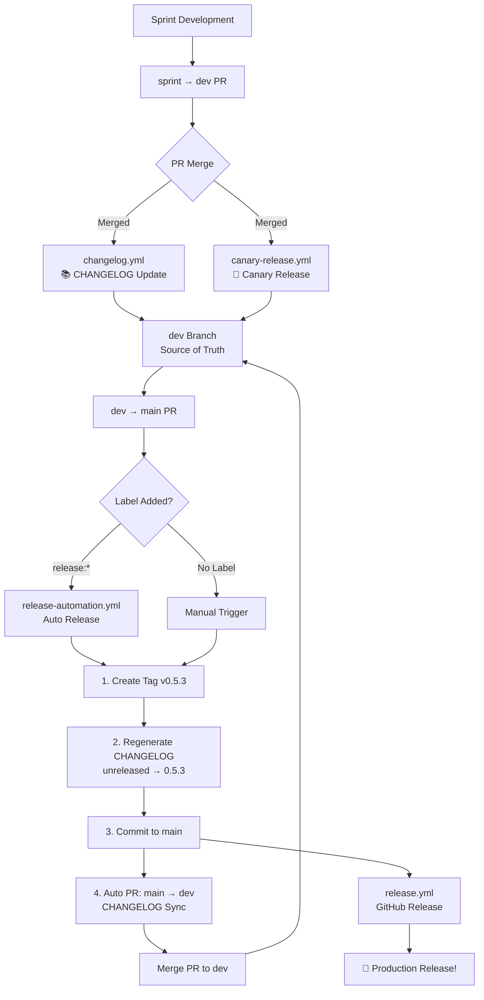

# GitHub Actions Workflows

This directory contains the automated workflows for the project.

## 📋 Workflow List

### 1. `release-automation.yml` - Production Release & CHANGELOG Management ⭐

**Trigger:** When a dev → main PR is merged (with `release:*` label) or manual trigger

**Behavior:**
- Creates production tag (e.g., `v0.5.3`)
- **Regenerates CHANGELOG on main branch** (main is the source of truth)
- Converts `[unreleased]` → `[0.5.3]`
- **Automatically creates main → dev PR** to sync CHANGELOG
- Triggers GitHub Release creation

**Features:**
- ✅ **main is the source of truth** for CHANGELOG
- ✅ Production versions only (no canary versions in CHANGELOG)
- ✅ **Automatic CHANGELOG sync via PR with auto-merge** (main → dev)
- ✅ Label-based or manual version control
- ✅ Prevents infinite loops (skips sync PRs)
- ✅ Fully automated (no manual PR merge needed)

**Label-based Release:**
- `release:major` → v1.0.0
- `release:minor` → v0.6.0
- `release:patch` → v0.5.3

**Configuration:**
- Uses `cliff.toml` for commit parsing rules
- Groups commits by type (Features, Bug Fixes, etc.)

**Workflow Strategy (Industry Standard):**
- dev → main merge: CHANGELOG generated on main ✅
- main → dev: Auto PR created and **auto-merged** for CHANGELOG sync ✅
- Canary versions: Excluded from CHANGELOG ✅

---

### 2. `canary-release.yml` - Canary Release Automation 🐤

**Trigger:** When a PR is merged into `dev` branch

**Behavior:**
- Automatically creates canary (pre-release) builds
- Generates date-based version: `vYYYY.MM.DD-canary.BUILD`
- Creates GitHub Release marked as Pre-release
- Includes recent commit history in release notes

**Features:**
- ✅ Automatic canary releases on every dev merge
- ✅ Date-based versioning (e.g., `v2025.12.14-canary.903`)
- ✅ Auto-incremented build numbers per day
- ✅ Pre-release flag set automatically
- ✅ Manual trigger available
- ✅ **Skips CHANGELOG sync PRs** (prevents duplicate releases)

**Example:**
```bash
# Sprint branch → dev PR merge
# → Automatically creates: v2025.12.14-canary.001
```

**Use Cases:**
- Early testing of new features
- Continuous integration testing
- Beta testing before production release

**See also:** [Canary Release Guide](CANARY_RELEASE_GUIDE.md)

---

### 2. `release.yml` - Automatic GitHub Release Creation

**Trigger:** When a Git tag matching `v*` pattern is pushed (excluding canary tags)

**Behavior:**
- Extracts latest release notes from CHANGELOG using git-cliff
- Automatically creates GitHub Release
- Official release (not draft or pre-release)
- Excludes canary tags automatically

**Features:**
- ✅ Only processes production tags (excludes `*-canary.*`)
- ✅ Generates release notes from CHANGELOG
- ✅ Creates official GitHub Release

**Example:**
```bash
git tag -a v0.5.3 -m "Release v0.5.3"
git push origin v0.5.3
# → GitHub Release is automatically created
```

---

### 3. `canary-release.yml` - Canary Release Automation 🐤

**Trigger:** When a PR is merged into `dev` branch

**Behavior:**
- Automatically creates canary (pre-release) builds
- Generates date-based version: `vYYYY.MM.DD-canary.BUILD`
- Creates GitHub Release marked as Pre-release
- **Excluded from CHANGELOG** (pre-releases only)
- Includes recent commit history in release notes

**Features:**
- ✅ Automatic canary releases on every dev merge
- ✅ Date-based versioning (e.g., `v2025.12.15-canary.001`)
- ✅ Auto-incremented build numbers per day
- ✅ Pre-release flag set automatically
- ✅ Manual trigger available
- ✅ **Not included in CHANGELOG** (production only)
- ✅ **Skips CHANGELOG sync PRs** (prevents duplicate releases)

**Example:**
```bash
# feature → dev PR merge
# → Automatically creates: v2025.12.15-canary.001 (Pre-release)
```

**Use Cases:**
- Early testing of new features
- Continuous integration testing
- Beta testing before production release

---

## 🔄 Complete Workflow

### Full Development & Release Cycle



### Step-by-Step Explanation

#### 1️⃣ Sprint Development
```bash
git checkout dev
git checkout -b sprint/v0.5.3-sprint-017
# ... development work ...
git push origin sprint/v0.5.3-sprint-017
```

#### 2️⃣ sprint → dev PR Merge
**Automatically triggers:**

**A. CHANGELOG Generation** (`changelog.yml`)
- ✅ Updates CHANGELOG.md on **dev branch**
- ✅ Full CHANGELOG with all version sections
- ✅ dev becomes the source of truth

**B. Canary Release** (`canary-release.yml`)
- ✅ Creates canary tag: `v2025.12.14-canary.001`
- ✅ Creates Pre-release on GitHub
- ✅ Testers can install and test early

#### 3️⃣ dev → main PR (Production Release)
- Create dev → main PR
- Add label (optional): `release:patch`, `release:minor`, or `release:major`
- Merge PR

#### 4️⃣ Production Release Automation (`release-automation.yml`)

**Triggers when:**
- PR has `release:*` label (automatic), OR
- Manual trigger from GitHub Actions

**Automatically performs:**
1. ✅ Creates production tag: `v0.5.3`
2. ✅ Regenerates CHANGELOG: `[unreleased]` → `[0.5.3]`
3. ✅ Commits CHANGELOG to main
4. ✅ Creates auto PR: main → dev (CHANGELOG sync)
5. ✅ **Auto-merges the sync PR** (fully automated)
6. ✅ Triggers `release.yml` for GitHub Release

#### 5️⃣ CHANGELOG Sync
- ✅ Auto PR created: main → dev
- ✅ **Automatically merged** (no manual action needed)
- ✅ Only CHANGELOG.md is synced
- ✅ **Automatically skipped by canary-release.yml**
  - Prevents infinite loop
  - No duplicate canary releases

#### 6️⃣ GitHub Release (`release.yml`)
- ✅ Automatically creates official release
- ✅ Includes release notes from CHANGELOG
- ✅ Published to GitHub Release page

---

## 🎯 Usage Scenarios

### Scenario 1: Standard Release (Most Common)

```bash
# 1. Sprint development
sprint/v0.5.3-sprint-017 → dev (PR & Merge)
# → ✅ CHANGELOG updated on dev
# → 🐤 Canary release created (v2025.12.14-canary.001)

# 2. Testing phase
# Testers install canary and provide feedback

# 3. Production release
dev → main PR + label: release:patch
# → ✅ Everything automatic:
#    - Production tag created (v0.5.3)
#    - CHANGELOG regenerated: [unreleased] → [0.5.3]
#    - CHANGELOG committed to main
#    - Auto PR created: main → dev (CHANGELOG sync)
#    - GitHub Release created

# 4. Complete the cycle
# → Merge the CHANGELOG sync PR to dev
```

### Scenario 2: Canary-Only Testing

```bash
# 1. Feature development
feature/new-feature → dev (PR & Merge)
# → 🐤 Canary release created

# 2. Test and iterate
# Multiple canary releases as needed

# 3. When ready, merge to main
dev → main PR
# → Production release
```

### Scenario 3: Manual Release

```bash
# 1-3. Same as Scenario 1 but no label
# 4. Manually run from GitHub Actions:
#    - Version: v0.5.3
#    - Click Run workflow
# 5. Everything else is automatic! ✨
```

### Scenario 4: Hotfix Release

```bash
# 1. Create hotfix branch from main
git checkout main
git checkout -b hotfix/critical-bug
# ... fix ...

# 2. Direct PR to main
# 3. Add label: release:patch
# 4. Merge
# 5. v0.5.4 release is automatically created!
```

---

## 📊 Release Types Comparison

| Type | Naming | Pre-release | Trigger | Use Case |
|------|--------|-------------|---------|----------|
| **Canary** | `v2025.12.14-canary.903` | ✅ Yes | dev merge | Early testing |
| **Sprint** | `v0.5.3-sprint-017` | ❌ No | main merge | Sprint completion |
| **Production** | `v0.5.3` | ❌ No | main merge | Official release |

---

## ⚙️ Configuration and Customization

### CHANGELOG Generation

**File:** `cliff.toml`

```toml
# Skip CHANGELOG meta entries
{ message = "^docs: update CHANGELOG", skip = true},

# Commit parsers
{ message = "^feat", group = "✨ Features"},
{ message = "^fix", group = "🐛 Bug Fixes"},
```

### Canary Release Naming

**File:** `.github/workflows/canary-release.yml`

```yaml
# Current format: YYYY.MM.DD-canary.BUILD
DATE=$(date +%Y.%m.%d)
BUILD_NUMBER=$(printf "%03d" $BUILD_NUMBER)
```

### Version Calculation

**File:** `.github/workflows/release-automation.yml`

```yaml
# Label-based version increment
release:major → MAJOR++
release:minor → MINOR++
release:patch → PATCH++
```

---

## 🔍 Troubleshooting

### CHANGELOG Not Updating

**Causes:**
- Commits not in Conventional Commits format
- `docs: update CHANGELOG` commit detected (now skipped)

**Solutions:**
- Start commit messages with `feat:`, `fix:`, `docs:`, etc.
- Check `commit_parsers` in `cliff.toml`
- ✅ Already fixed! (skip rule added)

### Canary Release Not Created

**Causes:**
- PR not merged to dev
- Workflow execution failed

**Solutions:**
- Check GitHub Actions tab
- Verify PR was merged to `dev` branch
- Manually trigger workflow if needed

### Tag Not Created Automatically

**Causes:**
- No label on PR
- Not run manually

**Solutions:**
- Method 1: Add `release:patch` label to PR
- Method 2: Manually run from GitHub Actions

### Release Notes Empty

**Causes:**
- No recent commits
- No tags for comparison

**Solutions:**
- Canary releases show last 10 commits automatically
- Production releases use CHANGELOG sections

### Infinite Loop Occurring

**Causes:**
- `[skip ci]` is missing
- Workflow conditions are incorrect

**Solutions:**
- ✅ Already fixed! (changelog.yml)
- Include `[skip ci]` in commit message
- Check GitHub Actions bot

---

## 📚 Additional Resources

- [Conventional Commits](https://www.conventionalcommits.org/)
- [Semantic Versioning](https://semver.org/)
- [git-cliff Documentation](https://git-cliff.org/)
- [GitHub Actions Documentation](https://docs.github.com/en/actions)
- [Canary Release Guide](CANARY_RELEASE_GUIDE.md)

---

## 🎉 Summary

### Complete Automation Flow

**Development Cycle:**
1. Sprint development
2. PR to dev → 📝 **CHANGELOG update** (automatic) + 🐤 **Canary release** (automatic)
3. Testing and feedback
4. PR to main → 🏷️ **Tag creation** (automatic, with label)
5. 🎉 **Production release** (automatic)

**Manual tasks:**
- Sprint development
- PR creation and review
- Click PR merge button
- (Optional) Add release label
- (Optional) Enter version in GitHub Actions

**Automatically handled:**
- ✅ Canary releases (dev merges)
- ✅ CHANGELOG updates (main merges)
- ✅ Version tag creation (with labels)
- ✅ GitHub Release creation
- ✅ Release notes generation
- ✅ Pre-release flag management

**Time saved: ~15 minutes → ~30 seconds** ⚡

---

## 🚀 Quick Reference

### Create Canary Release
```bash
# Just merge PR to dev
sprint/branch → dev (PR & Merge)
# → Canary created automatically!
```

### Create Production Release
```bash
# Option 1: With label
dev → main PR + label:release:patch
# → Automatic release!

# Option 2: Manual
GitHub Actions → Release Automation → Run
# → Enter version → Run
```

### Check Releases
- Canary: https://github.com/ssota-labs/ssota/releases (Pre-release)
- Production: https://github.com/ssota-labs/ssota/releases (Latest)

---

Happy releasing! 🎉
