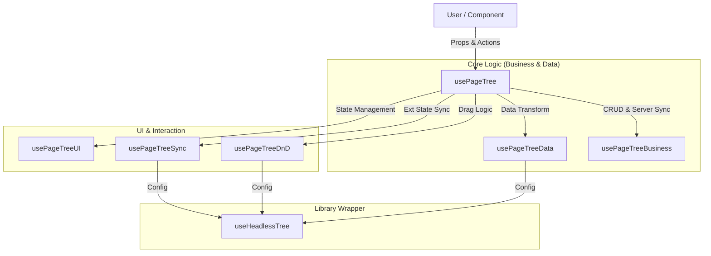
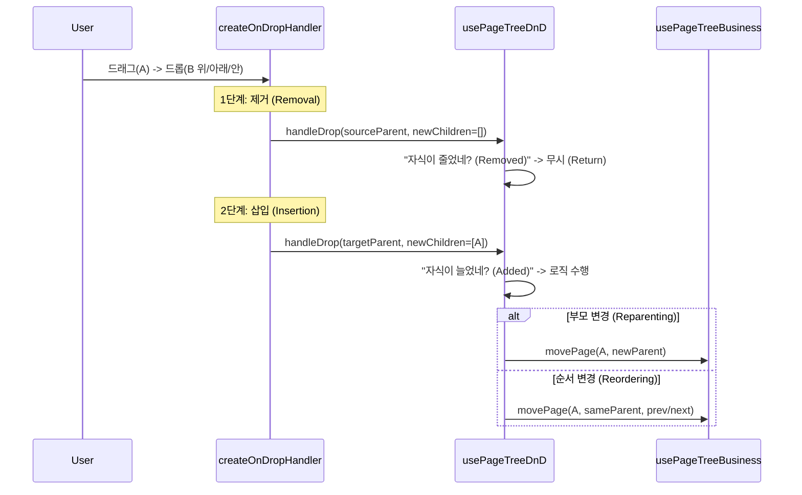

# Page Tree Core Logic Documentation

이 문서는 워크스페이스 사이드바의 **페이지 트리(Page Tree)** 로직을 설명합니다.
단순히 트리를 보여주는 것을 넘어, **상태 동기화, Drag & Drop, Optimistic Update, UX 보정** 등 복잡한 요구사항을 처리하기 위해 **Hook Composition 패턴**을 사용했습니다.

---

## 1. 아키텍처 (Architecture)

하나의 거대한 파일(`usePageTree.ts`)이 모든 걸 처리하지 않도록, **책임(Responsibility)**을 기준으로 파일을 분리했습니다.



### 파일별 상세 역할 가이드

| 파일명 | 역할 및 핵심 질문 | 만약 이 파일이 없다면? |
|:---|:---|:---|
| **`usePageTree.ts`** | **오케스트레이터 (지휘자)**<br>하위 훅들을 엮어서 최종적으로 UI 컴포넌트가 사용할 `props`를 만들어냅니다. | 컴포넌트에서 5개의 훅을 일일이 다 불러와야 해서 코드가 매우 지저분해집니다. |
| **`usePageTreeData.ts`** | **데이터 번역가**<br>서버의 `PageTreeNodeDTO`를 트리 라이브러리용 `Map` 구조로 변환합니다. | 트리가 데이터를 인식하지 못해 화면에 아무것도 안 나옵니다. |
| **`usePageTreeUI.ts`** | **UI 상태 관리자**<br>`expandedPageIds`, `selectedPageId`를 관리하고 `localStorage`에 저장합니다. | 새로고침할 때마다 트리가 다 접혀버려서 사용자가 짜증을 냅니다. |
| **`usePageTreeBusiness.ts`** | **서버 통신 담당관**<br>CRUD 작업을 수행하며 **Optimistic Update**를 처리합니다. | 페이지를 만들거나 옮길 때마다 서버 응답을 기다리느라 UI가 멈칫거립니다. |
| **`usePageTreeDnD.ts`** | **DnD 통역사**<br>드롭 이벤트를 분석하여 "순서 변경"인지 "부모 변경"인지 판단합니다. | 드래그 앤 드롭을 해도 아무 일이 일어나지 않거나 엉뚱하게 동작합니다. |
| **`usePageTreeSync.ts`** | **동기화 요원**<br>React State 변화를 감지해 트리 라이브러리 내부 메서드를 호출합니다. | URL을 바꿔서 이동했는데 사이드바의 선택 표시(Highlight)가 안 바뀝니다. |

---

## 2. 핵심 UX 로직 상세 (Deep Dive)

주니어 개발자가 코드를 볼 때 "이게 왜 필요하지?"라고 의문을 가질 수 있는 부분들을 시나리오별로 정리했습니다.

### A. 외부 진입 시 부모 자동 펼치기 (Auto-Expansion)
> **상황**: 사용자가 사이드바 트리를 클릭한 게 아니라, **상단 검색창**이나 **브레드크럼**, **홈 화면의 최근 페이지**를 통해 `/page/123`으로 이동했습니다.

*   **문제**: 트리는 성능을 위해 기본적으로 1뎁스만 제외하고 다 접혀있습니다(`collapsed`). 사용자가 깊은 depth에 있는 `/page/123`으로 이동하면, 트리는 닫혀있고 페이지만 선택된 상태라 **사이드바에서 내 위치를 찾을 수 없습니다.**
*   **해결 (`selectPage` 함수)**:
    1.  이동하려는 페이지 ID(`123`)를 받습니다.
    2.  `findPageAncestors` 함수로 그 페이지의 **모든 조상 폴더 ID**를 찾습니다. (예: `[Root, Folder A, Folder B]`)
    3.  `uiState.expandPage()`를 호출하여 조상들을 **강제로 펼칩니다**.
    4.  그 후 페이지를 선택(Highlight)합니다.
*   **코드 위치**: `usePageTree.ts` 내부 `selectPage` 함수.

### B. 페이지 생성 후 즉시 노출 (Creation UX)
> **상황**: 사용자가 '폴더 A' 안에 새 페이지를 만들었습니다. 그런데 '폴더 A'가 접혀있는 상태였습니다.

*   **문제**: 서버에 요청을 보내고 페이지가 생성되어도, 부모 폴더가 접혀있으면 사용자는 **"어? 페이지가 안 만들어졌나?"**라고 착각하게 됩니다.
*   **해결 (`createPageWithUIUpdate` 함수)**:
    1.  페이지 생성 요청이 들어오면, 먼저 `parentId`를 확인합니다.
    2.  `uiState.expandPage(parentId)`를 호출하여 부모 폴더를 **강제로 펼칩니다**.
    3.  그 후 비즈니스 로직(`createPage`)을 호출합니다.
    4.  `Optimistic Update`가 동작하여, 서버 응답 전에 가짜 페이지가 트리에 즉시 나타납니다.
*   **코드 위치**: `usePageTree.ts` 내부 `createPageWithUIUpdate` 함수.

### C. 초기화 및 상태 복원 (Initialization & Persistence)
> **상황**: 사용자가 열심히 트리를 펼쳐놓고 작업하다가 **새로고침**을 했습니다. 트리가 다 닫혀버리면 다시 찾아가기 귀찮습니다.

*   **해결 (`usePageTreeUI` Hook)**:
    1.  **펼침 상태 (Expansion)**: 각 폴더의 펼침 상태를 `localStorage`에 `ssota-page-collapsed-{id}` 키로 저장합니다. 초기 로드 시 이를 읽어와 복원합니다.
    2.  **선택 상태 (Selection)**:
        *   URL이나 Props로 `initialSelectedPageId`가 넘어오면 그걸 씁니다.
        *   없다면 쿠키(`ssota-recent-page`)를 확인하여 **마지막으로 봤던 페이지**를 찾아 선택합니다.
    3.  **Next.js 특성 대응 (Layout Persistence)**:
        *   Next.js는 페이지 이동 시 레이아웃 컴포넌트가 **언마운트되지 않고 유지**됩니다.
        *   따라서 `useState` 초기값뿐만 아니라 `useEffect`를 통해 `initialSelectedPageId` prop이 바뀔 때마다 내부 상태를 업데이트(`setSelectedPageId`)해줘야 합니다.

---

## 3. Drag & Drop 메커니즘 (`createOnDropHandler`)

`@headless-tree` 라이브러리의 `createOnDropHandler`가 하는 마법 같은 일을 이해해야 `usePageTreeDnD.ts`를 수정할 수 있습니다.

### 동작 원리 (The "Magic")
사용자님이 찾아보신 것처럼, `createOnDropHandler`는 내부적으로 **두 단계의 작업**을 수행합니다. 즉, 드래그 앤 드롭 한 번에 `handleDrop` 콜백이 **여러 번(부모 개수만큼)** 호출됩니다.

```javascript
// [라이브러리 내부 동작 개념도]
createOnDropHandler = (onChangeChildren) => async (items, target) => {
  // 1단계: 원래 부모에서 아이템 제거 (Source Parent Update)
  // -> onChangeChildren(sourceParent, childrenWithoutItems) 호출
  await removeItemsFromParents(items, onChangeChildren);
  
  // 2단계: 새 위치에 아이템 삽입 (Target Parent Update)
  // -> onChangeChildren(targetParent, childrenWithItems) 호출
  await insertItemsAtTarget(items, target, onChangeChildren);
}
```

이로 인해 `usePageTreeDnD.ts`의 `handleDrop` 함수는 다음과 같은 순서로 실행됩니다.

1.  **제거 단계**: 원래 부모(`sourceParent`)의 자식 목록에서 아이템이 빠진 상태로 호출됨.
    *   우리는 이때 `removedIds`가 있다는 것을 감지하고 무시합니다. (Case 2)
2.  **삽입 단계**: 새 부모(`targetParent`)의 자식 목록에 아이템이 추가된 상태로 호출됨.
    *   우리는 이때 `addedIds`가 있다는 것을 감지하고 DB 업데이트(`movePage`)를 수행합니다. (Case 1)

### 데이터 흐름 (Data Flow)



### ⚠️ 핵심 구현 디테일 (Critical Implementation Details)

드래그 앤 드롭이 부드럽게 동작하도록 하기 위해 반드시 지켜져야 할 중요한 처리 로직들입니다.

#### 1. 최상단 아이템의 reorder가 실행되지 않는 문제 (Hidden IDs Strategy) = isArrayChanged가 항상 false 버그
> **문제**: 라이브러리가 "제거(Removal)" 후 "삽입(Insertion)"을 수행하는 아주 짧은 순간 동안, **실제 데이터(DB/State)는 아직 업데이트되지 않은 상태**입니다.
> 2단계(삽입)에서 라이브러리가 새 위치를 계산할 때, **아직 제거되지 않은 원래 아이템(Old)**과 **새로 삽입하려는 아이템(New)**이 동시에 존재하게 됩니다.
> 이때 `Set`(집합) 자료구조 특성상, **"원래 있던 놈(Old)"이 우선권을 가져서 "새로 들어온 놈(New)"이 무시되는 현상**이 발생합니다. 이로 인해 **아래로 내리는 이동(Move Down)**이 동작하지 않습니다.

**예시 (Example)**:
```javascript
// 상황: [11, 13, 12] 순서에서 11번을 13번 뒤로 이동하고 싶음
// 기대 결과: [13, 11, 12]

// 1. 임시 숨김(Drag Hidden)이 없을 때 (FAIL)
// 라이브러리가 "11번을 13번 뒤에 넣어라"라고 시도함
// 이때 원본 데이터에는 아직 11번이 맨 앞에 살아있음
const original = [11, 13, 12];
const inserted = [11, 13, 11(New), 12]; // 13번 뒤에 11 추가
const unique = new Set(inserted); 
// Set 결과: [11(Old), 13, 12] -> "어? 11은 이미 있는데?" 하고 뒤에 놈 무시
// => 결과적으로 순서가 안 바뀜!

// 2. 임시 숨김(Drag Hidden) 적용 시 (SUCCESS)
// 1단계(제거)에서 11번을 "없는 셈" 침 (usePageTreeData에서 필터링)
const cleanList = [13, 12]; // 11번이 안 보임
const inserted = [13, 11(New), 12]; // 13번 뒤에 11 추가
const unique = new Set(inserted);
// Set 결과: [13, 11, 12] -> 중복이 없으므로 정상적으로 들어감!
// => 순서 변경 성공!
```

*   **해결책 (`dragHiddenIds`)**:
    1.  `handleDrop`의 **제거 단계(Removal)**에서, 빠져나가는 아이템 ID를 `dragHiddenIds` (Ref)에 추가합니다.
    2.  `usePageTreeData`는 렌더링 시 `dragHiddenIds`에 포함된 아이템을 자식 목록에서 **제외**하고 렌더링합니다. (마치 1단계가 성공해서 DB에 반영된 것처럼 속임)
    3.  이렇게 하면 2단계(삽입)가 실행될 때 라이브러리는 **"원래 아이템이 없는 깨끗한 목록"**을 보게 되어, 새 위치에 정확하게 아이템을 삽입할 수 있습니다.
    4.  모든 로직이 끝나면 `dragHiddenIds`를 `clear()`합니다.

#### 2. 최상위 계층 처리 (Root Handling)
> **문제**: 최상위 계층(Root)에 있는 아이템을 이동할 때, 라이브러리는 부모 ID를 `workspaceId`로 인식합니다. 하지만 우리 데이터 구조(`treeData`)에는 `workspaceId`라는 키를 가진 실제 Item 객체가 없습니다. 이로 인해 Root에서의 이동을 감지하지 못하거나 잘못된 동작(빈 배열과 비교 등)을 유발합니다.

*   **해결책 (`rootPageIds`)**:
    1.  `usePageTreeData`로부터 최상위 아이템들의 ID 목록인 `rootPageIds`를 별도로 전달받습니다.
    2.  `handleDrop`에서 `parentId === workspaceId`인 경우, `treeData`를 조회하는 대신 **`rootPageIds`를 `currentChildren`으로 사용**합니다.
    3.  이를 통해 최상위 레벨에서도 "기존 순서"와 "새 순서"를 정확히 비교(Diff)할 수 있게 되어, Root 아이템 간의 순서 변경(Reordering)이 완벽하게 동작합니다.

#### 3. 이동한 아이템 식별 오류 (Identification Strategy)
> **문제**: 배열의 순서가 변경되었음을 감지한 후, "정확히 어떤 아이템이 이동했는지" 찾는 것이 중요합니다.
> 기존의 단순 인덱스 비교 방식(`current[i] !== unique[i]`)은 **배열의 첫 번째 아이템이 이동할 때 치명적인 오류**를 범합니다. 첫 번째 아이템이 빠지면 뒤에 있는 **모든 아이템의 인덱스가 밀리기 때문**에, 실제로는 3번째 아이템이 이동했는데 2번째 아이템이 이동한 것으로 잘못 판단하게 됩니다.

**예시 (Example)**:
```javascript
// 상황: [A, B, C]에서 A를 맨 뒤로 이동 -> [B, C, A]

// 1. 단순 인덱스 비교 (FAIL)
// 0번 인덱스 비교: Old(A) !== New(B) -> "어? 다르네? B가 이동했구나!" (오판)
// Result: 엉뚱한 아이템(B)에 대해 movePage를 호출하여 데이터가 꼬임.

// 2. 나머지 아이템 비교법 (SUCCESS)
// "이 아이템을 뺐을 때, 나머지 아이템들의 순서가 그대로인가?"를 확인
// A를 뺌 -> 나머지: [B, C] vs [B, C] (일치!) -> "A가 범인이군."
// B를 뺌 -> 나머지: [A, C] vs [C, A] (불일치)
```

*   **해결책 (`rest array comparison`)**:
    *   `uniqueChildren.find`를 수행할 때, 해당 아이템을 제외한 나머지 배열(`oldRest`, `newRest`)을 비교합니다.
    *   나머지 아이템들의 길이와 순서가 완벽히 일치하는 아이템을 찾아야만 "이동한 주체"를 정확히 식별할 수 있습니다.

---

## 4. 자주 묻는 질문 (FAQ)

*   **Q: `createPage`에 `autoSelect` 기능은 왜 없나요?**
    *   A: 예전에는 페이지 생성 후 자동으로 해당 페이지로 이동하는 기능이 있었으나, 기획 변경으로 삭제되었습니다. 현재는 생성만 하고 이동하지 않습니다. (코드는 삭제되었지만 UX를 위한 `expandPage`는 남아있습니다.)
*   **Q: `selectedWorkspaceId`는 왜 따로 계산하나요? 그냥 `workspaceId` 쓰면 안 되나요?**
    *   A: `selectedPageId`가 URL이나 로컬스토리지에 남아있는데, 실제로는 **다른 사람이 삭제한 페이지**일 수 있습니다. 선택된 페이지가 **실제 트리 데이터에 존재하는지 검증(`findPageInTreeHelper`)**한 후, 유효할 때만 워크스페이스 ID를 반환하기 위한 방어 로직입니다.
