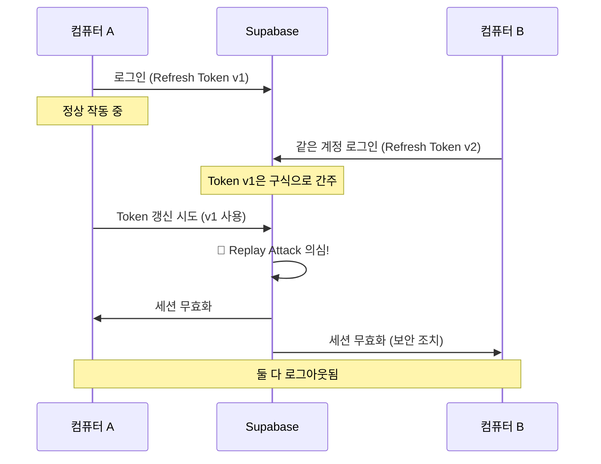

# Auth Session Management Guide

> 멀티 디바이스 환경에서 세션 관리 및 Supabase 인증 설정 가이드

## 📋 목차

1. [문제 상황](#문제-상황)
2. [원인 분석](#원인-분석)
3. [구현 솔루션](#구현-솔루션)
4. [Supabase 설정](#supabase-설정)
5. [멀티 디바이스 전략](#멀티-디바이스-전략)
6. [테스트 방법](#테스트-방법)
7. [향후 개선 사항](#향후-개선-사항)

---

## 문제 상황

### 발생한 에러

배포 환경에서 다음과 같은 에러가 발생:

```
[error] [getUserOrganizationsAction] Authentication failed: 
Error [AuthSessionMissingError]: Auth session missing!

[error] [/r/[orgId]/layout] Error fetching organizations: 
Error: Authentication required

[error] [PageContent] Canvas 로드 실패: User not authenticated
```

### 재현 시나리오

1. **컴퓨터 A**에서 로그인 ✅
2. **컴퓨터 B**에서 같은 계정으로 로그인 ✅
3. **컴퓨터 A**에서 페이지 새로고침 → ❌ 에러 발생
4. 브라우저 쿠키를 수동으로 삭제하고 재로그인하면 정상 작동

---

## 원인 분석

### Supabase의 보안 기능

**현재 설정:**
```
Detect and revoke potentially compromised refresh tokens = ON
Enforce single session per user = OFF
Refresh token reuse interval = 10 seconds
```

### 동작 방식



### 왜 이런 기능이 있는가?

**Token Replay Attack 방지:**
- 공격자가 네트워크에서 refresh token을 가로챔
- 공격자가 그 토큰으로 로그인 시도
- Supabase가 "같은 토큰이 여러 곳에서 사용됨" 감지
- 즉시 모든 세션 무효화로 계정 보호

---

## 구현 솔루션

### 1. Auth Session Monitor

**파일:** `apps/web/src/lib/auth-session-monitor.tsx`

실시간으로 세션 상태를 모니터링하고 자동으로 처리하는 클라이언트 컴포넌트

#### 주요 기능

1. **실시간 세션 모니터링**
   - `onAuthStateChange` 리스너로 Supabase 인증 이벤트 감지
   - `SIGNED_OUT`, `TOKEN_REFRESHED` 이벤트 처리

2. **자동 로그아웃 및 리다이렉트**
   - 세션 만료 시 자동으로 `signOut()` 호출
   - 쿠키 자동 클리어
   - 로그인 페이지로 친절한 메시지와 함께 리다이렉트

3. **주기적 세션 검증**
   - 5분마다 세션 유효성 확인
   - 네트워크 문제나 예외 상황 포착

#### 코드 구조

```typescript
export function AuthSessionMonitor({ children }: { children: React.ReactNode }) {
  const router = useRouter();
  const isHandlingAuthChange = useRef(false);

  useEffect(() => {
    const supabase = createClient();

    // 1. 세션 상태 변화 리스너
    const { data: { subscription } } = supabase.auth.onAuthStateChange(
      async (event, session) => {
        if (event === 'SIGNED_OUT' || (event === 'TOKEN_REFRESHED' && !session)) {
          // 보호된 경로에서만 리다이렉트
          if (isProtectedPath(window.location.pathname)) {
            await supabase.auth.signOut();
            window.location.href = '/login?message=Session expired';
          }
        }
      }
    );

    // 2. 주기적 세션 체크 (5분마다)
    const sessionCheckInterval = setInterval(async () => {
      const { data: { session }, error } = await supabase.auth.getSession();
      if (error || !session) {
        // 세션 무효화 처리
      }
    }, 5 * 60 * 1000);

    return () => {
      subscription.unsubscribe();
      clearInterval(sessionCheckInterval);
    };
  }, [router]);

  return <>{children}</>;
}
```

### 2. Middleware 개선

**파일:** `apps/web/src/utils/supabase/middleware.ts`

서버 사이드에서 세션을 체크하고 보호된 경로 접근을 제어

```typescript
export async function updateSession(request: NextRequest) {
  const supabase = createServerClient(/* ... */);
  const { data: { user }, error } = await supabase.auth.getUser();

  const protectedPaths = ['/r/', '/api/'];
  const isProtectedPath = protectedPaths.some(path =>
    request.nextUrl.pathname.startsWith(path)
  );

  // 세션 없이 보호된 경로 접근 시 리다이렉트
  if ((!user || error) && isProtectedPath) {
    const url = request.nextUrl.clone();
    url.pathname = '/login';
    url.searchParams.set('message', 'Session expired. Please log in again.');
    return NextResponse.redirect(url);
  }

  return supabaseResponse;
}
```

### 3. Server Actions 개선

**파일:** `apps/web/src/domains/organization-management/actions/organization-management.actions.ts`

인증 에러를 더 명확하게 처리

```typescript
export async function getUserOrganizationsAction() {
  const supabase = await createClient();
  const { data: { user }, error } = await supabase.auth.getUser();

  if (error || !user) {
    console.error('[getUserOrganizationsAction] Authentication failed:', {
      error: error?.message,
      hasUser: !!user,
      errorCode: error?.status,
      timestamp: new Date().toISOString(),
    });
    
    // 세션 만료 시 더 명확한 메시지
    if (error?.message?.includes('session') || error?.message?.includes('Auth')) {
      throw new Error('SESSION_EXPIRED');
    }
    
    throw new Error('Authentication required');
  }
  
  // ... 로직 계속
}
```

### 4. Layout 에러 처리

**파일:** `apps/web/src/app/(dashboard)/r/[orgId]/layout.tsx`

레이아웃에서 세션 만료 시 로그인 페이지로 리다이렉트

```typescript
try {
  organizations = await getUserOrganizationsAction();
} catch (error) {
  if (error instanceof Error) {
    const isAuthError = 
      error.message === 'Authentication required' || 
      error.message === 'SESSION_EXPIRED' ||
      error.message.includes('Auth session missing');
    
    if (isAuthError) {
      redirect('/login?message=Your%20session%20has%20expired');
    }
  }
  throw error;
}
```

---

## Supabase 설정

### Dashboard 접근

```
Supabase Dashboard → Authentication → Settings
```

### 현재 설정 (발표/데모용)

```yaml
Refresh Tokens:
  Detect and revoke potentially compromised refresh tokens: ON
  Refresh token reuse interval: 10 seconds

User Sessions:
  Enforce single session per user: OFF
  Time-box user sessions: 0 (never)
  Inactivity timeout: 0 (never)
```

**장점:**
- ✅ 보안 강화 (Replay Attack 방지)
- ✅ AuthSessionMonitor가 자동 처리
- ✅ 에러 대신 친절한 리다이렉트

**단점:**
- ⚠️ 멀티 디바이스 사용 시 기존 세션 무효화

### 프로덕션 권장 설정

```yaml
Refresh Tokens:
  Detect and revoke potentially compromised refresh tokens: OFF  # ⬅️ 변경
  Refresh token reuse interval: 10 seconds

User Sessions:
  Enforce single session per user: OFF
  Time-box user sessions: 0 (never)
  Inactivity timeout: 0 (never)
```

**장점:**
- ✅ 멀티 디바이스 동시 사용 가능
- ✅ UX 최상
- ✅ 여전히 AuthSessionMonitor가 세션 만료 감지

**단점:**
- ⚠️ Replay Attack에 약간 취약 (대부분의 SaaS는 이 방식 사용)

---

## 멀티 디바이스 전략

### Option 1: Multiple Sessions 허용 (현재 권장) ⭐

**설정:**
```
Detect compromised tokens = OFF
Enforce single session = OFF
```

**동작:**
- 데스크톱, 모바일, 태블릿 동시 로그인
- 서로 방해하지 않음
- 각 기기의 세션은 독립적

**사용 예:**
- Notion, Figma, Slack
- 대부분의 SaaS 제품

### Option 2: Device-Based Session Management (향후)

**구현:**

```sql
-- sessions 테이블 추가
CREATE TABLE user_sessions (
  id uuid PRIMARY KEY DEFAULT gen_random_uuid(),
  user_id uuid REFERENCES users(id) ON DELETE CASCADE,
  device_fingerprint text NOT NULL,
  device_type text CHECK (device_type IN ('desktop', 'mobile', 'tablet')),
  device_name text,
  device_info jsonb,
  last_active timestamptz DEFAULT now(),
  created_at timestamptz DEFAULT now(),
  UNIQUE(user_id, device_fingerprint)
);

-- 인덱스
CREATE INDEX idx_user_sessions_user_id ON user_sessions(user_id);
CREATE INDEX idx_user_sessions_last_active ON user_sessions(last_active);
```

**프론트엔드:**

```typescript
// Device fingerprinting
import FingerprintJS from '@fingerprintjs/fingerprintjs';

async function getDeviceFingerprint() {
  const fp = await FingerprintJS.load();
  const result = await fp.get();
  return result.visitorId;
}

// 로그인 시 device 정보 저장
async function signInWithDevice() {
  const deviceId = await getDeviceFingerprint();
  const deviceInfo = {
    userAgent: navigator.userAgent,
    platform: navigator.platform,
    language: navigator.language,
  };
  
  // Supabase 로그인 후 세션 정보 저장
  await supabase.from('user_sessions').upsert({
    user_id: user.id,
    device_fingerprint: deviceId,
    device_type: detectDeviceType(),
    device_name: getDeviceName(),
    device_info: deviceInfo,
    last_active: new Date().toISOString(),
  });
}
```

**UI 컴포넌트:**

```tsx
// Settings > Active Sessions
function ActiveSessionsPage() {
  const { sessions } = useActiveSessions();
  
  return (
    <div>
      <h2>Active Sessions</h2>
      {sessions.map(session => (
        <SessionCard key={session.id}>
          <DeviceIcon type={session.device_type} />
          <div>
            <h3>{session.device_name}</h3>
            <p>Last active: {formatTimeAgo(session.last_active)}</p>
            {session.is_current && <Badge>Current</Badge>}
          </div>
          <Button onClick={() => revokeSession(session.id)}>
            Log out
          </Button>
        </SessionCard>
      ))}
      <Button variant="destructive" onClick={revokeAllOtherSessions}>
        Log out all other devices
      </Button>
    </div>
  );
}
```

**장점:**
- ✅ 멀티 디바이스 지원
- ✅ 보안 유지
- ✅ 사용자가 직접 관리 가능
- ✅ 의심스러운 로그인 감지

**사용 예:**
- Gmail, GitHub, Netflix

### Option 3: Smart Session Management (Enterprise)

**기능:**
- AI 기반 로그인 패턴 분석
- 지역, 시간, 네트워크 기반 판단
- 의심스러운 로그인만 차단

**구현 예:**

```typescript
class SmartSessionManager {
  async shouldInvalidateSession(newLogin: LoginEvent) {
    // 1. 같은 네트워크 → 허용
    if (this.isSameNetwork(newLogin.ip, currentSession.ip)) {
      return false;
    }
    
    // 2. 짧은 시간 내 로그인 (10분) → 허용
    if (this.timeDiff(newLogin.timestamp, currentSession.timestamp) < 600000) {
      return false;
    }
    
    // 3. 알려진 기기 → 허용
    if (this.isKnownDevice(newLogin.deviceId)) {
      return false;
    }
    
    // 4. 다른 국가에서 로그인 → 경고 + 확인 필요
    if (this.isDifferentCountry(newLogin.location, currentSession.location)) {
      await this.sendSecurityAlert(currentSession.user_id, newLogin);
      return true; // 확인 전까지 차단
    }
    
    return false; // 기본적으로 허용
  }
  
  private isSameNetwork(ip1: string, ip2: string): boolean {
    // IP 범위 비교 로직
    return ip1.split('.').slice(0, 3).join('.') === 
           ip2.split('.').slice(0, 3).join('.');
  }
}
```

**사용 예:**
- Facebook, Google Account
- Banking apps

---

## 테스트 방법

### 1. 로컬 환경 테스트

```bash
# 방법 1: 다른 브라우저 사용
1. Chrome에서 로그인
2. Safari/Firefox에서 같은 계정으로 로그인
3. Chrome으로 돌아가서 페이지 새로고침
4. 콘솔에서 로그 확인:
   [AuthSessionMonitor] Auth state changed
   [AuthSessionMonitor] Session expired
   [AuthSessionMonitor] Redirecting to login page

# 방법 2: 시크릿 모드
1. Chrome 일반 모드에서 로그인
2. Chrome 시크릿 모드에서 같은 계정 로그인
3. 일반 모드로 돌아가서 테스트
```

### 2. 배포 환경 테스트

```bash
# 실제 멀티 디바이스
1. 데스크톱: https://your-app.vercel.app 로그인
2. 모바일: 같은 계정으로 로그인
3. 데스크톱에서 페이지 새로고침 또는 네비게이션
4. 자동 리다이렉트 확인
```

### 3. 개발자 도구 시뮬레이션

```javascript
// 브라우저 콘솔에서 실행
// 1. 강제 로그아웃
const { createClient } = await import('@/utils/supabase/browser');
const supabase = createClient();
await supabase.auth.signOut();

// 2. 세션 확인
const { data, error } = await supabase.auth.getSession();
console.log('Session:', data.session);

// 3. AuthStateChange 이벤트 확인
supabase.auth.onAuthStateChange((event, session) => {
  console.log('Event:', event, 'Session:', !!session);
});
```

### 4. 예상 동작

**성공 케이스:**
```
✅ 세션 만료 감지됨
✅ 자동으로 signOut() 호출
✅ 쿠키 클리어됨
✅ /login?message=Session%20expired로 리다이렉트
✅ 에러 화면 없이 깔끔하게 처리
```

**실패 케이스 (디버깅):**
```
❌ AuthSessionMonitor 로그가 안 보임
   → Provider 순서 확인 (app/provider.tsx)
   
❌ 리다이렉트가 안됨
   → isProtectedPath 로직 확인
   
❌ 여전히 에러 화면 표시
   → 레이아웃 에러 처리 확인
```

---

## 향후 개선 사항

### Phase 1: 현재 (MVP/발표용)

**상태:**
- ✅ AuthSessionMonitor 구현 완료
- ✅ Middleware 개선 완료
- ✅ Server Actions 에러 처리 개선 완료

**설정:**
```
Detect compromised tokens = ON
+ AuthSessionMonitor
```

**권장 사용법:**
- 발표 시 한 기기에서만 로그인
- 필요하면 다른 기기에서 재로그인

### Phase 2: 출시 초기 (1-2개월)

**구현 목표:**
1. Supabase 설정 변경
   ```
   Detect compromised tokens = OFF
   ```

2. 간단한 세션 리스트 UI
   ```tsx
   // Settings > Security > Active Sessions
   - 현재 세션 목록 표시
   - 마지막 활동 시간
   - 개별 로그아웃 버튼
   - 전체 로그아웃 버튼
   ```

3. 기본 메트릭 수집
   - 동시 활성 세션 수
   - 평균 세션 지속 시간
   - 기기별 사용 패턴

### Phase 3: 프로덕션 (3-6개월)

**구현 목표:**

1. **Device-Based Session Management**
   ```sql
   -- DB 스키마 추가
   CREATE TABLE user_sessions (...)
   CREATE TABLE login_history (...)
   ```

2. **Device Fingerprinting**
   ```bash
   npm install @fingerprintjs/fingerprintjs
   ```

3. **보안 알림**
   - 새 기기 로그인 시 이메일 알림
   - 의심스러운 위치 로그인 감지
   - 푸시 알림 (모바일 앱 출시 시)

4. **고급 UI**
   ```tsx
   // 세션 관리 페이지
   - 기기별 아이콘 (💻📱🖥️)
   - 위치 정보 표시 (IP 기반)
   - 브라우저/OS 정보
   - 신뢰할 수 있는 기기 설정
   ```

### Phase 4: 성장기 (6-12개월)

**구현 목표:**

1. **2FA (Two-Factor Authentication)**
   - TOTP (Google Authenticator)
   - SMS 인증
   - 백업 코드

2. **Advanced Security**
   - 비정상 로그인 패턴 감지
   - IP whitelist/blacklist
   - Rate limiting
   - Brute force protection

3. **Smart Session Management**
   - AI 기반 로그인 패턴 분석
   - 자동화된 보안 결정
   - 위험 점수 기반 인증 레벨

4. **Compliance**
   - GDPR 준수 (EU)
   - CCPA 준수 (California)
   - 로그 보관 정책
   - 데이터 암호화

### 참고 구현 예시

**Supabase Auth Helpers 활용:**
```typescript
// apps/web/src/lib/auth/session-manager.ts
import { createClient } from '@/utils/supabase/browser';

export class SessionManager {
  async getActiveSessions(userId: string) {
    const supabase = createClient();
    const { data, error } = await supabase
      .from('user_sessions')
      .select('*')
      .eq('user_id', userId)
      .order('last_active', { ascending: false });
    
    return data || [];
  }
  
  async revokeSession(sessionId: string) {
    const supabase = createClient();
    await supabase
      .from('user_sessions')
      .delete()
      .eq('id', sessionId);
    
    // Supabase Auth에서도 세션 제거
    await supabase.auth.admin.signOut(sessionId);
  }
  
  async revokeAllOtherSessions(userId: string, currentSessionId: string) {
    const supabase = createClient();
    await supabase
      .from('user_sessions')
      .delete()
      .eq('user_id', userId)
      .neq('id', currentSessionId);
  }
}
```

---

## 참고 자료

### Supabase 공식 문서
- [Auth Helpers for Next.js](https://supabase.com/docs/guides/auth/auth-helpers/nextjs)
- [Server-Side Auth](https://supabase.com/docs/guides/auth/server-side/nextjs)
- [Session Management](https://supabase.com/docs/guides/auth/sessions)

### 보안 Best Practices
- [OWASP Session Management](https://cheatsheetseries.owasp.org/cheatsheets/Session_Management_Cheat_Sheet.html)
- [JWT Best Practices](https://auth0.com/blog/a-look-at-the-latest-draft-for-jwt-bcp/)

### 구현 참고
- [Device Fingerprinting](https://github.com/fingerprintjs/fingerprintjs)
- [Next.js Middleware Patterns](https://nextjs.org/docs/app/building-your-application/routing/middleware)

---

## 변경 이력

| 날짜 | 버전 | 변경 내용 |
|------|------|-----------|
| 2024-11-25 | 1.0.0 | 초기 문서 작성 - AuthSessionMonitor 구현 |
| TBD | 1.1.0 | Supabase 설정 변경 (Multi-session 허용) |
| TBD | 2.0.0 | Device-based session management 구현 |

---

## 문의 및 피드백

이 문서나 구현에 대한 질문이 있으시면:
- GitHub Issues에 등록
- 팀 Slack #engineering 채널
- 담당자: [Your Name]

