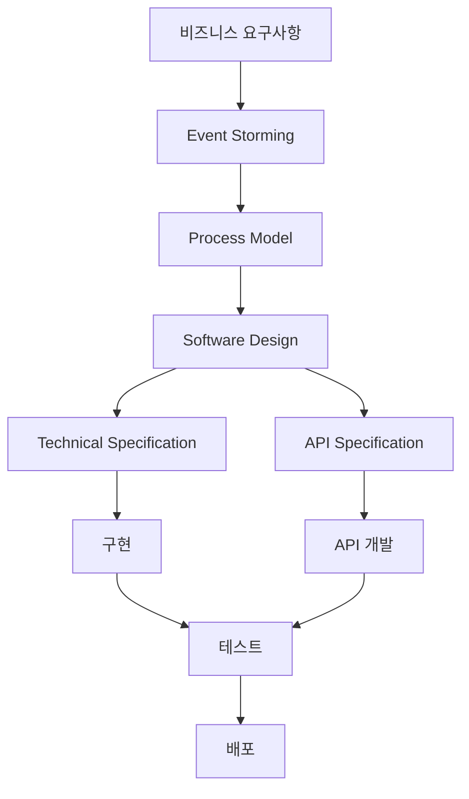

# 쏘타 프로젝트 문서화 가이드

이 문서는 쏘타 프로젝트의 문서화 구조와 협업 방식을 정의합니다.

## 📁 문서 구조 개요

```
docs/
├── event-domain-design/     # 🎯 도메인별 설계 문서
│   └── README.md           # 도메인 설계 협업 가이드
├── project-technical-design/ # 🏗️ 프로젝트 전체 기술 설계
│   └── README.md           # 기술 아키텍처 관리 가이드
├── agile-planning/          # 📋 애자일 계획 및 스토리
│   └── README.md           # 애자일 프로세스 가이드
└── README.md               # 이 문서 (전체 시스템 가이드)
```

### 각 폴더의 주요 역할
- **[event-domain-design/](../event-domain-design/README.md)**: 도메인별 Event Storming → DDD 구현
- **[project-technical-design/](../project-technical-design/README.md)**: 시스템 아키텍처 및 기술 스택
- **[agile-planning/](../agile-planning/README.md)**: 스프린트 계획 및 사용자 스토리

## 🎯 협업 방식

### 공통 원칙
- **점진적 개발**: Event Storming → Process Model → Software Design → Technical Specification → Implementation
- **역할 분담**: 각 단계별 담당자와 리뷰어 명확 정의
- **지속적 개선**: 문서 작성 후 지속적 리뷰와 업데이트

---

## 📂 event-domain-design/

**도메인별 설계 문서** - 각 도메인의 비즈니스 로직과 구현 설계

### 협업 방식

#### 1단계: Event Flow & Process Model (기획 단계)
- **참가자**: 도메인 담당자, PO, 기획자, 시니어 개발자
- **목적**: 비즈니스 요구사항을 도메인 이벤트로 변환
- **작업 순서**:
  1. Event Storming으로 비즈니스 이벤트 식별
  2. Process Model로 Command → Policy → System → Events 정의
  3. 시니어 개발자 리뷰 및 아키텍처 검토

#### 2단계: Software Design (설계 단계)
- **작성자**: 주니어 개발자
- **리뷰어**: 기획자, 시니어 개발자
- **목적**: DDD 구조와 코드 흐름 설계
- **작업 순서**:
  1. Process Model을 Aggregate로 매핑
  2. Value Object, Entity, Command, Event 정의
  3. Bounded Context와 Context Map 설계
  4. 핵심 설계 결정 문서화

#### 3단계: Technical & API Specification (구현 단계)
- **작성자**: 주니어 개발자
- **리뷰어**: 시니어 개발자
- **목적**: 구체적 구현 가이드와 API 계약 정의
- **작업 순서**:
  1. Technical Specification: 코드 구현 가이드 작성
  2. API Specification: 외부 API 계약 정의
  3. 시니어 개발자 코드 리뷰

### 폴더 구조
자세한 폴더 구조는 [event-domain-design/README.md](event-domain-design/README.md)를 참조하세요.

---

## 🏗️ project-technical-design/

**프로젝트 전체 기술 설계** - 시스템 아키텍처와 기술 스택

### 협업 방식
- **작성자**: 시니어 개발자 (아키텍트)
- **리뷰어**: PO, 기획자, 시니어 개발자
- **작업 순서**:
  1. 아키텍처 개요 및 기술 스택 정의
  2. 데이터베이스 스키마 설계
  3. 크로스컷팅 콘서트 (에러 처리, 로깅 등) 정의
  4. 인프라 설계 (배포, 모니터링)
  5. PO/기획자와 리뷰 및 조율

### 폴더 구조
자세한 폴더 구조는 [project-technical-design/README.md](project-technical-design/README.md)를 참조하세요.

---

## 📋 agile-planning/

**애자일 계획 및 스토리** - 개발 계획과 사용자 스토리

### 협업 방식
- **작성자**: PM (Product Manager)
- **참가자**: PO, 기획자, 개발팀 전체
- **작업 순서**:
  1. Epic 정의 및 우선순위 설정
  2. Sprint 계획 수립
  3. 사용자 스토리 작성 및 스토리 포인트 할당
  4. 개발팀과 계획 조율 및 확정

### 폴더 구조
자세한 폴더 구조는 [agile-planning/README.md](agile-planning/README.md)를 참조하세요.

---

## 🎯 문서 작성 가이드라인

### 공통 원칙
1. **점진적 상세화**: 추상적 → 구체적 순서로 작성
2. **역할 명확화**: 각 단계별 담당자와 리뷰어 정의
3. **변경 이력 관리**: 중요한 설계 결정 변경 시 기록
4. **참조 링크**: 관련 문서들 간 링크 연결

### 품질 기준
- **완전성**: 모든 필수 섹션 포함
- **명확성**: 기술적이지 않으면서도 충분한 정보 제공
- **일관성**: 동일한 패턴과 용어 사용
- **유지보수성**: 변경사항 추적 및 업데이트 용이

---

## 🤝 협업 프로세스

### 1. 새로운 기능 개발 시


### 2. 코드 리뷰 프로세스
1. **작성자**: 기능 구현 및 문서화
2. **리뷰어**: 코드 및 문서 리뷰
3. **수정**: 피드백 반영
4. **승인**: 최종 검토 및 승인

### 3. 문서 업데이트 프로세스
1. **변경 필요성 식별**: 새로운 요구사항이나 버그 발견
2. **영향 범위 분석**: 관련 문서 및 코드 식별
3. **동시 업데이트**: 관련 문서 모두 업데이트
4. **리뷰 및 승인**: 변경사항 검증

---

## 📚 추가 리소스

### 내부 가이드
- **[소프트웨어 디자인 가이드](../event-domain-design/guide/software-design-guide.md)**: 상세 구현 가이드라인
- **[테크니컬 스펙 가이드](../event-domain-design/guide/technical-specification-guide.md)**: 구체적 구현 가이드
- **[코드 컨벤션](../event-domain-design/guide/code-conventions.md)**: 코드 작성 표준
- **[템플릿 가이드](../event-domain-design/template/README.md)**: 표준 문서 템플릿

### 외부 레퍼런스
- **DDD 패턴**: Entity, Value Object, Aggregate 개념
- **Event Sourcing**: 이벤트 기반 상태 관리
- **CQRS**: Command와 Query 분리
- **Clean Architecture**: 의존성 방향 제어

---

## 🎯 성공 지표

| 지표 | 목표 | 측정 방법 |
|------|------|-----------|
| **문서 완전성** | 95%+ | 모든 도메인에 3개 문서 작성 |
| **협업 효율성** | 80%+ | 정해진 역할과 프로세스 준수 |
| **개발 속도** | 50% 향상 | 새로운 기능 개발 시간 |
| **품질 만족도** | 90%+ | 코드 리뷰 및 사용자 피드백 |

이 문서화 시스템을 통해 **효율적인 협업**과 **품질 높은 소프트웨어 개발**을 달성할 수 있습니다! 🚀
