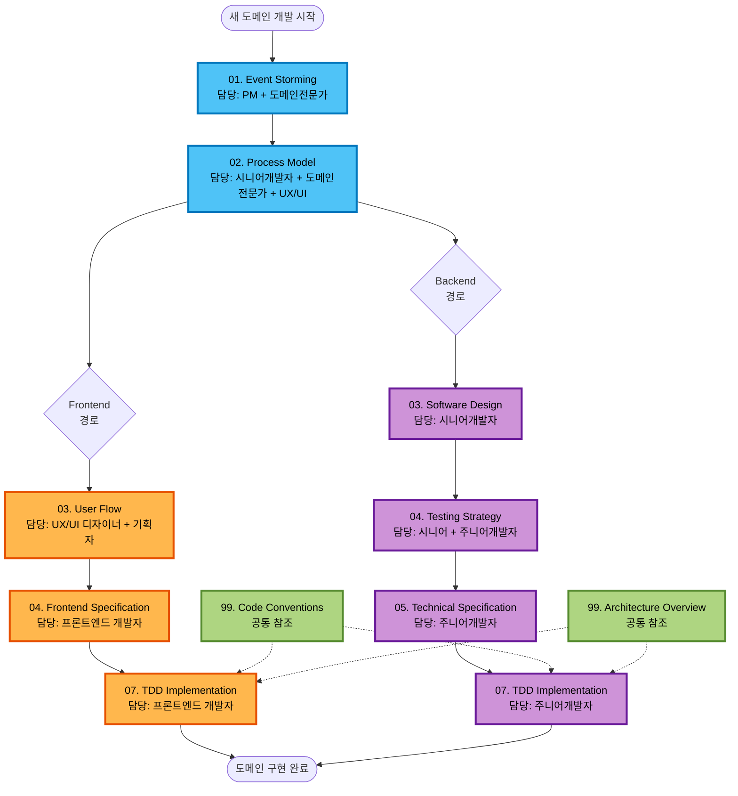

# Event Domain Design 문서 가이드

이 폴더는 **Event Storming**과 **Process Model**을 기반으로 한 도메인별 설계 문서들을 포함합니다.

---

## 🔁 전체 프로세스 다이어그램



### 프로세스 설명

**🟦 공통 단계** (전체 참여):
1. **Event Storming**: 도메인 이해, Bounded Context 식별
2. **Process Model**: 비즈니스 프로세스 정의 (UI/UX 독립적)

**🟧 Frontend 경로** (병렬 진행):
3. **User Flow**: 사용자 여정 및 화면 흐름 정의
4. **Frontend Specification**: React Context/Hooks/Components 구현
7. **TDD Implementation**: 프론트엔드 구현

**🟪 Backend 경로** (병렬 진행):
3. **Software Design**: DDD 설계 (Aggregate, ACL, Context Map)
4. **Testing Strategy**: 테스트 전략 수립 (Unit/Integration/E2E)
5. **Technical Specification**: 구현 + 테스트 수도코드 작성
7. **TDD Implementation**: 백엔드 구현

**🟩 공통 참조** (구현 전반):
- **Code Conventions**: DTO 직렬화, 네이밍 규칙
- **Architecture Overview**: 전체 시스템 아키텍처

---

## 📁 폴더 구조

```
event-domain-design/
├── README.md                    # 이 문서 (폴더 가이드)
├── event-flow-diagram.md        # 전체 이벤트 플로우
├── domains/                     # 각 도메인별 설계 문서
│   ├── organization-management/ # Organization Management Domain
│   │   ├── 01-event-storm.md       # Event Storming 결과
│   │   ├── 02-process-model.md     # Process Model 정의 (공통)
│   │   ├── 03-user-flow.md         # User Flow 정의 (Frontend) ⭐ 신규
│   │   ├── 03-software-design.md   # Software Design (Backend)
│   │   ├── 04-testing-strategy.md  # Testing Strategy (Backend)
│   │   ├── 04-frontend-specification.md # Frontend Spec (Frontend)
│   │   ├── 05-technical-specification.md # Technical Spec (Backend)
│   │   ├── 06-db-schema.md         # DB Schema (Backend)
│   │   └── README.md            # 도메인별 가이드
│   ├── workspace-structure/    # Workspace Structure Domain
│   ├── user-management/        # User Management Domain
│   └── ...                     # 기타 도메인
├── template/                   # 표준 문서 템플릿
│   ├── 01, 02 (공통)
│   ├── 03 (User Flow - Frontend, Software Design - Backend)
│   ├── 04 (Frontend Spec - Frontend, Testing Strategy - Backend)
│   └── 05 (Technical Spec - Backend)
├── guide/                      # 구현 가이드라인
│   ├── 01, 02 (공통)
│   ├── 03 (User Flow - Frontend, Software Design - Backend)
│   ├── 04 (Frontend Spec - Frontend, Testing Strategy - Backend)
│   ├── 05 (Technical Spec - Backend)
│   ├── 07 (TDD Implementation - 공통)
│   └── 99 (Code Conventions, Architecture Overview - 공통 참조)
└── discussion/                 # 설계 토론 기록
```

## 🎯 도메인 정의 프로세스 (병렬 개발 기반)

> **새로운 도메인을 정의해야 할 때?**
> 
> ### 공통 단계 (전체 참여)
> 1. `guide/01-event-storming-guide.md`를 따라 Event Storming 워크샵 진행
>    - Bounded Context 식별 및 간단한 관계 파악
> 2. `guide/02-process-model-guide.md`를 따라 Process Model 정의
>    - **UI/UX 독립적으로 작성** (비즈니스 프로세스에 집중)
>    - **하이브리드 접근법**: 선택적으로 `*UI Hint:` 최소 UX 가이드 포함
>    - External System 식별 (ACL 설계의 기반)
>    - Layered Authorization 명시 (Frontend/Backend 역할 구분)
> 
> ### Backend 경로 (백엔드 개발자)
> 3. `guide/03-software-design-guide.md`를 따라 Software Design 작성
>    - **Process Model의 External System → ACL 설계**
>    - **Event Storming의 관계 → Context Map 작성**
> 4. `guide/04-testing-strategy-guide.md`를 따라 Testing Strategy 수립
> 5. `guide/05-technical-specification-guide.md`로 수도코드 작성 (구현 + 테스트)
> 6. `guide/07-tdd-implementation-guide.md`로 TDD 사이클 적용하여 구현
> 
> ### Frontend 경로 (UX/UI 디자이너 → 프론트엔드 개발자)
> 3. `guide/03-user-flow-guide.md`를 따라 User Flow 정의
>    - **Process Model의 Read Model → UI 요소로 전환**
>    - 구체적인 화면 흐름 및 인터랙션 정의
> 4. `guide/04-frontend-specification-guide.md`로 프론트엔드 연동
> 5. `guide/07-tdd-implementation-guide.md`로 TDD 사이클 적용하여 구현
> 
> ### 공통 참조
> - `guide/99-code-conventions.md`에서 DTO 직렬화 컨벤션 확인
> - `guide/99-architecture-overview.md`에서 전체 아키텍처 확인

### 단계별 작업 프로세스

#### 1단계: Event Storming (도메인 이해 단계)
- **담당자**: PM + 도메인전문가
- **참가자**: 도메인전문가, PM, 기획자, 시니어개발자
- **결과물**: `01-event-storm.md`
- **가이드**: `guide/01-event-storming-guide.md`
- **작업 순서**:
  1. 워크샵 진행 (이벤트/커맨드/액터 식별, Context 경계 정의)
  2. Hotspot과 Opportunity 정리
  3. **Bounded Context 식별 및 간단한 관계 파악** (구체적인 Context Map은 Software Design에서)
  4. 문서화 및 리뷰

#### 2단계: Process Model (프로세스 정의 단계)
- **담당자**: 시니어개발자 + 도메인전문가
- **참가자**: 시니어개발자, 도메인전문가, PM, UX/UI 디자이너
- **결과물**: `02-process-model.md`
- **가이드**: `guide/02-process-model-guide.md`
- **핵심 원칙**: **UI/UX로부터 독립적** (비즈니스 프로세스에 집중)
  - **하이브리드 접근법**: 선택적으로 `*UI Hint:` 형태의 최소 UX 가이드 포함 가능
- **작업 순서**:
  1. Event Storm 결과 분석 및 핵심 프로세스 선정
  2. Event → Policy → Read Model → Command → System → Event 패턴 적용
  3. **External System 식별** (Software Design의 ACL 설계 기반 제공)
  4. **Layered Authorization 명시** (Frontend/Backend 역할 구분)
  5. 문서화 및 리뷰

#### 3-A단계: User Flow (사용자 여정 정의) - Frontend 경로
- **담당자**: UX/UI 디자이너 + 기획자
- **참가자**: UX/UI 디자이너, 기획자, 프론트엔드 개발자
- **결과물**: `03-user-flow.md`
- **가이드**: `guide/03-user-flow-guide.md`
- **작업 순서**:
  1. Process Model 시나리오를 화면 흐름으로 전환
  2. 화면별 UI 요소 및 인터랙션 정의
  3. 권한별 UI 차이 정의
  4. 반응형 고려사항 정의

#### 3-B단계: Software Design (설계 단계) - Backend 경로
- **담당자**: 시니어개발자
- **참가자**: 시니어개발자, 도메인전문가, PM
- **결과물**: `03-software-design.md`
- **가이드**: `guide/03-software-design-guide.md`
- **작업 순서**:
  1. Process Model을 Aggregate로 매핑
  2. Value Object, Entity, Command, Event 정의
  3. **Anti-Corruption Layer (ACL) 설계** (Process Model의 External System 기반)
  4. **Context Map 작성** (Event Storming의 관계를 구체적인 통합 패턴으로 정의)
  5. Read Model 경계 설정
  6. 핵심 설계 결정 문서화

#### 4-A단계: Frontend Specification (프론트엔드 구현 상세) - Frontend 경로
- **담당자**: 프론트엔드 개발자
- **참가자**: 프론트엔드 개발자, UX/UI 디자이너
- **결과물**: `04-frontend-specification.md`
- **가이드**: `guide/04-frontend-specification-guide.md`
- **작업 순서**:
  1. User Flow를 기반으로 React Context 설계
  2. Server Actions 연동
  3. 낙관적 업데이트 패턴 적용
  4. UI 컴포넌트 구현

#### 4-B단계: Testing Strategy (테스트 전략 수립) - Backend 경로
- **담당자**: 시니어개발자 + 주니어개발자
- **참가자**: 시니어개발자, 주니어개발자
- **결과물**: `04-testing-strategy.md`
- **가이드**: `guide/04-testing-strategy-guide.md`
- **작업 순서**:
  1. Process Model 시나리오를 테스트 케이스로 매핑
  2. Unit/Integration/E2E 테스트 전략 수립
  3. 커버리지 목표 설정
  4. TDD 우선순위 정의

#### 5단계: Technical Specification (수도코드 작성) - Backend 경로
- **담당자**: 주니어개발자
- **참가자**: 주니어개발자, 시니어개발자
- **결과물**: `05-technical-specification.md`
- **가이드**: `guide/05-technical-specification-guide.md`
- **작업 순서**:
  1. 구현 수도코드 작성 (DDD 컴포넌트별)
  2. 테스트 수도코드 작성 (Given-When-Then)
  3. TDD 구현 순서 정의
  4. 시니어 개발자 리뷰

#### 7단계: TDD Implementation (실제 구현)
- **담당자**: 주니어개발자
- **참가자**: 주니어개발자, 시니어개발자 (코드 리뷰)
- **결과물**: 실제 코드 + 테스트 코드
- **가이드**: `guide/07-tdd-implementation-guide.md`
- **작업 순서**:
  1. RED-GREEN-REFACTOR 사이클 적용
  2. Phase별 구현 (Value Objects → Entities → Aggregates → ...)
  3. 커버리지 목표 달성 확인
  4. 시니어 개발자 코드 리뷰

#### 99단계: 공통 참조 문서
- **Code Conventions**: `guide/99-code-conventions.md` - 코드 컨벤션 & DTO 직렬화
- **Architecture Overview**: `guide/99-architecture-overview.md` - 전체 아키텍처 개요
- **사용 시점**: 구현 전반에 걸쳐 참조

## 📋 각 문서의 역할

### event-flow-diagram.md
- **목적**: 전체 시스템의 이벤트 플로우 시각화
- **작성자**: 시니어 개발자
- **사용법**: 새로운 도메인 추가 시 참조

### domains/[domain-name]/
각 도메인의 완전한 설계 문서 세트:

#### event-storm.md
- **Event Storming 결과**: 비즈니스 이벤트와 프로세스 발견
- **작성**: PM + 도메인전문가
- **가이드**: `guide/01-event-storming-guide.md`

#### process-model.md
- **Process Model**: Event → Policy → Read Model → Command → System → Event 패턴
- **작성**: 시니어개발자 + 도메인전문가 + UX/UI 디자이너
- **가이드**: `guide/02-process-model-guide.md`

#### user-flow.md ⭐ 신규
- **User Flow**: 사용자 여정 및 화면 흐름 정의
- **작성**: UX/UI 디자이너 + 기획자
- **가이드**: `guide/03-user-flow-guide.md`
- **참조**: Process Model의 비즈니스 프로세스

#### software-design.md (03)
- **DDD 구조 설계**: Aggregate, Entity, Value Object 정의 (Backend)
- **작성**: 시니어개발자
- **가이드**: `guide/03-software-design-guide.md`

#### testing-strategy.md (04)
- **테스트 전략**: Unit/Integration/E2E 테스트 전략 (Backend)
- **작성**: 시니어개발자 + 주니어개발자
- **가이드**: `guide/04-testing-strategy-guide.md`

#### frontend-specification.md (04)
- **프론트엔드 구현 상세**: React Context, Hooks, Components (Frontend)
- **작성**: 프론트엔드 개발자
- **가이드**: `guide/04-frontend-specification-guide.md`

#### technical-specification.md (05)
- **구현 가이드**: 구체적 코드 작성 방법 (Backend)
- **작성**: 주니어개발자
- **가이드**: `guide/05-technical-specification-guide.md`

### template/
- **표준 템플릿들**: 새로운 도메인 개발 시 사용
- **사용법**: `cp template/[template-name] docs/domains/[new-domain]/[document-name]`

### guide/
- **단계별 가이드**: 각 문서 작성 방법과 워크샵 진행법
- **사용법**: 도메인 정의 시 순서대로 참조

### discussion/
- **설계 토론 기록**: 중요한 설계 결정들의 배경과 토론 내용
- **사용법**: 새로운 팀원 온보딩 시 필독

## 🎯 작업 체크리스트

### 새로운 도메인 개발 시작 시 (병렬 개발 워크플로우)

#### 공통 단계
- [ ] **Event Storming**: `guide/01-event-storming-guide.md` 따라 진행 (PM + 도메인전문가)
- [ ] **Process Model**: `guide/02-process-model-guide.md` 따라 진행 (시니어개발자 + 도메인전문가 + UX/UI 디자이너)

#### Backend 경로 (병렬 진행)
- [ ] **Software Design**: `guide/03-software-design-guide.md` 따라 진행 (시니어개발자)
- [ ] **Testing Strategy**: `guide/04-testing-strategy-guide.md` 따라 진행 (시니어 + 주니어)
- [ ] **Technical Specification**: `guide/05-technical-specification-guide.md` 따라 수도코드 작성 (주니어개발자)
- [ ] **TDD Implementation**: `guide/07-tdd-implementation-guide.md` 따라 RED-GREEN-REFACTOR (주니어개발자)

#### Frontend 경로 (병렬 진행)
- [ ] **User Flow**: `guide/03-user-flow-guide.md` 따라 화면 흐름 정의 (UX/UI 디자이너 + 기획자) ⭐
- [ ] **Frontend Specification**: `guide/04-frontend-specification-guide.md` 따라 UI 연동 (프론트엔드 개발자)
- [ ] **TDD Implementation**: `guide/07-tdd-implementation-guide.md` 따라 RED-GREEN-REFACTOR (프론트엔드 개발자)

#### 공통 참조
- [ ] **Code Conventions**: `guide/99-code-conventions.md`의 DTO 직렬화 컨벤션 확인
- [ ] **Architecture Overview**: `guide/99-architecture-overview.md`의 전체 아키텍처 확인
- [ ] 각 단계별 리뷰 및 승인 완료

### 기존 도메인 수정 시
- [ ] 변경 영향도 분석 (영향 받는 문서 확인)
- [ ] 관련 문서 동시 업데이트
- [ ] 변경 이력 기록
- [ ] 리뷰어 승인

### 단계별 독립 실행 시
- [ ] **Event Storming만**: `guide/01-event-storming-guide.md` 참조
- [ ] **Process Model만**: `guide/02-process-model-guide.md` 참조 (Event Storm 완료 전제)
- [ ] **User Flow만**: `guide/03-user-flow-guide.md` 참조 (Process Model 완료 전제, Frontend)
- [ ] **Software Design만**: `guide/03-software-design-guide.md` 참조 (Process Model 완료 전제, Backend)

---

## 📚 관련 문서

### 가이드 문서

#### 공통 경로
- **[Event Storming 가이드](./guide/01-event-storming-guide.md)**: 워크샵 진행 및 문서화
- **[Process Model 가이드](./guide/02-process-model-guide.md)**: 프로세스 정의 및 문서화

#### Frontend 경로
- **[User Flow 가이드](./guide/03-user-flow-guide.md)**: 사용자 여정 및 화면 흐름 정의 ⭐ 신규
- **[Frontend Specification 가이드](./guide/04-frontend-specification-guide.md)**: 프론트엔드 구현 상세

#### Backend 경로
- **[Software Design 가이드](./guide/03-software-design-guide.md)**: DDD 설계 및 문서화
- **[Testing Strategy 가이드](./guide/04-testing-strategy-guide.md)**: 테스트 전략 수립
- **[Technical Specification 가이드](./guide/05-technical-specification-guide.md)**: 수도코드 작성 (구현 + 테스트)

#### 공통 구현
- **[TDD Implementation 가이드](./guide/07-tdd-implementation-guide.md)**: TDD 사이클 적용 구현

#### 공통 참조
- **[Code Conventions](./guide/99-code-conventions.md)**: 코드 컨벤션 & DTO 직렬화
- **[Architecture Overview](./guide/99-architecture-overview.md)**: 전체 아키텍처 개요

### 템플릿 문서

#### 공통 템플릿
- **[Event Storm 템플릿](./template/01-event-storm-template.md)**: Event Storming 결과 문서 템플릿
- **[Process Model 템플릿](./template/02-process-model-template.md)**: Process Model 문서 템플릿

#### Frontend 템플릿
- **[User Flow 템플릿](./template/03-user-flow-template.md)**: User Flow 문서 템플릿 ⭐ 신규
- **[Frontend Specification 템플릿](./template/04-frontend-specification-template.md)**: Frontend Specification 문서 템플릿

#### Backend 템플릿
- **[Software Design 템플릿](./template/03-software-design-template.md)**: Software Design 문서 템플릿
- **[Testing Strategy 템플릿](./template/04-testing-strategy-template.md)**: Testing Strategy 문서 템플릿
- **[Technical Specification 템플릿](./template/05-technical-specification-template.md)**: Technical Specification 문서 템플릿

### 예시 문서
- **[Workspace Structure Domain](../domains/workspace-structure-domain/)**: 완성된 도메인 예시
- **[Event Flow Diagram](./event-flow-diagram.md)**: 전체 시스템 이벤트 플로우

### 상위 문서
- **[상위 문서화 가이드](../../../README.md)**: 전체 문서화 시스템 개요
- **[Agile Planning 가이드](../../agile-planning/guide/)**: 프로젝트 계획 및 관리

---

이 문서화 시스템을 통해 **체계적인 도메인 정의**와 **품질 높은 소프트웨어 구현**을 달성할 수 있습니다! 🚀
