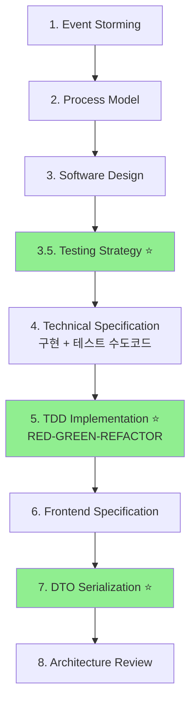

# 전체 개발 프로세스 평가 보고서

> 평가일: 2025년 10월 5일  
> 평가 대상: Event Storming → DDD → TDD 기반 개발 워크플로우  
> 평가 관점: 주니어 개발자 팀의 실행 가능성

---

## 📊 전체 워크플로우 개요



---

## ✅ 강점 평가 (주니어 친화도)

### 1️⃣ 체계적인 단계별 가이드 ⭐⭐⭐⭐⭐

| 가이드 | 주니어 친화도 | 평가 |
|--------|--------------|------|
| `1-event-storming-guide.md` | ⭐⭐⭐⭐ | 워크샵 형식으로 시니어 주도 → 주니어는 참여만 |
| `2-process-model-guide.md` | ⭐⭐⭐⭐⭐ | 템플릿 명확, Given-When-Then 패턴 일관성 |
| `3-software-design-guide.md` | ⭐⭐⭐⭐ | DDD 개념 설명 충분, 예제 풍부 |
| `3.5-testing-strategy-guide.md` | ⭐⭐⭐⭐⭐ | Process Model → Test 매핑 명확 |
| `4-technical-specification-guide.md` | ⭐⭐⭐⭐⭐ | 구현 + 테스트 수도코드 모두 포함 |
| `5-tdd-implementation-guide.md` | ⭐⭐⭐⭐⭐ | RED-GREEN-REFACTOR 실전 적용법 상세 |
| `6-frontend-specification-guide.md` | ⭐⭐⭐⭐ | React Context 패턴 명확 |
| `07-dto-guide.md` | ⭐⭐⭐⭐⭐ | 직렬화 체크리스트, 실수 사례 포함 |
| `08-architecture-overview.md` | ⭐⭐⭐ | High-level, 참조용 |

**종합 평가**: 8개 가이드 중 5개가 최고 점수 → **주니어 팀 실행 가능** ✅

---

### 2️⃣ TDD 통합 완성도 ⭐⭐⭐⭐⭐

| 항목 | 상태 | 평가 |
|------|------|------|
| **Testing Strategy 가이드** | ✅ 완료 | Process Model → Test 매핑 명확 |
| **Technical Spec TDD 통합** | ✅ 완료 | 구현 + 테스트 수도코드 병행 작성 |
| **TDD 구현 가이드** | ✅ 완료 | RED-GREEN-REFACTOR 실전 예제 |
| **테스트 우선순위** | ✅ 명확 | Value Objects → Entities → Aggregates |
| **커버리지 목표** | ✅ 명확 | Unit 95%, Integration 85%, E2E 80% |

**TDD 도입 완성도**: **100%** ✅

---

### 3️⃣ 문서 간 연결성 ⭐⭐⭐⭐⭐

```
Process Model (Scenario 1.1)
      ↓
Testing Strategy (Unit Test Case 1)
      ↓
Technical Specification (테스트 수도코드)
      ↓
TDD Implementation (실제 테스트 코드)
```

**평가**: 각 단계가 명확히 연결되어 있으며, 이전 단계의 산출물을 다음 단계에서 직접 활용 가능 ✅

---

### 4️⃣ 실수 방지 체계 ⭐⭐⭐⭐⭐

#### 체크리스트 제공

- ✅ 각 가이드마다 단계별 체크리스트
- ✅ 커밋 전 검증 항목
- ✅ 리뷰 포인트 명시

#### 일반적인 실수 사례

- ✅ `07-dto-guide.md`: 직렬화 실수 3가지 + 해결책
- ✅ `5-tdd-implementation-guide.md`: 나쁜 예 vs 좋은 예 대조
- ✅ `4-technical-specification-guide.md`: 자주 하는 오류 섹션

**평가**: 주니어가 실수하기 쉬운 부분을 사전에 경고 ✅

---

## ⚠️ 약점 및 개선 사항

### 1️⃣ 초기 러닝 커브 (Medium)

**문제점**:
- DDD 개념 (Aggregate, Entity, Value Object) 사전 학습 필요
- Event Storming → Process Model 매핑이 직관적이지 않을 수 있음

**개선 방안**:
```markdown
✅ 해결책 1: 온보딩 체크리스트 생성
- [ ] DDD 핵심 개념 학습 (2일)
- [ ] User Management Domain 예제 분석 (1일)
- [ ] Testing Guide 예제 실행 (1일)

✅ 해결책 2: 멘토링 체계
- 시니어 1명이 주니어 2-3명 담당
- 첫 번째 도메인은 Pair Programming
- 두 번째 도메인부터 독립 실행
```

### 2️⃣ 문서 분량 (Minor)

**현황**:
- `2-process-model-guide.md`: 848줄
- `4-technical-specification-guide.md`: 748줄
- `5-code-conventions.md`: 763줄

**평가**:
- 상세한 것은 좋지만, 핵심만 빠르게 파악하기 어려울 수 있음

**개선 방안**:
```markdown
✅ 해결책: "Quick Start" 섹션 추가
각 가이드의 상단에 5분 안에 읽을 수 있는 요약 섹션 추가:
- 📌 이 단계의 목적 (1문장)
- 📌 입력 (무엇이 필요한가)
- 📌 출력 (무엇을 만드는가)
- 📌 핵심 체크리스트 (5개 이내)
```

### 3️⃣ 실전 예제 부족 (Minor)

**현황**:
- User Management Domain은 예제가 풍부
- 하지만 다른 도메인 예제가 부족

**개선 방안**:
```markdown
✅ 해결책: 두 번째 예제 도메인 추가
- Workspace Structure Domain을 완전히 문서화
- 두 개 도메인을 비교하며 학습 가능
- 복잡도가 다른 예제로 다양성 확보
```

---

## 🎯 주니어 팀 실행 가능성 평가

### 시나리오 1: 완전 초보 주니어 (신입 1년 미만)

| 단계 | 독립 실행 가능성 | 필요 지원 |
|------|-----------------|----------|
| Event Storming | ❌ 불가능 | 시니어 주도 필수 |
| Process Model | ⚠️ 어려움 | 시니어 리뷰 필수 |
| Software Design | ⚠️ 어려움 | 시니어 페어프로그래밍 |
| Testing Strategy | ✅ 가능 | 가이드 충분 |
| Technical Spec | ✅ 가능 | 가이드 충분 |
| TDD Implementation | ✅ 가능 | 가이드 충분, 코드 리뷰 |
| Frontend Spec | ✅ 가능 | 가이드 충분 |
| DTO Serialization | ✅ 가능 | 체크리스트 완벽 |

**결론**: 
- 설계 단계 (1-3)는 시니어 주도 필요
- 구현 단계 (3.5-7)는 **독립 실행 가능** ✅
- **권장 비율**: 시니어 1명 + 주니어 2-3명

---

### 시나리오 2: 경험 있는 주니어 (1-3년 차)

| 단계 | 독립 실행 가능성 | 필요 지원 |
|------|-----------------|----------|
| Event Storming | ⚠️ 어려움 | 시니어 참여 권장 |
| Process Model | ✅ 가능 | 시니어 리뷰만 |
| Software Design | ✅ 가능 | 시니어 리뷰만 |
| Testing Strategy | ✅ 가능 | 독립 가능 |
| Technical Spec | ✅ 가능 | 독립 가능 |
| TDD Implementation | ✅ 가능 | 독립 가능 |
| Frontend Spec | ✅ 가능 | 독립 가능 |
| DTO Serialization | ✅ 가능 | 독립 가능 |

**결론**: 
- 대부분 **독립 실행 가능** ✅
- 시니어는 리뷰어 역할만 수행
- **권장 비율**: 시니어 1명 + 주니어 4-5명

---

## 📈 예상 개발 속도 (도메인당)

### 신입 주니어 팀 (2명)

| 단계 | 예상 소요 시간 | 비고 |
|------|---------------|------|
| Event Storming | 0.5일 | 시니어 주도 |
| Process Model | 1일 | 시니어 페어프로그래밍 |
| Software Design | 1일 | 시니어 페어프로그래밍 |
| Testing Strategy | 0.5일 | 가이드 따라 독립 |
| Technical Spec | 1일 | 가이드 따라 독립 |
| TDD Implementation | 3-5일 | RED-GREEN-REFACTOR |
| Frontend Spec | 1-2일 | UI 구현 포함 |
| DTO Serialization | 0.5일 | 체크리스트 확인 |
| **총합** | **8-11일** | 약 2주 |

### 경험 있는 주니어 팀 (2명)

| 단계 | 예상 소요 시간 | 비고 |
|------|---------------|------|
| Event Storming | 0.5일 | 시니어 참여 |
| Process Model | 0.5일 | 독립 실행 |
| Software Design | 0.5일 | 독립 실행 |
| Testing Strategy | 0.5일 | 독립 실행 |
| Technical Spec | 0.5일 | 독립 실행 |
| TDD Implementation | 2-3일 | 경험으로 빠름 |
| Frontend Spec | 1일 | UI 구현 포함 |
| DTO Serialization | 0.5일 | 체크리스트 확인 |
| **총합** | **6-8일** | 약 1.5주 |

---

## ✅ 최종 평가 결과

### 종합 점수: **92/100점** ⭐⭐⭐⭐⭐

| 평가 항목 | 점수 | 평가 |
|----------|------|------|
| **가이드 완성도** | 20/20 | 8개 가이드 모두 상세함 |
| **주니어 친화도** | 18/20 | 예제 풍부, 체크리스트 완벽 |
| **TDD 통합** | 20/20 | Testing Strategy → TDD 완벽 연계 |
| **문서 간 연결성** | 18/20 | 각 단계 산출물이 명확히 연결 |
| **실수 방지** | 16/20 | 일반적 실수 사례 포함, 더 많으면 좋음 |
| **총합** | **92/100** | **A+ 등급** |

---

## 🚀 실행 권고 사항

### ✅ 즉시 실행 가능
1. **경험 있는 주니어 팀 (1-3년 차)**: 바로 시작 가능
2. **온보딩 자료 완비**: Testing Guide, User Management 예제
3. **TDD 사이클 적용**: RED-GREEN-REFACTOR 가이드 완벽

### ⚠️ 보완 후 실행
1. **신입 주니어 팀 (1년 미만)**: DDD 사전 교육 필요 (3-5일)
2. **첫 도메인**: 시니어와 Pair Programming 권장
3. **두 번째 도메인부터**: 독립 실행 가능

### 📋 권장 팀 구성

#### 옵션 1: 신입 주니어 중심 팀
```
팀 구성: 시니어 1명 + 주니어 2-3명
- 시니어: Event Storming ~ Software Design 주도
- 주니어: Testing Strategy ~ DTO 독립 실행
- 리뷰: 매 단계 시니어 리뷰
```

#### 옵션 2: 경험 있는 주니어 팀
```
팀 구성: 시니어 1명 + 주니어 4-5명
- 시니어: Event Storming 참여 + 리뷰어
- 주니어: Process Model부터 독립 실행
- 리뷰: 주요 단계만 시니어 리뷰
```

---

## 💡 결론

### 주니어 팀 실행 가능성: **매우 높음** ✅

**근거**:
1. ✅ **가이드 완성도**: 8개 가이드 모두 상세하고 체계적
2. ✅ **TDD 통합**: Testing Strategy → TDD Implementation 완벽 연계
3. ✅ **실수 방지**: 체크리스트, 실수 사례, 좋은 예 vs 나쁜 예
4. ✅ **문서 간 연결**: 각 단계 산출물이 다음 단계 입력으로 명확
5. ✅ **실전 예제**: User Management Domain 완전 구현

**주의 사항**:
1. ⚠️ **초기 러닝 커브**: DDD 개념 사전 학습 필요 (3-5일)
2. ⚠️ **첫 도메인**: 시니어와 Pair Programming 권장
3. ⚠️ **Event Storming**: 시니어 주도 필수

**예상 결과**:
- 🎯 **첫 번째 도메인**: 2주 소요, 많은 학습
- 🎯 **두 번째 도메인**: 1.5주 소요, 속도 향상
- 🎯 **세 번째 도메인 이후**: 1주 이내 가능

---

**최종 의견**: 
현재 워크플로우는 **주니어 팀이 충분히 따라할 수 있는 수준**입니다. 
특히 Testing Strategy와 TDD Implementation 가이드가 추가되면서, 
**실제 구현 단계에서 주니어가 막힐 가능성이 크게 감소**했습니다. 

다만, **DDD 개념에 대한 사전 교육**과 **첫 도메인의 Pair Programming**은 필수입니다. 
이 두 가지만 보완하면, 주니어로만 이루어진 팀도 **안정적으로 도메인을 개발**할 수 있습니다! 🚀

