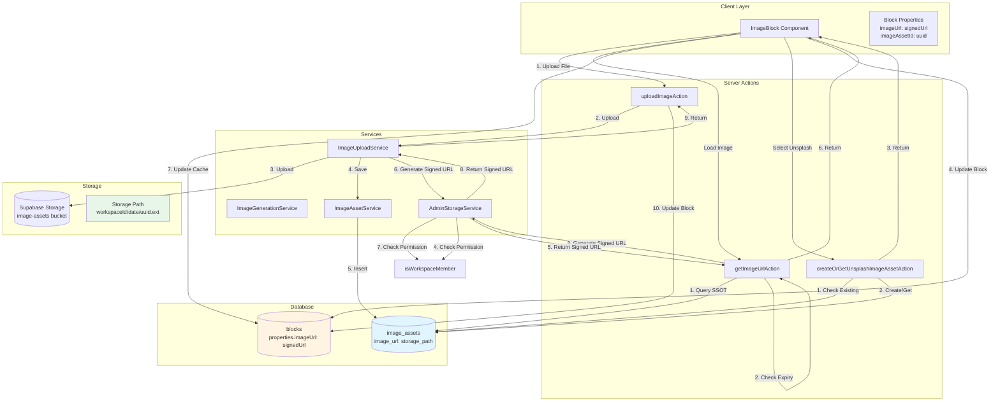
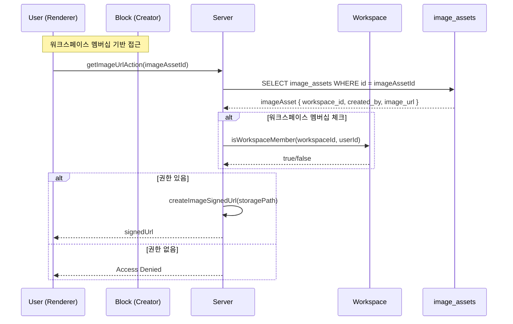
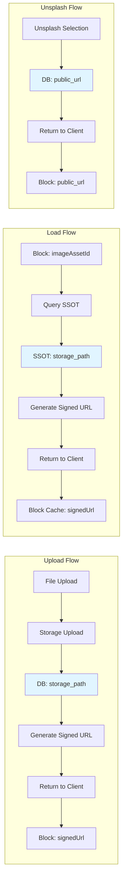

# 이미지 관리 아키텍처 분석

## 개요

이 문서는 SSOTA의 이미지 블록과 이미지 앱스페이스 스키마 간의 관계, 그리고 이미지 업로드/불러오기 로직에서의 권한 관리에 대한 전체적인 분석입니다.

## 요구사항

1. **통합 관리**: unsplash, user upload, generated 모두 하나의 로직에서 관리
2. **블록 렌더링 URL**: `public.blocks.properties.imageUrl`은 렌더링용 URL (signedUrl 또는 unsplash public url)
3. **SSOT Storage Path**: `image-app-space.image_assets.image_url`에는 supabase storage folder url이 들어가야 함
4. **워크스페이스 멀티유저**: 워크스페이스 멤버는 블록 생성자와 다를 수 있음. RLS는 최종 방어, 복잡한 권한 검사는 서버에서 수행

## 현재 아키텍처 분석

### 1. 데이터 모델

#### public.blocks 테이블
- `properties.imageUrl`: **렌더링용 URL** (signed URL 또는 Unsplash public URL)
- `properties.imageAssetId`: `image-app-space.image_assets.id` 참조
- `properties.imageSource`: `'unsplash' | 'user-upload' | 'ai-generated'`

#### image-app-space.image_assets 테이블
- `id`: UUID (Primary Key)
- `asset_type`: `'ai-generated' | 'unsplash' | 'user-upload'`
- `image_url`: **Storage path 또는 Unsplash public URL** (SSOT)
- `workspace_id`: 워크스페이스 ID
- `created_by`: 생성자 사용자 ID
- `is_public`: 공개 여부

#### storage.image-assets 버킷
- 경로 구조: `{workspaceId}/{YYYYMMDD}/{uuid}.{ext}`
- 예: `workspace-123/20250101/abc123.png`

### 2. 이미지 업로드 플로우

#### 2.1 User Upload 플로우

```
[Client] ImageBlock.handleFileUpload
  ↓
[Server Action] uploadImageAction
  ↓
[Service] ImageUploadService.uploadImage
  ├─ 1. Storage 경로 생성: generateImageAssetPath()
  ├─ 2. Supabase Storage 업로드 (admin client)
  ├─ 3. DB 저장: image_assets.image_url = storage_path ✅
  ├─ 4. Signed URL 생성: AdminStorageService.createImageSignedUrl()
  │   └─ 권한 체크: isWorkspaceMember(workspaceId, userId)
  └─ 5. 반환: ImageAsset { image_url: signedUrl } ⚠️
      ↓
[Client] 블록 properties 업데이트
  ├─ imageAssetId: imageAsset.id
  ├─ imageUrl: imageAsset.image_url (signed URL) ✅
  └─ imageSource: 'user-upload'
```

**문제점**: 
- `ImageUploadService`가 반환할 때 `image_url`을 signed URL로 변경하고 있음 (line 229)
- 이로 인해 SSOT에 signed URL이 저장될 수 있음

#### 2.2 AI Generated 플로우

```
[Client] GenerateImageAction
  ↓
[Service] ImageGenerationService.generate
  ├─ 1. AI 모델 호출 (OpenAI/Stability)
  ├─ 2. Base64 이미지 수신
  └─ 3. ImageUploadService.uploadImage 호출
      └─ User Upload와 동일한 플로우
```

#### 2.3 Unsplash 플로우

```
[Client] Unsplash 이미지 선택
  ↓
[Server Action] createOrGetUnsplashImageAssetAction
  ├─ 1. photoId로 기존 이미지 검색
  ├─ 2. 없으면 새로 생성
  │   └─ image_assets.image_url = Unsplash public URL ✅
  └─ 3. 반환: ImageAsset { image_url: Unsplash URL }
      ↓
[Client] 블록 properties 업데이트
  ├─ imageAssetId: imageAsset.id
  ├─ imageUrl: imageAsset.image_url (Unsplash URL) ✅
  └─ imageSource: 'unsplash'
```

**정상**: Unsplash는 외부 URL이므로 storage path가 아님

### 3. 이미지 불러오기 플로우

#### 3.1 블록 렌더링 시

```
[Client] ImageBlock.loadImageUrl
  ├─ 1. imageAssetId 확인
  ├─ 2. 블록 캐시 확인: properties.imageUrl
  │   └─ 만료되지 않았으면 캐시 사용 ✅
  └─ 3. 만료되었거나 없으면 SSOT 조회
      ↓
[Server Action] getImageUrlAction
  ├─ 1. image_assets 조회 (SSOT)
  ├─ 2. 외부 URL 체크 (Unsplash)
  │   └─ http/https로 시작하면 그대로 반환 ✅
  ├─ 3. Signed URL 만료 확인
  │   └─ 만료되지 않았으면 SSOT의 URL 재사용 ✅
  └─ 4. 만료되었으면 재생성
      ├─ AdminStorageService.createImageSignedUrl()
      │   └─ 권한 체크: isWorkspaceMember()
      ├─ SSOT 업데이트: image_assets.image_url = newSignedUrl ⚠️
      └─ 반환: newSignedUrl
      ↓
[Client] 블록 properties 캐시 업데이트
  └─ properties.imageUrl = signedUrl (백그라운드)
```

**문제점**:
- `getImageUrlAction`에서 SSOT를 업데이트할 때 signed URL을 저장하고 있음 (line 771)
- 이로 인해 SSOT에 signed URL이 저장됨

### 4. 권한 관리

#### 4.1 RLS 정책 (최종 방어)

```sql
-- image_assets SELECT 정책
(created_by = auth.uid()) OR (is_public = true AND is_deleted = false)

-- image_assets INSERT 정책
created_by = auth.uid()

-- image_assets UPDATE 정책
created_by = auth.uid()
```

#### 4.2 서버 권한 체크 (비즈니스 로직)

```typescript
// AdminStorageService.createImageSignedUrl
const hasAccess = isPublic || await isWorkspaceMember(workspaceId, userId);
```

**워크스페이스 멤버십 체크**:
- 블록 생성자와 렌더링 사용자가 다를 수 있음
- 워크스페이스 멤버면 접근 가능 ✅

## 발견된 문제점

### 문제 1: SSOT에 Signed URL 저장

**현재 동작**:
- `ImageUploadService.uploadImage`: DB 저장 시 storage path, 반환 시 signed URL로 변경
- `getImageUrlAction`: SSOT 업데이트 시 signed URL 저장

**요구사항**:
- `image_assets.image_url`에는 storage path만 저장되어야 함

**영향**:
- Signed URL이 만료되면 SSOT에서도 만료된 URL을 참조
- 다른 사용자가 같은 이미지를 볼 때 불필요한 재생성 발생

### 문제 2: Unsplash URL 처리

**현재 동작**: ✅ 정상
- Unsplash는 외부 URL이므로 storage path가 아님
- `getImageUrlAction`에서 외부 URL 체크 후 그대로 반환

### 문제 3: 경쟁 조건 (Race Condition)

**현재 동작**:
- `getImageUrlAction`에서 SSOT 업데이트 시 signed URL 저장
- 여러 사용자가 동시에 접근하면 각자 signed URL 생성 가능

**요구사항**:
- SSOT는 storage path만 저장
- Signed URL은 요청 시마다 생성 (캐싱은 클라이언트에서)

## 권장 해결 방안

### 방안 1: SSOT는 Storage Path만 저장

```typescript
// ImageUploadService.uploadImage
const createResult = await this.imageAssetService.createImageAsset({
  imageUrl: storagePath, // ✅ Storage path만 저장
  // ...
});

// 반환 시 signed URL 생성 (DB 업데이트 없이)
const signedUrl = await this.storageService.createImageSignedUrl(
  storagePath,
  command.workspaceId,
  command.userId,
  false
);

return Result.success({
  ...imageAsset,
  image_url: signedUrl, // ✅ 반환만 signed URL
});
```

```typescript
// getImageUrlAction
// SSOT는 storage path만 저장되어 있다고 가정
const storagePath = imageAsset.image_url; // storage path

// Signed URL 생성 (SSOT 업데이트 없이)
const signedUrl = await storageService.createImageSignedUrl(
  storagePath,
  imageAsset.workspace_id,
  user.id,
  imageAsset.is_public
);

// ✅ SSOT 업데이트 제거
return ok({ url: signedUrl, metadata });
```

### 방안 2: 클라이언트 캐싱 전략

```typescript
// ImageBlock.loadImageUrl
// 1. 블록 캐시 확인 (properties.imageUrl)
// 2. 만료 확인
// 3. 만료되었으면 getImageUrlAction 호출
// 4. 받은 signed URL을 블록 캐시에 저장 (SSOT 업데이트 없이)
```

### 방안 3: Unsplash URL 구분

```typescript
// image_assets.image_url 저장 시
if (assetType === 'unsplash') {
  image_url = unsplashPublicUrl; // 외부 URL
} else {
  image_url = storagePath; // Storage path
}

// getImageUrlAction에서
if (isExternalUrl(imageAsset.image_url)) {
  return imageAsset.image_url; // Unsplash 등 외부 URL
} else {
  // Storage path → Signed URL 생성
  const signedUrl = await createSignedUrl(imageAsset.image_url);
  return signedUrl;
}
```

## 다이어그램

### 전체 플로우 다이어그램



### 권한 체크 플로우



### 데이터 흐름 다이어그램



## 코드 수정 제안

### 1. ImageUploadService 수정

```typescript
// apps/web/src/domains/image-app-space/backend/services/image-upload.service.ts

async uploadImage(command: UploadImageCommand): Promise<Result<ImageAsset, ImageUploadError>> {
  // ... 기존 코드 ...

  // 4. DB 저장 (storage path만 저장)
  const createResult = await this.imageAssetService.createImageAsset({
    assetType: command.assetType,
    imageUrl: storagePath, // ✅ Storage path만 저장
    // ...
  });

  // 5. Signed URL 생성 (반환용, DB 업데이트 없이)
  const signedUrl = await this.storageService.createImageSignedUrl(
    storagePath,
    command.workspaceId,
    command.userId,
    false
  );

  // 6. 반환 시에만 signed URL 포함 (SSOT는 storage path 유지)
  return Result.success({
    ...createResult.value,
    image_url: signedUrl, // ✅ 반환만 signed URL
  });
}
```

### 2. getImageUrlAction 수정

```typescript
// apps/web/src/domains/image-app-space/actions/image-asset.actions.ts

export async function getImageUrlAction(request: unknown): Promise<ActionResult<...>> {
  // ... 기존 코드 ...

  // 4. ✅ 외부 URL 체크 (Unsplash 등)
  if (isExternalUrl(imageAsset.image_url)) {
    return ok({ url: imageAsset.image_url, metadata });
  }

  // 5. ✅ SSOT는 storage path만 저장되어 있다고 가정
  const storagePath = imageAsset.image_url;

  // 6. ✅ Signed URL 생성 (SSOT 업데이트 없이)
  const signedUrl = await storageService.createImageSignedUrl(
    storagePath,
    imageAsset.workspace_id,
    user.id,
    imageAsset.is_public
  );

  // ✅ SSOT 업데이트 제거
  return ok({ url: signedUrl, metadata });
}

function isExternalUrl(url: string): boolean {
  return url.startsWith('http://') || url.startsWith('https://');
}
```

### 3. getWorkspaceImagesAction 수정

```typescript
// apps/web/src/domains/image-app-space/actions/image-asset.actions.ts

export async function getWorkspaceImagesAction(request: unknown): Promise<ActionResult<ImageAsset[]>> {
  // ... 기존 코드 ...

  // 5. Signed URL 생성 (SSOT 업데이트 없이)
  const imagesWithSignedUrls = await Promise.all(
    result.value.map(async image => {
      // 외부 URL 체크
      if (isExternalUrl(image.image_url)) {
        return image; // Unsplash 등
      }

      // Storage path → Signed URL 생성
      const signedUrl = await storageService.createImageSignedUrl(
        image.image_url, // storage path
        image.workspace_id,
        user.id,
        image.is_public
      );

      return {
        ...image,
        image_url: signedUrl, // ✅ 반환만 signed URL
      };
    })
  );

  return ok(imagesWithSignedUrls);
}
```

## 마이그레이션 계획

### 1. 기존 데이터 정리

```sql
-- SSOT에 signed URL이 저장된 경우를 위한 마이그레이션
-- storage path로 변환 필요

UPDATE image_app_space.image_assets
SET image_url = extract_storage_path(image_url)
WHERE image_url LIKE '%/storage/v1/object/sign/%';
```

### 2. Helper 함수 추가

```typescript
// apps/web/src/domains/storage/utils/storage-path.utils.ts

export function extractStoragePathFromSignedUrl(signedUrl: string): string | null {
  try {
    const urlObj = new URL(signedUrl);
    const pathname = urlObj.pathname;
    
    // Signed URL: /storage/v1/object/sign/{bucket}/{path}
    const match = pathname.match(/\/storage\/v1\/object\/sign\/[^/]+\/(.+)/);
    if (match && match[1]) {
      return decodeURIComponent(match[1]);
    }
    
    return null;
  } catch {
    return null;
  }
}

export function isExternalUrl(url: string): boolean {
  return url.startsWith('http://') || url.startsWith('https://');
}

export function isStoragePath(url: string): boolean {
  return !isExternalUrl(url) && !url.includes('/storage/v1/object/');
}
```

## 결론

현재 아키텍처의 주요 문제점은 **SSOT에 signed URL이 저장되는 것**입니다. 이를 해결하기 위해:

1. **SSOT는 storage path만 저장**: `image_assets.image_url`에는 storage path만 저장
2. **Signed URL은 요청 시 생성**: 클라이언트 요청 시마다 생성하고, 블록 캐시에만 저장
3. **Unsplash는 예외 처리**: 외부 URL이므로 storage path가 아님

이렇게 하면:
- SSOT의 일관성 유지
- 경쟁 조건 방지
- 워크스페이스 멤버십 기반 권한 관리 가능
- Signed URL 만료 시 자동 재생성 가능


