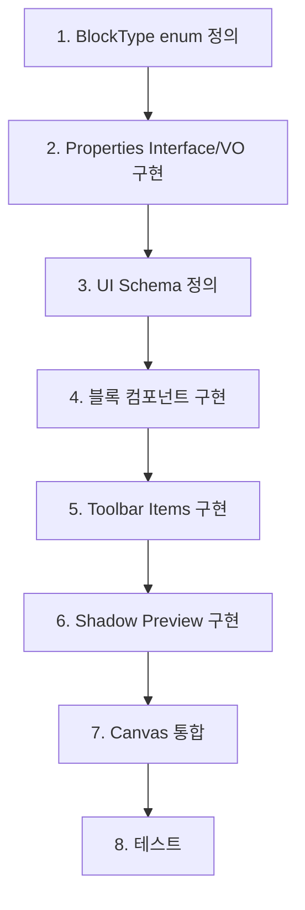

# 새로운 블록 타입 추가 가이드

> 이 문서는 새로운 블록 타입을 시스템에 추가하는 전체 프로세스를 단계별로 설명합니다.
> Shape Block 구현 과정을 기반으로 작성되었습니다.

## 📋 목차

1. [블록 타입 및 속성 정의](#1-블록-타입-및-속성-정의)
2. [Value Object 구현](#2-value-object-구현)
3. [블록 컴포넌트 구현](#3-블록-컴포넌트-구현)
4. [스타일 가이드](#4-스타일-가이드)
5. [Toolbar Items 구현](#5-toolbar-items-구현)
6. [UI Schema 정의 및 등록](#6-ui-schema-정의-및-등록)
7. [Shadow Block 구현 및 등록](#7-shadow-block-구현-및-등록)
8. [Canvas 통합](#8-canvas-통합)
9. [Add Dialog 통합](#9-add-dialog-통합)
10. [체크리스트](#10-체크리스트)

---

## 1. 블록 타입 및 속성 정의

### 1.1 블록 타입 정의

**파일**: `apps/web/src/domains/block-management/shared/types/block-types.ts`

```typescript
export enum BlockType {
  TEXT = 'text',
  SHAPE = 'shape',
  YOUR_NEW_BLOCK = 'your_new_block', // 추가
}

// 블록 타입별 기본 크기 정의
export const BLOCK_TYPE_SIZES: Record<BlockType, BlockSize> = {
  [BlockType.TEXT]: { width: 400, height: 200 },
  [BlockType.SHAPE]: { width: 300, height: 180 },
  [BlockType.YOUR_NEW_BLOCK]: { width: 400, height: 300 }, // 추가
};
```

### 1.2 속성 인터페이스 정의

**파일**: `apps/web/src/domains/block-management/shared/value-objects/block-properties/{blockname}.vo.ts`

```typescript
import type { BorderStyle } from './common-types';

export interface YourBlockProperties {
  // 필수 속성들 (모두 mandatory)
  color: ColorToken;
  customProp1: string;
  customProp2: number;
  // ... 필요한 속성들
}
```

### 1.3 공통 타입이 필요한 경우

**파일**: `apps/web/src/domains/block-management/shared/value-objects/block-properties/common-types.ts`

```typescript
// 새로운 Enum이 필요한 경우
export enum YourCustomType {
  OPTION1 = 'option1',
  OPTION2 = 'option2',
}

// 또는 Union Type
export type YourCustomType = 'option1' | 'option2' | 'option3';
```

---

## 2. Value Object 구현

**파일**: `apps/web/src/domains/block-management/shared/value-objects/block-properties/{blockname}.vo.ts`

```typescript
import { BlockPropertiesVO } from '../block-properties.vo';

export class YourBlockPropertiesVO extends BlockPropertiesVO<YourBlockProperties> {
  constructor(properties: YourBlockProperties) {
    super(properties);
  }

  // 1. 기본값 생성 (필수)
  static createDefault(): YourBlockPropertiesVO {
    return new YourBlockPropertiesVO({
      color: ColorToken.BLUE,
      customProp1: 'default value',
      customProp2: 0,
    });
  }

  // 2. JSON 역직렬화 (필수, 타입 안전성 중요)
  static fromJSON(data: unknown): YourBlockPropertiesVO {
    const safeData = (data as Partial<YourBlockProperties>) ?? {};
    return new YourBlockPropertiesVO({
      color: safeData.color ?? ColorToken.BLUE,
      customProp1: safeData.customProp1 ?? 'default',
      customProp2: safeData.customProp2 ?? 0,
    });
  }

  // 3. 유효성 검증 (필수)
  protected validate(): void {
    if (!this._properties.customProp1) {
      throw new Error('customProp1 is required');
    }
    // 추가 검증 로직...
  }

  // 4. JSON 직렬화 (필수)
  toJSON(): YourBlockProperties {
    return {
      color: this._properties.color,
      customProp1: this._properties.customProp1,
      customProp2: this._properties.customProp2,
    };
  }

  // 5. 비교 (필수)
  equals(other: YourBlockPropertiesVO): boolean {
    return (
      this._properties.color === other._properties.color &&
      this._properties.customProp1 === other._properties.customProp1 &&
      this._properties.customProp2 === other._properties.customProp2
    );
  }

  // 6. Getter 메서드들
  getCustomProp1(): string {
    return this._properties.customProp1;
  }

  getCustomProp2(): number {
    return this._properties.customProp2;
  }
}
```

### 2.1 Index 파일에 Export 추가

**파일**: `apps/web/src/domains/block-management/shared/value-objects/block-properties/index.ts`

```typescript
export * from './your-block.vo';
```

---

## 3. 블록 컴포넌트 구현

**파일**: `apps/web/src/domains/block-management/frontend/components/block/{blockname}/{blockname}-block.tsx`

### 3.1 기본 구조 (BaseBlock 활용)

```typescript
'use client';

import React, { memo, useState, useRef, useCallback } from 'react';
import type { NodeProps } from '@xyflow/react';
import type { YourBlockNodeData } from '@/domains/block-management/shared/types/block-data.types';
import { BaseBlock } from '../base-block/base-block';
import { YourBlockProperties } from '@/domains/block-management/shared/value-objects/block-properties';
import { ColorToken, getGlowColor } from '@/domains/block-management/shared/types/style-tokens.types';
import { cn } from '@workspace/ui/lib/utils';
import { useBlockPropertyUpdate } from '../../../hooks/use-block-property-update';

export const YourBlock = memo(function YourBlock({
  id,
  data,
  selected,
  width: nodeW,
  height: nodeH,
}: NodeProps) {
  const nodeData = data as YourBlockNodeData;
  const properties = nodeData.properties as YourBlockProperties;
  
  // Properties destructuring
  const { color, customProp1, customProp2 } = properties;
  
  // Dimensions
  const width = typeof nodeW === 'number' ? nodeW : 400;
  const height = typeof nodeH === 'number' ? nodeH : 300;
  
  // Hooks
  const { updateProperty } = useBlockPropertyUpdate();

  return (
    <BaseBlock
      data={nodeData}
      selected={selected}
      isConnectable={true}
      width={width}
      height={height}
      noBorder={true}      // 블록에서 직접 테두리 처리
      noBackground={true}  // 블록에서 직접 배경 처리
    >
      {/* Your Block Content */}
      <div
        className={cn(
          'w-full h-full flex flex-col',
          // 기본 스타일은 섹션 4 참조
        )}
        style={{
          '--glow-color': getGlowColor(color),
        } as React.CSSProperties}
      >
        {/* 블록 내용 구현 */}
      </div>
    </BaseBlock>
  );
});
```

### 3.2 NodeData 타입 정의

**파일**: `apps/web/src/domains/block-management/shared/types/block-data.types.ts`

```typescript
export interface YourBlockNodeData extends BlockNodeData {
  blockType: BlockType.YOUR_NEW_BLOCK;
  properties: YourBlockProperties;
}
```

### 3.3 Index에 Export 추가

**파일**: `apps/web/src/domains/block-management/frontend/components/block/index.ts`

```typescript
export { YourBlock } from './your-block/your-block';
```

---

## 4. 스타일 가이드

> **중요**: 모든 블록은 동일한 스타일 패턴을 따라야 합니다.

### 4.1 공통 스타일 적용

```typescript
<div
  className={cn(
    'w-full h-full flex flex-col',
    // 호버 효과 (선택되지 않았을 때만)
    !selected && 'hover:shadow-lg hover:scale-[1.02] hover:rotate-1',
    !selected && 'hover:shadow-[0_0_4px_1px_var(--glow-color)]',
    // 선택 효과
    selected && getSelectedRingClasses(color),
    selected && 'shadow-lg',
    selected && 'shadow-[0_0_4px_1px_var(--glow-color)]',
    // Transition
    'transition-all duration-300 ease-out',
    // 블록별 커스텀 스타일 추가
  )}
  style={{
    '--glow-color': getGlowColor(color),
  } as React.CSSProperties}
>
```

### 4.2 스타일 상태별 정의

| 상태 | 그림자 | 크기 | 회전 | 글로우 | 링/테두리 |
|------|--------|------|------|--------|----------|
| **일반** | `shadow-sm` | 100% | 0° | ❌ | 블록별 커스텀 |
| **호버** | `shadow-lg` | 102% | 1° | ✅ `shadow-[0_0_4px_1px]` | - |
| **선택** | `shadow-lg` | 100% | 0° | ✅ `shadow-[0_0_4px_1px]` | `ring-2 ring-{color}-400` |

### 4.3 블록 타입별 스타일 변형

#### Text Block (Box Shadow)
```typescript
<div className={cn(
  'border border-gray-200 rounded-lg bg-white shadow-sm',
  // 공통 호버/선택 스타일
)}>
```

#### Shape Block (SVG Drop Shadow)
```typescript
<div className={cn('shadow-sm', /* 공통 스타일 */)}>
  <svg style={{
    filter: [
      'drop-shadow(0 1px 3px rgba(0, 0, 0, 0.1))',  // 기본
      ((isHovered && !selected) || selected) && 'drop-shadow(0 10px 15px rgba(0, 0, 0, 0.1))',
      ((isHovered && !selected) || selected) && `drop-shadow(0 0 4px ${getGlowColor(color)})`,
    ].filter(Boolean).join(' ')
  }}>
```

> **주의**: SVG 기반 블록은 `drop-shadow` filter를, 일반 블록은 `box-shadow`를 사용합니다.

---

## 5. Toolbar Items 구현

### 5.1 Toolbar Item 컴포넌트 생성

**파일**: `apps/web/src/domains/block-management/frontend/components/toolbar-items/{property}-toolbar-item.tsx`

```typescript
'use client';

import { useCallback } from 'react';
import { Popover, PopoverContent, PopoverTrigger } from '@workspace/ui/components/ui/popover';
import { Tooltip, TooltipContent, TooltipTrigger } from '@workspace/ui/components/ui/tooltip';
import { cn } from '@/lib/utils';

interface YourPropertyToolbarItemProps {
  blockId: string;
  blockMountId?: string;
  currentValue: YourPropertyType;
  disabled?: boolean;
  onValueChange?: (value: YourPropertyType) => Promise<void>;
}

const OPTIONS = [
  { value: 'option1', label: '옵션1' },
  { value: 'option2', label: '옵션2' },
];

// 미리보기 렌더링 함수 (옵션)
function renderPreview(value: YourPropertyType, size: number = 16) {
  // SVG 또는 아이콘 반환
  return <YourPreviewComponent />;
}

export function YourPropertyToolbarItem({
  blockId,
  blockMountId,
  currentValue,
  disabled = false,
  onValueChange,
}: YourPropertyToolbarItemProps) {
  const handleSelect = useCallback(
    async (value: YourPropertyType) => {
      if (onValueChange) {
        await onValueChange(value);
      }
    },
    [onValueChange]
  );

  return (
    <Popover>
      <Tooltip>
        <TooltipTrigger asChild>
          <PopoverTrigger asChild>
            <button
              className="flex items-center justify-center p-1 rounded-md hover:bg-black/5 transition-colors disabled:opacity-50 disabled:cursor-not-allowed"
              onMouseDown={e => e.stopPropagation()}
              disabled={disabled}
            >
              {renderPreview(currentValue, 16)}
            </button>
          </PopoverTrigger>
        </TooltipTrigger>
        <TooltipContent side="top">
          <p>Your Property Name</p>  {/* 속성 이름 (예: "도형 타입", "색상") */}
        </TooltipContent>
      </Tooltip>
      <PopoverContent
        className="p-2 w-fit"
        side="top"
        align="center"
        onMouseDown={e => e.stopPropagation()}
        onClick={e => e.stopPropagation()}
        onOpenAutoFocus={e => e.preventDefault()}
      >
        {/* ⚠️ 중요: Toolbar 옵션은 항상 horizontal하게 아이콘으로만 배치 */}
        <div className="flex gap-1.5">
          {OPTIONS.map(option => (
            <Tooltip key={option.value}>
              <TooltipTrigger asChild>
                <button
                  onClick={e => {
                    e.stopPropagation();
                    handleSelect(option.value);
                  }}
                  onMouseDown={e => e.stopPropagation()}
                  className={cn(
                    'h-7 w-7 flex items-center justify-center rounded transition hover:scale-110',
                    {
                      'ring-1 ring-black/10': currentValue !== option.value,
                      'ring-2 ring-blue-400': currentValue === option.value,
                    }
                  )}
                  aria-label={option.label}
                >
                  {renderPreview(option.value, 16)}
                </button>
               </TooltipTrigger>
               <TooltipContent side="top" hasArrow={false} sideOffset={10}>
                 <p>{option.label}</p>
               </TooltipContent>
             </Tooltip>
          ))}
        </div>
      </PopoverContent>
    </Popover>
  );
}

/**
 * 🎯 툴팁 가이드:
 * 
 * 1. Shadcn Tooltip 사용:
 *    - Popover와 Tooltip을 중첩하여 사용
 *    - Tooltip > TooltipTrigger > PopoverTrigger 순서
 * 
 * 2. Trigger 버튼 툴팁:
 *    - 이 toolbar item이 무엇인지 설명
 *    - 예: "도형 타입", "색상", "테두리 스타일", "텍스트 정렬"
 *    - 현재 선택된 값이 아님!
 * 
 * 3. Option 버튼들 툴팁:
 *    - Tooltip 컴포넌트로 감싸서 표시
 *    - TooltipContent에 옵션의 실제 라벨 표시
 *    - 예: "사각형", "타원", "Blue", "Red"
 *    - aria-label도 추가하여 접근성 향상
 *    - HTML title 속성은 제거 (Tooltip이 대체)
 *    - hasArrow={false}로 화살표 제거 (Popover 내부에서 깔끔하게 표시)
 * 
 * 4. 중첩 구조:
 *    ```tsx
 *    <Popover>
 *      <Tooltip>
 *        <TooltipTrigger asChild>
 *          <PopoverTrigger asChild>
 *            <button>...</button>
 *          </PopoverTrigger>
 *        </TooltipTrigger>
 *        <TooltipContent side="bottom">
 *          <p>속성 이름</p>
 *        </TooltipContent>
 *      </Tooltip>
 *      <PopoverContent>
 *        {/* 옵션들 - 각 옵션도 Tooltip으로 감쌈 */}
 *        <div className="flex gap-1.5">
 *          {OPTIONS.map(option => (
 *            <Tooltip>
 *              <TooltipTrigger asChild>
 *                <button>...</button>
 *              </TooltipTrigger>
 *              <TooltipContent side="top" hasArrow={false}>
 *                <p>{option.label}</p>
 *              </TooltipContent>
 *            </Tooltip>
 *          ))}
 *        </div>
 *      </PopoverContent>
 *    </Popover>
 *    ```
 * 
 * 5. hasArrow={false} & sideOffset={10} 사용:
 *    - Tooltip은 화살표 제거 (hasArrow={false})
 *    - sideOffset={10}으로 버튼과 적절한 거리 확보
 *    - z-index 문제 방지 및 깔끔한 UI
 * 
 * 6. onOpenAutoFocus 방지:
 *    - PopoverContent에 onOpenAutoFocus={e => e.preventDefault()} 추가
 *    - Popover 열릴 때 자동 포커스 방지
 *    - 마우스 호버 시에만 툴팁 표시되도록 함
 * 
 * 5. 🔥 PopoverContent 내부 옵션 레이아웃:
 *    - 항상 horizontal하게 아이콘으로만 배치
 *    - 텍스트 라벨 없이 아이콘만 표시
 *    - 고정 크기 정사각형 버튼 사용 (h-7 w-7)
 *    - flex gap-1.5로 수평 배치
 *    
 *    ❌ Bad: 세로 배치, 텍스트와 아이콘 함께
 *    ```tsx
 *    <div className="flex flex-col gap-1">
 *      <button className="flex items-center gap-2">
 *        <Icon /> <span>Label</span>
 *      </button>
 *    </div>
 *    ```
 *    
 *    ✅ Good: 가로 배치, 아이콘만
 *    ```tsx
 *    <div className="flex gap-1.5">
 *      <button className="h-7 w-7 flex items-center justify-center">
 *        <Icon size={16} />
 *      </button>
 *    </div>
 *    ```
 */
```

### 5.2 Index에 Export 추가

**파일**: `apps/web/src/domains/block-management/frontend/components/toolbar-items/index.ts`

```typescript
export { YourPropertyToolbarItem } from './your-property-toolbar-item';
```

### 5.3 BlockToolbarMapper에 추가

**파일**: `apps/web/src/domains/block-management/frontend/components/toolbar-items/block-toolbar-mapper.tsx`

```typescript
export function BlockToolbarMapper({ ... }: BlockToolbarMapperProps) {
  // ...
  
  switch (blockType) {
    case BlockType.YOUR_NEW_BLOCK:
      const yourBlockProps = properties as YourBlockProperties;
      return (
        <>
          <YourPropertyToolbarItem
            blockId={blockId}
            blockMountId={blockMountId}
            currentValue={yourBlockProps.customProp1}
            onValueChange={async (value) => {
              await onUpdateProperties({ customProp1: value });
            }}
          />
          <ColorToolbarItem
            blockId={blockId}
            blockMountId={blockMountId}
            currentColor={yourBlockProps.color}
            onColorChange={async (color) => {
              await onUpdateProperties({ color });
            }}
          />
        </>
      );
    
    // ... other cases
  }
}
```

---

## 6. UI Schema 정의 및 등록

### 6.1 UI Schema 정의

**파일**: `apps/web/src/domains/block-management/shared/schemas/ui/{blockname}-block.ui-schema.ts`

```typescript
import type { BlockUISchema } from './types';
import { BlockType } from '../../types/block-types';
import { PropertyType } from '../../value-objects/block-properties/common-types';
import { ColorToken, YourCustomType } from '../../value-objects/block-properties';

export const yourBlockUISchema: BlockUISchema = {
  blockType: BlockType.YOUR_NEW_BLOCK,
  groups: [
    {
      id: 'basic-info',
      label: '기본 정보',
      order: 1,
      properties: ['customProp1', 'customProp2', 'color'],
    },
    {
      id: 'metadata',
      label: '메타데이터',
      order: 100,
      properties: ['createdAt', 'updatedAt'],
    },
  ],
  properties: {
    customProp1: {
      label: 'Custom Property 1',
      type: PropertyType.SELECT,
      options: [
        { value: YourCustomType.OPTION1, label: '옵션 1' },
        { value: YourCustomType.OPTION2, label: '옵션 2' },
      ],
      order: 1,
    },
    customProp2: {
      label: 'Custom Property 2',
      type: PropertyType.NUMBER,
      order: 2,
    },
    color: {
      label: '색상',
      type: PropertyType.COLOR,
      options: Object.values(ColorToken).map(token => ({
        value: token,
        label: token,
      })),
      order: 3,
    },
    createdAt: {
      label: '생성 일시',
      type: PropertyType.DATETIME,
      order: 101,
      readOnly: true,
    },
    updatedAt: {
      label: '수정 일시',
      type: PropertyType.DATETIME,
      order: 102,
      readOnly: true,
    },
  },
};
```

### 6.2 UI Schema Registry에 등록

**파일**: `apps/web/src/domains/block-management/shared/schemas/ui/block-ui-schema-registry.ts`

```typescript
import { yourBlockUISchema } from './your-block.ui-schema';

export function registerDefaultSchemas(): void {
  BlockUISchemaRegistry.register(textBlockUISchema);
  BlockUISchemaRegistry.register(shapeBlockUISchema);
  BlockUISchemaRegistry.register(yourBlockUISchema); // 추가
}
```

---

## 7. Shadow Block 구현 및 등록

### 7.1 Shadow Preview 컴포넌트 생성

**파일**: `apps/web/src/domains/canvas-management/frontend/components/shadow-block/previews/{blockname}-shadow-preview.tsx`

```typescript
'use client';

import React from 'react';
import type { ShadowPreviewProps } from '../shadow-block-preview-registry';
import { YourIcon } from 'lucide-react';

export function YourBlockShadowPreview({ width, height }: ShadowPreviewProps) {
  return (
    <div
      className="relative border-2 border-blue-400 border-dashed bg-blue-50/50 rounded-lg flex items-center justify-center"
      style={{ width, height }}
    >
      {/* 블록 타입에 맞는 미리보기 디자인 */}
      <div className="text-center">
        <YourIcon className="h-8 w-8 text-blue-500 mx-auto mb-2" />
        <span className="text-xs font-medium text-blue-600">Your Block</span>
      </div>
    </div>
  );
}
```

### 7.2 Shadow Preview Registry에 등록

**파일**: `apps/web/src/domains/canvas-management/frontend/components/shadow-block/shadow-block-preview-registry.tsx`

```typescript
import { YourBlockShadowPreview } from './previews/your-block-shadow-preview';

const SHADOW_PREVIEW_MAP: Partial<Record<BlockType, React.ComponentType<ShadowPreviewProps>>> = {
  [BlockType.TEXT]: TextShadowPreview,
  [BlockType.SHAPE]: ShapeShadowPreview,
  [BlockType.YOUR_NEW_BLOCK]: YourBlockShadowPreview, // 추가
};
```

### 7.3 Index에 Export 추가

**파일**: `apps/web/src/domains/canvas-management/frontend/components/shadow-block/index.ts`

```typescript
export { YourBlockShadowPreview } from './previews/your-block-shadow-preview';
```

---

## 8. Canvas 통합

### 8.1 React Flow ACL 타입 추가

**파일**: `apps/web/src/domains/canvas-management/frontend/acl/react-flow.acl.ts`

React Flow의 타입 시스템에 새 블록을 등록해야 합니다.

#### 8.1.1 Import 추가

```typescript
import {
  BaseNodeData,
  TextBlockNodeData,
  ShapeBlockNodeData,
  YourBlockNodeData,  // 추가
  BlockNodeData,
} from '@/domains/block-management/shared/types/block-data.types';
```

#### 8.1.2 노드 타입 정의 추가

```typescript
/**
 * 각 블록 타입별 React Flow 노드 타입 정의
 */
export type DefaultBlockNode = Node<BaseNodeData, 'default'>;
export type TextBlockNode = Node<TextBlockNodeData, 'text'>;
export type ShapeBlockNode = Node<ShapeBlockNodeData, 'shape'>;
export type YourBlockNode = Node<YourBlockNodeData, 'your_new_block'>;  // 추가
```

#### 8.1.3 CustomNodeType 유니온에 추가

```typescript
/**
 * 확장 가능한 노드 타입 유니온 (모든 블록 타입 포함)
 */
export type CustomNodeType =
  | BuiltInNode
  | DefaultBlockNode
  | TextBlockNode
  | ShapeBlockNode
  | YourBlockNode  // 추가
  | ...;
```

#### 8.1.4 타입 가드에 추가

```typescript
// blockType이 있는 경우 (커스텀 블록)
if ('blockType' in node.data) {
  const validBlockTypes = [
    'default',
    'text',
    'shape',
    'your_new_block',  // 추가 (BlockType enum 값과 동일)
  ];
  return validBlockTypes.includes(node.data.blockType as string);
}
```

> **⚠️ 중요**: ACL 타입 추가를 빠뜨리면 React Flow에서 타입 에러가 발생하거나 런타임에서 블록이 제대로 렌더링되지 않을 수 있습니다.

### 8.2 nodeTypes에 등록

**파일**: `apps/web/src/domains/canvas-management/frontend/components/core/canvas-react-flow-wrapper.tsx`

```typescript
import { TextBlock, ShapeBlock, YourBlock } from '@/domains/block-management/frontend/components/block';

const nodeTypes = {
  text: TextBlock,
  shape: ShapeBlock,
  your_new_block: YourBlock, // 추가 (BlockType enum 값과 동일)
};
```

---

## 9. Add Dialog 통합

### 9.1 블록 옵션 추가

**파일**: `apps/web/src/domains/canvas-management/frontend/components/core/block-add-dialog.tsx`

```typescript
const BLOCK_TYPES = [
  {
    type: BlockType.TEXT,
    label: '텍스트',
    icon: FileText,
    description: '텍스트 블록 추가',
  },
  {
    type: BlockType.SHAPE,
    label: '도형',
    icon: Square,
    description: '도형 블록 추가',
  },
  {
    type: BlockType.YOUR_NEW_BLOCK, // 추가
    label: 'Your Block',
    icon: YourIcon,
    description: 'Your block description',
  },
];
```

---

## 10. 체크리스트

새로운 블록을 추가할 때 아래 체크리스트를 따르세요:

### ✅ Domain Layer (Shared)

- [ ] **BlockType enum 정의**
  - `apps/web/src/domains/block-management/shared/types/block-types.ts`
  - `BLOCK_TYPE_SIZES`에 기본 크기 추가

- [ ] **공통 타입 정의** (필요한 경우)
  - `apps/web/src/domains/block-management/shared/value-objects/block-properties/common-types.ts`
  - Enum 또는 Union Type 정의

- [ ] **Properties Interface 정의**
  - `apps/web/src/domains/block-management/shared/value-objects/block-properties/{blockname}.vo.ts`
  - 모든 속성은 **mandatory** (필수값)

- [ ] **PropertiesVO 클래스 구현**
  - 같은 파일에 구현
  - `createDefault()`, `fromJSON()`, `validate()`, `toJSON()`, `equals()` 필수
  - Getter 메서드들 추가

- [ ] **Index에 Export**
  - `apps/web/src/domains/block-management/shared/value-objects/block-properties/index.ts`

- [ ] **NodeData 타입 정의**
  - `apps/web/src/domains/block-management/shared/types/block-data.types.ts`

### ✅ UI Schema Layer

- [ ] **UI Schema 정의**
  - `apps/web/src/domains/block-management/shared/schemas/ui/{blockname}-block.ui-schema.ts`
  - `groups`와 `properties` 정의

- [ ] **UI Schema Registry 등록**
  - `apps/web/src/domains/block-management/shared/schemas/ui/block-ui-schema-registry.ts`
  - `registerDefaultSchemas()`에 추가

### ✅ Component Layer (Frontend)

- [ ] **블록 컴포넌트 구현**
  - `apps/web/src/domains/block-management/frontend/components/block/{blockname}/{blockname}-block.tsx`
  - `BaseBlock` 사용
  - 표준 스타일 패턴 적용

- [ ] **Index에 Export**
  - `apps/web/src/domains/block-management/frontend/components/block/index.ts`

- [ ] **Toolbar Items 구현**
  - `apps/web/src/domains/block-management/frontend/components/toolbar-items/{property}-toolbar-item.tsx`
  - 각 커스텀 속성별로 생성

- [ ] **Toolbar Items Index 업데이트**
  - `apps/web/src/domains/block-management/frontend/components/toolbar-items/index.ts`

- [ ] **BlockToolbarMapper 업데이트**
  - `apps/web/src/domains/block-management/frontend/components/toolbar-items/block-toolbar-mapper.tsx`
  - 새로운 `case` 추가

### ✅ Shadow Block Layer

- [ ] **Shadow Preview 컴포넌트 구현**
  - `apps/web/src/domains/canvas-management/frontend/components/shadow-block/previews/{blockname}-shadow-preview.tsx`

- [ ] **Shadow Preview Registry 등록**
  - `apps/web/src/domains/canvas-management/frontend/components/shadow-block/shadow-block-preview-registry.tsx`
  - `SHADOW_PREVIEW_MAP`에 추가

- [ ] **Index에 Export**
  - `apps/web/src/domains/canvas-management/frontend/components/shadow-block/index.ts`

### ✅ Canvas Integration

- [ ] **React Flow ACL 타입 추가**
  - `apps/web/src/domains/canvas-management/frontend/acl/react-flow.acl.ts`
  - Import `YourBlockNodeData` 추가
  - `export type YourBlockNode` 정의 추가
  - `CustomNodeType` 유니온에 추가
  - `validBlockTypes` 배열에 추가

- [ ] **nodeTypes 등록**
  - `apps/web/src/domains/canvas-management/frontend/components/core/canvas-react-flow-wrapper.tsx`
  - `nodeTypes` 객체에 추가

- [ ] **Add Dialog 옵션 추가**
  - `apps/web/src/domains/canvas-management/frontend/components/core/block-add-dialog.tsx`
  - `BLOCK_TYPES` 배열에 추가

### ✅ Documentation

- [ ] **블록 정의 문서 작성**
  - `docs/event-domain-design/discussion/block-definitions/XX-{blockname}-block.md`
  - Properties, UI Schema, 구현 참조 등 포함

---

## 11. 코드 예제: Shape Block 구현 요약

### 11.1 전체 파일 구조

```
apps/web/src/domains/
├── block-management/
│   ├── shared/
│   │   ├── types/
│   │   │   └── block-types.ts                          # BlockType enum 정의
│   │   ├── value-objects/
│   │   │   └── block-properties/
│   │   │       ├── common-types.ts                     # ShapeType, BorderStyle 정의
│   │   │       ├── shape.vo.ts                         # ShapeBlockPropertiesVO 구현
│   │   │       └── index.ts                            # Export
│   │   └── schemas/
│   │       └── ui/
│   │           ├── shape-block.ui-schema.ts            # UI Schema 정의
│   │           └── block-ui-schema-registry.ts         # Registry 등록
│   └── frontend/
│       └── components/
│           ├── block/
│           │   ├── shape/
│           │   │   └── shape-block.tsx                 # ShapeBlock 컴포넌트
│           │   └── index.ts                            # Export
│           └── toolbar-items/
│               ├── shape-type-toolbar-item.tsx         # ShapeType 선택 툴바
│               ├── border-style-toolbar-item.tsx       # BorderStyle 선택 툴바
│               ├── block-toolbar-mapper.tsx            # Mapper에 case 추가
│               └── index.ts                            # Export
└── canvas-management/
    └── frontend/
        ├── acl/
        │   └── react-flow.acl.ts                       # React Flow ACL 타입 추가
        └── components/
            ├── shadow-block/
            │   ├── previews/
            │   │   └── shape-shadow-preview.tsx        # Shadow Preview
            │   ├── shadow-block-preview-registry.tsx   # Registry 등록
            │   └── index.ts                            # Export
            └── core/
                ├── canvas-react-flow-wrapper.tsx       # nodeTypes 등록
                └── block-add-dialog.tsx                # Add Dialog 옵션
```

### 11.2 핵심 구현 패턴

#### BaseBlock 사용
```typescript
<BaseBlock
  data={nodeData}
  selected={selected}
  isConnectable={true}
  width={width}
  height={height}
  noBorder={true}      // 블록에서 직접 처리
  noBackground={true}  // 블록에서 직접 처리
>
  {/* 블록 내용 */}
</BaseBlock>
```

#### 속성 업데이트
```typescript
const { updateProperty } = useBlockPropertyUpdate();

await updateProperty(
  blockId,
  blockMountId,
  'shapeType',
  ShapeType.ELLIPSE
);
```

#### 호버 상태 추적 (SVG 효과용)
```typescript
const [isHovered, setIsHovered] = useState(false);

<div
  onMouseEnter={() => setIsHovered(true)}
  onMouseLeave={() => setIsHovered(false)}
>
  <svg style={{
    filter: isHovered ? 'drop-shadow(...)' : undefined
  }}>
```

---

## 12. 주요 Convention

### 12.1 네이밍 규칙

- **파일명**: kebab-case (`shape-block.tsx`, `border-style-toolbar-item.tsx`)
- **컴포넌트명**: PascalCase (`ShapeBlock`, `BorderStyleToolbarItem`)
- **Enum**: UPPER_SNAKE_CASE (`RECTANGLE`, `ELLIPSE`)
- **함수**: camelCase (`createDefault`, `fromJSON`)

### 12.2 타입 안전성

```typescript
// ❌ Bad: any 사용
static fromJSON(data: any)

// ✅ Good: unknown + type assertion
static fromJSON(data: unknown) {
  const safeData = (data as Partial<YourBlockProperties>) ?? {};
  // ...
}
```

### 12.3 Properties는 항상 Mandatory

```typescript
// ❌ Bad: Optional properties
export interface YourBlockProperties {
  color?: ColorToken;
}

// ✅ Good: Mandatory with defaults
export interface YourBlockProperties {
  color: ColorToken;  // 필수값
}

// fromJSON에서 default 제공
static fromJSON(data: unknown) {
  const safeData = (data as Partial<YourBlockProperties>) ?? {};
  return new YourBlockPropertiesVO({
    color: safeData.color ?? ColorToken.BLUE, // runtime default
  });
}
```

---

## 13. 자주 발생하는 이슈

### 13.1 fromJSON 타입 에러

**에러**:
```
Types of property 'fromJSON' are incompatible.
```

**해결**:
```typescript
// parameter 타입을 unknown으로 변경
static fromJSON(data: unknown): YourBlockPropertiesVO
```

### 13.2 BaseBlock 스타일 충돌

**문제**: BaseBlock의 기본 배경/테두리가 적용됨

**해결**:
```typescript
<BaseBlock
  noBorder={true}      // BaseBlock 테두리 제거
  noBackground={true}  // BaseBlock 배경 제거
>
```

### 13.3 SVG 크기 문제

**문제**: SVG가 전체 크기를 채우지 못함

**해결**:
```typescript
<svg
  width="100%"
  height="100%"
  viewBox={`0 0 ${width} ${height}`}
  preserveAspectRatio="none"  // 비율 무시하고 꽉 채움
>
```

---

## 14. 개발 플로우

### 단계별 개발 순서



### 권장 개발 순서

1. **Domain 먼저**: Types → VO → UI Schema
2. **UI 나중**: Component → Toolbar → Shadow
3. **통합 마지막**: Canvas → Add Dialog
4. **테스트**: 생성 → 편집 → 삭제 → 속성 변경

---

## 15. 참고 링크

### 구현 완료 블록

- [Text Block](./01-text-block.md) - 가장 기본적인 블록
- [Shape Block](./03-shape-block.md) - SVG 기반 블록
- [Markdown Block](./02-markdown-block.md) - 에디터 통합
- [YouTube Block](./06-youtube-block.md) - 외부 리소스 임베드

### 핵심 아키텍처 문서

- [Block Properties Principle](./00-block-properties-principle.md)
- [Block Summary](./BLOCK_SUMMARY.md)

---

## 16. 고급 패턴

### 16.1 텍스트 편집 모드

```typescript
const [isDoubleClickMode, setIsDoubleClickMode] = useState(false);
const textareaRef = useRef<HTMLTextAreaElement>(null);

// Double-click 핸들러
const handleDoubleClick = useCallback(() => {
  if (selected) {
    setIsDoubleClickMode(true);
  }
}, [selected]);

// Textarea blur 핸들러
const handleBlur = useCallback(async () => {
  setIsDoubleClickMode(false);
  await updateProperty(blockId, blockMountId, 'content', draftContent);
}, [blockId, blockMountId, draftContent, updateProperty]);
```

### 16.2 Canvas Mode 통합

```typescript
import { useCanvasMode } from '@/domains/canvas-management/frontend/hooks/use-canvas-mode';

const { setTextareaEditing } = useCanvasMode();

useEffect(() => {
  setTextareaEditing(isDoubleClickMode);
}, [isDoubleClickMode, setTextareaEditing]);
```

### 16.3 Debounced Updates

```typescript
const debounceTimerRef = useRef<NodeJS.Timeout | null>(null);

const handleChange = useCallback((value: string) => {
  setDraftValue(value);
  
  if (debounceTimerRef.current) {
    clearTimeout(debounceTimerRef.current);
  }
  
  debounceTimerRef.current = setTimeout(() => {
    updateProperty(blockId, blockMountId, 'property', value);
  }, 500);
}, [blockId, blockMountId, updateProperty]);
```

---

## 17. 최종 검증

### 17.1 기능 테스트

- [ ] **생성**: Add Dialog에서 블록 생성 가능
- [ ] **Shadow**: 마우스 커서를 따라다니는 Shadow Block 표시
- [ ] **렌더링**: 블록이 올바르게 표시됨
- [ ] **속성 변경**: Toolbar Items로 속성 변경 가능
- [ ] **에디터 패널**: Properties Panel에서 속성 편집 가능
- [ ] **리사이즈**: 우측 하단 핸들로 크기 조정 가능
- [ ] **선택/호버**: 스타일 변화가 올바르게 작동
- [ ] **Connection**: 4방향 Handle이 올바르게 작동

### 17.2 코드 품질

- [ ] **Linter 오류 없음**
- [ ] **TypeScript 타입 에러 없음**
- [ ] **Console 로그 제거**
- [ ] **주석 작성 (특히 복잡한 로직)**
- [ ] **파일 구조 정리**

---

## 18. 트러블슈팅 가이드

### 문제: Shadow Block이 표시되지 않음

**원인**: Registry에 등록 안 됨 또는 BlockType 불일치

**해결**:
```typescript
// 1. Registry 확인
console.log('Current mode:', canvasMode.getCurrentMode());
console.log('Preview component:', getShadowPreview(blockType));

// 2. BlockType enum 값과 nodeTypes key가 일치하는지 확인
const nodeTypes = {
  'your_new_block': YourBlock,  // BlockType.YOUR_NEW_BLOCK = 'your_new_block'
};
```

### 문제: 속성 업데이트가 안 됨

**원인**: updateProperty 호출이 안 되거나 잘못된 property key 사용

**해결**:
```typescript
// Properties interface의 key와 정확히 일치해야 함
await updateProperty(
  blockId,
  blockMountId,
  'shapeType',  // ShapeBlockProperties의 실제 key
  ShapeType.ELLIPSE
);
```

### 문제: BaseBlock 스타일이 의도와 다름

**원인**: noBorder, noBackground 설정 누락

**해결**:
```typescript
<BaseBlock
  noBorder={true}      // 블록별 테두리 직접 처리
  noBackground={true}  // 블록별 배경 직접 처리
>
```

### 문제: 블록이 렌더링되지 않거나 타입 에러 발생

**원인**: React Flow ACL 타입 추가 누락

**해결**:
```typescript
// 1. react-flow.acl.ts 확인
// Import 추가
import { YourBlockNodeData } from '@/domains/block-management/shared/types/block-data.types';

// 타입 정의 추가
export type YourBlockNode = Node<YourBlockNodeData, 'your_new_block'>;

// CustomNodeType에 추가
export type CustomNodeType =
  | BuiltInNode
  | YourBlockNode  // 추가 확인
  | ...;

// validBlockTypes에 추가
const validBlockTypes = [
  'your_new_block',  // BlockType enum 값과 일치하는지 확인
  ...
];
```

> **💡 팁**: ACL 타입을 추가하지 않으면 런타임에서 블록이 렌더링되지 않거나 TypeScript 타입 체킹에서 에러가 발생할 수 있습니다. 항상 새 블록을 추가할 때 ACL 타입도 함께 추가해야 합니다.

---

## 19. 베스트 프랙티스

### 19.1 코드 재사용

- **BaseBlock**: 공통 기능 (Handle, Resizer, Toolbar) 활용
- **Hooks**: `useBlockPropertyUpdate`, `useCanvasMode` 등 활용
- **Style Helpers**: `getGlowColor`, `getSelectedRingClasses` 등 활용

### 19.2 성능 최적화

```typescript
// useMemo로 무거운 계산 캐싱
const renderShape = useMemo(() => {
  // SVG 렌더링 로직
}, [shapeType, width, height, colors]);

// useCallback으로 함수 참조 안정화
const handleClick = useCallback(() => {
  // 이벤트 핸들러
}, [dependencies]);

// memo로 불필요한 리렌더링 방지
export const YourBlock = memo(function YourBlock({ ... }) {
  // ...
});
```

### 19.3 접근성

```typescript
// 적절한 ARIA 속성
<button
  aria-label="Select shape type"
  title="Shape Type"
  disabled={disabled}
>

// 키보드 접근성
<div
  tabIndex={0}
  onKeyDown={handleKeyDown}
>
```

---

## 20. Shape Block 구현 하이라이트

### 핵심 기술 결정

1. **SVG 기반 렌더링**: `drop-shadow` filter로 도형 모양을 따라가는 그림자/글로우
2. **동적 도형 생성**: `useMemo`로 width/height 변화에 반응하는 SVG path
3. **텍스트 오버레이**: 도형 위에 편집 가능한 텍스트 레이어
4. **색상 매핑**: ColorToken을 SVG fill/stroke 색상으로 변환

### 특이사항

- **CIRCLE 제거**: ELLIPSE와 겹쳐서 제거, rx/ry를 동일하게 하면 원
- **CYLINDER 렌더링 순서**: 바닥 → 몸통 → 윗면 (SVG z-order)
- **Border Style 적용**: SVG `stroke-dasharray`로 구현

---

## 마무리

이 가이드를 따라 새로운 블록 타입을 추가하면:

✅ **일관된 아키텍처**: 모든 블록이 동일한 패턴을 따름  
✅ **타입 안전성**: TypeScript로 컴파일 타임 체크  
✅ **재사용성**: BaseBlock, Hooks, Helpers 활용  
✅ **확장성**: 새로운 블록 추가가 용이  
✅ **유지보수성**: 명확한 파일 구조와 책임 분리  

**Happy Coding! 🚀**

