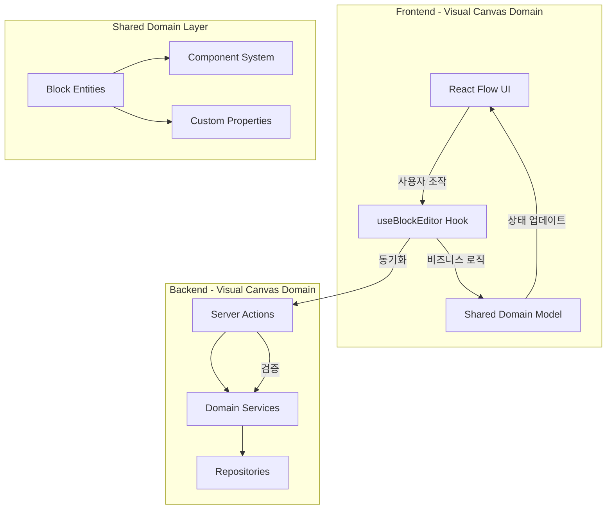

# React Flow + DDD 아키텍처 통합 설계

## 📋 문서 개요

**목적**: React Flow 기반 시각적 캔버스와 DDD(도메인 주도 설계) 아키텍처의 통합 설계 방안  
**작성자**: 개발팀  
**작성일**: 2025-10-02  
**대상**: 시니어 아키텍트 리뷰  

---

## 🎯 핵심 설계 철학

### 1. **하이브리드 DDD 패턴**
- **서버 중심 DDD** (User Management): 전통적인 서버 액션 + Context 패턴
- **프론트+서버 양방향 DDD** (Visual Canvas): 실시간 조작 + 도메인 검증

### 2. **Shared Domain Model**
- 프론트엔드와 백엔드가 동일한 도메인 모델 공유
- EventBus 없는 실용적 접근법 (React Context + Hooks)
- 다형성과 Composition을 통한 확장성 확보

---

## 🏗️ 전체 아키텍처 개요



---

## 📁 디렉토리 구조

```
domains/visual-canvas/
├── shared/                              # 🎯 프론트/서버 공유 도메인
│   ├── block-types/
│   │   ├── base/
│   │   │   └── block.base.ts           # 추상 기본 클래스
│   │   ├── shape/
│   │   │   ├── shape-block.ts          # ShapeBlock 엔티티
│   │   │   ├── shape-metadata.ts
│   │   │   └── shape-policies.ts       # 리사이징, 검증 정책
│   │   ├── youtube/
│   │   │   ├── youtube-block.ts        # YouTubeBlock 엔티티
│   │   │   └── youtube-policies.ts     # 16:9 비율 고정 정책
│   │   ├── code/
│   │   │   ├── code-block.ts           # CodeBlock 엔티티
│   │   │   └── code-policies.ts        # 높이만 조정 정책
│   │   └── index.ts                    # BlockFactory
│   │
│   ├── component-system/                # 🆕 Component-Instance 시스템
│   │   ├── models/
│   │   │   ├── component-metadata.ts   # Component/Instance 역할
│   │   │   ├── property-override.ts    # 속성 오버라이드
│   │   │   └── style-link-rule.ts      # 스타일 연동 규칙
│   │   └── services/
│   │       ├── component-sync.service.ts
│   │       └── override-manager.ts
│   │
│   ├── custom-properties/               # 🆕 사용자 정의 속성
│   │   ├── models/
│   │   │   ├── custom-property.ts      # text, select, number, date...
│   │   │   ├── property-types.ts
│   │   │   └── property-value.ts
│   │   └── validators/
│   │       └── property-validator.ts
│   │
│   └── value-objects/
│       ├── position.vo.ts
│       ├── size.vo.ts
│       └── block-id.vo.ts
│
├── frontend/                            # 프론트엔드 레이어
│   ├── hooks/
│   │   ├── use-canvas.ts               # React Flow 상태 관리
│   │   ├── use-block-editor.ts         # 🎯 핵심 도메인 로직
│   │   ├── use-component-sync.ts       # Component 동기화
│   │   └── use-custom-properties.ts    # Custom Properties
│   │
│   ├── components/
│   │   ├── Canvas.tsx                  # React Flow 캔버스
│   │   ├── PropertyPanel/              # 속성 편집 패널
│   │   │   ├── PropertyPanel.tsx
│   │   │   ├── PropertyEditor.tsx
│   │   │   └── OverrideIndicator.tsx
│   │   ├── TableView/                  # 테이블 뷰
│   │   │   ├── TableView.tsx
│   │   │   └── InlinePropertyEditor.tsx
│   │   ├── ContextMenu/                # 우클릭 메뉴
│   │   │   └── BlockContextMenu.tsx
│   │   └── Toolbar/                    # 툴바
│   │       └── PropertyToolbar.tsx
│   │
│   └── contexts/
│       └── canvas-context.tsx          # Context Provider
│
├── backend/                             # 서버 레이어
│   ├── services/
│   │   ├── visual-canvas.service.ts    # 비즈니스 로직
│   │   └── component.service.ts        # Component 시스템
│   │
│   └── repositories/
│       └── drizzle-block.repository.ts # Drizzle ORM
│
└── actions/                             # Server Actions
    ├── block.actions.ts
    ├── component.actions.ts
    └── property.actions.ts
```

---

## 🎨 핵심 도메인 모델

### 1. Block Base Class (다형성 기반)

```typescript
export abstract class Block {
  constructor(
    public readonly id: BlockId,
    public readonly type: BlockType,
    protected _position: Position,
    protected _size: Size,
    public readonly pageId: PageId,
    
    // Block Type별 메타데이터
    protected _blockMetadata: BlockMetadata,
    protected _styleProps: StyleProperties,
    
    // 🆕 Component System
    protected _componentMetadata: ComponentMetadata,
    
    // 🆕 Custom Properties
    protected _customProperties: Map<string, CustomProperty>,
    
    public readonly createdAt: Date,
    protected _updatedAt: Date
  ) {}

  // ========== 추상 메서드 (타입별 구현) ==========
  abstract canResize(direction: ResizeDirection): boolean;
  abstract validateSize(newSize: Size): ValidationResult;
  abstract getDefaultMetadata(): BlockMetadata;
  abstract getDefaultStyleProps(): StyleProperties;

  // ========== Component System 메서드 ==========
  get componentRole(): ComponentRole { return this._componentMetadata.role; }
  get isComponent(): boolean { return this._componentMetadata.role === 'component'; }
  get isInstance(): boolean { return this._componentMetadata.role === 'instance'; }

  // ========== Custom Properties 메서드 ==========
  setCustomProperty(property: CustomProperty): CustomPropertySetEvent {
    this._customProperties.set(property.name, property);
    this._updatedAt = new Date();
    
    // 🎯 스타일 연동 규칙 자동 적용
    if (this.isInstance || this.isComponent) {
      this.applyStyleLinkRules(property);
    }
    
    return new CustomPropertySetEvent({...});
  }

  // ========== Instance 전용 메서드 ==========
  overrideProperty(propertyName: string, value: any): PropertyOverriddenEvent {
    if (!this.isInstance) {
      throw new Error('Only instances can override properties');
    }
    // Override 로직...
  }

  // ========== React Flow 변환 ==========
  toReactFlowNode(): Node {
    return {
      id: this.id.value,
      type: this.type,
      position: this._position,
      data: {
        blockType: this.type,
        componentRole: this._componentMetadata.role,
        componentId: this._componentMetadata.componentId,
        customProps: this.serializeCustomProperties(),
        styleProps: this._styleProps
      }
    };
  }
}
```

### 2. Block Type별 구체 클래스

#### ShapeBlock
```typescript
export class ShapeBlock extends Block {
  // 🎯 Shape만의 메서드
  changeShapeType(newType: ShapeType): ShapeTypeChangedEvent {
    this._metadata = { ...this._metadata, shapeType: newType };
    return new ShapeTypeChangedEvent({...});
  }

  // 🎯 추상 메서드 구현
  canResize(direction: ResizeDirection): boolean {
    return true; // 모든 방향 리사이징 가능
  }

  validateSize(newSize: Size): ValidationResult {
    if (newSize.width < 20 || newSize.height < 20) {
      return { isValid: false, error: 'Shape must be at least 20x20' };
    }
    return { isValid: true };
  }
}
```

#### YouTubeBlock
```typescript
export class YouTubeBlock extends Block {
  private readonly ASPECT_RATIO = 16 / 9;

  // 🎯 YouTube만의 메서드
  changeVideoUrl(url: string): VideoUrlChangedEvent {
    const videoId = this.extractVideoId(url);
    if (!videoId) throw new Error('Invalid YouTube URL');
    // ...
  }

  // 🎯 추상 메서드 구현
  canResize(direction: ResizeDirection): boolean {
    return direction === 'horizontal' || direction === 'both';
  }

  validateSize(newSize: Size): ValidationResult {
    const expectedHeight = newSize.width / this.ASPECT_RATIO;
    if (Math.abs(newSize.height - expectedHeight) > 2) {
      return { 
        isValid: false, 
        error: 'YouTube block must maintain 16:9 aspect ratio' 
      };
    }
    return { isValid: true };
  }
}
```

### 3. Component System

```typescript
export class ComponentMetadata {
  constructor(
    public readonly role: ComponentRole, // 'regular' | 'component' | 'instance'
    public readonly componentId?: string, // instance인 경우 component ID
    private _overrides: Map<string, PropertyOverride> = new Map(),
    private _styleLinkRules: StyleLinkRule[] = []
  ) {}

  // 🎯 Override 관리
  recordOverride(propertyName: string, value: any): void { ... }
  hasOverride(propertyName: string): boolean { ... }
  getAllOverrides(): PropertyOverride[] { ... }

  // 🎯 Style Link Rules
  addStyleLinkRule(rule: StyleLinkRule): void { ... }
  getStyleLinkRules(): StyleLinkRule[] { ... }
}

// 스타일 연동 규칙 예시
export class StyleLinkRule {
  constructor(
    public readonly propertyName: string,
    public readonly condition: RuleCondition,
    public readonly styleChanges: Partial<StyleProperties>
  ) {}

  evaluate(propertyValue: any): Partial<StyleProperties> | null {
    if (this.condition.matches(propertyValue)) {
      return this.styleChanges;
    }
    return null;
  }
}
```

### 4. Custom Properties

```typescript
export class CustomProperty {
  constructor(
    public readonly name: string,
    public readonly type: PropertyType, // 'text' | 'number' | 'select' | 'date'
    private _value: any,
    public readonly options?: string[], // select type용
    public readonly isRequired: boolean = false
  ) {
    this.validate(_value);
  }

  setValue(newValue: any): void {
    this.validate(newValue);
    this._value = newValue;
  }

  private validate(value: any): void {
    switch (this.type) {
      case 'select':
        if (!this.options?.includes(value)) {
          throw new Error(`Property ${this.name} must be one of ${this.options?.join(', ')}`);
        }
        break;
      // ... 기타 타입 검증
    }
  }
}
```

---

## 🔄 프론트엔드 통합 패턴

### 1. Shared Hook (핵심 도메인 로직)

```typescript
export function useBlockEditor(pageId: string) {
  const [nodes, setNodes] = useNodesState([]);
  const [selectedBlockId, setSelectedBlockId] = useState<string | null>(null);

  // 🎯 핵심 도메인 로직 - 모든 UI에서 공유
  const setCustomProperty = useCallback(
    async (blockId: string, propertyName: string, value: any) => {
      const node = nodes.find(n => n.id === blockId);
      if (!node) return;

      // Shared Domain Model 사용
      const block = BlockFactory.fromReactFlowNode(node, new PageId(pageId));
      
      const property = block.getCustomProperty(propertyName);
      if (!property) throw new Error(`Property ${propertyName} not found`);

      // 🎯 비즈니스 로직 (검증 포함)
      property.setValue(value);
      const event = block.setCustomProperty(property);

      // Instance인 경우 Override 처리
      if (block.isInstance) {
        block.overrideProperty(propertyName, value);
      }

      // Optimistic UI 업데이트
      setNodes(nodes =>
        nodes.map(n =>
          n.id === blockId ? block.toReactFlowNode() : n
        )
      );

      // 서버 동기화
      await updateCustomPropertyAction({
        blockId, propertyName, value, isOverride: block.isInstance
      });

      return event;
    },
    [nodes, pageId]
  );

  return {
    nodes, selectedBlockId, setSelectedBlockId,
    setCustomProperty, addCustomProperty, deleteCustomProperty
  };
}
```

### 2. 다중 UI Entry Points

#### Canvas Editor Panel
```tsx
export function PropertyPanel() {
  const { selectedBlockId, setCustomProperty } = useBlockEditor(pageId);
  
  return (
    <Panel>
      {selectedBlock.getAllCustomProperties().map(prop => (
        <PropertyEditor
          property={prop}
          onChange={(value) => {
            // 🎯 동일한 도메인 로직 사용
            setCustomProperty(selectedBlock.id.value, prop.name, value);
          }}
        />
      ))}
    </Panel>
  );
}
```

#### Table View
```tsx
export function TableView() {
  const { setCustomProperty } = useBlockEditor(pageId);
  
  return (
    <table>
      <tbody>
        {filteredBlocks.map(block => (
          <tr key={block.id.value}>
            {propertyNames.map(propName => (
              <td>
                <InlinePropertyEditor
                  onChange={(value) => {
                    // 🎯 동일한 도메인 로직 사용
                    setCustomProperty(block.id.value, propName, value);
                  }}
                />
              </td>
            ))}
          </tr>
        ))}
      </tbody>
    </table>
  );
}
```

#### Keyboard Shortcuts
```tsx
export function Canvas() {
  const { setCustomProperty } = useBlockEditor(pageId);

  // 🎯 단축키로 동일한 도메인 로직 호출
  useHotkeys('cmd+1', () => {
    const block = getSelectedBlock();
    const firstProp = block.getAllCustomProperties()[0];
    
    if (firstProp && firstProp.type === 'select') {
      const nextValue = getNextOption(firstProp);
      // 🎯 동일한 도메인 로직 사용
      setCustomProperty(block.id.value, firstProp.name, nextValue);
    }
  });
}
```

---

## 🎯 핵심 설계 원칙

### 1. **Shared Domain Model** ✅
- 프론트엔드와 백엔드가 동일한 도메인 모델 공유
- 중복 코드 제거, 일관성 보장
- 단일 진실 공급원 (SSOT)

### 2. **Composition over Inheritance** ✅
- Block이 Component 기능을 "가짐" (상속 아님)
- 모든 Block Type이 Component/Instance가 될 수 있음
- 확장성과 유연성 확보

### 3. **다형성 활용** ✅
- 추상 기본 클래스 (Block)
- 타입별 구체 클래스 (ShapeBlock, YouTubeBlock, CodeBlock)
- Factory 패턴으로 인스턴스 생성

### 4. **실용적 접근법** ✅
- EventBus 없는 단순한 구조
- React Context + Hooks 기반
- Next.js 풀스택에 최적화

### 5. **단일 책임 원칙** ✅
- UI는 렌더링과 이벤트 처리만
- 비즈니스 로직은 Domain Model에 캡슐화
- 서버는 검증과 영속화만

---

## 📊 아키텍처 비교

| 방식 | 코드 중복 | 일관성 | 유지보수 | 학습곡선 |
|------|----------|-------|---------|---------|
| **각 UI마다 로직 구현** | 높음 | 낮음 | 어려움 | 완만함 |
| **EventBus 패턴** | 중간 | 높음 | 어려움 | 가파름 |
| **Shared Domain Model** | 없음 | 높음 | 쉬움 | 완만함 |

---

## 🚀 확장성과 미래 계획

### 1. **새로운 Block Type 추가**
```typescript
// 새 타입 추가 시
export class LaTeXBlock extends Block {
  // LaTeX만의 정책 구현
  validateSize(newSize: Size): ValidationResult {
    // LaTeX 수식은 자동 크기 조정
    return { isValid: true };
  }
}

// Factory에 등록
BlockFactory.create('latex', {...});
```

### 2. **새로운 UI Entry Point 추가**
```typescript
// 새로운 UI 추가 시
export function VoiceCommands() {
  const { setCustomProperty } = useBlockEditor(pageId);
  
  useVoiceCommand('set priority high', () => {
    // 🎯 동일한 도메인 로직 사용
    setCustomProperty(selectedBlockId, 'priority', 'high');
  });
}
```

### 3. **복잡한 비즈니스 규칙 추가**
```typescript
// Component 버전 관리, 스마트 추천 등
export class ComponentVersionManager {
  createVersion(componentId: string): ComponentVersion { ... }
  rollbackToVersion(versionId: string): void { ... }
}
```

---

## ✅ 검증 체크리스트

### 기술적 검증
- [x] React Flow와 도메인 모델 간 변환 계층 분리
- [x] 타입 안전성 확보 (TypeScript)
- [x] 성능 최적화 (디바운스, 배치 처리)
- [x] 에러 처리 및 롤백 전략

### 비즈니스 검증
- [x] Block Type별 정책 캡슐화
- [x] Component-Instance 동기화 로직
- [x] Custom Properties 검증 규칙
- [x] 스타일 연동 규칙 시스템

### 사용자 경험 검증
- [x] 다중 UI Entry Point 지원
- [x] 일관된 동작 보장
- [x] 실시간 피드백
- [x] 직관적인 인터랙션

---

## 📚 참고 자료

### 관련 문서
- [Visual Canvas Domain Event Storm](./domains/visual-canvas-domain/event-storm.md)
- [Component System Domain Event Storm](./domains/component-system-domain/event-storm.md)
- [User Management Domain Frontend Specification](./domains/user-management-domain/frontend-specification.md)

### 기술 스택
- **React Flow**: 시각적 캔버스 라이브러리
- **Next.js 15**: 풀스택 프레임워크
- **Drizzle ORM**: 타입 안전한 데이터베이스 접근
- **TypeScript**: 타입 안전성
- **Supabase**: 인증 및 데이터베이스

---

**결론**: 이 아키텍처는 React Flow의 실시간 조작 특성과 DDD의 비즈니스 로직 캡슐화를 효과적으로 결합하여, 확장 가능하고 유지보수하기 쉬운 시스템을 제공합니다.
