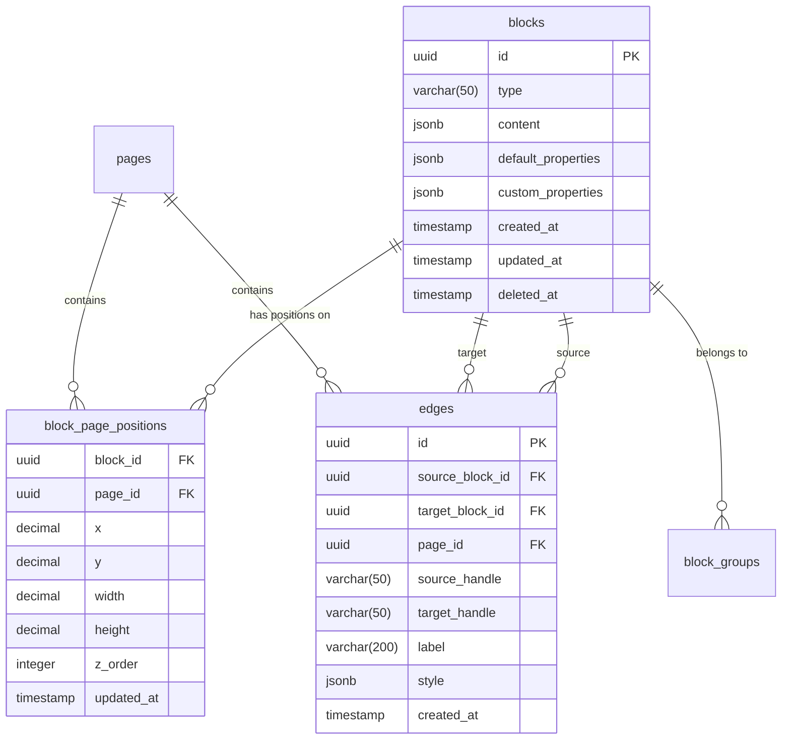

# Visual Canvas Domain - Database Schema

DDD 설계를 기반으로 실제 데이터베이스 스키마를 정의합니다.

---

## 🗄️ Schema Overview



---

## 📋 Table Definitions

### 1. blocks
**Aggregate Root**: Block  
**Purpose**: 모든 블럭의 핵심 정보 저장

```sql
CREATE TABLE blocks (
    id UUID PRIMARY KEY DEFAULT gen_random_uuid(),
    type VARCHAR(50) NOT NULL,
    content JSONB NOT NULL DEFAULT '{}',
    default_properties JSONB NOT NULL DEFAULT '{}',
    custom_properties JSONB NOT NULL DEFAULT '{}',
    
    -- Component System Integration (단순화됨)
    component_id UUID REFERENCES components(id),
    style_overrides JSONB DEFAULT '{}',
    block_subtype VARCHAR(50) DEFAULT 'regular',
    
    created_at TIMESTAMP WITH TIME ZONE DEFAULT NOW(),
    updated_at TIMESTAMP WITH TIME ZONE DEFAULT NOW(),
    deleted_at TIMESTAMP WITH TIME ZONE NULL,
    
    -- Constraints
    CONSTRAINT valid_block_type CHECK (type IN ('text', 'image', 'video', 'shape', 'page', 'component-instance')),
    CONSTRAINT valid_block_subtype CHECK (block_subtype IN ('regular', 'instance', 'page'))
);

-- Indexes
CREATE INDEX idx_blocks_type ON blocks(type);
CREATE INDEX idx_blocks_deleted_at ON blocks(deleted_at) WHERE deleted_at IS NULL;
CREATE INDEX idx_blocks_created_at ON blocks(created_at DESC);
-- Component System Integration Indexes
CREATE INDEX idx_blocks_component_id ON blocks(component_id) WHERE component_id IS NOT NULL;
CREATE INDEX idx_blocks_subtype ON blocks(block_subtype);
CREATE INDEX idx_blocks_component_instance ON blocks(type, component_id) WHERE type = 'component-instance';

-- Comments
COMMENT ON TABLE blocks IS 'Visual Canvas의 모든 블럭 정보 (Component System 통합)';
COMMENT ON COLUMN blocks.type IS '블럭 타입: text, image, video, shape, page, component-instance';
COMMENT ON COLUMN blocks.content IS '블럭별 고유 콘텐츠 (타입에 따라 구조 다름)';
COMMENT ON COLUMN blocks.default_properties IS '블럭 타입의 기본 속성';
COMMENT ON COLUMN blocks.custom_properties IS '사용자가 커스터마이징한 속성';
COMMENT ON COLUMN blocks.component_id IS '컴포넌트 인스턴스인 경우 컴포넌트 ID (NULL이면 일반 블럭)';
COMMENT ON COLUMN blocks.style_overrides IS '컴포넌트 인스턴스의 스타일 오버라이드 (JSON)';
COMMENT ON COLUMN blocks.block_subtype IS '블럭 서브타입: regular, instance, page';
```

### 2. block_page_positions
**Purpose**: 블럭의 페이지별 위치 및 크기 정보

```sql
CREATE TABLE block_page_positions (
    block_id UUID NOT NULL REFERENCES blocks(id) ON DELETE CASCADE,
    page_id UUID NOT NULL,
    x DECIMAL(10, 2) NOT NULL,
    y DECIMAL(10, 2) NOT NULL,
    width DECIMAL(10, 2) NOT NULL DEFAULT 200,
    height DECIMAL(10, 2) NOT NULL DEFAULT 100,
    z_order INTEGER NOT NULL DEFAULT 0,
    updated_at TIMESTAMP WITH TIME ZONE DEFAULT NOW(),
    PRIMARY KEY (block_id, page_id)
);

-- Indexes
CREATE INDEX idx_block_positions_page_id ON block_page_positions(page_id);
CREATE INDEX idx_block_positions_z_order ON block_page_positions(page_id, z_order);

-- Comments
COMMENT ON TABLE block_page_positions IS '블럭의 페이지별 위치 정보';
COMMENT ON COLUMN block_page_positions.z_order IS '레이어 순서 (높을수록 위)';
```

### 3. edges
**Purpose**: 블럭 간 연결 정보

```sql
CREATE TABLE edges (
    id UUID PRIMARY KEY DEFAULT gen_random_uuid(),
    source_block_id UUID NOT NULL REFERENCES blocks(id) ON DELETE CASCADE,
    target_block_id UUID NOT NULL REFERENCES blocks(id) ON DELETE CASCADE,
    page_id UUID NOT NULL,
    source_handle VARCHAR(50) NOT NULL DEFAULT 'default',
    target_handle VARCHAR(50) NOT NULL DEFAULT 'default',
    label VARCHAR(200),
    style JSONB NOT NULL DEFAULT '{}',
    created_at TIMESTAMP WITH TIME ZONE DEFAULT NOW(),
    CONSTRAINT edges_no_self_loop CHECK (source_block_id != target_block_id)
);

-- Indexes
CREATE INDEX idx_edges_source ON edges(source_block_id);
CREATE INDEX idx_edges_target ON edges(target_block_id);
CREATE INDEX idx_edges_page_id ON edges(page_id);

-- Comments
COMMENT ON TABLE edges IS '블럭 간 연결선 정보';
COMMENT ON COLUMN edges.source_handle IS '출발점 연결 위치';
COMMENT ON COLUMN edges.target_handle IS '도착점 연결 위치';
COMMENT ON COLUMN edges.style IS '선 스타일 (색상, 두께, 화살표 등)';
```

### 4. block_groups
**Purpose**: 블럭 그룹 관리

```sql
CREATE TABLE block_groups (
    id UUID PRIMARY KEY DEFAULT gen_random_uuid(),
    page_id UUID NOT NULL,
    name VARCHAR(200),
    created_at TIMESTAMP WITH TIME ZONE DEFAULT NOW()
);

CREATE TABLE block_group_members (
    group_id UUID NOT NULL REFERENCES block_groups(id) ON DELETE CASCADE,
    block_id UUID NOT NULL REFERENCES blocks(id) ON DELETE CASCADE,
    PRIMARY KEY (group_id, block_id)
);

-- Indexes
CREATE INDEX idx_block_groups_page_id ON block_groups(page_id);
CREATE INDEX idx_group_members_block_id ON block_group_members(block_id);
```

---

## 📊 Content JSONB Schemas

### Text Block Content
```json
{
  "text": "블럭 텍스트 내용",
  "formatting": {
    "bold": [{"start": 0, "end": 5}],
    "italic": [],
    "color": "#000000"
  }
}
```

### Image Block Content
```json
{
  "url": "https://example.com/image.jpg",
  "alt": "이미지 설명",
  "caption": "캡션 텍스트"
}
```

### Video Block Content
```json
{
  "platform": "youtube",
  "videoId": "dQw4w9WgXcQ",
  "startTime": 0,
  "autoplay": false
}
```

### Component Instance Content (단순화)
```json
{
  "componentId": "uuid-of-component",
  "version": 1,
  "instanceData": {
    "renderedAt": "2024-01-01T00:00:00Z"
  }
}
```

**Note**: 컴포넌트 인스턴스는 블럭의 `component_id` 필드로 관리되며, 
스타일 오버라이드는 별도의 `style_overrides` 필드에 저장됩니다.

### Style Overrides (New)
```json
{
  "color": "#ff0000",
  "fontSize": "16px",
  "backgroundColor": "#f0f0f0",
  "borderColor": "#cccccc"
}
```

---

## 🔄 Migration Strategy

### Initial Migration
```sql
-- V001__create_visual_canvas_schema.sql
BEGIN;

-- Create tables in order
CREATE TABLE blocks (...);
CREATE TABLE block_page_positions (...);
CREATE TABLE edges (...);
CREATE TABLE block_groups (...);
CREATE TABLE block_group_members (...);

-- Create indexes
CREATE INDEX ...;

-- Add comments
COMMENT ON ...;

COMMIT;
```

### Rollback Plan
```sql
-- V001__create_visual_canvas_schema.down.sql
BEGIN;

DROP TABLE IF EXISTS block_group_members CASCADE;
DROP TABLE IF EXISTS block_groups CASCADE;
DROP TABLE IF EXISTS edges CASCADE;
DROP TABLE IF EXISTS block_page_positions CASCADE;
DROP TABLE IF EXISTS blocks CASCADE;

COMMIT;
```

---

## 🚀 Performance Considerations

### 1. Query Optimization

#### Canvas Load Query
```sql
-- 페이지의 모든 블럭 로드 (최적화됨)
WITH page_blocks AS (
    SELECT 
        b.*,
        bp.x, bp.y, bp.width, bp.height, bp.z_order
    FROM blocks b
    INNER JOIN block_page_positions bp ON b.id = bp.block_id
    WHERE bp.page_id = $1
      AND b.deleted_at IS NULL
),
page_edges AS (
    SELECT e.*
    FROM edges e
    WHERE e.page_id = $1
      AND EXISTS (
        SELECT 1 FROM page_blocks pb 
        WHERE pb.id IN (e.source_block_id, e.target_block_id)
      )
)
SELECT 
    json_build_object(
        'blocks', json_agg(DISTINCT pb.*),
        'edges', json_agg(DISTINCT pe.*)
    ) as canvas_data
FROM page_blocks pb
CROSS JOIN page_edges pe;
```

### 2. Index Strategy

- **Primary Lookups**: UUID primary keys with B-tree indexes
- **Position Queries**: Composite index on (page_id, z_order)
- **Soft Delete**: Partial index WHERE deleted_at IS NULL
- **Time-based**: BRIN index on created_at for large tables

### 3. Partitioning Strategy

For scale:
```sql
-- 월별 파티셔닝 (대용량 서비스)
CREATE TABLE blocks_2024_01 PARTITION OF blocks
FOR VALUES FROM ('2024-01-01') TO ('2024-02-01');
```

---

## 📈 Capacity Planning

### Storage Estimates
- Average block size: ~2KB (including JSONB)
- Average edges per page: 10
- Target: 10,000 blocks per page

### Performance Targets
- Single block insert: < 10ms
- Page load (1000 blocks): < 200ms
- Position update: < 5ms
- Concurrent users: 50 per canvas

---

## 🔐 Security Considerations

### Row Level Security (RLS)
```sql
-- Enable RLS
ALTER TABLE blocks ENABLE ROW LEVEL SECURITY;

-- Policy: Users can only see their workspace blocks
CREATE POLICY blocks_workspace_policy ON blocks
    FOR ALL
    USING (
        EXISTS (
            SELECT 1 FROM workspace_members wm
            WHERE wm.user_id = auth.uid()
            AND wm.workspace_id = (
                SELECT workspace_id FROM pages 
                WHERE id = ANY(
                    SELECT page_id FROM block_page_positions 
                    WHERE block_id = blocks.id
                )
            )
        )
    );
```

### Data Validation
- Block type must be from allowed list
- Position coordinates must be reasonable
- Content JSONB must match type schema

---

## 🧪 Test Data

```sql
-- Seed data for development
INSERT INTO blocks (type, content) VALUES
    ('text', '{"text": "Hello World"}'),
    ('image', '{"url": "https://picsum.photos/200", "alt": "Random"}'),
    ('video', '{"platform": "youtube", "videoId": "dQw4w9WgXcQ"}');
```
