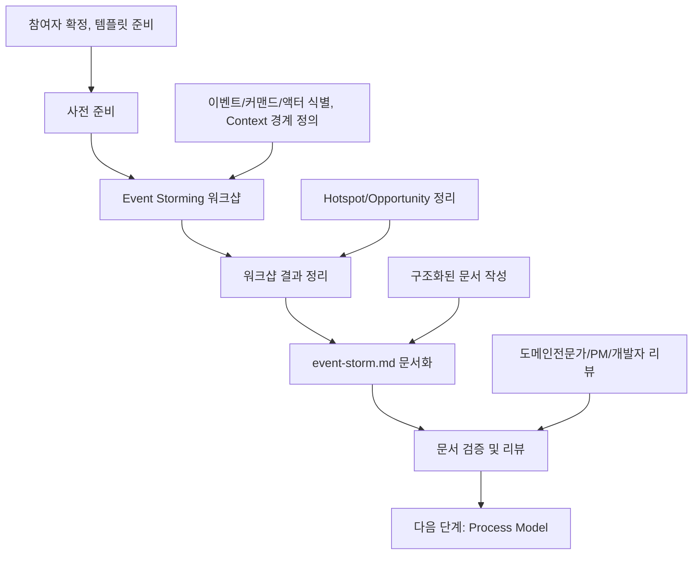

# Event Storming 워크샵 → 문서화 가이드

이 문서는 **Event Storming 워크샵**부터 **event-storm.md 문서 작성**까지, 의사결정 참여자들이 순서대로 따라할 수 있는 **Event Storming 전용 프로세스**를 설명합니다.

> 시작 전, `docs/event-domain-design/template/event-storm-template.md` 파일을 복사해 도메인 전용 `event-storm.md` 초안을 생성한 뒤, 아래 단계에 따라 내용을 채워 넣으세요.

---

## 🔁 Event Storming 프로세스 한눈에 보기



Event Storming은 **도메인 이해의 기초**를 만드는 단계로, Process Model 작성의 필수 선행 과정입니다.

---

## Phase 1: 사전 준비 (담당: PM)

### 1.1 참여자 확정 및 일정 조율

#### 필수 참여자:
- **도메인 전문가**: 해당 도메인의 비즈니스 지식이 풍부한 사람
- **PM**: 제품 전략 및 우선순위 결정
- **기획자**: 사용자 요구사항 및 UX 관점  
- **시니어 개발자**: 기술적 실현 가능성 및 아키텍처 관점

#### 권장 참여자:
- **주니어 개발자**: 구현 관점에서의 질문 및 학습
- **QA**: 테스트 관점에서의 시나리오 검증
- **디자이너**: 사용자 경험 관점

### 1.2 도구 및 환경 준비

#### 물리적 환경:
- [ ] 넓은 벽면 또는 화이트보드
- [ ] 다양한 색상의 포스트잇 (이벤트용: 주황색, 커맨드용: 파란색, 액터용: 노란색)
- [ ] 마커펜
- [ ] 카메라 (결과물 촬영용)

#### 디지털 환경 (대안):
- [ ] Miro, Mural, Figma 등 온라인 협업 도구
- [ ] 화면 공유 가능한 환경
- [ ] 녹화 도구 (온라인 세션의 경우)

### 1.3 템플릿 파일 준비
```bash
# 도메인 폴더 생성
mkdir -p docs/event-domain-design/domains/<domain-name>

# Event Storm 템플릿 복사
cp docs/event-domain-design/template/event-storm-template.md docs/event-domain-design/domains/<domain-name>/event-storm.md
```

### 1.4 사전 자료 준비
- [ ] Initiative 문서
- [ ] 기존 시스템 분석 자료
- [ ] 사용자 인터뷰 결과
- [ ] 경쟁사 분석 자료
- [ ] 비즈니스 요구사항 문서

---

## Phase 2: Event Storming 워크샵 진행 (담당: PM + 도메인전문가)

### 2.1 워크샵 전체 구조 (2-3시간)

```
시간 배분:
- Phase 1: 이벤트 식별 (30-45분)
- Phase 2: 커맨드 식별 (20-30분)  
- Phase 3: 액터 식별 (15-20분)
- Phase 4: 도메인 경계 탐색 (30-45분)
- 휴식 및 정리 (15-30분)
```

### 2.2 Phase 1: 이벤트 식별 (30-45분)

**목표**: 도메인에서 발생하는 모든 중요한 이벤트들을 식별

#### 진행 방법:
1. **도메인 전문가가 먼저 시작**: 가장 중요한 이벤트부터 포스트잇에 작성
2. **시간순으로 배치**: 왼쪽에서 오른쪽으로 시간 순서대로 배치
3. **모든 참가자가 참여**: 각자의 관점에서 놓친 이벤트 추가
4. **질문 유도**: "그 다음에 뭐가 일어나나요?", "사용자가 뭘 하게 되나요?"

#### 이벤트 작성 규칙:
- **과거형 동사 사용**: "~됨", "~완료됨", "~생성됨"
- **구체적으로 작성**: "주문됨" (O) vs "처리됨" (X)
- **도메인 언어 사용**: 비즈니스에서 실제 사용하는 용어

#### 예시:
```
[워크스페이스가 생성됨] → [페이지가 생성됨] → [페이지가 이동됨] → [페이지가 삭제됨]
```

### 2.3 Phase 2: 커맨드 식별 (20-30분)

**목표**: 각 이벤트를 발생시키는 커맨드(명령) 식별

#### 진행 방법:
1. **각 이벤트 아래에 커맨드 배치**: "이 이벤트를 발생시키는 명령은?"
2. **액터와 연결**: "누가 이 명령을 내리는가?"
3. **중복 제거**: 같은 의미의 커맨드 통합

#### 커맨드 작성 규칙:
- **명령형 동사 사용**: "워크스페이스 생성하기", "페이지 이동하기"
- **액터 명시**: "사용자가 워크스페이스 생성하기"

#### 예시:
```
[사용자가 워크스페이스 생성하기] → [워크스페이스가 생성됨]
[사용자가 페이지 이동하기] → [페이지가 이동됨]
```

### 2.4 Phase 3: 액터 식별 (15-20분)

**목표**: 시스템과 상호작용하는 모든 액터 식별

#### 액터 분류:
- **Primary Actor**: 직접적인 사용자 (조직 관리자, 팀 멤버)
- **Secondary Actor**: 간접적인 사용자 (시스템 관리자)
- **System Actor**: 자동화된 시스템 (Clerk, 알림시스템)

#### 진행 방법:
1. **외부 액터**: 시스템 밖의 사람이나 시스템
2. **내부 액터**: 시스템 내부의 역할이나 서비스
3. **액터별 색상 구분**: 사람(노란색), 시스템(회색)

### 2.5 Phase 4: 도메인 경계 탐색 (30-45분)

**목표**: Bounded Context의 경계를 찾아 색상으로 구분

#### 🎯 Domain vs Bounded Context 개념 정리

**Domain (도메인)**:
- **정의**: 비즈니스 영역 자체 (예: "사용자 관리", "조직 관리")
- **범위**: 넓음 - 여러 Bounded Context를 포함할 수 있음
- **목적**: 문제 영역 식별

**Bounded Context (경계 컨텍스트)**:
- **정의**: 동일한 도메인 모델이 유효한 경계
- **범위**: 좁음 - 명확한 시스템 경계
- **목적**: 해결 방안 구현 경계

**관계**: `Domain > Bounded Context > System`

#### 진행 방법:
1. **관련 이벤트들을 그룹핑**: 논리적으로 연결된 이벤트들 묶기
2. **경계선 그리기**: 각 그룹을 색상으로 구분
3. **Context 이름 붙이기**: 각 경계의 이름 정의

#### Context 식별 기준:
- **동일한 언어 사용**: 같은 비즈니스 용어 사용
- **강한 응집성**: 내부 요소들이 밀접하게 연결
- **약한 결합성**: 다른 Context와의 의존성 최소화

#### 실제 예시:

**User Management Domain** 안의 여러 Bounded Context:
```
[User Authentication Context]  [Profile Management Context]  [Organization Context]
[로그인됨] → [프로필생성됨] → [조직생성됨] → [멤버추가됨]
```

**전체 시스템의 Context 구조**:
```
[조직 관리 Context]     [워크스페이스 Context]     [페이지 구조 Context]
[조직생성됨] → [멤버추가됨] → [워크스페이스생성됨] → [페이지생성됨]
```

#### 🔍 Context 식별 시 주의사항:

1. **하나의 Context에 여러 시스템이 포함될 수 있음**:
   ```
   User Authentication Context
   ├── Supabase Auth System (외부)
   ├── User Registration System (내부)
   └── Profile Creation System (내부)
   ```

2. **Context ≠ System**:
   - **Context**: 도메인 모델의 경계
   - **System**: 실제 구현 단위

3. **Context 내부에서 일관된 언어 사용**:
   - 같은 개념이라도 다른 Context에서는 다르게 해석될 수 있음
   - 예: "User"는 Authentication Context에서는 "인증된 사용자", Profile Context에서는 "프로필 소유자"

### 2.6 Phase 5: Context 간 관계 파악 (20분)

**목표**: Bounded Context 간의 기본적인 관계와 데이터 흐름 발견

> **참고**: 구체적인 Context Map 작성과 통합 패턴(ACL, Customer-Supplier 등) 정의는 **Software Design 단계**에서 진행합니다.

#### 진행 방법:

1. **Context 간 연결선 그리기**:
   - 어떤 Context가 다른 Context와 통신하는가?
   - 데이터나 이벤트가 흐르는 방향은?

2. **간단한 관계 메모**:
   - "User Management → Organization Management" (사용자 생성 후 조직 생성)
   - "Organization Management → Workspace Structure" (조직 생성 후 워크스페이스 생성)

3. **외부 시스템 식별**:
   - 어떤 외부 시스템/서비스와 통합이 필요한가?
   - 각 외부 시스템은 어느 Context와 연관되는가?

#### Context 간 관계 메모 예시:

```markdown
### Context 간 관계 (발견 단계)

**User Management → Organization Management**:
- 사용자 생성 완료 후 기본 조직 생성 필요
- 데이터 흐름: userId → createDefaultOrganization

**Organization Management → Notification Management**:
- 멤버 초대 시 이메일/알림 발송 필요
- 데이터 흐름: invitation → sendNotification

**외부 시스템**:
- Supabase Auth (User Management Context)
- SendGrid (Notification Management Context)
```

#### 주의사항:

1. **발견 단계에 집중**:
   - 이 단계에서는 "어떤 Context들이 연결되는가?"만 파악
   - 구체적인 통합 패턴(ACL, Customer-Supplier)은 Software Design에서 결정

2. **순환 의존성 경고**:
   - Context A → Context B → Context A 구조 발견 시 메모
   - Software Design 단계에서 재설계 검토

3. **다음 단계를 위한 준비**:
   - Process Model: External System 목록 제공
   - Software Design: 구체적인 Context Map + ACL 설계

---

## Phase 3: 워크샵 결과 정리 및 문서화 (담당: PM)

### 3.1 워크샵 결과물 촬영 및 정리

- [ ] 전체 보드 사진 촬영
- [ ] 각 Context별 상세 사진 촬영
- [ ] 참가자별 인사이트 정리
- [ ] 논의된 이슈 및 의견 정리

### 3.2 event-storm.md 문서 작성

복사한 템플릿을 기반으로 다음 섹션들을 채워넣습니다:

#### 필수 작성 섹션:

1. **📊 Domain Overview**
   - 도메인의 비즈니스 가치 및 다른 도메인과의 관계
   - 핵심 개념과 범위 정의

2. **📝 핵심 개념 정리**
   - 외부 시스템 통합 전략 (Clerk 등)
   - 도메인의 핵심 엔티티와 관계
   - 주요 비즈니스 정책

3. **🟠 Domain Events (시간 순서)**
   - 워크샵에서 식별된 이벤트들을 카테고리별로 분류
   - 시간순 배치와 사용자 여정 반영

4. **🔴 Hotspots (문제점/병목)**
   - 우선순위별로 분류 (높음/중간/낮음)
   - 각 문제의 영향도와 해결방안 제시

5. **💡 Opportunities (개선 기회)**
   - 즉시구현(MVP 필수) vs 향후구현(Post-MVP) 분류
   - 구체적인 구현 방안 제시

6. **🔗 Context 간 관계** (다른 도메인과 통합이 있는 경우)
   - Bounded Context 목록
   - Context 간 간단한 관계 및 데이터 흐름
   - 외부 시스템 식별 (구체적인 통합 패턴은 Software Design에서)

7. **❓ Process Modeling을 위한 주요 질문들**
   - 다음 단계(Process Model)에서 해결해야 할 미해결 이슈
   - 핵심 프로세스별 질문 정리

#### 작성 팁:
- **과거형 동사 사용**: "~됨", "~완료됨", "~생성됨"
- **도메인 언어 사용**: 비즈니스에서 실제 사용하는 용어
- **시간순 정렬**: 사용자 여정을 따라 이벤트 배치
- **구체적 설명**: 추상적 표현보다는 명확한 비즈니스 상황 기술

### 3.3 문서 품질 검증

#### 자체 점검 체크리스트:
- [ ] 모든 주요 비즈니스 이벤트가 누락 없이 식별되었는가?
- [ ] 시간순으로 논리적인 사용자 여정이 구성되었는가?
- [ ] 도메인 언어가 일관되게 사용되었는가?
- [ ] Hotspot이 우선순위와 함께 명확히 정리되었는가?
- [ ] Process Model 작성을 위한 충분한 질문이 정리되었는가?

---

## Phase 4: 문서 검증 및 리뷰 (담당: 전체 참여자)

### 4.1 리뷰 단계별 체크포인트

#### 도메인전문가 리뷰:
- [ ] 비즈니스 프로세스가 정확하게 반영되었는가?
- [ ] 도메인 언어와 개념이 올바르게 사용되었는가?
- [ ] 실제 운영 시나리오가 누락되지 않았는가?
- [ ] Hotspot으로 식별된 문제들이 실제 현실과 일치하는가?

#### PM 리뷰:
- [ ] 비즈니스 요구사항이 정확히 반영되었는가?
- [ ] 사용자 가치가 명확히 정의되었는가?
- [ ] Epic/Story 도출이 가능한 수준으로 정리되었는가?
- [ ] 우선순위가 비즈니스 관점에서 적절한가?

#### 기획자 리뷰:
- [ ] 사용자 경험 관점에서 놓친 이벤트가 없는가?
- [ ] 사용자 여정이 자연스럽게 연결되는가?
- [ ] UX 개선 기회가 적절히 식별되었는가?

#### 시니어개발자 리뷰:
- [ ] 기술적 실현 가능성이 고려되었는가?
- [ ] 외부 시스템 통합점이 명확히 정의되었는가?
- [ ] Process Model 작성을 위한 정보가 충분한가?

---

## ✅ Event Storming 완료 기준

다음 모든 조건이 충족되어야 Event Storming이 완료된 것으로 간주합니다:

### 워크샵 완료 기준:
- [ ] 모든 핵심 도메인 이벤트가 시간순으로 식별됨
- [ ] 명확한 Context 경계가 정의됨
- [ ] 액터와 커맨드가 이벤트와 연결됨
- [ ] 주요 문제점과 개선기회가 정리됨

### 문서 완료 기준:
- [ ] event-storm.md의 모든 필수 섹션이 작성됨
- [ ] 비즈니스 도메인 전문가의 검증 완료
- [ ] Process Modeling을 위한 질문들이 정리됨
- [ ] Git에 체계적으로 커밋되고 PR이 승인됨

---

## 🚀 다음 단계: Process Model로 연결

Event Storming이 완료되면 다음 단계를 진행할 수 있습니다:

### Process Model 작성 준비:
1. **Process Model 가이드 참조**: `docs/event-domain-design/guide/2-process-model-guide.md`
2. **핵심 프로세스 선정**: Event Storm에서 식별된 이벤트 중 가장 중요한 사용자 여정 5-7개
3. **워크샵 참여자 재조정**: 시니어개발자 + 도메인전문가 중심으로

### 연결 정보:
- **입력**: 완성된 event-storm.md
- **출력**: process-model.md
- **다음 담당자**: 시니어개발자 (PM에서 전환)

---

## 📚 관련 문서 및 템플릿

### 참조 가이드:
- [Process Model 작성 가이드](./2-process-model-guide.md)
- [Software Design 작성 가이드](./1-software-design-guide.md)

### 템플릿 파일:
- [Event Storm 템플릿](../template/event-storm-template.md)

### 예시 문서:
- [Workspace Structure Domain 예시](../domains/workspace-structure-domain/event-storm.md)

---

## 💡 성공을 위한 핵심 팁

### 워크샵 성공 팁:
- **도메인전문가 주도**: 비즈니스 지식이 풍부한 사람이 이끌어야 함
- **시간순 배치**: 사용자 여정을 따라 이벤트를 시간순으로 정렬
- **질문 많이 하기**: "왜?", "언제?", "누가?" 질문으로 깊이 파기
- **판단 유보**: 기술적 제약보다는 비즈니스 관점에서 먼저 생각

### 문서화 성공 팁:
- **구체적 표현**: 추상적이지 않고 실제 비즈니스 상황을 구체적으로 기술
- **도메인 언어 일관성**: 워크샵에서 사용된 용어를 그대로 문서에 반영
- **시각적 정리**: 이벤트 흐름이 시각적으로 이해하기 쉽게 정리
- **미해결 이슈 명시**: 다음 단계에서 해결해야 할 질문들을 명확히 정리

### 주의사항:
- **기술적 세부사항 피하기**: 구현 방법보다는 무엇을 할지에 집중
- **완벽함 추구하지 않기**: 100% 완벽한 결과보다는 방향성 확립
- **시간 관리**: 각 Phase별 시간을 엄수하여 전체 일정 지키기
