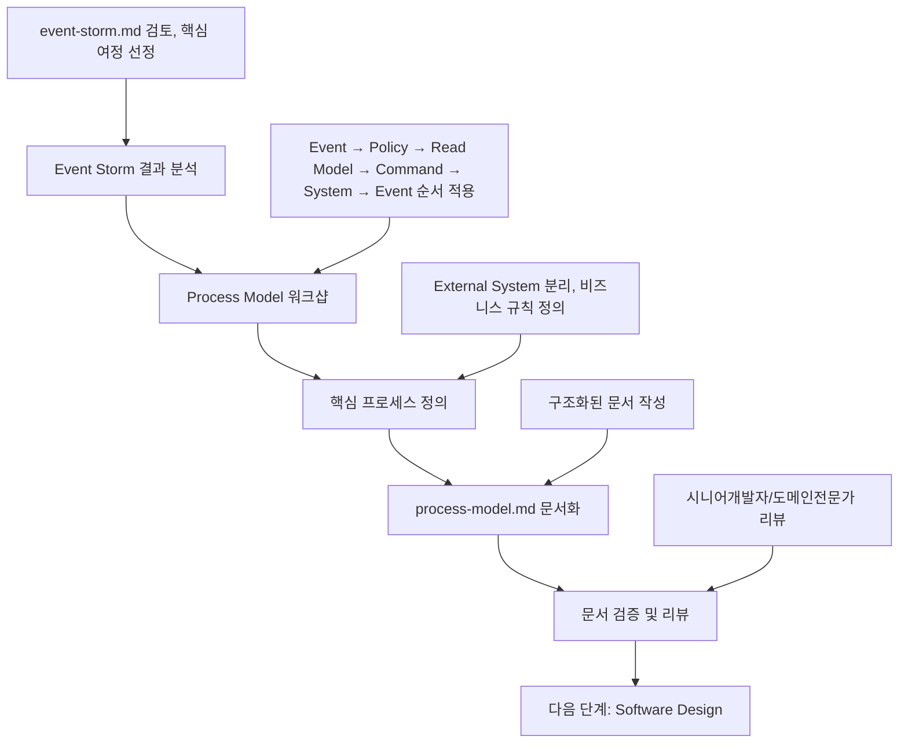

# Process Model 정의 가이드

이 문서는 **Event Storming 결과**를 바탕으로 **Process Model**을 정의하고 **process-model.md 문서 작성**까지, 의사결정 참여자들이 순서대로 따라할 수 있는 **Process Model 전용 프로세스**를 설명합니다.

> 시작 전, `docs/event-domain-design/template/2-process-model-template.md` 파일을 복사해 도메인 전용 `process-model.md` 초안을 생성한 뒤, 아래 단계에 따라 내용을 채워 넣으세요.

---

## 🔁 Process Model 프로세스 한눈에 보기



Process Model은 **Event Storm의 추상적 이벤트**를 **구체적 시스템 프로세스**로 전환하는 핵심 단계입니다.

### 🔄 시퀀스 기반 상호작용 순서
Process Model은 시나리오와 시퀀스로 구성되며, 이벤트에 의해 다음 시퀀스가 트리거됩니다:

**Event** → **Policy** → **Read Model** → **Command** → **System** → **Event** → **Policy** → ...

1. **Event** (이전 시퀀스의 결과) → 2. **Policy** (이벤트에 따른 정책 적용) → 3. **Read Model** (시스템에서 사용자에게 제공하는 정보) → 4. **Command** (사용자가 입력하는 정보) → 5. **System** (처리 시스템) → 6. **Event** (결과 이벤트)

---

## 🛠️ 작업 시작 전 Git 브랜치 준비하기

```bash
# Event Storming 브랜치에서 연결하거나 새 브랜치 생성
git checkout event-storm-<domain-name>

# Process Model 브랜치 생성 (Event Storm이 완료된 상태에서)
git checkout -b process-model-<domain-name>

# 예시: git checkout -b process-model-workspace-structure
```

---

## Phase 1: Event Storm 결과 분석 (담당: 시니어개발자)

### 1.1 사전 준비 - 완료된 Event Storm 확인

#### 필수 전제 조건:
- [ ] event-storm.md 문서가 완성되어 있음
- [ ] Event Storming 워크샵이 완료되어 도메인전문가의 승인을 받음
- [ ] 주요 Hotspot과 개선기회가 정리되어 있음
- [ ] Process Modeling을 위한 질문들이 준비되어 있음

#### Event Storm 결과물 검토:
```bash
# Event Storm 문서 확인
cat docs/event-domain-design/domains/<domain-name>/event-storm.md

# 주요 확인 포인트:
# - Domain Events (시간순)
# - Hotspots (문제점)
# - Process Modeling을 위한 질문들
```

### 1.2 핵심 사용자 여정 선정

#### 선정 기준:
1. **비즈니스 가치가 높은 프로세스** (Opportunity에서 식별된 것들)
2. **Hotspot으로 식별된 중요 문제가 포함된 프로세스**
3. **외부 시스템과의 통합이 필요한 프로세스**
4. **다른 도메인과의 연결점이 되는 프로세스**

#### 일반적인 선정 가이드:
- **5-7개 핵심 시나리오** 선정 (너무 많으면 복잡해짐)
- **사용자 여정의 시작부터 끝까지** 커버
- **External System 동기화** 프로세스는 필수 포함

### 1.3 템플릿 파일 준비
```bash
# Process Model 템플릿 복사 (아직 없다면)
cp docs/event-domain-design/template/2-process-model-template.md docs/event-domain-design/domains/<domain-name>/process-model.md
```

---

## Phase 2: Process Model 워크샵 진행 (담당: 시니어개발자 + 도메인전문가)

### 2.1 워크샵 참여자 및 구조

#### 필수 참여자:
- **시니어 개발자** (리드): 시스템 설계 및 기술적 실현성 검토
- **도메인 전문가**: 비즈니스 규칙 및 정책 검증
- **PM**: 비즈니스 우선순위 및 요구사항 확인

#### 권장 참여자:
- **기획자**: 사용자 관점에서의 프로세스 검증
- **주니어 개발자**: 구현 관점에서의 질문 및 학습

#### 워크샵 시간 배분 (2-3시간):
```
- Phase 1: External System 식별 (30분)
- Phase 2: 핵심 프로세스별 Command 정의 (60분)
- Phase 3: Policy 및 System 정의 (60분)
- 휴식 및 정리 (15-30분)
```

### 2.2 Phase 1: External System 식별 (30분)

**목표**: 도메인 외부의 시스템들을 명확히 구분하고 통합 방식 정의

#### 진행 방법:
1. **Event Storm에서 식별된 외부 액터 검토**
2. **각 외부 시스템의 역할과 책임 정의**
3. **Single Source of Truth 결정**
4. **통합 방식 선택** (Webhook, API 호출, 이벤트 기반 등)

#### External System 분류 기준:
- **SSOT (Single Source of Truth)**: 외부 시스템이 주도권을 가지는 데이터
- **Integration Pattern**: Webhook, API, Event-driven
- **Failure Strategy**: 외부 시스템 장애 시 대응 방안

#### 예시 결과:
```markdown
### 🟪 External System: Clerk
- 역할: 사용자 인증 및 Organization 관리
- SSOT: Clerk이 Organization/User의 Single Source of Truth
- 통합: Webhook을 통한 실시간 동기화
```

### 2.3 Phase 2: 핵심 시나리오별 시퀀스 정의 (60분)

**목표**: 실제 사용자 여정을 시나리오와 시퀀스로 나누어 Event → Policy → Read Model → Command → System → Event 패턴으로 정의

#### 진행 방법:
1. **선정된 핵심 시나리오 순서대로 진행**
2. **각 시나리오의 시작점(초기 트리거) 식별**
3. **시퀀스별 Trigger Event 정의**
4. **Event에 따른 Policy 적용 규칙 정의**
5. **Policy에 따른 Read Model 결정**
6. **사용자 Command 정의**
7. **System 처리 단위 정의**
8. **Event 결과 정의 및 다음 시퀀스 트리거 확인**

#### 시나리오 vs 시퀀스 구분:
- **시나리오**: 하나의 완전한 사용자 여정 (예: "사용자 등록 및 온보딩")
- **시퀀스**: 시나리오 내의 개별 단계 (예: "구글 로그인", "튜토리얼 진행") 또는 시스템 내부의 구체적인 처리 과정

#### 🔄 복합 시퀀스 패턴

##### 1) 시퀀스 내 Event-Policy 반복 패턴
**언제 사용**: 하나의 Command가 여러 단계로 나뉘어 처리될 때

**구조**:
```
Event → Policy → Read Model → Command → System → Event
                                                    ↓
                  Policy → Read Model → Command → System → Event  
                                                    ↓
                  Policy → Read Model → Command → System → Event
```

**예시**:
```markdown
**Events**: 구글 OAuth 코드 전달받음  
**Policy**: "Whenever 구글 OAuth 코드 전달됨, then always 유저 등록 처리하기"
**Command**: 유저 등록 처리 시작
**System**: User Authentication System
**Events**: 유저 등록 처리 완료됨 / 유저 등록 처리 실패함

**Policy**: "Whenever 유저 등록 처리 완료됨, then always 온보딩 옵션 제공하기"
**Read Model**: 온보딩 시작 버튼, 온보딩 건너뛰기 옵션
**Command**: 온보딩 선택
**System**: (웹) - Frontend
**Events**: 온보딩 완료됨
```

##### 2) 시스템 내부 처리 세분화
**언제 사용**: System의 내부 로직이 복잡하고 단계별 검증이 필요할 때

**별도 Sequence로 분리하여 상세 처리 과정 표현**:
```markdown
### Sequence 2: User Authentication System 내부 처리 과정

**Trigger Event**: 유저 등록 처리 시작됨

**Policy**: "Whenever 유저 등록 처리 시작됨, then always Supabase Auth으로 유저 생성하기"
**Command**: 유저 생성 시작
**System**: Supabase Auth System (외부시스템)
**Event**: 유저 생성됨

**Policy**: "Whenever 유저 생성됨, then always 프로필 생성하기"
**Read Model**: 구글 계정 정보, 기존 프로필 조회 결과
**Command**: 프로필 생성 처리
**System**: Profile System
**Event**: 사용자 프로필이 생성됨

**Policy**: "Whenever 사용자 프로필이 생성됨, then always 기본 조직 생성하기"
**Read Model**: 조직 생성 상태, 기본 조직 설정 정보
**Command**: 기본 조직 생성
**System**: Organization Manager
**Event**: 기본 조직이 생성됨

**Events** (최종 결과):
1. 사용자 등록 처리 완료됨
2. 사용자 등록 처리 실패함
```

#### 👀 관점별 시퀀스 작성 기준

##### 사용자/비즈니스 관점 시퀀스
- **특징**: 사용자가 실제 경험하는 여정, 비즈니스 의사결정자가 이해해야 하는 흐름
- **System 처리**: 블랙박스로 처리 (내부 로직 노출하지 않음)
- **목적**: 사용자 여정과 비즈니스 가치 중심

**예시**:
```markdown
### Sequence 1: 방문자가 구글 로그인으로 플랫폼에 가입 및 온보딩

**Trigger Event**: 로그인 페이지 이동함

```
👤 사용자: "구글 계정으로 로그인해서 플랫폼에 가입하고 싶어"
```

**Read Model**: 로그인 방식 선택, 서비스 후기 확인
**Command**: 구글 로그인 선택
**System**: Google OAuth (블랙박스)
**Events**: 구글 OAuth 코드 전달받음
```

##### 시스템 내부 관점 시퀀스  
- **특징**: 개발자가 구현해야 하는 상세 처리 과정, 시스템 간 연동 및 데이터 처리 흐름
- **System 처리**: 모듈화된 블랙박스의 내부 로직을 상세히 표현
- **목적**: Software Design으로 연결되는 기술적 세부사항

**예시**:
```markdown
### Sequence 2: User Authentication System 내부 처리 과정

**Trigger Event**: 유저 등록 처리 시작됨

```
🔧 시스템: "User Authentication System 내부에서 구글 코드 인증부터 기본 데이터 생성까지 처리"
```

**Policy**: "Whenever 유저 등록 처리 시작됨, then always Supabase Auth으로 유저 생성하기"
**Command**: 유저 생성 시작
**System**: Supabase Auth System (외부시스템)
**Event**: 유저 생성됨
```

##### 블랙박스 시퀀스 분리 기준

**언제 별도 시퀀스로 분리해야 하는가?**

1. **내부 시스템의 경우** (우리가 정의해야 하는 블랙박스):
   - ✅ System의 처리 단계가 3개 이상인 경우
   - ✅ 에러 처리나 재시도 로직이 복잡한 경우  
   - ✅ 여러 하위 시스템으로 구성된 경우
   - ✅ 비즈니스 로직이 복잡하고 단계별 검증이 필요한 경우

2. **외부 시스템의 경우** (다른 팀이 정의하는 블랙박스):
   - ❌ 외부 시스템 내부 로직은 정의하지 않음
   - ✅ 외부 시스템과의 인터페이스만 정의
   - ✅ Webhook, API 호출, 이벤트 기반 통합만 표현

**분리 예시**:
```markdown
❌ 외부 시스템 내부 분리 (불필요):
### Sequence 3: Google OAuth 내부 처리 과정  # Google이 정의하는 블랙박스

✅ 내부 시스템 분리 (필요):
### Sequence 2: User Authentication System 내부 처리 과정  # 우리가 정의하는 블랙박스
```
#### 이벤트의 종류:
- 내부 서비스에서 발생하는 이벤트 (중요)
- 웹에서 발생하는 이벤트 (중요)
- 외부 시스템에서 발생하는 이벤트

#### 프론트엔드 전용 처리 가이드:
- **System**: `(웹) - Frontend`로 명시
- **Event**: 사용자 관점의 이벤트로 처리 (예: "튜토리얼이 끝났다")
- 백엔드 처리 여부와 관계없이 사용자 여정에서 중요한 이벤트는 모두 포함

#### 시퀀스 연결 예시:
```
Scenario 0: 사용자 등록 및 온보딩
├── Sequence 1: 구글 로그인으로 플랫폼 등록
│   └── Event: "로그인이 완료됨"
├── Sequence 2: 신규 사용자 튜토리얼 처리 (Event 기반 시작)
│   ├── Policy: "Whenever 로그인이 완료됨, then always 신규 사용자인지 확인하기"
│   ├── Read Model: 튜토리얼 시작/건너뛰기 옵션 표시
│   ├── Command: "튜토리얼 시작" 또는 "튜토리얼 건너뛰기"
│   ├── System: (웹) - 프론트엔드에서 처리
│   └── Event: "튜토리얼이 끝났다" 또는 "튜토리얼을 건너뛰었다"
└── Sequence 3: 메인 화면 진입 (Event 기반 시작)
```

#### 시퀀스 정의 패턴:
```markdown
### Sequence N: [시퀀스명]

**Trigger Event**: [이전 시퀀스의 특정 이벤트 또는 초기 트리거]

**Policy**: 
- "Whenever [특정 이벤트], then always [자동 반응 액션]"
- "Whenever [조건부 이벤트], then [조건에 따른 반응]"

**Read Model** (시스템에서 사용자에게 제공하는 정보):
- [시스템이 보여주는 정보 1]
- [시스템이 보여주는 정보 2]
- [사용자 선택 옵션들]
- [진행 상태 표시]

**Command**: [Action Name] ([Technical Command Name])
- [사용자가 입력하는 정보 1]
- [사용자가 입력하는 정보 2]
- [사용자 선택 옵션]
- [확인/제출 정보]

**System**: [System Name] System | [Domain] - [System Name] System | [External System] System | (웹) - Frontend
- 비즈니스 로직: [구체적인 비즈니스 규칙들]
- 검증 로직: [입력 데이터 검증 규칙들]
- 처리 로직: [핵심 비즈니스 처리 과정]

**System 명명 예시**:
- `User Manager` (내부 도메인)
- `Workspace-Management - Page Manager` (외부 도메인)
- `Supabase Auth System` (서드파티)
- `(웹) - Frontend` (프론트엔드)

**Events**:
1. [Event 1] ([Technical Event Name])
2. [Event 2] ([Technical Event Name])
```

#### 시퀀스 작성 가이드:
- **Trigger Event**: 이전 시퀀스의 특정 이벤트 또는 초기 사용자 액션
- **Policy**: 이벤트에 대한 자동 반응 규칙 ("Whenever X, then Y" 패턴)
- **Read Model**: 시스템이 사용자에게 보여주는 정보 (폼, 목록, 상태 표시 등)
- **Command**: 사용자가 실제로 입력하거나 선택하는 정보 (폼 데이터, 선택 옵션 등)
- **System**: 처리 시스템 (비즈니스 로직 포함, 백엔드 시스템 또는 Frontend)
- **Events**: Command 실행 결과로 발생하는 구체적인 이벤트들

### 2.4 Phase 3: 상호작용 순서 검증 및 정리 (60분)

**목표**: 정의된 상호작용 순서의 일관성과 완전성 검증

#### 검증 포인트:
1. **순서 일관성**: 모든 시나리오가 Event → Policy → Read Model → Command → System → Event 순서를 따르는지 확인
2. **완전성**: 각 단계별로 필요한 정보가 모두 포함되었는지 확인
3. **실용성**: 실제 구현팀이 이해할 수 있을 정도로 구체적인지 확인

#### Policy 검증:
이벤트에 대한 **자동 반응 규칙**이 "Whenever-then" 패턴으로 명확히 정의되었는지 확인

```markdown
**Policy**: 
- "Whenever [특정 이벤트], then always [자동 반응 액션]"
- "Whenever [조건부 이벤트], then [조건에 따른 반응]"
- "Whenever [이벤트], then immediately [즉시 반응]"
```

#### Policy 작성 가이드:
- **이벤트 기반**: 특정 이벤트 발생 시 자동으로 트리거되는 규칙
- **Whenever-then 패턴**: "Whenever X, then Y" 형태로 작성
- **자동화**: 사용자 개입 없이 시스템이 자동으로 실행하는 규칙
- **비즈니스 정책이 아님**: 비즈니스 로직, 정책을 의미하는 것이 아닌, 프로세스의 규칙을 의미

#### ⚡ Event 직후 Policy 삽입 패턴

**패턴 구조**:
```
System → **Event** → **Policy** (즉시 반응) → Read Model → Command → System
```

**사용 시기**:
- Event 발생 즉시 다음 단계가 자동으로 트리거되어야 할 때
- 사용자 개입 없이 시스템이 연속 처리해야 할 때
- Event와 다음 Command 사이에 Policy 검증이 필요한 때

**작성 예시**:
```markdown
**System**: Google OAuth
**Events**: 구글 OAuth 코드 전달받음

**Policy**: "Whenever 구글 OAuth 코드 전달됨, then always 유저 등록 처리하기"
**Command**: 유저 등록 처리 시작
**System**: User Authentication System
**Events**: 유저 등록 처리 완료됨 / 유저 등록 처리 실패함

**Policy**: "Whenever 유저 등록 처리 완료됨, then always 온보딩 옵션 제공하기"
**Read Model**: 온보딩 시작 버튼, 온보딩 건너뛰기 옵션
**Command**: 온보딩 선택
```

**주의사항**:
- Event 직후 Policy는 반드시 "Whenever [Event], then always [Action]" 패턴 사용
- Policy가 단순히 다음 단계를 트리거하는 역할이어야 함
- 복잡한 비즈니스 로직은 System 내부에 정의

#### Policy 키워드 활용법:

**1. Whenever** - 특정 이벤트 발생 시
- "Whenever [이벤트], then [반응]"
- 예: "Whenever 사용자가 로그인됨, then 항상 세션 토큰 생성하기"

**2. If** - 조건부 이벤트 발생 시
- "If [조건], then [반응]"
- 예: "If 신규 사용자임, then 온보딩 프로세스 시작하기"

**3. Then** - 반응 액션 연결
- "Whenever/If [조건], then [액션]"
- 예: "Whenever 결제 완료됨, then 주문 상태 업데이트하기"

**4. Always** - 항상 실행되는 규칙
- "Whenever [이벤트], then always [반응]"
- 예: "Whenever 로그인 시도됨, then always 로그 기록하기"

**5. Immediately** - 즉시 실행되는 규칙
- "Whenever [이벤트], then immediately [반응]"
- 예: "Whenever 시스템 오류 발생함, then immediately 관리자에게 알림 보내기"

#### Policy 작성 예시:
```markdown
**Policy**:
- "Whenever 구글 로그인 인증됨, then always 사용자 등록 처리하기"
- "If 기존 사용자임, then 메인 화면으로 이동하기"
- "Whenever 사용자 등록 실패함, then immediately 오류 로그 기록하기"
- "Whenever 조직 생성됨, then always 기본 설정 적용하기"
```

#### System 검증:
Command를 실행하고 Event를 발생시키는 **책임 단위**가 명확히 정의되었는지 확인

```markdown
**System**: [System Name] Manager
- 비즈니스 로직: [구체적인 비즈니스 규칙들]
- 검증 로직: [입력 데이터 검증 규칙들]
- 처리 로직: [핵심 비즈니스 처리 과정]
```

#### System 정의 가이드:
- **단일 책임**: 하나의 명확한 비즈니스 책임
- **비즈니스 로직 포함**: 검증, 처리, 규칙 적용 등 모든 비즈니스 로직
- **Manager 패턴**: "[Entity] Manager" 형태로 명명
- **Software Design의 Aggregate 후보**: System이 Aggregate가 됨 (단일 도메인) 또는 Service Layer가 됨 (다중 도메인)

#### 🌐 System 유형별 명명 규칙:

##### 1) 내부 도메인 시스템 (우리가 구현하는 시스템)
```markdown
**System**: [Entity] System
- 예: User System, Organization System, Profile System
- 특징: 우리 도메인 내부의 비즈니스 로직을 담당
```

##### 2) 외부 도메인 시스템 (다른 도메인의 시스템)
```markdown
**System**: [Domain] - [Entity] System
- 예: User-Management - User System, Workspace-Management - Page System
- 특징: 다른 도메인의 시스템과의 명확한 구분
```

##### 3) 외부 시스템 (서드파티)
```markdown
**System**: [External System Name] System
- 예: Supabase Auth System, Google OAuth System, Clerk System
- 특징: 완전히 외부의 서드파티 시스템
```

##### 4) 프론트엔드 시스템
```markdown
**System**: (웹) - Frontend
- 특징: 사용자 인터페이스 처리
```

#### 🔧 System 세부 비즈니스 로직 작성법

**기본 구조**:
```markdown
**System**: [System Name] System (또는 (웹) - Frontend)
- [구체적인 처리 규칙 1]
- [구체적인 처리 규칙 2]
- [데이터 검증 및 변환 로직]
- [에러 처리 및 재시도 로직]
```

**작성 예시**:

##### 1) 내부 도메인 시스템 (우리 도메인)
```markdown
**System**: User System
- "기존 프로필이 있는지 확인 후 없으면 프로필 생성"
- "프로필 생성 실패 시 즉시 재시도 (동기 처리)"
- "기본 조직 자동 생성 (사용자가 소유자)"
```

##### 2) 외부 도메인 시스템 (다른 도메인)
```markdown
**System**: Workspace-System - Page System
- "페이지 생성 시 사용자 권한 검증"
- "페이지 이동 시 부모-자식 관계 업데이트"
- "페이지 삭제 시 하위 페이지들 처리"
```

##### 3) 외부 시스템 (서드파티)
```markdown
**System**: Supabase Auth System
- "구글 인증 코드 성공 시에만 Supabase 사용자 저장"
- "인증 토큰 생성 및 관리"
- "사용자 세션 상태 관리"
```

##### 4) 프론트엔드 시스템
```markdown
**System**: (웹) - Frontend
- 온보딩 튜토리얼 단계별 진행
- 사용자 선택에 따른 라우팅 처리
- 진행 상태 저장 및 복원
```

**작성 원칙**:
- **구체적**: "데이터 검증하기" ❌ → "중복 이메일 검증 및 처리" ✅
- **기술적 세부사항**: 구현팀이 이해할 수 있는 수준의 구체성
- **비즈니스 규칙**: 도메인 전문가가 검증할 수 있는 비즈니스 로직
- **에러 처리**: 실패 시나리오와 재시도 로직 포함

#### 👤🔧 사용자 여정 설명 패턴

**목적**: 각 시퀀스의 관점을 명확히 하고 이해하기 쉽게 만들기

**패턴 구조**:
```markdown
**Trigger Event**: [이벤트명]

```
👤 사용자: "[사용자의 의도나 목표를 자연어로 표현]"
```

또는

```
🔧 시스템: "[시스템이 수행해야 할 작업을 기술적 관점에서 표현]"
```
```

**사용자 관점 설명 (👤)**:
- **언제 사용**: 사용자/비즈니스 관점 시퀀스
- **내용**: 사용자의 의도, 목표, 고민사항을 자연어로 표현
- **목적**: 비즈니스 이해관계자가 사용자 경험을 이해할 수 있도록

**예시**:
```markdown
```
👤 사용자: "구글 계정으로 로그인해서 플랫폼에 가입하고 싶어"
```
```

**시스템 관점 설명 (🔧)**:
- **언제 사용**: 시스템 내부 관점 시퀀스
- **내용**: 시스템이 수행해야 할 작업을 기술적 관점에서 표현
- **목적**: 개발자가 구현해야 할 시스템 동작을 명확히 이해할 수 있도록

**예시**:
```markdown
```
🔧 시스템: "User Authentication System 내부에서 구글 코드 인증부터 기본 데이터 생성까지 처리"
```
```

**작성 가이드**:
- **자연스러운 언어**: 기술 용어보다는 이해하기 쉬운 표현 사용
- **구체적 목표**: 추상적인 표현보다는 구체적인 목표나 작업 내용
- **관점 일관성**: 한 시퀀스 내에서는 동일한 관점 유지
- **선택적 사용**: 모든 시퀀스에 필수는 아니지만, 복잡한 시퀀스에는 권장

---

## Phase 3: process-model.md 문서 작성 (담당: 시니어개발자)

### 3.1 문서 구조 및 작성 순서

복사한 템플릿을 기반으로 다음 순서로 작성합니다:

#### 1. 🎯 Process Modeling Overview
- 도메인의 핵심 시나리오 개요
- External System과의 관계 명시
- 시퀀스 기반 상호작용 패턴 설명

#### 2. 🟪 External System 정의
- 워크샵에서 정의된 외부 시스템들
- 각 시스템의 역할, SSOT, 통합 방식

#### 3. 📍 Scenario 0: External System 동기화
- 외부 시스템과의 동기화 시나리오 (보통 Scenario 0으로 작성)
- Webhook 처리, 재시도 로직 등
- 여러 시퀀스로 구성된 상호작용 흐름

#### 4. 📍 Scenario 1~N: 핵심 비즈니스 시나리오
- 워크샵에서 정의된 각 시나리오
- Event → Policy → Read Model → Command → System → Event 순서 일관 적용

#### 5. 💡 핵심 Policy 정리
- 워크샵에서 정의된 모든 Policy들을 카테고리별로 요약

#### 6. 🔧 기술 권장사항
- 구현 시 고려해야 할 기술적 사항들

### 3.2 각 Process 작성 가이드

각 프로세스는 다음 구조를 일관되게 따릅니다:

```markdown
## 📍 Scenario N: [시나리오명]

### Sequence 1: [첫 번째 시퀀스명]

**Trigger Event**: [초기 트리거 또는 사용자 액션]

**Policy**: [정책명]
- "구체적인 비즈니스 규칙 1"
- "구체적인 비즈니스 규칙 2"

**Read Model** (시스템에서 사용자에게 제공하는 정보):
- 시스템이 보여주는 정보들
- 사용자 선택 옵션들
- 진행 상태 표시

**Command**: [명령명] ([Technical Command Name])
- 사용자가 입력하는 정보들
- 사용자 선택 옵션들
- 확인/제출 정보

**System**: [System Name] Manager (또는 (웹) - Frontend)

**Events**:
1. [Event 1] ([Technical Event Name])
2. [Event 2] ([Technical Event Name])

### Sequence 2: [두 번째 시퀀스명] (선택사항)

**Trigger Event**: [이전 시퀀스의 특정 이벤트]

[동일한 구조 반복...]
```

### 시퀀스 기반 상호작용 설명:
1. **Event**: 이전 시퀀스의 결과 또는 초기 트리거
2. **Policy**: 이벤트에 따라 적용되는 프로세스 규칙 (다음 단계 결정)
3. **Read Model**: 시스템이 사용자에게 보여주는 정보 (폼, 목록, 상태 등)
4. **Command**: 사용자가 실제로 입력하거나 선택하는 정보
5. **System**: Command를 처리하는 시스템 (백엔드 또는 Frontend)
6. **Event**: System 처리 결과로 발생하는 이벤트들 (다음 시퀀스 트리거)

### 3.3 품질 검증 체크리스트

#### 일관성 검증:
- [ ] 모든 Scenario가 동일한 구조로 작성되었는가?
- [ ] Event → Policy → Read Model → Command → System → Event 순서가 일관되게 적용되었는가?
- [ ] 각 시퀀스의 Trigger Event가 명확히 정의되었는가?
- [ ] 시퀀스 간 Event 연결이 올바르게 구성되었는가?
- [ ] Event Storm의 주요 이벤트들이 모두 시나리오에 반영되었는가?

#### 완전성 검증:
- [ ] 선정된 핵심 시나리오가 모두 문서화되었는가?
- [ ] 각 시나리오 내의 주요 시퀀스가 모두 포함되었는가?
- [ ] External System과의 통합점이 명확히 정의되었는가?
- [ ] Policy가 구체적이고 검증 가능하게 작성되었는가?
- [ ] 프론트엔드 전용 처리도 적절히 포함되었는가?

#### 실용성 검증:
- [ ] Software Design 작성을 위한 충분한 정보가 있는가?
- [ ] 구현팀이 이해할 수 있을 정도로 구체적인가?
- [ ] 비즈니스 의사결정자가 검증할 수 있을 정도로 명확한가?

---

## Phase 4: 문서 검증 및 리뷰 (담당: 전체 참여자)

### 4.1 리뷰 단계별 체크포인트

#### 도메인전문가 리뷰:
- [ ] 비즈니스 프로세스가 정확하게 모델링되었는가?
- [ ] Policy(비즈니스 규칙)가 실제와 일치하는가?
- [ ] 예외 상황들이 적절히 고려되었는가?
- [ ] 실제 운영 시나리오가 누락되지 않았는가?

#### 시니어개발자 리뷰:
- [ ] 시스템 경계가 합리적으로 정의되었는가?
- [ ] External System 통합 방식이 적절한가?
- [ ] Software Design 작성을 위한 정보가 충분한가?
- [ ] 기술적 실현 가능성이 고려되었는가?

#### PM 리뷰:
- [ ] 비즈니스 우선순위가 프로세스 선정에 반영되었는가?
- [ ] 사용자 가치가 명확히 드러나는가?
- [ ] 요구사항이 정확히 반영되었는가?

### 4.2 Event Storm ↔ Process Model 일관성 검증

#### 필수 검증 포인트:
- [ ] Event Storm의 핵심 이벤트들이 Process Model에 반영되었는가?
- [ ] Event Storm의 Hotspot들이 Process Model에서 해결책을 제시하고 있는가?
- [ ] Event Storm의 Context 경계와 Process Model의 System 경계가 일치하는가?
- [ ] 동일한 도메인 언어가 일관되게 사용되고 있는가?

### 4.3 Git 커밋 및 PR 생성

```bash
# Process Model 문서 커밋
git add docs/event-domain-design/domains/<domain-name>/process-model.md
git commit -m "docs(process-model): define <domain-name> core processes

- Map user scenarios to command-policy-system-event patterns
- Define business rules and constraints
- Identify system boundaries and external integrations
- Prepare foundation for software design"

# GitHub에 푸시 및 PR 생성
git push origin process-model-<domain-name>
```

### 4.4 PR 리뷰 체크리스트

**승인 조건:**
- [ ] 도메인전문가가 비즈니스 프로세스 정확성을 승인
- [ ] 시니어개발자가 시스템 설계 타당성을 승인
- [ ] PM이 요구사항 충족도를 승인
- [ ] Event Storm과의 일관성이 확인됨

---

## ✅ Process Model 완료 기준

다음 모든 조건이 충족되어야 Process Model이 완료된 것으로 간주합니다:

### 워크샵 완료 기준:
- [ ] 핵심 사용자 여정 5-7개가 시나리오로 정의됨
- [ ] Event → Policy → Read Model → Command → System → Event 패턴이 일관되게 적용됨
- [ ] External System과의 통합점이 명확히 정의됨
- [ ] 비즈니스 규칙(Policy)이 구체적으로 명시됨

### 문서 완료 기준:
- [ ] process-model.md의 모든 필수 섹션이 작성됨
- [ ] Event Storm과의 일관성이 확인됨
- [ ] 도메인전문가와 시니어개발자의 검증 완료
- [ ] Software Design 작성을 위한 충분한 정보 확보
- [ ] Git에 체계적으로 커밋되고 PR이 승인됨

---

## 🚀 다음 단계: Software Design로 연결

Process Model이 완료되면 다음 단계를 진행할 수 있습니다:

### Software Design 작성 준비:
1. **Software Design 가이드 참조**: `docs/event-domain-design/guide/1-software-design-guide.md`
2. **System을 Aggregate로 전환**: Process Model의 System들이 Aggregate 후보가 됨
3. **워크샵 참여자 유지**: 시니어개발자가 계속 리드

### 연결 정보:
- **입력**: 완성된 process-model.md + event-storm.md
- **출력**: software-design.md
- **다음 담당자**: 시니어개발자 (계속 유지)

### Software Design에서 해결될 사항:
- **Aggregate 정의**: Process Model의 System → Aggregate 전환
- **Bounded Context 식별**: 명확한 도메인 경계 설정
- **Context Map**: 다른 도메인과의 통합 방식
- **Anti-Corruption Layer**: External System 통합 레이어 설계

---

## 📚 관련 문서 및 템플릿

### 참조 가이드:
- [Event Storming 가이드](./1-event-storming-guide.md)
- [Software Design 작성 가이드](./1-software-design-guide.md)

### 템플릿 파일:
- [Process Model 템플릿](../template/2-process-model-template.md)

### 예시 문서:
- [Workspace Structure Domain 예시](../domains/workspace-structure-domain/process-model.md)

---

## 💡 성공을 위한 핵심 팁

### 워크샵 성공 팁:
- **시니어개발자 주도**: 시스템 설계 관점에서 시나리오를 구체화
- **도메인전문가와의 긴밀한 협업**: 비즈니스 규칙의 정확성 확보
- **일관된 패턴 적용**: Event → Policy → Read Model → Command → System → Event 패턴을 모든 시나리오에 일관되게 적용
- **External System 우선 처리**: 복잡한 통합 부분을 먼저 해결

### 문서화 성공 팁:
- **구체적 Policy**: 검증 가능한 비즈니스 규칙 작성
- **명확한 System 경계**: Software Design의 Aggregate 후보가 되도록 적절한 크기로 정의
- **Event Storm 연결성**: Event Storm의 결과와 일관성 유지
- **구현 가능성**: 실제 구현팀이 이해할 수 있을 정도의 구체성

### 주의사항:
- **과도한 세부사항 지양**: 구현 레벨이 아닌 비즈니스 프로세스 레벨 유지
- **External System 명확한 분리**: 도메인 내부 로직과 외부 통합 로직 구분
- **Policy의 구현 독립성**: 특정 기술에 종속되지 않는 순수한 비즈니스 규칙

---

## 📊 8단계. 프로젝트 진행 상황 업데이트

### 8.1 project-progress.md 업데이트

**목표**: Process Model 완료 상태를 프로젝트 전체 진행 상황에 반영

**작업 과정**:
```bash
# 1. 현재 날짜 확인
date

# 2. project-progress.md 파일 열기
# docs/project-progress.md
```

**업데이트 내용**:
1. **Overall Progress Overview 테이블 업데이트**:
   ```markdown
   | [Domain Name] | ✅ Complete | ✅ Complete | ❌ Pending | ❌ Pending | ❌ Pending | **40%** |
   ```

2. **해당 도메인 섹션 업데이트**:
   ```markdown
   ### [N]. [Domain Name] Domain 🟡 **40% 완료**
   
   #### 설계 진행 상황
   - [x] **Event Storming**: `docs/event-domain-design/[domain-name]/event-storm.md`
     - 핵심 이벤트 [N]개 정의
     - Hotspots [N]개 식별
     - Opportunities [N]개 발견
   
   - [x] **Process Model**: `docs/event-domain-design/[domain-name]/process-model.md`
     - [N]개 핵심 시나리오 정의
     - Event → Policy → Read Model → Command → System → Event 패턴 적용
     - External System 매핑 완료
   
   - [ ] **Software Design**: ❌ **대기 중**
   - [ ] **Technical Design**: ❌ **대기 중**
   - [ ] **Agile Planning**: ❌ **대기 중**
   ```

3. **전체 진행률 업데이트**:
   - 해당 도메인의 진행률을 25% → 40%로 업데이트
   - Next Steps 섹션에서 해당 도메인을 Software Design 단계로 이동

### 8.2 Git 커밋

```bash
# 변경사항 커밋
git add docs/event-domain-design/[domain-name]/process-model.md docs/project-progress.md
git commit -m "feat(process-model): complete [Domain Name] domain process model

- Define [N] core scenarios with Event → Policy → Read Model → Command → System → Event pattern
- Map external system integrations
- Update project progress to 40% for [Domain Name] domain"

# 브랜치 푸시
git push origin domain/[번호]-[domain-name]
```

---

이 가이드를 따라하면 Event Storm 결과를 바탕으로 체계적이고 완성도 높은 Process Model을 정의할 수 있습니다! 🚀
