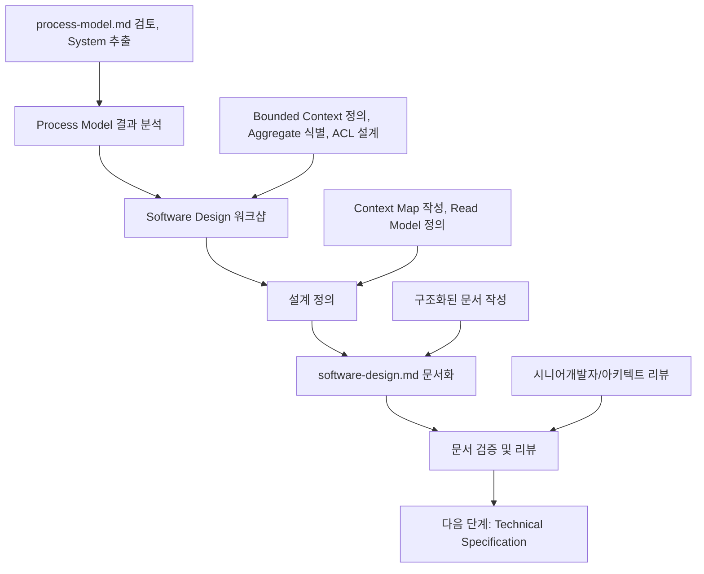

# Software Design 설계 가이드

이 문서는 **Process Model 결과**를 바탕으로 **Software Design**을 정의하고 **software-design.md 문서 작성**까지, 의사결정 참여자들이 순서대로 따라할 수 있는 **Software Design 전용 프로세스**를 설명합니다.

> 시작 전, `docs/event-domain-design/template/software-design-template.md` 파일을 복사해 도메인 전용 `software-design.md` 초안을 생성한 뒤, 아래 단계에 따라 내용을 채워 넣으세요.

---

## 🔁 Software Design 프로세스 한눈에 보기



Software Design은 **Process Model의 System**을 **구현 가능한 Aggregate와 Bounded Context**로 전환하는 핵심 단계입니다.

---

## Phase 1: Process Model 결과 분석 (담당: 시니어개발자)

### 1.1 사전 준비 - 완료된 Process Model 확인

#### 필수 전제 조건:
- [ ] process-model.md 문서가 완성되어 있음
- [ ] Process Model 워크샵이 완료되어 도메인전문가의 승인을 받음
- [ ] 모든 핵심 시나리오가 정의되어 있음
- [ ] External System이 명확히 식별되어 있음

#### Process Model 결과물 검토:
```bash
# Process Model 문서 확인
cat docs/event-domain-design/domains/<domain-name>/process-model.md

# 주요 확인 포인트:
# - 정의된 모든 System들
# - External System과의 통합점
# - 핵심 비즈니스 규칙(Policy)
# - Command와 Event 흐름
```

### 1.2 System 목록 추출 및 분석

#### System 목록화:
Process Model에 등장하는 모든 `System`을 추출하고 분류합니다.

**분류 기준**:
- **내부 System**: 우리가 구현하는 시스템
- **외부 도메인 System**: 다른 도메인의 시스템
- **External System**: 서드파티 시스템
- **Frontend System**: 프론트엔드 처리

#### 예시 결과:
```markdown
| System 이름 | 유형 | 받는 Command | 발생시키는 Event | 비고 |
| ----------- | ---- | ------------ | ----------------- | ---- |
| Workspace System | 내부 | Create Workspace | Workspace Created | 핵심 Aggregate 후보 |
| Page System | 내부 | Move Page | Page Moved | 핵심 Aggregate 후보 |
| Clerk System | External | Sync Organization | Organization Synced | ACL 필요 |
| User-Management - User System | 외부 도메인 | - | User Created | 이벤트 구독 |
```

### 1.3 템플릿 파일 준비
```bash
# Software Design 템플릿 복사 (아직 없다면)
cp docs/event-domain-design/template/software-design-template.md docs/event-domain-design/domains/<domain-name>/software-design.md
```

---

## Phase 2: Software Design 워크샵 진행 (담당: 시니어개발자 + 아키텍트)

### 2.1 워크샵 참여자 및 구조

#### 필수 참여자:
- **시니어 개발자** (리드): 도메인 설계 및 Aggregate 정의
- **아키텍트** (있는 경우): 시스템 간 통합 및 Context Map 설계
- **도메인 전문가**: 비즈니스 규칙 및 불변식 검증

#### 권장 참여자:
- **주니어 개발자**: 구현 관점에서의 질문 및 학습
- **PM**: 비즈니스 우선순위 확인

#### 워크샵 시간 배분 (2-3시간):
```
- Phase 1: Bounded Context 정의 (30-40분)
- Phase 2: Aggregate 및 Invariant 정의 (60분)
- Phase 3: ACL 및 Context Map 설계 (40-50분)
- 휴식 및 정리 (15-30분)
```

### 2.2 Phase 1: Bounded Context 정의 (30-40분)

**목표**: Process Model의 System들을 기반으로 Bounded Context를 정의합니다.

#### 진행 방법:
1. **System 그룹화**: 유사한 언어와 데이터 모델을 사용하는 System들을 묶습니다.
2. **Context 경계 설정**: 각 그룹의 명확한 책임과 경계를 정의합니다.
3. **Core/Supporting/Generic 분류**: 비즈니스 가치에 따라 Context를 분류합니다.

#### Bounded Context 식별 기준:
- **동일한 유비쿼터스 언어**: 같은 비즈니스 용어와 개념 사용
- **강한 응집성**: 내부 요소들이 밀접하게 연결
- **약한 결합성**: 다른 Context와의 의존성 최소화
- **명확한 책임**: 하나의 명확한 비즈니스 책임

#### 예시 결과:
```markdown
### Workspace Structure Context (Core Domain)
- **책임**: 워크스페이스와 페이지 계층 구조 관리
- **포함 System**: 
  - Workspace System
  - Page System
  - Trash System
- **도메인 언어**: Workspace, Page, 계층 구조, 휴지통, 복원
- **외부 연동**: 
  - User Management Context (사용자 권한)
  - Clerk (조직 동기화, ACL 필요)

### Organization Management Context (Core Domain)
- **책임**: 조직 및 멤버십 관리
- **포함 System**:
  - Organization System
  - Member System
  - Invitation System
- **도메인 언어**: Organization, Member, Role, Invitation
- **외부 연동**: 
  - Clerk (SSOT, ACL 필요)
```

### 2.3 Phase 2: Aggregate 및 Invariant 정의 (60분)

**목표**: 각 Bounded Context 내에서 일관성을 유지해야 하는 Aggregate를 정의하고 불변식을 명시합니다.

#### 진행 방법:
1. **Aggregate 후보 선정**: Process Model의 System을 Aggregate로 전환합니다.
2. **Command/Event 매핑**: 각 Aggregate가 처리하는 Command와 발행하는 Event를 정리합니다.
3. **Invariant 도출**: 비즈니스 규칙(Policy)에서 불변식을 추출합니다.
4. **Aggregate 경계 검증**: 트랜잭션 경계와 일관성 범위를 확인합니다.

#### Aggregate 식별 기준:
- **트랜잭션 일관성**: 함께 변경되어야 하는 데이터의 범위
- **비즈니스 불변식**: 반드시 지켜야 할 비즈니스 규칙
- **독립적 라이프사이클**: 다른 Aggregate와 독립적으로 생성/수정/삭제
- **명확한 루트 엔티티**: Aggregate를 대표하는 Root Entity 존재

#### Aggregate 정의 패턴:
```markdown
### [Aggregate Name] Aggregate

**Root Entity**: [Entity Name] (식별자: [ID Type])

**Commands** (Process Model의 Command 매핑):
- [Command 1]: [설명]
- [Command 2]: [설명]

**Events** (Process Model의 Event 매핑):
- [Event 1]: [발생 조건]
- [Event 2]: [발생 조건]

**Invariants** (반드시 지켜야 할 비즈니스 규칙):
- [불변식 1]: [설명]
- [불변식 2]: [설명]

**포함 엔티티**:
- [Entity 1]: [관계 설명]
- [Entity 2]: [관계 설명]
```

#### 예시 결과:
```markdown
### Workspace Aggregate

**Root Entity**: Workspace (식별자: WorkspaceId)

**Commands**:
- CreateWorkspace: 새로운 워크스페이스 생성
- DeleteWorkspace: 워크스페이스 삭제 (휴지통 이동)
- RestoreWorkspace: 휴지통에서 워크스페이스 복원
- PermanentlyDeleteWorkspace: 워크스페이스 영구 삭제

**Events**:
- WorkspaceCreated: 워크스페이스가 생성됨
- WorkspaceDeleted: 워크스페이스가 삭제됨 (휴지통)
- WorkspaceRestored: 워크스페이스가 복원됨
- WorkspacePermanentlyDeleted: 워크스페이스가 영구 삭제됨

**Invariants**:
- Workspace는 반드시 하나의 Organization에 속한다
- Free 플랜에서는 Organization당 최대 5개만 생성 가능
- 삭제된 Workspace는 30일 후 자동으로 영구 삭제됨
- Workspace 이름은 Organization 내에서 고유해야 함

**포함 엔티티**:
- Page (Root): 워크스페이스 내 페이지 계층 구조
```

#### Invariant 도출 가이드:
Process Model의 **System 비즈니스 로직**과 **Policy**에서 불변식을 추출합니다.

**Process Model의 Policy 예시**:
```markdown
**System**: Organization System
- "소유자는 단 1명만 존재해야 함"
- "최소 1명의 멤버가 있어야 조직 삭제 가능"
- "Free 플랜은 최대 5명까지만 초대 가능"
```

**→ Invariant로 전환**:
```markdown
**Invariants**:
- Organization에는 정확히 1명의 Owner가 존재해야 함
- Organization 삭제 시 모든 멤버가 제거되어야 함
- Free 플랜 조직은 최대 5명의 멤버만 가질 수 있음
```

### 2.4 Phase 3: ACL 및 Context Map 설계 (40-50분)

**목표**: External System과의 통합을 위한 ACL을 설계하고, Context 간 관계를 Context Map으로 정의합니다.

#### Part 1: Anti-Corruption Layer (ACL) 설계

**진행 방법**:

1. **Process Model에서 External System 추출**:
   ```markdown
   | External System | 연동 Context | 통합 목적 | 데이터 흐름 |
   | --------------- | ------------ | -------- | ---------- |
   | Supabase Auth   | User Management | 사용자 인증 | userId → User Profile |
   | Clerk           | Organization | 조직 관리 | orgId → Organization |
   ```

2. **ACL 필요성 판단**:
   - ✅ 외부 시스템의 모델이 우리 도메인 모델과 다를 때
   - ✅ 외부 시스템의 변경으로부터 도메인을 보호해야 할 때
   - ✅ 외부 시스템의 복잡성을 내부에 전파하지 않아야 할 때

3. **ACL 인터페이스 설계**:

   **외부 인터페이스 정의**:
   ```typescript
   // 외부 시스템의 실제 인터페이스
   interface ClerkOrganization {
     id: string;
     name: string;
     createdBy: string;
   }
   ```

   **도메인 모델 정의**:
   ```typescript
   // 우리 도메인의 Organization 모델
   interface Organization {
     organizationId: OrganizationId;
     name: OrganizationName;
     ownerId: UserId;
   }
   ```

   **ACL 구현 패턴**:
   ```typescript
   // Anti-Corruption Layer
   class ClerkOrganizationAdapter {
     async syncOrganization(clerkOrg: ClerkOrganization): Promise<Organization> {
       return this.toDomainOrganization(clerkOrg); // 변환
     }
   }
   ```

4. **ACL 문서화**:

   ```markdown
   ### Anti-Corruption Layers
   
   #### Clerk Organization ACL
   - **목적**: Clerk의 Organization 모델을 도메인 Organization 모델로 변환
   - **위치**: `src/domains/organization/infrastructure/ClerkAdapter.ts`
   - **변환 규칙**:
     - `clerk.id` → `OrganizationId`
     - `clerk.name` → `OrganizationName` (Value Object)
     - `clerk.createdBy` → `ownerId`
   - **에러 처리**: Clerk Webhook 실패 시 재시도 로직
   
   #### Supabase Auth ACL
   - **목적**: Supabase Auth의 사용자 모델을 도메인 User 모델로 변환
   - **위치**: `src/domains/user/infrastructure/SupabaseAuthAdapter.ts`
   - **변환 규칙**:
     - `supabase.id` → `UserId`
     - `supabase.email` → `Email` (Value Object)
   - **에러 처리**: Supabase 에러를 도메인 에러로 변환
   ```

#### Part 2: Context Map 작성

**진행 방법**:

1. **Context 간 관계 식별**: Event Storming에서 파악한 Context 간 기본 관계를 구체화합니다.
2. **통합 패턴 선택**: 각 관계에 적용할 DDD 통합 패턴을 결정합니다.
3. **통합 지점 명시**: 구체적인 인터페이스와 데이터 흐름을 정의합니다.
4. **순환 의존성 검증**: Context 간 순환 참조가 없는지 확인합니다.

**DDD 통합 패턴**:
- **Shared Kernel**: 공유 모델 (신중하게 사용)
- **Customer-Supplier**: 명확한 공급자-소비자 관계
- **Conformist**: 상위 Context의 모델을 그대로 따름
- **Anti-Corruption Layer (ACL)**: 하위 Context가 보호 레이어 구축
- **Published Language**: 공개된 표준 인터페이스
- **Open Host Service**: 다수의 클라이언트를 위한 공개 서비스

**Context Map 작성 템플릿**:

```markdown
## Context Map

### Context Relationships

User Management Context (Upstream)
        ↓ [Customer-Supplier + ACL]
Organization Management Context (Downstream)
        ↓ [Published Language: Event Bus]
Workspace Structure Context

### Integration Points

**User Management → Organization Management**:
- **패턴**: Customer-Supplier + ACL
- **방향**: User Management (Upstream) → Organization (Downstream)
- **인터페이스**: `createDefaultOrganization(userId: UserId)`
- **통합 방식**: Server Action 직접 호출
- **보호**: OrganizationService가 ACL 역할
- **이벤트**: `UserCreated` → `OrganizationCreated`

**Organization Management → Workspace Structure**:
- **패턴**: Customer-Supplier
- **방향**: Organization (Upstream) → Workspace (Downstream)
- **인터페이스**: `createDefaultWorkspace(orgId: OrganizationId)`
- **통합 방식**: Service Layer 호출
- **이벤트**: `OrganizationCreated` → `WorkspaceCreated`
```

**Context Map 검증 체크리스트**:
- [ ] 순환 의존성이 없는가? (Context A → B → A는 ❌)
- [ ] Single Source of Truth가 명확한가?
- [ ] 외부 시스템은 모두 ACL로 보호되는가?
- [ ] 각 통합 지점의 에러 처리 전략이 정의되었는가?

---

## Phase 3: software-design.md 문서 작성 (담당: 시니어개발자)

### 3.1 문서 구조 및 작성 순서

복사한 템플릿을 기반으로 다음 순서로 작성합니다:

#### 1. 📊 Software Design Overview
- 도메인의 설계 개요
- Process Model과의 연결점
- 주요 설계 결정사항

#### 2. 🔷 Bounded Context 정의
- 워크샵에서 정의된 Bounded Context들
- 각 Context의 책임과 포함된 Aggregate
- Core/Supporting/Generic 분류

#### 3. 📦 Aggregate 상세 정의
- 각 Aggregate의 상세 스펙
- Root Entity, Command, Event, Invariant
- Process Model의 System과의 매핑

#### 4. 🛡️ Anti-Corruption Layer
- External System별 ACL 설계
- 변환 규칙 및 에러 처리

#### 5. 🗺️ Context Map
- Context 간 관계 다이어그램
- 통합 패턴 및 통합 지점 상세

#### 6. 📖 Read Models
- 조회 모델 정의
- 데이터 구조 및 최적화 전략

#### 7. ✅ 검증 체크리스트 및 성과 측정

### 3.2 Read Model 정의 가이드

**목표**: Process Model의 Read Model을 구체적인 데이터 구조로 전환합니다.

#### 진행 방법:
1. **사용자 시나리오 검토**: Process Model의 Read Model 섹션을 모두 수집합니다.
2. **조회 단위 설계**: 화면/기능별로 필요한 데이터 단위를 정의합니다.
3. **데이터 구조 설계**: TypeScript Interface 형태로 명시합니다.
4. **최적화 전략**: 성능 고려사항과 캐싱 전략을 기록합니다.

#### Read Model 정의 패턴:
```typescript
// 조회 모델 인터페이스
interface WorkspaceStructureView {
  workspaceId: WorkspaceId;
  name: string;
  pageTree: PageTreeNode[];
  deletedAt?: Date;
}

interface PageTreeNode {
  id: PageId;
  title: string;
  children: PageTreeNode[];
  depth: number;
  lastModified: Date;
}
```

#### 문서화 예시:
```markdown
### WorkspaceStructureView

**목적**: 워크스페이스 사이드바에서 페이지 계층 구조 표시

**데이터 구조**:
- workspaceId: 워크스페이스 식별자
- name: 워크스페이스 이름
- pageTree: 페이지 계층 구조 (재귀적)

**최적화**:
- 페이지 트리는 Redis에 캐싱 (TTL: 5분)
- 1000개 이상 페이지 시 가상 스크롤링 적용
- 페이지 이동/생성/삭제 시 캐시 무효화

**조회 빈도**: 높음 (사용자 접속 시마다)
```

### 3.3 품질 검증 체크리스트

#### 일관성 검증:
- [ ] Process Model의 모든 System이 Aggregate로 매핑되었는가?
- [ ] Event Storm의 Context 경계와 Bounded Context가 일치하는가?
- [ ] Process Model의 External System이 모두 ACL로 보호되는가?
- [ ] Read Model이 실제 사용자 시나리오를 커버하는가?

#### 완전성 검증:
- [ ] 모든 Bounded Context가 정의되었는가?
- [ ] 각 Aggregate의 Invariant가 명확히 정의되었는가?
- [ ] Context 간 통합 방식이 명확한가?
- [ ] ACL의 변환 규칙이 구체적으로 정의되었는가?

#### 실용성 검증:
- [ ] Technical Specification 작성을 위한 충분한 정보가 있는가?
- [ ] 구현팀이 이해할 수 있을 정도로 구체적인가?
- [ ] 순환 의존성이 없는가?

---

## Phase 4: 문서 검증 및 리뷰 (담당: 전체 참여자)

### 4.1 리뷰 단계별 체크포인트

#### 시니어개발자 리뷰:
- [ ] Aggregate 경계가 합리적으로 정의되었는가?
- [ ] Invariant가 구현 가능한가?
- [ ] Context Map의 통합 패턴이 적절한가?
- [ ] ACL 설계가 외부 시스템 변경을 충분히 보호하는가?

#### 아키텍트 리뷰 (있는 경우):
- [ ] 전체 시스템 아키텍처와 일관성이 있는가?
- [ ] Context 간 결합도가 적절한가?
- [ ] 확장성을 고려한 설계인가?
- [ ] 기술적 부채가 최소화되었는가?

#### 도메인전문가 리뷰:
- [ ] 비즈니스 규칙(Invariant)이 정확한가?
- [ ] 도메인 언어가 일관되게 사용되었는가?
- [ ] 예외 상황이 적절히 고려되었는가?

#### PM 리뷰:
- [ ] 비즈니스 요구사항이 설계에 반영되었는가?
- [ ] 우선순위가 적절히 반영되었는가?

### 4.2 Process Model ↔ Software Design 일관성 검증

#### 필수 검증 포인트:
- [ ] Process Model의 모든 System이 Aggregate 또는 Service로 전환되었는가?
- [ ] Process Model의 Policy가 Invariant로 전환되었는가?
- [ ] Process Model의 External System이 ACL로 보호되는가?
- [ ] 동일한 도메인 언어가 일관되게 사용되고 있는가?

---

## ✅ Software Design 완료 기준

다음 모든 조건이 충족되어야 Software Design이 완료된 것으로 간주합니다:

### 워크샵 완료 기준:
- [ ] 모든 Bounded Context가 정의됨
- [ ] 각 Context의 Aggregate와 Invariant가 명확히 정의됨
- [ ] External System에 대한 ACL 설계 완료
- [ ] Context Map이 작성되고 통합 패턴이 명시됨

### 문서 완료 기준:
- [ ] software-design.md의 모든 필수 섹션이 작성됨
- [ ] Process Model과의 일관성이 확인됨
- [ ] 시니어개발자와 아키텍트의 검증 완료
- [ ] Technical Specification 작성을 위한 충분한 정보 확보
- [ ] Git에 체계적으로 커밋되고 PR이 승인됨

---

## 🚀 다음 단계: Technical Specification으로 연결

Software Design이 완료되면 다음 단계를 진행할 수 있습니다:

### Technical Specification 작성 준비:
1. **Technical Specification 가이드 참조**: `docs/event-domain-design/guide/technical-specification-guide.md`
2. **Aggregate를 구현 모듈로 전환**: Software Design의 Aggregate들이 실제 코드 구조가 됨
3. **워크샵 참여자 조정**: 시니어개발자 + 주니어개발자 중심으로

### 연결 정보:
- **입력**: 완성된 software-design.md + process-model.md
- **출력**: technical-specification.md
- **다음 담당자**: 시니어개발자 (계속 유지)

### Technical Specification에서 해결될 사항:
- **디렉토리 구조**: 실제 파일 및 폴더 구조
- **구현 세부사항**: 각 Aggregate의 구현 방법
- **데이터베이스 스키마**: 실제 테이블 및 인덱스 설계
- **API 엔드포인트**: REST/GraphQL 엔드포인트 정의

---

## 📚 관련 문서 및 템플릿

### 참조 가이드:
- [Process Model 가이드](./02-process-model-guide.md)
- [Technical Specification 가이드](./05-technical-specification-guide.md)

### 템플릿 파일:
- [Software Design 템플릿](../template/software-design-template.md)

### 예시 문서:
- [Organization Management Domain 예시](../domains/organization-management-domain/software-design.md)

---

## 💡 성공을 위한 핵심 팁

### 워크샵 성공 팁:
- **시니어개발자 주도**: DDD 패턴과 아키텍처 관점에서 설계 리드
- **Process Model 기반**: System을 Aggregate로 전환하는 명확한 매핑
- **Invariant 중심**: 비즈니스 규칙을 불변식으로 명확히 정의
- **ACL 우선 설계**: 외부 시스템 통합을 먼저 해결

### 문서화 성공 팁:
- **구체적 Invariant**: 검증 가능하고 테스트 가능한 불변식 작성
- **명확한 Context 경계**: 각 Context의 책임이 중첩되지 않도록
- **Process Model 연결성**: Process Model의 결과와 일관성 유지
- **구현 가능성**: Technical Specification으로 연결될 수 있는 구체성

### 주의사항:
- **과도한 추상화 지양**: 구현 가능한 수준의 구체성 유지
- **Aggregate 크기 적절히**: 너무 크지도 작지도 않게 (트랜잭션 경계 고려)
- **순환 의존성 제거**: Context Map 작성 시 반드시 확인
- **ACL의 명확한 책임**: 외부 시스템 변경으로부터 도메인 완전 보호