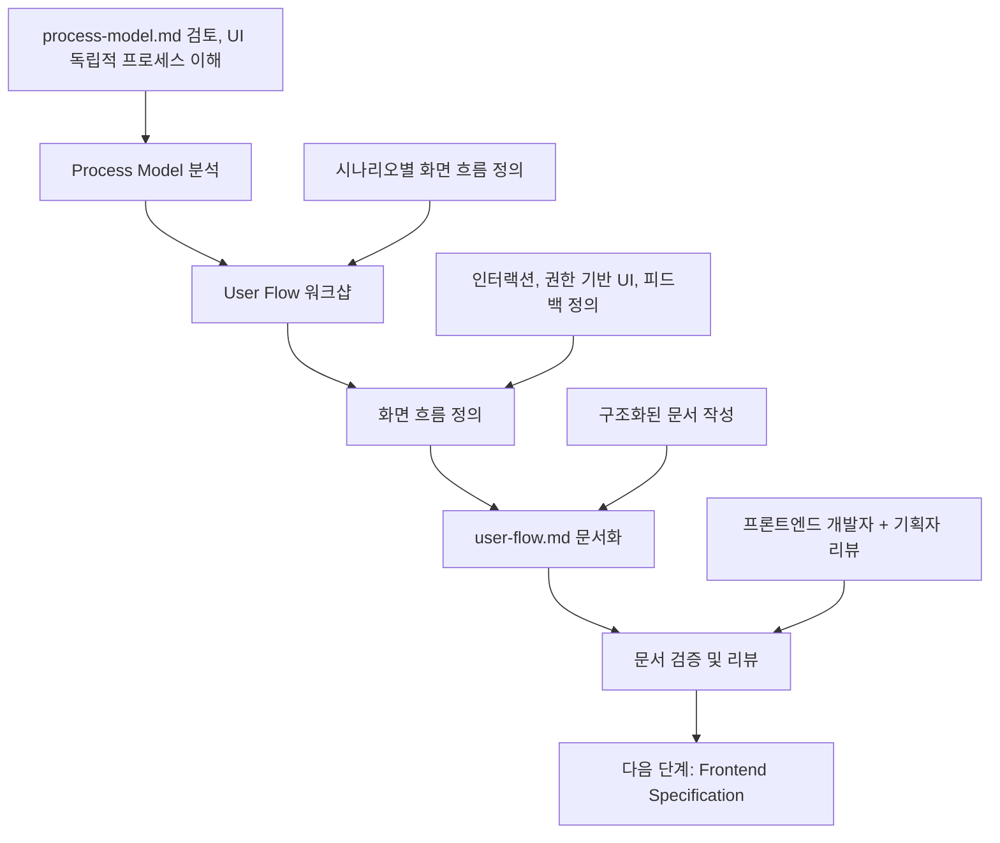

# User Flow 정의 가이드

이 문서는 **Process Model 결과**를 바탕으로 **User Flow**를 정의하고 **user-flow.md 문서 작성**까지, UX/UI 디자이너와 기획자가 순서대로 따라할 수 있는 **User Flow 전용 프로세스**를 설명합니다.

> 시작 전, `docs/event-domain-design/template/03-user-flow-template.md` 파일을 복사해 도메인 전용 `user-flow.md` 초안을 생성한 뒤, 아래 단계에 따라 내용을 채워 넣으세요.

---

## 🔁 User Flow 프로세스 한눈에 보기



User Flow는 **Process Model의 비즈니스 프로세스**를 **실제 사용자가 경험하는 화면 흐름**으로 전환하는 핵심 단계입니다.

---

## 🎯 User Flow의 목적

### Process Model vs User Flow

| 관점 | Process Model | User Flow |
|------|---------------|-----------|
| **관심사** | 비즈니스 프로세스 | 사용자 경험 |
| **추상화** | 높음 (UI 독립적) | 낮음 (구체적 화면 흐름) |
| **대상** | 도메인 전문가, 개발자 | UX/UI 디자이너, 사용자 |
| **예시** | "권한 기반 옵션 제공" | "드롭다운 메뉴에 관리자/멤버 옵션 표시" |

### User Flow의 역할

1. **Process Model의 구체화**: UI 독립적 프로세스를 실제 화면으로 전환
2. **UX 최적화**: 사용자 경험 중심의 화면 흐름 설계
3. **개발 가이드**: Frontend Specification의 입력 문서
4. **커뮤니케이션 도구**: 기획자, 디자이너, 개발자 간 협업 문서

---


## Phase 1: Process Model 분석 (담당: UX/UI 디자이너 + 기획자)

### 1.1 사전 준비 - 완료된 Process Model 확인

#### 필수 전제 조건:
- [ ] process-model.md 문서가 완성되어 있음
- [ ] Process Modeling 워크샵이 완료되어 승인을 받음
- [ ] 핵심 시나리오가 정의되어 있음
- [ ] Process Model 워크샵에 참여했거나, 문서를 충분히 이해함

#### Process Model 결과물 검토:
```bash
# Process Model 문서 확인
cat docs/event-domain-design/domains/<domain-name>/process-model.md

# 주요 확인 포인트:
# - 핵심 시나리오 목록
# - 각 시나리오의 Read Model (사용자에게 제공되는 정보)
# - Policy (비즈니스 규칙, UI 필터링에 영향)
# - Command (사용자 액션)
```

### 1.2 핵심 시나리오 및 UI 요구사항 파악

#### 각 시나리오에서 확인할 사항:

1. **Read Model 분석**:
   - 사용자에게 어떤 정보를 보여줘야 하는가?
   - 권한에 따라 다르게 표시되는 정보는 무엇인가?
   - 선택 옵션, 폼 필드, 상태 표시 등

2. **Policy 분석**:
   - 권한 기반 UI 필터링이 필요한가?
   - 조건부로 표시/숨김되는 UI 요소는 무엇인가?
   - 사용자 피드백이 필요한 시점은 언제인가?

3. **Command 분석**:
   - 사용자가 어떤 액션을 수행하는가?
   - 어떤 정보를 입력해야 하는가?
   - 확인/취소가 필요한가?

4. **Event 분석**:
   - 성공/실패 시 사용자에게 어떤 피드백을 주는가?
   - 화면 전환이 필요한가?
   - 다음 단계로 이어지는가?

### 1.3 템플릿 파일 준비
```bash
# User Flow 템플릿 복사 (아직 없다면)
cp docs/event-domain-design/template/03-user-flow-template.md docs/event-domain-design/domains/<domain-name>/user-flow.md
```

---

## Phase 2: User Flow 워크샵 진행 (담당: UX/UI 디자이너 + 기획자)

### 2.1 워크샵 참여자 및 구조

#### 필수 참여자:
- **UX/UI 디자이너** (리드): 화면 흐름 및 인터랙션 설계
- **기획자**: 사용자 요구사항 및 비즈니스 우선순위 확인
- **프론트엔드 개발자**: 기술적 실현 가능성 검토

#### 권장 참여자:
- **PM**: 비즈니스 우선순위 및 요구사항 확인
- **도메인 전문가**: 비즈니스 규칙 검증

#### 워크샵 시간 배분 (2-3시간):
```
- Phase 1: 시나리오별 화면 목록 정의 (30분)
- Phase 2: 화면별 UI 요소 및 인터랙션 정의 (60분)
- Phase 3: 권한 기반 UI 및 에러 처리 정의 (45분)
- 휴식 및 정리 (15-30분)
```

### 2.2 Phase 1: 시나리오별 화면 목록 정의 (30분)

**목표**: Process Model의 각 시나리오를 화면 단위로 분해

#### 진행 방법:
1. **Process Model 시나리오 순서대로 진행**
2. **각 시나리오를 화면(Screen) 단위로 분해**
3. **화면 간 전환 흐름 정의**
4. **필수 화면과 선택적 화면 구분**

#### 화면 정의 기준:
- **화면 전환**: 사용자 인터랙션으로 다른 화면으로 이동
- **모달/다이얼로그**: 현재 화면 위에 표시되는 오버레이
- **인라인 UI**: 현재 화면 내에서 동적으로 표시되는 요소

#### 예시 (멤버 역할 변경 시나리오):
```markdown
Scenario 3: 멤버 역할 변경

Screen 1: 멤버 목록 화면
- 트리거: 사용자가 조직 설정 페이지 진입
- 역할: 멤버 목록 표시, 역할 배지 표시

Screen 2: 역할 변경 옵션 메뉴 (인라인 UI)
- 트리거: 역할 배지 클릭
- 역할: 권한 기반 필터링된 역할 옵션 표시

Screen 3: 역할 변경 확인 다이얼로그 (모달)
- 트리거: 옵션 선택
- 역할: 변경 확인 및 영향 설명

Screen 4: 결과 피드백 (Toast)
- 트리거: 확인 버튼 클릭
- 역할: 성공/실패 메시지 표시
```

### 2.3 Phase 2: 화면별 UI 요소 및 인터랙션 정의 (60분)

**목표**: 각 화면의 구체적인 UI 요소와 사용자 인터랙션 정의

#### 진행 방법:
1. **화면별로 순서대로 진행**
2. **UI 컴포넌트 목록 작성**
3. **사용자 인터랙션 정의 (클릭, 호버, 입력 등)**
4. **화면 전환 조건 명시**
5. **애니메이션/트랜지션 필요 여부 확인**

#### 각 화면에 대해 정의할 내용:

##### 1) 화면 구성 (Layout)
```markdown
**화면 구성**:
- 헤더: 페이지 제목, 네비게이션
- 본문: 주요 콘텐츠 영역
- 액션 영역: 버튼, 폼 등
```

##### 2) UI 컴포넌트 목록
```markdown
**UI 컴포넌트**:
- 멤버 테이블 (DataTable)
  - 컬럼: 이름, 이메일, 역할, 가입일
  - 각 행에 역할 배지 (Badge)
- 역할 배지 (Badge)
  - 클릭 가능한 상태 (권한 있는 경우)
  - 호버 시 커서 변경
```

##### 3) 인터랙션 정의
```markdown
**인터랙션**:
- 역할 배지 클릭 → 드롭다운 메뉴 표시
- 드롭다운 옵션 호버 → 하이라이트
- 드롭다운 옵션 클릭 → 확인 다이얼로그 표시
- 다이얼로그 외부 클릭 → 다이얼로그 닫기
- ESC 키 → 다이얼로그 닫기
```

##### 4) 화면 전환 조건
```markdown
**화면 전환 조건**:
- 조건: 옵션 선택
- 전환: Screen 2 → Screen 3
- 전환 방식: 모달 다이얼로그 표시
```

### 2.4 Phase 3: 권한 기반 UI 및 에러 처리 정의 (45분)

**목표**: 사용자 권한에 따른 UI 차이와 에러 처리 방법 정의

#### 권한 기반 UI 정의:

**Process Model의 Layered Authorization 반영**:
```markdown
**권한별 UI 차이**:
- **소유자**:
  - 모든 멤버의 역할 배지 클릭 가능
  - 옵션: "관리자", "멤버" 표시
  
- **어드민**:
  - 멤버의 역할 배지만 클릭 가능
  - 옵션: "관리자" (멤버→어드민 승격만)
  
- **일반 멤버**:
  - 역할 배지 클릭 불가 (view only)
  - 호버 효과 없음
```

#### 에러 처리 및 피드백:

```markdown
**성공 시**:
- Toast 메시지: "역할이 변경되었습니다"
- 목록 자동 업데이트 (역할 배지 변경)
- 다이얼로그 닫기

**실패 시**:
- Toast 메시지: "역할 변경에 실패했습니다: [에러 메시지]"
- 다이얼로그는 열린 상태 유지
- 확인 버튼 비활성화 (3초 후 재활성화)

**권한 부족**:
- 역할 배지 클릭 불가
- 호버 시 커서 변경 없음
- 클릭 시 아무 반응 없음 (또는 Toast: "권한이 없습니다")
```

---

## Phase 3: user-flow.md 문서 작성 (담당: UX/UI 디자이너)

### 3.1 문서 구조 및 작성 순서

복사한 템플릿을 기반으로 다음 순서로 작성합니다:

#### 1. 🎯 개요
- 도메인 소개
- Process Model 참조
- 문서 목적 및 범위

#### 2. 📍 Scenario N: [시나리오명]
각 시나리오별로:
- **비즈니스 컨텍스트**: Process Model 참조, 사용자 목표
- **Screen 1~N**: 화면별 상세 정의
  - 화면 구성
  - 권한별 UI 차이
  - 인터랙션
  - 애니메이션/트랜지션
- **에러 처리**: 실패 시나리오별 피드백

#### 3. 🎨 디자인 시스템 참조
- 사용하는 컴포넌트 라이브러리
- 색상, 타이포그래피, 스페이싱

#### 4. 📱 반응형 고려사항
- 데스크톱, 태블릿, 모바일별 UI 차이

#### 5. 🔗 다음 단계
- Frontend Specification으로 연결

### 3.2 화면(Screen) 작성 가이드

각 화면은 다음 구조를 일관되게 따릅니다:

```markdown
### Screen N: [화면명]

**화면 구성**:
- [레이아웃 설명]

**권한별 UI 차이** (있는 경우):
- **소유자**: [UI 요소 및 동작]
- **어드민**: [UI 요소 및 동작]
- **멤버**: [UI 요소 및 동작]

**인터랙션**:
- [사용자 액션] → [시스템 반응]

**애니메이션** (선택사항):
- [애니메이션 설명]

**접근성** (필요시):
- [접근성 고려사항]
```

### 3.3 Process Model과의 매핑

#### Read Model → UI 컴포넌트
```markdown
Process Model:
**Read Model**:
- 현재 멤버 정보
- 역할 옵션 (권한 기반 필터링)

↓

User Flow:
**UI 컴포넌트**:
- 멤버 정보 카드 (이름, 이메일, 프로필 이미지)
- 드롭다운 메뉴 (권한에 따라 옵션 필터링됨)
```

#### Policy → 권한별 UI 차이
```markdown
Process Model:
**Policy**: "권한 기반 옵션 메뉴를 계산하여 표시하기"
**Read Model**: 
- 소유자: "관리자", "멤버" 옵션
- 어드민: "관리자" 옵션 (조건부)

↓

User Flow:
**권한별 UI 차이**:
- **소유자**: 드롭다운에 "관리자", "멤버" 옵션 표시
- **어드민**: 드롭다운에 "관리자" 옵션만 표시 (대상이 멤버인 경우)
- **멤버**: 역할 배지 클릭 불가
```

#### Command → 사용자 인터랙션
```markdown
Process Model:
**Command**: 역할 변경 확인
- 역할 변경 확인 또는 취소

↓

User Flow:
**인터랙션**:
- 확인 버튼 클릭 → 역할 변경 API 호출 → 성공 Toast
- 취소 버튼 클릭 → 다이얼로그 닫기
- ESC 키 → 다이얼로그 닫기
```

### 3.4 품질 검증 체크리스트

#### 일관성 검증:
- [ ] 모든 Scenario가 동일한 구조로 작성되었는가?
- [ ] Process Model의 시나리오와 1:1 매핑되는가?
- [ ] 권한별 UI 차이가 명확히 정의되었는가?
- [ ] 화면 전환 흐름이 올바르게 구성되었는가?

#### 완전성 검증:
- [ ] 모든 화면의 UI 요소가 정의되었는가?
- [ ] 인터랙션이 구체적으로 명시되었는가?
- [ ] 에러 처리 방법이 정의되었는가?
- [ ] UI 요소가 구체적으로 설명되었는가?

#### 실용성 검증:
- [ ] 프론트엔드 개발자가 구현할 수 있을 만큼 구체적인가?
- [ ] UX 의도가 명확히 전달되는가?
- [ ] 반응형 고려사항이 포함되었는가?

---

## Phase 4: 문서 검증 및 리뷰 (담당: 전체 참여자)

### 4.1 리뷰 단계별 체크포인트

#### 프론트엔드 개발자 리뷰:
- [ ] 구현 가능한 수준으로 구체적인가?
- [ ] 기술적 제약사항이 고려되었는가?
- [ ] 반응형 고려사항이 충분한가?

#### 기획자 리뷰:
- [ ] 사용자 요구사항이 반영되었는가?
- [ ] 비즈니스 우선순위가 적절한가?
- [ ] UX가 직관적이고 효율적인가?

#### UX/UI 디자이너 리뷰:
- [ ] 디자인 시스템이 일관되게 적용되었는가?
- [ ] 접근성 고려사항이 포함되었는가?
- [ ] UI 요소가 명확히 정의되었는가?

### 4.2 Process Model ↔ User Flow 일관성 검증

#### 필수 검증 포인트:
- [ ] Process Model의 모든 시나리오가 User Flow에 반영되었는가?
- [ ] Read Model의 정보가 UI 컴포넌트로 전환되었는가?
- [ ] Policy의 권한 규칙이 UI에 반영되었는가?
- [ ] Command가 사용자 인터랙션으로 전환되었는가?

### 4.3 Git 커밋 및 PR 생성

```bash
# User Flow 문서 커밋
git add docs/event-domain-design/domains/<domain-name>/user-flow.md
git commit -m "docs(user-flow): define <domain-name> user flow

- Map Process Model scenarios to screen flows
- Define UI components and interactions
- Add permission-based UI variations
- Document error handling and feedback
- Prepare foundation for Frontend Specification"

# GitHub에 푸시 및 PR 생성
git push origin user-flow-<domain-name>
```

### 4.4 PR 리뷰 체크리스트

**승인 조건:**
- [ ] 프론트엔드 개발자가 구현 가능성을 승인
- [ ] 기획자가 사용자 요구사항 충족도를 승인
- [ ] UX/UI 디자이너가 디자인 일관성을 승인
- [ ] Process Model과의 일관성이 확인됨

---

## ✅ User Flow 완료 기준

다음 모든 조건이 충족되어야 User Flow가 완료된 것으로 간주합니다:

### 워크샵 완료 기준:
- [ ] 핵심 시나리오가 화면 흐름으로 정의됨
- [ ] 각 화면의 UI 요소와 인터랙션이 구체적으로 정의됨
- [ ] 권한별 UI 차이가 명확히 정의됨
- [ ] 에러 처리 및 피드백 방법이 정의됨

### 문서 완료 기준:
- [ ] user-flow.md의 모든 필수 섹션이 작성됨
- [ ] Process Model과의 일관성이 확인됨
- [ ] 모든 화면의 UI 요소가 구체적으로 정의됨
- [ ] 프론트엔드 개발자와 기획자의 검증 완료
- [ ] Git에 체계적으로 커밋되고 PR이 승인됨

---

## 🚀 다음 단계: Frontend Specification으로 연결

User Flow가 완료되면 다음 단계를 진행할 수 있습니다:

### Frontend Specification 작성 준비:
1. **Frontend Specification 가이드 참조**: `docs/event-domain-design/guide/04-frontend-specification-guide.md`
2. **User Flow를 React 컴포넌트로 전환**: User Flow의 화면들이 컴포넌트 후보가 됨
3. **담당자**: 프론트엔드 개발자

### 연결 정보:
- **입력**: 완성된 user-flow.md + process-model.md
- **출력**: frontend-specification.md
- **다음 담당자**: 프론트엔드 개발자

### Frontend Specification에서 다루는 사항:
- **React Context 설계**: 상태 관리
- **Custom Hooks**: 비즈니스 로직 캡슐화
- **UI 컴포넌트**: User Flow의 화면을 컴포넌트로 구현
- **Server Actions 연동**: Backend API 호출
- **DTO 직렬화**: 데이터 전달 형식

---

## 📚 관련 문서 및 템플릿

### 참조 가이드:
- [Process Model 가이드](./02-process-model-guide.md)
- [Frontend Specification 가이드](./04-frontend-specification-guide.md)

### 템플릿 파일:
- [User Flow 템플릿](../template/03-user-flow-template.md)

### 예시 문서:
- [Organization Management Domain 예시](../domains/organization-management-domain/03-user-flow.md) (작성 예정)

---

## 💡 성공을 위한 핵심 팁

### 워크샵 성공 팁:
- **UX/UI 디자이너 주도**: 사용자 경험 중심으로 설계
- **프론트엔드 개발자와 긴밀한 협업**: 기술적 실현 가능성 확보
- **Process Model 충실히 따르기**: 비즈니스 로직 이탈 방지
- **구체적 UI 명세**: 개발자가 이해할 수 있는 수준으로 상세히 작성

### 문서화 성공 팁:
- **구체적 UI 정의**: "드롭다운 메뉴", "모달 다이얼로그" 등 명확한 용어
- **권한별 UI 차이 명시**: Layered Authorization 반영
- **시각적 설명 추가**: 화면 구성을 텍스트로 상세히 설명
- **반응형 고려**: 다양한 디바이스에서의 UX

### 주의사항:
- **Process Model 벗어나지 않기**: UI는 바뀔 수 있지만 비즈니스 로직은 유지
- **과도한 구현 세부사항 지양**: 컴포넌트명, 상태 관리 방법 등은 Frontend Spec에서
- **일관된 디자인 시스템**: 기존 컴포넌트 라이브러리 활용

---

이 가이드를 따라하면 Process Model을 기반으로 체계적이고 사용자 중심의 User Flow를 정의할 수 있습니다! 🎨

