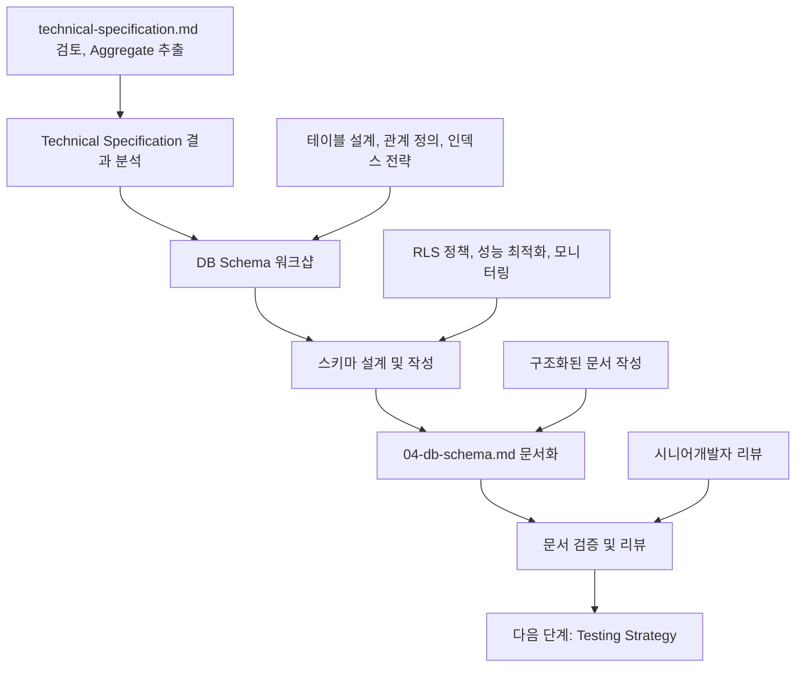

# DB Schema 작성 가이드

이 문서는 **Technical Specification 결과**를 바탕으로 **DB Schema**를 정의하고 **04-db-schema.md 문서 작성**까지, 의사결정 참여자들이 순서대로 따라할 수 있는 **DB Schema 전용 프로세스**를 설명합니다.

> 시작 전, `docs/event-domain-design/template/04-db-schema-template.md` 파일을 복사해 도메인 전용 `04-db-schema.md` 초안을 생성한 뒤, 아래 단계에 따라 내용을 채워 넣으세요.

---

## 🔁 DB Schema 프로세스 한눈에 보기



DB Schema는 **Technical Specification을 기반으로 DDD Aggregate를 데이터베이스 테이블로 전환**하고, **성능 최적화 및 RLS 정책을 정의**하는 핵심 단계입니다.

---

## Phase 1: Technical Specification 결과 분석 (담당: 시니어개발자)

### 1.1 사전 준비 - 완료된 Technical Specification 확인

#### 필수 전제 조건:
- [ ] 04-technical-specification.md 문서가 완성되어 있음
- [ ] Technical Specification 워크샵이 완료되어 시니어개발자의 승인을 받음
- [ ] 모든 DDD 컴포넌트의 수도코드가 작성되어 있음
- [ ] Repository 인터페이스가 정의되어 있음

#### Technical Specification 결과물 검토:
```bash
# Technical Specification 문서 확인
cat docs/event-domain-design/domains/<domain-name>/04-technical-specification.md

# 주요 확인 포인트:
# - 정의된 모든 Aggregate들
# - Repository 인터페이스와 메서드 시그니처
# - Command와 Event의 데이터 구조
# - Read Model 쿼리 패턴
```

### 1.2 Aggregate → 테이블 매핑 분석

#### Aggregate 매핑 분석:
Technical Specification에 정의된 모든 Aggregate를 검토하여 테이블 구조를 설계합니다.

**분석 항목**:
- **Aggregate Root**: 각 Aggregate의 루트 엔티티가 테이블이 됨
- **Value Objects**: 별도 테이블 vs 컬럼 저장 결정
- **Entities**: Aggregate 내부 엔티티의 저장 방식
- **Commands & Events**: 테이블 구조에 필요한 데이터 필드
- **Read Model**: 쿼리 패턴에 맞는 인덱스 설계

#### 예시 결과:
```markdown
| Aggregate | 테이블명 | 주요 필드 | 관계 | 인덱스 전략 |
|-----------|----------|-----------|------|-------------|
| Canvas Aggregate | canvases | id, page_id, react_flow_instance | pages 1:1 | page_id 인덱스 |
| BlockMount Aggregate | block_mounts | id, page_id, block_id, position | pages 1:N, blocks 1:N | 복합 인덱스 |
```

### 1.3 Process Model 시나리오 매핑 준비

#### Process Model 검토:
```bash
# Process Model 문서 확인
cat docs/event-domain-design/domains/<domain-name>/02-process-model.md

# 주요 확인 포인트:
# - 각 Scenario에서 사용되는 데이터 조회/생성 패턴
# - Read Model의 쿼리 복잡도
# - 성능이 중요한 시나리오 식별
```

#### 매핑 준비:
Process Model의 각 Scenario에서 필요한 데이터베이스 연산을 분석하여 테이블 설계를 준비합니다.

### 1.4 템플릿 파일 준비
```bash
# DB Schema 템플릿 복사 (아직 없다면)
cp docs/event-domain-design/template/04-db-schema-template.md docs/event-domain-design/domains/<domain-name>/04-db-schema.md
```

---

## Phase 2: DB Schema 워크샵 진행 (담당: 시니어개발자 + 주니어개발자)

### 2.1 워크샵 참여자 및 구조

#### 필수 참여자:
- **주니어개발자** (리드): 테이블 설계 및 스키마 작성
- **시니어개발자** (멘토): 설계 검증 및 성능 최적화
- **백엔드개발자**: Repository 구현 관점에서 검증

#### 권장 참여자:
- **DBA**: 성능 최적화 및 인덱스 전략
- **다른 주니어개발자**: 학습 및 페어 설계

#### 워크샵 시간 배분 (3-4시간):
```
- Phase 1: 테이블 설계 및 관계 정의 (90-120분)
- Phase 2: 인덱스 전략 및 성능 최적화 (60-90분)
- Phase 3: RLS 정책 및 보안 설계 (60-90분)
- Phase 4: 모니터링 및 유지보수 계획 (30분)
- 휴식 및 정리 (15-30분)
```

### 2.2 Phase 1: 테이블 설계 및 관계 정의 (90-120분)

**목표**: Technical Specification의 Aggregate를 데이터베이스 테이블로 매핑하고 관계를 정의합니다.

#### Part 1: Enum 타입 정의 (20-30분)

**Enum 설계 예시**:
```sql
-- 상태 관련 enum
CREATE TYPE user_status AS ENUM (
    'ACTIVE',      -- 활성 사용자
    'INACTIVE',    -- 비활성 사용자
    'SUSPENDED'    -- 정지된 사용자
);

-- 권한 관련 enum  
CREATE TYPE user_role AS ENUM (
    'ADMIN',       -- 관리자
    'USER',        -- 일반 사용자
    'VIEWER'       -- 조회 전용
);
```

**설계 포인트**:
- Aggregate 내 Value Object의 제한된 값들을 enum으로 정의
- 비즈니스 규칙이 변경될 가능성을 고려한 확장성
- 명확한 주석으로 각 값의 의미 설명

#### Part 2: 핵심 테이블 설계 (40-50분)

**테이블 설계 예시**:
```sql
CREATE TABLE users (
    -- Primary Key
    id UUID PRIMARY KEY DEFAULT gen_random_uuid(),
    
    -- User Info Fields
    email TEXT NOT NULL,
    name TEXT NOT NULL,
    status user_status NOT NULL DEFAULT 'ACTIVE',
    
    -- Foreign Keys
    organization_id UUID NOT NULL REFERENCES organizations(id) ON DELETE CASCADE,
    
    -- Audit Fields
    created_at TIMESTAMPTZ NOT NULL DEFAULT NOW(),
    updated_at TIMESTAMPTZ NOT NULL DEFAULT NOW(),
    deleted_at TIMESTAMPTZ, -- 소프트 삭제
    
    -- Constraints
    CONSTRAINT users_email_length CHECK (LENGTH(TRIM(email)) BETWEEN 1 AND 255),
    CONSTRAINT users_email_format CHECK (email ~* '^[A-Za-z0-9._%-]+@[A-Za-z0-9.-]+[.][A-Za-z]+$'),
    CONSTRAINT users_name_length CHECK (LENGTH(TRIM(name)) BETWEEN 1 AND 100),
    CONSTRAINT users_unique_email UNIQUE (email) WHERE deleted_at IS NULL
);
```

**설계 포인트**:
- Aggregate Root → 테이블 매핑
- Value Object → 컬럼 vs 별도 테이블 결정
- 제약조건으로 비즈니스 불변식 반영
- 소프트 삭제 vs 하드 삭제 결정
- Foreign Key 관계 및 CASCADE 정책

#### Part 3: 관계 테이블 및 조인 테이블 (20-30분)

**관계 테이블 예시**:
```sql
-- 다대다 관계 테이블
CREATE TABLE workspace_members (
    -- Composite Primary Key
    workspace_id UUID NOT NULL REFERENCES workspaces(id) ON DELETE CASCADE,
    user_id UUID NOT NULL REFERENCES users(id) ON DELETE CASCADE,
    
    -- Audit Fields
    joined_at TIMESTAMPTZ NOT NULL DEFAULT NOW(),
    
    -- Primary Key
    PRIMARY KEY (workspace_id, user_id)
);

-- 계층 구조 테이블 (Self-referencing)
CREATE TABLE pages (
    id UUID PRIMARY KEY DEFAULT gen_random_uuid(),
    workspace_id UUID NOT NULL REFERENCES workspaces(id) ON DELETE CASCADE,
    parent_id UUID REFERENCES pages(id) ON DELETE CASCADE, -- Self-referencing
    
    -- Hierarchy Fields
    title TEXT NOT NULL,
    depth INTEGER NOT NULL DEFAULT 0,
    "order" INTEGER NOT NULL DEFAULT 0,
    
    -- Constraints
    CONSTRAINT pages_depth_consistency CHECK (
        (parent_id IS NULL AND depth = 0) OR (parent_id IS NOT NULL AND depth > 0)
    )
);
```

**설계 포인트**:
- 다대다 관계 처리 방법 (조인 테이블 vs 복합 키)
- 계층 구조 처리 (Adjacency List vs Materialized Path vs Nested Set)
- 순환 참조 방지 전략
- 삭제 시 고아 데이터 처리 정책

### 2.3 Phase 2: 인덱스 전략 및 성능 최적화 (60-90분)

**목표**: Process Model의 Read Model 쿼리 패턴을 분석하여 성능 최적화를 위한 인덱스를 설계합니다.

#### Part 1: Read Model 분석 (20-30분)

**쿼리 패턴 분석**:
```sql
-- Scenario 1: 사용자별 Workspace 목록 조회
SELECT * FROM workspaces WHERE organization_id = $1;
CREATE INDEX idx_workspaces_org_id ON workspaces(organization_id) WHERE deleted_at IS NULL;

-- Scenario 2: Workspace별 Page 트리 조회 (재귀 CTE)
CREATE INDEX idx_pages_tree_query ON pages(workspace_id, depth, "order") WHERE deleted_at IS NULL;

-- Scenario 3: 사용자 멤버십 확인
SELECT 1 FROM workspace_members WHERE workspace_id = $1 AND user_id = $2;
CREATE INDEX idx_workspace_members_lookup ON workspace_members(workspace_id, user_id);
```

**최적화 포인트**:
- Repository 메서드의 쿼리 패턴 분석
- WHERE 조건, ORDER BY, JOIN 패턴 식별
- 복합 인덱스 vs 단일 인덱스 결정
- 부분 인덱스 활용 (deleted_at IS NULL 등)

#### Part 2: 복합 인덱스 설계 (20-30분)

**복합 인덱스 예시**:
```sql
-- 멀티 컬럼 인덱스 (자주 함께 조회되는 컬럼)
CREATE INDEX idx_pages_workspace_tree ON pages(workspace_id, depth, "order") 
WHERE deleted_at IS NULL;

-- 조건부 인덱스 (특정 조건에서만 인덱스 적용)
CREATE INDEX idx_workspaces_default ON workspaces(organization_id, is_default) 
WHERE is_default = true;

-- 표현식 인덱스 (계산된 값 인덱스)
CREATE INDEX idx_users_email_lower ON users(LOWER(email)) WHERE deleted_at IS NULL;
```

**설계 포인트**:
- 컬럼 순서: 선택도(selectivity)가 높은 컬럼부터
- 쿼리 패턴과 인덱스 순서 일치
- 부분 인덱스로 저장 공간 절약
- 인덱스 유지 비용 vs 조회 성능 트레이드오프

#### Part 3: 쿼리 성능 검증 (20-30분)

**성능 측정 쿼리**:
```sql
-- EXPLAIN ANALYZE로 실행 계획 확인
EXPLAIN (ANALYZE, BUFFERS) 
SELECT * FROM pages 
WHERE workspace_id = $1 AND depth = 0 
ORDER BY "order";

-- 느린 쿼리 모니터링
SELECT 
    query,
    calls,
    total_time,
    mean_time,
    rows
FROM pg_stat_statements 
WHERE query LIKE '%pages%'
ORDER BY total_time DESC;
```

**검증 포인트**:
- Index Scan vs Seq Scan 확인
- 인덱스 사용률 모니터링
- 쿼리 실행 시간 측정
- 메모리 사용량 최적화

### 2.4 Phase 3: RLS 정책 및 보안 설계 (60-90분)

**목표**: Layered Security Model을 적용하여 RLS 정책을 설계하고 Application-level 권한 체크와 연계합니다.

#### Part 1: RLS 전략 결정 (15-20분)

**Layered Security Model 선택**:
```sql
-- 전략 1: Self-only (기본적, 안전함)
CREATE POLICY "Enable read for creator only" ON workspaces
    FOR SELECT TO authenticated
    USING (created_by = (SELECT auth.uid()));

-- 전략 2: Application-level + RLS 조합
-- RLS: 최후의 보루 (Self-only)
-- Application: 복잡한 비즈니스 권한 로직
```

**전략 결정 포인트**:
- RLS vs Application-level 권한 체크 비중
- 복잡도 vs 보안성 트레이드오프
- 성능 영향도 분석
- 유지보수 용이성

#### Part 2: RLS 정책 구현 (30-40분)

**RLS 정책 예시**:
```sql
-- 테이블별 RLS 활성화
ALTER TABLE workspaces ENABLE ROW LEVEL SECURITY;
ALTER TABLE pages ENABLE ROW LEVEL SECURITY;
ALTER TABLE workspace_members ENABLE ROW LEVEL SECURITY;

-- Self-only 정책 (단순하고 안전)
CREATE POLICY "Enable read for creator" ON workspaces
    FOR SELECT TO authenticated
    USING (created_by = (SELECT auth.uid()));

CREATE POLICY "Enable insert for creator" ON workspaces
    FOR INSERT TO authenticated
    WITH CHECK (created_by = (SELECT auth.uid()));

CREATE POLICY "Enable update for creator" ON workspaces
    FOR UPDATE TO authenticated
    USING (created_by = (SELECT auth.uid()))
    WITH CHECK (created_by = (SELECT auth.uid()));

CREATE POLICY "Enable delete for creator" ON workspaces
    FOR DELETE TO authenticated
    USING (created_by = (SELECT auth.uid()));
```

**정책 설계 포인트**:
- CRUD별 세분화된 정책 정의
- 사용자 컨텍스트 기반 권한 확인
- Application-level 검증 후 adminDb 사용 패턴
- 보안 원칙: 최소 권한 (Principle of Least Privilege)

#### Part 3: Application-level 권한 체크 연계 (15-30분)

**권한 체크 Flow 예시**:
```typescript
// WorkspaceManagementService.getOrganizationWorkspaces()
// Step 1: Application-level 권한 체크 - 조직 멤버십 확인
const isOrgMember = await orgMemberRepo.isMember(orgId, userId);
if (!isOrgMember) {
  return Result.err('NOT_ORG_MEMBER');
}

// Step 2: adminDb로 조직의 모든 Workspace 조회 (RLS 우회)
const workspaces = await db.admin.select().from(workspaces)
  .where(eq(workspaces.organizationId, orgId));

return Result.ok(workspaces);
```

**연계 설계 포인트**:
- RLS와 Application-level 권한 체크의 역할 분담
- adminDb 사용 시점과 조건
- 권한 체크 실패 시 사용자 안내 메시지
- 보안 로그 및 모니터링

### 2.5 Phase 4: 모니터링 및 유지보수 계획 (30분)

**목표**: 운영 환경에서 필요한 모니터링 쿼리와 유지보수 정책을 정의합니다.

#### Part 1: 정기 점검 쿼리 (15분)

**점검 쿼리 예시**:
```sql
-- 1. 데이터 무결성 확인
SELECT 'Orphan records' as issue, COUNT(*) as count
FROM child_table c
LEFT JOIN parent_table p ON c.parent_id = p.id
WHERE c.parent_id IS NOT NULL AND p.id IS NULL;

-- 2. 성능 이슈 확인
SELECT 'Slow queries' as issue, COUNT(*) as count
FROM pg_stat_statements 
WHERE mean_time > 1000; -- 1초 이상

-- 3. 정책 준수 확인
SELECT 'Policy violations' as issue, COUNT(*) as count
FROM audit_table 
WHERE deleted_at IS NULL 
AND updated_at < NOW() - INTERVAL '30 days';
```

#### Part 2: 성능 모니터링 (15분)

**모니터링 지표**:
```sql
-- 테이블별 사용량 통계
SELECT 
    tablename,
    n_tup_ins as inserts,
    n_tup_upd as updates,
    n_tup_del as deletes,
    seq_scan,
    idx_scan
FROM pg_stat_user_tables 
WHERE tablename IN ('테이블목록')
ORDER BY (n_tup_ins + n_tup_upd + n_tup_del) DESC;

-- 인덱스 사용률
SELECT 
    indexname,
    idx_scan,
    idx_tup_read
FROM pg_stat_user_indexes 
WHERE tablename IN ('테이블목록')
ORDER BY idx_scan DESC;
```

---

## Phase 3: db-schema.md 문서 작성 (담당: 주니어개발자)

### 3.1 문서 구조 및 작성 순서

복사한 템플릿을 기반으로 다음 순서로 작성합니다:

#### 1. 📊 Schema Overview
- 도메인 구현 개요
- Technical Specification과의 연결점
- 설계 원칙 및 전략

#### 2. 📋 Table Definitions
- Enum 타입 정의
- 핵심 테이블 설계 (각 Aggregate → 테이블 매핑)
- 관계 테이블 및 조인 테이블
- 제약조건 및 인덱스

#### 3. 🔒 Row Level Security (RLS) Policies
- RLS 전략 및 원칙
- 테이블별 RLS 정책 구현
- Application-level 권한 체크 연계

#### 4. 💼 비즈니스 로직 처리 방침
- SSOT 원칙
- Layered Security Model
- adminDb 사용 시점

#### 5. 🚀 Performance Optimization
- 인덱스 전략
- 쿼리 성능 최적화
- 읽기 최적화 뷰 (선택적)

#### 6. 📋 Maintenance & Monitoring
- 정기 점검 쿼리
- 성능 모니터링
- 데이터 정리 정책

#### 7. ✅ 검증 체크리스트
- Scenario 지원
- 데이터 무결성
- 성능 최적화
- 아키텍처 일관성

### 3.2 Document Quality Checklist

**기술적 완성도**:
- [ ] 모든 Aggregate가 적절한 테이블로 매핑됨
- [ ] Foreign Key 관계가 올바르게 정의됨
- [ ] 비즈니스 제약조건이 DB 제약조건으로 구현됨
- [ ] 성능 최적화를 위한 인덱스가 정의됨
- [ ] RLS 정책이 보안 요구사항을 만족함

**문서 품질**:
- [ ] 모든 테이블과 컬럼에 의미 있는 주석 포함
- [ ] 테이블 관계도가 명확히 표현됨
- [ ] 설계 결정의 근거가 문서화됨
- [ ] 모니터링 및 유지보수 방안이 구체적으로 기술됨

---

## Phase 4: 문서 검증 및 리뷰 (담당: 전체 참여자)

### 4.1 리뷰 단계별 체크포인트

#### 시니어개발자 리뷰:
- [ ] 테이블 설계가 Technical Specification을 올바르게 반영하는가?
- [ ] 인덱스 전략이 Read Model 쿼리 패턴에 최적화되었는가?
- [ ] RLS 정책이 보안 요구사항을 만족하는가?
- [ ] 성능과 확장성을 고려한 설계인가?
- [ ] 데이터 무결성을 보장하는 제약조건이 적절한가?
- [ ] Repository 구현에 필요한 모든 쿼리가 지원되는가?

#### 주니어개발자 리뷰:
- [ ] 스키마를 이해하고 Repository를 구현할 수 있는가?
- [ ] 테이블 관계와 제약조건이 명확한가?
- [ ] 인덱스 전략을 구현할 수 있는가?
- [ ] RLS 정책의 동작 방식을 이해할 수 있는가?

#### DBA 리뷰:
- [ ] 인덱스 설계가 성능 최적화에 적합한가?
- [ ] 모니터링 쿼리가 실용적인가?
- [ ] 데이터 정리 정책이 현실적인가?
- [ ] 확장성을 고려한 설계인가?

### 4.2 Technical Specification ↔ DB Schema 일관성 검증

#### 필수 검증 포인트:
- [ ] 모든 Aggregate가 테이블로 매핑되었는가?
- [ ] Repository 인터페이스의 모든 메서드가 지원되는가?
- [ ] Read Model의 쿼리 패턴에 맞는 인덱스가 있는가?
- [ ] Command와 Event의 데이터 구조가 저장 가능한가?
- [ ] 성능 요구사항이 반영되었는가?

---

## ✅ DB Schema 완료 기준

다음 모든 조건이 충족되어야 DB Schema가 완료된 것으로 간주합니다:

### 워크샵 완료 기준:
- [ ] 모든 Aggregate의 테이블 매핑 완료
- [ ] 테이블 관계 및 제약조건 정의 완료
- [ ] 인덱스 전략 및 성능 최적화 완료
- [ ] RLS 정책 및 보안 설계 완료
- [ ] 모니터링 및 유지보수 계획 수립 완료

### 문서 완료 기준:
- [ ] 04-db-schema.md의 모든 필수 섹션이 작성됨
- [ ] Technical Specification과의 일관성이 확인됨
- [ ] 시니어개발자와 DBA의 검증 완료
- [ ] Repository 구현을 위한 충분한 정보 확보
- [ ] Git에 체계적으로 커밋되고 PR이 승인됨

---

## 🚀 다음 단계: Testing Strategy로 연결

DB Schema가 완료되면 다음 단계를 진행할 수 있습니다:

### Testing Strategy 준비:
1. **Testing Strategy 가이드 참조**: `docs/event-domain-design/guide/05-testing-strategy-guide.md`
2. **Technical Specification + DB Schema 기반 테스트 전략**: 수도코드와 스키마를 바탕으로 체계적인 테스트 전략 수립
3. **워크샵 참여자**: 시니어개발자 + 주니어개발자 (QA 권장)

### 연결 정보:
- **입력**: 완성된 04-technical-specification.md + 04-db-schema.md
- **출력**: 05-testing-strategy.md
- **다음 담당자**: 시니어개발자 + 주니어개발자

### Testing Strategy에서 진행될 사항:
- **Repository 테스트**: DB Schema 기반 통합 테스트 계획
- **성능 테스트**: 인덱스 효과 및 쿼리 성능 검증
- **보안 테스트**: RLS 정책 및 권한 체크 검증
- **데이터 무결성 테스트**: 제약조건 및 트랜잭션 테스트

---

## 📚 관련 문서 및 템플릿

### 참조 가이드:
- [Technical Specification 가이드](./04-technical-specification-guide.md)
- [Testing Strategy 가이드](./05-testing-strategy-guide.md)
- [TDD Implementation 가이드](./07-tdd-implementation-guide.md)

### 템플릿 파일:
- [DB Schema 템플릿](../template/04-db-schema-template.md)

### 예시 문서:
- [Workspace Management Domain 예시](../domains/workspace-management-domain/04-db-schema.md)

---

## 💡 성공을 위한 핵심 팁

### 워크샵 성공 팁:
- **주니어개발자 주도**: 실제 구현 준비를 위한 스키마 설계
- **시니어개발자 멘토링**: 설계 검증 및 성능 최적화
- **Technical Specification 기반**: Technical Specification의 Aggregate를 충실히 반영
- **성능 고려**: Read Model 쿼리 패턴에 맞는 인덱스 설계

### 문서화 성공 팁:
- **테이블 중심**: 각 Aggregate별로 테이블 설계를 체계적으로 문서화
- **관계 명확화**: Foreign Key 관계와 제약조건을 명확히 표현
- **성능 문서화**: 인덱스 전략과 최적화 근거를 상세히 기술
- **운영 고려**: 모니터링과 유지보수 방안을 구체적으로 수립

### 주의사항:
- **과도한 정규화 지양**: 성능과 복잡성의 균형점 찾기
- **미래 확장성 고려**: 현재 요구사항만이 아닌 확장 가능성 고려
- **성능 vs 일관성**: 트레이드오프에 대한 명확한 결정 문서화
- **보안 우선**: RLS 정책과 Application-level 권한 체크의 적절한 조합

---

이 DB Schema 작성 가이드를 통해 Technical Specification의 Aggregate를 효과적으로 데이터베이스로 전환하고, 성능 최적화와 보안을 모두 고려한 스키마를 설계할 수 있습니다! 🚀
