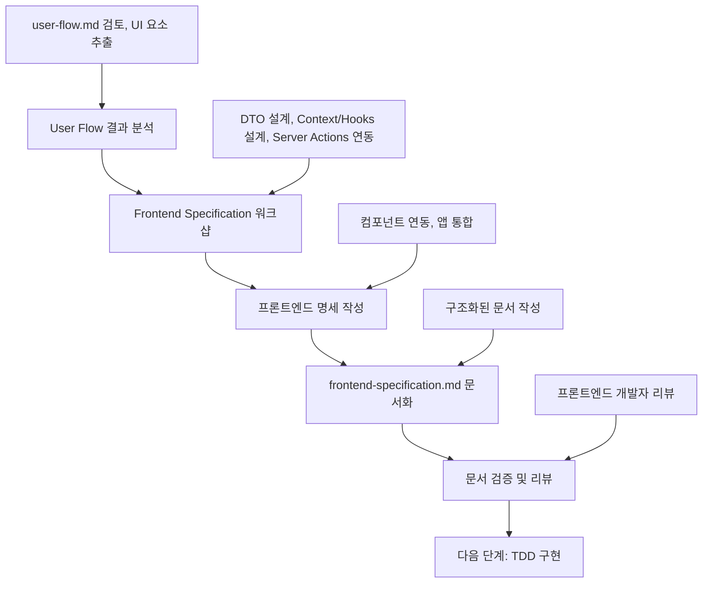

# Frontend Specification 작성 가이드

이 문서는 **User Flow 결과**를 바탕으로 **Frontend Specification**을 정의하고 **frontend-specification.md 문서 작성**까지, 의사결정 참여자들이 순서대로 따라할 수 있는 **Frontend Specification 전용 프로세스**를 설명합니다.

> 시작 전, `docs/event-domain-design/template/frontend-specification-template.md` 파일을 복사해 도메인 전용 `frontend-specification.md` 초안을 생성한 뒤, 아래 단계에 따라 내용을 채워 넣으세요.

---

## 🔁 Frontend Specification 프로세스 한눈에 보기



Frontend Specification은 **User Flow의 화면 흐름을 실제 구현 가능한 React 구조**로 전환하는 핵심 단계입니다.

---

## Phase 1: User Flow 결과 분석 (담당: 프론트엔드 개발자)

### 1.1 사전 준비 - 완료된 User Flow 확인

#### 필수 전제 조건:
- [ ] user-flow.md 문서가 완성되어 있음
- [ ] User Flow 워크샵이 완료되어 UX/UI 디자이너의 승인을 받음
- [ ] 모든 화면 흐름이 정의되어 있음
- [ ] UI 요소와 인터랙션이 명확히 정의되어 있음

#### User Flow 결과물 검토:
```bash
# User Flow 문서 확인
cat docs/event-domain-design/domains/<domain-name>/user-flow.md

# 주요 확인 포인트:
# - 화면별 UI 요소
# - 사용자 인터랙션
# - 권한별 UI 차이
# - 반응형 고려사항
```

### 1.2 UI 요소 및 상태 추출

#### UI 요소 목록화:
User Flow에 정의된 모든 UI 요소를 추출하고 분류합니다.

**추출 항목**:
- **컴포넌트**: 재사용 가능한 UI 컴포넌트
- **상태**: 관리해야 할 클라이언트 상태
- **액션**: 사용자 인터랙션
- **데이터 흐름**: Server Actions와의 연동 지점

#### 예시 결과:
```markdown
| UI 요소 | 상태 | Server Action | 비고 |
| ------- | ---- | ------------- | ---- |
| OrganizationSwitcher | selectedOrgId | getOrganizations | 드롭다운 |
| MemberList | members[] | getMembers | 목록 표시 |
| InviteForm | email, role | inviteMember | 폼 제출 |
```

### 1.3 Software Design 검토

#### Software Design 확인:
```bash
# Software Design 문서 확인 (Backend 산출물)
cat docs/event-domain-design/domains/<domain-name>/software-design.md

# 주요 확인 포인트:
# - Aggregate 정의 (DTO 변환 기준)
# - Command와 Event (Server Actions 기반)
# - Read Models (조회 데이터 구조)
```

### 1.4 템플릿 파일 준비
```bash
# Frontend Specification 템플릿 복사 (아직 없다면)
cp docs/event-domain-design/template/frontend-specification-template.md docs/event-domain-design/domains/<domain-name>/frontend-specification.md
```

---

## Phase 2: Frontend Specification 워크샵 진행 (담당: 프론트엔드 개발자)

### 2.1 워크샵 참여자 및 구조

#### 필수 참여자:
- **프론트엔드 개발자** (리드): React Context/Hooks 설계 및 Server Actions 연동
- **UX/UI 디자이너**: UI 요소 검증 및 사용자 경험 확인

#### 권장 참여자:
- **백엔드 개발자**: Software Design 및 Server Actions 인터페이스 확인
- **시니어 개발자**: 아키텍처 검증

#### 워크샵 시간 배분 (3-4시간):
```
- Phase 1: DTO 및 타입 설계 (40-50분)
- Phase 2: Context 및 Hooks 설계 (60-80분)
- Phase 3: Server Actions 연동 및 컴포넌트 설계 (60-80분)
- 휴식 및 정리 (15-30분)
```

### 2.2 Phase 1: DTO 및 타입 설계 (40-50분)

**목표**: Software Design의 Aggregate를 DTO로 직렬화하여 프론트엔드에서 활용

#### 진행 방법:
1. **DTO 타입 파일 생성**: `src/domains/[도메인명]/shared/dtos/index.ts`
   - Next.js Server Actions 직렬화를 위한 Plain Object 인터페이스
   - Domain Objects → DTO 변환을 위한 타입 정의
   - 클라이언트-서버 통신용 데이터 구조

2. **공통 타입 파일 생성**: `src/domains/[도메인명]/shared/types/index.ts`
   - Result 패턴 (함수형 에러 처리)
   - 공통 유틸리티 타입들
   - 도메인 전반에서 사용되는 기본 타입들

**파일 구조 예시**:
```
src/domains/[도메인명]/
├── shared/
│   ├── dtos/
│   │   └── index.ts          # DTO 인터페이스들 (직렬화 가능)
│   ├── types/
│   │   └── index.ts          # Result 패턴 및 공통 타입
│   ├── commands/             # Command 객체들
│   ├── errors/              # 에러 타입들
│   └── value-objects/       # Value Object들
├── frontend/
│   ├── contexts/            # React Context
│   ├── hooks/               # Custom Hooks
│   ├── components/          # UI 컴포넌트
│   └── utils/               # 클라이언트 유틸리티
└── actions/                 # Server Actions
```

### 1.2 DTO 타입 정의 가이드라인

**DTO 정의 시 주의사항**:
- **Plain Object만 사용**: 클래스, 함수, Date 객체 등 직렬화 불가능한 타입 금지
- **ISO 문자열 사용**: Date → string 변환 (예: `createdAt: string`)
- **Value Object 직렬화**: Domain Value Object → string 변환 (예: `UserId` → `string`)
- **의미 있는 이름**: View, Summary, Request 등 용도별 명확한 네이밍

**Result 패턴 활용**:
- 함수형 에러 처리: `Result<T, E>` 클래스 사용
- 성공/실패 명시적 구분: `isSuccess()`, `isError()` 메서드
- 타입 안전성: 컴파일 타임 에러 처리 보장

### 1.3 DTO 직렬화 패턴

**목표**: Domain Objects를 클라이언트에서 사용 가능한 DTO로 변환

**작업 과정**:
1. **Server Actions에서 직렬화**: Domain Objects → DTO 변환
2. **Context에서 DTO 활용**: 직렬화된 데이터를 상태로 관리
3. **컴포넌트에서 사용**: DTO 데이터를 UI에 표시

**직렬화 예시**:
- `UserProfileView`: 사용자 프로필 정보 (헤더, 프로필 페이지 등)
- `OrganizationSummary`: 조직 요약 정보 (드롭다운, 사이드바 등)
- `CreateOrganizationRequest`: 조직 생성 요청 (폼 입력 등)

### 2.3 Phase 2: Context 및 Hooks 설계 (60-80분)

**목표**: 도메인별로 독립적인 React Context를 만들어 DTO 상태와 액션을 관리

#### Part 1: Context 구조 설계 (30-40분)

**목표**: 도메인별로 독립적인 Context를 만들어 DTO 상태와 액션을 관리

**작업 과정**:
1. **Context 타입 정의**: `src/domains/[도메인명]/frontend/contexts/[도메인명]-context.tsx`
   - State 인터페이스: DTO 배열 + 선택된 엔티티 + UI 상태 + 에러 상태
   - Actions 인터페이스: Server Actions를 기반으로 정의
   - Context 타입: State와 Actions를 포함

2. **Provider 구현**: 동일 파일에서 Provider와 Hook 함께 구현
   - useState로 DTO 상태 관리
   - useEffect로 초기 데이터 로드
   - Server Actions 호출 및 에러 처리

### 2.2 Context 설계 가이드라인

**State 구조**:
- **DTO 배열**: Server Actions에서 받은 직렬화된 데이터 (예: `OrganizationSummary[]`)
- **선택된 엔티티**: 현재 선택된 엔티티 ID (예: `selectedOrganizationId`)
- **UI 상태**: 로딩, 에러 상태 (예: `isLoading`, `error`)
- **영속성**: 쿠키를 통한 선택 상태 유지

**Actions 구조**:
- **선택 액션**: 엔티티 선택 및 쿠키 저장 (예: `selectOrganization`)
- **새로고침 액션**: Server Actions 호출하여 데이터 갱신 (예: `refreshOrganizations`)
- **에러 처리**: try-catch로 에러 상태 관리

**Provider 패턴**:
- 초기 데이터 로드를 위한 useEffect
- 쿠키 기반 상태 복원 로직
- Server Actions 호출 시 에러 처리
- 선택 우선순위: URL 파라미터 > 쿠키 > 기본값

### 2.4 Phase 3: Server Actions 연동 및 컴포넌트 설계 (60-80분)

**목표**: Server Actions 연동과 UI 컴포넌트 구조를 설계합니다.

#### Part 1: Server Actions 연동 (30-40분)

**목표**: Technical Specification 패턴을 따라 Server Actions를 구현하여 DTO 반환

**작업 과정**:
1. **Server Actions 파일 생성**: `src/domains/[도메인명]/actions/[도메인명].actions.ts`
   - **의존성 주입** 패턴으로 Service Layer 활용
   - Software Design의 **Command 객체** 사용
   - **DTO 직렬화**하여 클라이언트에 반환

2. **에러 처리**: try-catch로 에러 처리하고 throw로 전파
   - 인증 에러: Supabase Auth 확인
   - 비즈니스 에러: Service Layer에서 발생
   - 시스템 에러: 예상치 못한 에러

### 3.2 Server Actions 설계 가이드라인

**Server Action 구조**:
```typescript
// 표준 패턴
export async function [액션명]Action(
  // 입력 파라미터들
): Promise<[DTOType]> {
  try {
    // 1. Supabase Auth 인증 확인
    const supabase = await createClient();
    const { data: { user }, error } = await supabase.auth.getUser();
    if (error || !user) throw new Error('Authentication required');

    // 2. 의존성 주입 (Repository, Service)
    const userRepository = new DrizzleUserRepository();
    const organizationRepository = new DrizzleOrganizationRepository();
    const supabaseAuthService = new SupabaseAuthService(supabase);
    const service = new UserManagementService(userRepository, organizationRepository, supabaseAuthService);

    // 3. Command 생성
    const command: [CommandType] = { /* ... */ };

    // 4. 도메인 로직 실행
    const result = await service.[methodName](command);
    if (result.isError()) throw new Error(result.error.message);

    // 5. DTO 직렬화 및 반환
    return {
      id: result.value.id.value, // Value Object → string
      name: result.value.entity.name,
      createdAt: result.value.entity.createdAt.toISOString(), // Date → string
    };
  } catch (error) {
    throw error; // 에러 전파
  }
}
```

**핵심 원칙**:
- **DTO 반환**: Domain Objects를 직렬화하여 반환
- **Command 객체**: Software Design의 Command를 그대로 활용
- **Service Layer**: 비즈니스 로직은 Service에서 처리
- **에러 전파**: try-catch로 에러를 catch하고 throw로 전파
- **revalidatePath**: 데이터 변경 시 관련 페이지 재검증

#### Part 2: Custom Hooks 설계 (20-30분)

**목표**: Context를 사용하는 Custom Hook을 만들어 컴포넌트에서 쉽게 사용

**작업 과정**:
1. **메인 Hook 생성**: `src/domains/[도메인명]/frontend/hooks/use-[도메인명].ts`
   - Context에서 state와 actions를 가져옴
   - 비즈니스 로직 메서드 추가 (검색, 필터링, 검증 등)
   - DTO 데이터를 기반으로 한 유틸리티 함수 제공

2. **Context Hook**: Context 파일에서 기본 Hook 제공
   - Context 접근 및 에러 처리
   - Provider 내부에서만 사용 가능하도록 보장

### 4.2 Hook 설계 가이드라인

**메인 Hook 패턴**:
- **Context 연결**: Context Hook을 통해 도메인 Context 사용
- **비즈니스 로직**: DTO 데이터를 기반으로 한 유틸리티 메서드
- **선택적 데이터**: 현재 선택된 엔티티, 기본 엔티티 등
- **검증 메서드**: 권한 확인, 상태 검증 등

**Hook 메서드 예시**:
- `selectedOrganization`: 현재 선택된 조직 정보
- `defaultOrganization`: 기본 조직 정보
- `canSelectOrganization(id)`: 조직 선택 가능 여부
- `isDefaultOrganization(id)`: 기본 조직 여부
- `findOrganizationByName(name)`: 이름으로 조직 검색
- `ownedOrganizations`: 소유한 조직만 필터링

**Context Hook 패턴**:
- Context 접근 및 undefined 체크
- Provider 내부에서만 사용 가능하도록 에러 처리
- 타입 안전성 보장

#### Part 3: 컴포넌트 연동 (10-20분)

**목표**: Hook을 사용하여 도메인 로직과 UI를 분리한 컴포넌트 구현

**작업 과정**:
1. **도메인별 컴포넌트 폴더 생성**: `src/domains/[도메인명]/frontend/components/`
   - 각 도메인의 주요 기능별로 컴포넌트 분리
   - Hook을 통해 DTO 상태와 액션에 접근
   - UI 라이브러리 컴포넌트 활용

2. **컴포넌트 패턴 적용**:
   - **Switcher 컴포넌트**: 드롭다운으로 엔티티 선택 (예: OrganizationSwitcher)
   - **List 컴포넌트**: 엔티티 목록 표시
   - **Form 컴포넌트**: 입력 검증 및 제출 처리

### 5.2 컴포넌트 설계 가이드라인

**Hook 사용 패턴**:
- 컴포넌트에서 직접 Context 접근 금지
- 반드시 Custom Hook을 통해 접근
- DTO 데이터를 기반으로 한 UI 렌더링

**Switcher 컴포넌트 패턴**:
- 드롭다운 메뉴로 엔티티 선택
- 현재 선택된 엔티티 표시
- 선택 시 Hook의 select 메서드 호출
- 라우팅 연동 (필요시)

**에러 처리 패턴**:
- Hook에서 제공하는 에러 상태 활용
- 에러 메시지를 사용자 친화적으로 표시
- 로딩 상태와 에러 상태를 적절히 처리

**로딩 상태 처리**:
- Hook에서 제공하는 로딩 상태 활용
- 스피너, 스켈레톤 등으로 UX 향상
- 데이터가 없을 때의 빈 상태 처리

---

## Phase 3: frontend-specification.md 문서 작성 (담당: 프론트엔드 개발자)

### 3.1 문서 구조 및 작성 순서

복사한 템플릿을 기반으로 다음 순서로 작성합니다:

#### 1. 📊 Frontend Specification Overview
- 프론트엔드 구현 개요
- User Flow와의 연결점
- 핵심 설계 원칙

#### 2. 📦 DTO 및 타입 정의
- DTO 인터페이스
- 직렬화 규칙
- Result 패턴

#### 3. 🎯 React Context 설계
- Context 구조
- State와 Actions 인터페이스
- Provider 패턴

#### 4. 🪝 Custom Hooks 설계
- Hook 구조 및 메서드
- 비즈니스 로직 유틸리티

#### 5. 🎨 UI 컴포넌트 설계
- 컴포넌트 구조
- Switcher/List/Form 패턴

#### 6. 🔗 앱 레벨 통합
- Provider 중첩 순서
- 초기 데이터 전달
- 쿠키 영속성

### 3.2 앱 레벨 통합 설계

#### Provider 통합 패턴:

**목표**: 앱 전체에서 도메인 Context들을 사용할 수 있도록 Provider 설정

**작업 과정**:
1. **Root Layout에 Provider 추가**: `src/app/layout.tsx`
   - 각 도메인의 Provider를 중첩으로 배치
   - 초기 데이터를 Server Components에서 전달
   - 의존성 순서에 따라 Provider 순서 결정

2. **페이지별 Hook 사용**: 각 페이지에서 필요한 Hook만 사용
   - 전역 상태는 Provider를 통해 공유
   - 페이지별로 필요한 도메인 Hook만 import


### 3.3 품질 검증 체크리스트

#### 일관성 검증:
- [ ] User Flow의 모든 화면이 컴포넌트로 매핑되었는가?
- [ ] Software Design의 Aggregate가 DTO로 직렬화되었는가?
- [ ] 모든 DTO가 Plain Object로 정의되었는가?

#### 완전성 검증:
- [ ] 모든 도메인에 Context와 Hook이 정의되었는가?
- [ ] Server Actions가 모든 Command를 처리하는가?
- [ ] 에러 처리와 로딩 상태가 적절히 정의되었는가?

#### 실용성 검증:
- [ ] 컴포넌트가 도메인 로직과 UI를 적절히 분리하는가?
- [ ] 쿠키 기반 영속성이 올바르게 작동하는가?
- [ ] Provider 중첩 순서가 의존성을 고려하는가?

---

## Phase 4: 문서 검증 및 리뷰 (담당: 전체 참여자)

### 4.1 리뷰 단계별 체크포인트

#### 프론트엔드 개발자 리뷰:
- [ ] React Context 설계가 적절한가?
- [ ] DTO 직렬화가 올바른가?
- [ ] Server Actions 연동이 명확한가?
- [ ] 컴포넌트 구조가 합리적인가?

#### UX/UI 디자이너 리뷰:
- [ ] User Flow의 모든 화면이 포함되었는가?
- [ ] 사용자 경험이 적절히 고려되었는가?
- [ ] 로딩 상태와 에러 처리가 UX 친화적인가?

#### 백엔드 개발자 리뷰:
- [ ] Software Design과의 일관성이 있는가?
- [ ] Server Actions 인터페이스가 올바른가?
- [ ] DTO가 Backend 계약을 준수하는가?

### 4.2 User Flow ↔ Frontend Specification 일관성 검증

#### 필수 검증 포인트:
- [ ] User Flow의 모든 화면이 컴포넌트로 구현되었는가?
- [ ] UI 요소가 모두 React 컴포넌트로 매핑되었는가?
- [ ] 사용자 인터랙션이 Hook 메서드로 정의되었는가?
- [ ] 동일한 도메인 언어가 일관되게 사용되고 있는가?

---

## ✅ Frontend Specification 완료 기준

다음 모든 조건이 충족되어야 Frontend Specification이 완료된 것으로 간주합니다:

### 워크샵 완료 기준:
- [ ] DTO 및 타입 정의 완료
- [ ] Context 및 Hooks 설계 완료
- [ ] Server Actions 연동 설계 완료
- [ ] 컴포넌트 구조 정의 완료

### 문서 완료 기준:
- [ ] frontend-specification.md의 모든 필수 섹션이 작성됨
- [ ] User Flow와의 일관성이 확인됨
- [ ] 프론트엔드 개발자의 검증 완료
- [ ] TDD 구현을 위한 충분한 정보 확보
- [ ] Git에 체계적으로 커밋되고 PR이 승인됨

---

## 🚀 다음 단계: TDD 구현으로 연결

Frontend Specification이 완료되면 다음 단계를 진행할 수 있습니다:

### TDD 구현 준비:
1. **TDD Implementation 가이드 참조**: `docs/event-domain-design/guide/07-tdd-implementation-guide.md`
2. **RED-GREEN-REFACTOR 사이클 적용**: Frontend Specification을 실제 코드로 구현
3. **워크샵 참여자 유지**: 프론트엔드 개발자

### 연결 정보:
- **입력**: 완성된 frontend-specification.md + user-flow.md
- **출력**: 실제 프론트엔드 코드 (Context, Hooks, Components)
- **다음 담당자**: 프론트엔드 개발자

### TDD 구현에서 진행될 사항:
- **Context 구현**: 상태 관리 및 Provider 설정
- **Hooks 구현**: Custom Hooks 및 비즈니스 로직
- **컴포넌트 구현**: UI 컴포넌트 및 인터랙션
- **테스트 작성**: React Testing Library로 컴포넌트 테스트

---

## 📚 관련 문서 및 템플릿

### 참조 가이드:
- [User Flow 가이드](./03-user-flow-guide.md)
- [TDD Implementation 가이드](./07-tdd-implementation-guide.md)

### 템플릿 파일:
- [Frontend Specification 템플릿](../template/frontend-specification-template.md)

### 예시 문서:
- [Organization Management Domain 예시](../domains/organization-management-domain/frontend-specification.md)

---

## 💡 성공을 위한 핵심 팁

### 워크샵 성공 팁:
- **프론트엔드 개발자 주도**: React 패턴과 Next.js 최적화 관점에서 설계
- **User Flow 기반**: 모든 UI 요소를 User Flow에서 도출
- **DTO 직렬화**: Plain Object만 사용하여 Next.js 호환성 보장
- **도메인 분리**: 각 도메인별로 독립적인 Context/Hook 구조

### 문서화 성공 팁:
- **구체적 타입 정의**: DTO 인터페이스를 명확히 정의
- **명확한 상태 관리**: Context의 State와 Actions를 분리
- **User Flow 연결성**: User Flow의 결과와 일관성 유지
- **실용적 패턴**: 재사용 가능한 컴포넌트 패턴 적용

### 주의사항:
- **직렬화 제약**: Date, 클래스, 함수 등 직렬화 불가능한 타입 사용 금지
- **Context 과다 사용 지양**: 도메인별로만 Context 생성
- **Hook 추상화**: 컴포넌트에서 직접 Context 접근 금지
- **Server Actions 의존성 주입**: Service Layer 활용 필수

### 7.1 전체 아키텍처 플로우

```
Software Design (도메인 모델)
         ↓
┌─────────────────┐    ┌──────────────────┐    ┌─────────────────┐
│   React UI      │    │  React Context   │    │ Server Actions  │
│                 │    │                  │    │                 │
│ • Custom Hook   │◄──►│ • DTO 상태 관리  │◄──►│ • DTO 직렬화    │
│ • Switcher UI   │    │ • 선택 상태      │    │ • Command 객체  │
│ • 에러 처리     │    │ • 쿠키 영속성    │    │ • Service Layer │
└─────────────────┘    └──────────────────┘    └─────────────────┘
```

### 7.2 도메인 연동 패턴

**DTO 기반 연동**:
- Software Design → DTO 인터페이스 정의
- Domain Objects → DTO 직렬화
- Plain Object만 사용하여 Next.js 호환성 보장

**상태 관리**:
- 도메인별 독립적인 Context
- DTO 배열 + 선택된 엔티티 상태
- 쿠키 기반 영속성으로 선택 상태 유지

**에러 처리**:
- try-catch로 에러 처리하고 throw로 전파
- Context에서 에러 상태 관리
- Hook에서 에러 상태를 컴포넌트에 전달

### 7.3 개발 프로세스

1. **Software Design 완료** → 도메인 모델 확정
2. **DTO 정의** → 직렬화 가능한 인터페이스 정의
3. **Context 설계** → DTO 상태 + 액션 인터페이스 정의
4. **Server Actions** → DTO 직렬화 + Service Layer 연동
5. **Hook 구현** → Context 연결 + 비즈니스 로직 메서드
6. **컴포넌트** → Hook 사용 + Switcher UI 구현
7. **앱 통합** → Provider 설정 + 초기 데이터 전달

---

## ✅ 검증 체크리스트

### DTO 타입 정의
- [ ] DTO 인터페이스가 Plain Object로 정의되었는가?
- [ ] Date 객체가 ISO 문자열로 직렬화되었는가?
- [ ] Value Object가 string으로 직렬화되었는가?
- [ ] Next.js Server Actions 직렬화 제약을 준수하는가?

### Context 설계
- [ ] 도메인별로 독립적인 Context가 생성되었는가?
- [ ] DTO 배열과 선택된 엔티티 상태가 관리되는가?
- [ ] 쿠키 기반 영속성이 구현되었는가?
- [ ] 초기 데이터 로드 로직이 구현되었는가?

### Server Actions
- [ ] Supabase Auth 인증 확인이 포함되었는가?
- [ ] 의존성 주입 패턴으로 Service Layer를 사용하는가?
- [ ] Command 객체를 활용하여 입력을 구조화했는가?
- [ ] DTO 직렬화가 올바르게 구현되었는가?
- [ ] revalidatePath로 관련 페이지 재검증이 포함되었는가?

### Hook 구현
- [ ] Context를 적절히 추상화한 Hook이 구현되었는가?
- [ ] 비즈니스 로직 메서드가 포함되었는가?
- [ ] 선택된 엔티티, 기본 엔티티 등 유틸리티가 제공되는가?
- [ ] 에러 상태가 적절히 처리되는가?

### 컴포넌트 연동
- [ ] 컴포넌트에서 직접 Context 접근을 피하고 Hook을 사용하는가?
- [ ] Switcher 컴포넌트가 드롭다운으로 구현되었는가?
- [ ] 로딩 상태와 에러 상태가 적절히 처리되는가?
- [ ] 빈 상태 처리가 포함되었는가?

### 앱 통합
- [ ] Provider가 적절한 순서로 중첩 배치되었는가?
- [ ] 초기 데이터가 Server Components에서 전달되는가?
- [ ] 쿠키 기반 영속성이 올바르게 작동하는가?
- [ ] 페이지별로 필요한 Hook만 선택적으로 사용하는가?

---

## 📚 References

### 필수 선행 문서
- [Software Design 문서](../domains/[도메인명]/software-design.md) - Aggregate, Command, Event 정의
- [Technical Specification 가이드](./05-technical-specification-guide.md) - DTO 직렬화, Service Layer 패턴
- [Code Conventions](./08-code-conventions.md) - DTO 직렬화 컨벤션

### 기술 스택 가이드
- Next.js 15 (App Router, Server Actions, revalidatePath)
- React 19 (Context API, useState, useEffect)
- TypeScript 5 (인터페이스, 타입 정의)
- Supabase (인증, 데이터베이스)
- Drizzle ORM (타입 안전한 쿼리)

---

이 Frontend Specification 가이드는 **Software Design에서 정의된 도메인 모델을 React 프론트엔드에서 어떻게 활용할지에 대한 프로세스 중심 가이드**입니다. 각 도메인마다 일관된 패턴으로 프론트엔드를 구현할 수 있도록 설계되었습니다.
