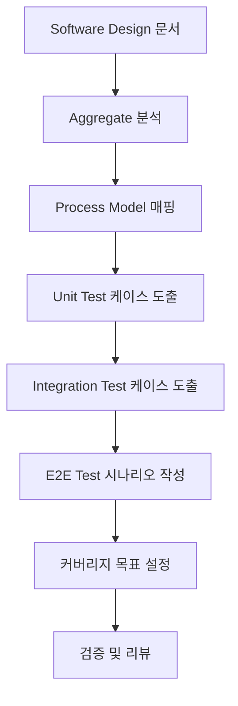

# Software Design → Testing Strategy 가이드라인

이 문서는 **Software Design** 산출물을 바탕으로, 주니어 개발자가 따라 할 수 있는 **Testing Strategy 작성 프로세스**를 설명합니다. 최종 목표는 `3.5. testing-strategy.md` 문서에서 확인할 수 있는 수준의 테스트 전략을 완성하는 것입니다.

> 시작 전, `docs/event-domain-design/template/3.5-testing-strategy-template.md` 파일을 복사해 도메인 전용 `3.5. testing-strategy.md` 초안을 생성한 뒤, 아래 단계에 따라 내용을 채워 넣으세요.

---

## 🔁 전체 프로세스 한눈에 보기



각 단계는 아래 절차를 순서대로 수행하면서 `3.5. testing-strategy.md`를 채워넣습니다.

---

## 🛠️ 작업 시작 전 Git 브랜치 준비하기

작업을 시작하기 전에 **반드시 브랜치를 확인**하고, Software Design과 동일한 브랜치에서 작업합니다.

```bash
# 현재 브랜치 확인 (Software Design 작업 중인 브랜치)
git branch

# 최신 상태 확인
git status
```

---

## 🎯 작성 시점 및 목적

**작성 시점**: Software Design 완료 후, Technical Specification 작성 전  
**목적**: 구현하기 전에 "무엇을 어떻게 테스트할지" 명확히 정의

---

## 1단계. Software Design에서 Aggregate 분석하기

**목표**: Software Design에 정의된 모든 Aggregate와 그 구성 요소를 파악합니다.

### 1.1 Aggregate 목록 작성

1. **Software Design 문서 열기**: `3. software-design.md`
2. **Aggregate 섹션 찾기**: "Aggregate 상세 정의" 섹션
3. **목록 작성**: 모든 Aggregate, Entity, Value Object 나열

```markdown
### Aggregate 목록
- UserAggregate
  - Value Objects: UserId, UserEmail
  - Entities: User
- OrganizationAggregate
  - Value Objects: OrganizationId
  - Entities: Organization
```

### 1.2 각 Aggregate의 구성 요소 파악

각 Aggregate마다 다음을 확인:
- **Value Objects**: 유효성 검증 로직이 있는가?
- **Entities**: 비즈니스 로직 메서드가 있는가?
- **Commands**: 어떤 명령을 받는가?
- **Events**: 어떤 이벤트를 발행하는가?
- **Invariants**: 반드시 지켜야 할 규칙은 무엇인가?

> `testing-strategy.md`의 **"Unit Tests 전략"** 섹션 작성 준비

---

## 2단계. Process Model → Test 매핑표 작성하기

**목표**: Process Model의 각 요소를 테스트 케이스로 변환합니다.

### 2.1 Process Model 시나리오 분석

1. **Process Model 문서 열기**: `2. process-model.md`
2. **각 Scenario 확인**: Scenario 0, 1, 2, ...
3. **Sequence별로 분해**: 각 Sequence의 Command, System, Event 파악

### 2.2 매핑표 작성

각 Process Model 요소를 테스트로 매핑:

```markdown
| Process Model 요소 | 테스트 종류 | 테스트 케이스 |
|-------------------|------------|-------------|
| Command: [명령명] | Unit | [Aggregate].[메서드명]() |
| System: [시스템명] | Unit | [Aggregate] [로직 설명] |
| Event: [이벤트명] | Unit | [Event] 발행 검증 |
| 전체 플로우 | Integration | [Service/Action].[메서드명]() |
| 사용자 경험 | E2E | [시나리오 설명] |
```

**예시**:
```markdown
### Scenario 0: 유저 가입 및 온보딩

| Process Model 요소 | 테스트 종류 | 테스트 케이스 |
|-------------------|------------|-------------|
| Command: 유저 가입 처리하기 | Unit | UserAggregate.createFromSupabaseAuth() |
| System: Profile System | Unit | UserAggregate 프로필 생성 로직 |
| Event: 유저 프로필이 생성됨 | Unit | UserProfileCreatedEvent 발행 검증 |
| System: Organization System | Unit | OrganizationAggregate.createDefault() |
| Event: 기본 조직이 생성됨 | Unit | DefaultOrganizationCreatedEvent 발행 검증 |
| 전체 플로우 | Integration | processUserRegistrationAction() |
| 사용자 경험 | E2E | 구글 로그인 → 프로필 생성 → 조직 선택 |
```

> `testing-strategy.md`의 **"Process Model → Test 매핑"** 섹션에 반영

---

## 3단계. Unit Test 케이스 도출하기

**목표**: Value Objects, Entities, Aggregates의 단위 테스트 케이스를 작성합니다.

### 3.1 Value Objects 테스트 케이스

각 Value Object마다:
1. **생성자 테스트**: 유효한 값, 잘못된 값
2. **유효성 검증**: 경계값, 특수 케이스
3. **메서드 테스트**: equals, getter 등

**템플릿**:
```typescript
describe('[ValueObjectName] Value Object', () => {
  describe('생성자', () => {
    it('유효한 값으로 생성되어야 한다')
    it('잘못된 값에 대해 예외를 발생시켜야 한다')
    it('[경계값 케이스]')
  })
  
  describe('[메서드명]', () => {
    it('[기대 동작]')
  })
})
```

**우선순위 설정**:
- ⭐️⭐️⭐️⭐️⭐️: 핵심 Value Object (ID, Email 등)
- ⭐️⭐️⭐️⭐️: 비즈니스 로직이 있는 VO
- ⭐️⭐️⭐️: 단순 래퍼 VO

### 3.2 Entities 테스트 케이스

각 Entity마다:
1. **생성 테스트**: 필수 속성 검증
2. **비즈니스 메서드**: 각 메서드의 동작 검증
3. **불변성 검증**: createdAt 등 변경되지 않아야 할 속성

**템플릿**:
```typescript
describe('[EntityName] Entity', () => {
  describe('생성', () => {
    it('모든 필수 속성으로 생성되어야 한다')
    it('[특수 조건]에서 생성되어야 한다')
  })
  
  describe('[메서드명]', () => {
    it('[비즈니스 규칙]이 적용되어야 한다')
    it('[부작용]이 발생해야 한다')
  })
})
```

### 3.3 Aggregates 테스트 케이스

각 Aggregate마다:
1. **생성 메서드**: 팩토리 메서드 테스트
2. **Command 처리**: 각 Command에 대한 동작
3. **Event 발행**: 올바른 이벤트가 발행되는지
4. **Invariant 검증**: 불변식이 깨지지 않는지

**템플릿**:
```typescript
describe('[AggregateName]', () => {
  describe('[팩토리메서드]', () => {
    it('[정상 케이스]로부터 생성되어야 한다')
    it('[예외 케이스]에 대해 예외를 발생시켜야 한다')
    it('[Event]가 발행되어야 한다')
  })
  
  describe('[Command처리메서드]', () => {
    it('[비즈니스 로직]이 수행되어야 한다')
    it('[Event]가 발행되어야 한다')
    it('[불변식]이 유지되어야 한다')
  })
})
```

> `testing-strategy.md`의 **"Unit Tests 전략"** 섹션에 반영

---

## 4단계. Integration Test 케이스 도출하기

**목표**: Repository, Service, Server Actions의 통합 테스트 케이스를 작성합니다.

### 4.1 Repository 통합 테스트

각 Repository마다:
1. **CRUD 테스트**: save, findById, update, delete
2. **복잡한 쿼리**: 조건부 조회, 정렬, 페이징
3. **RLS 정책**: 권한 기반 접근 제어

**템플릿**:
```typescript
describe('[RepositoryName] Integration Tests', () => {
  beforeEach(async () => {
    // 테스트 데이터베이스 초기화
    await cleanDatabase();
  })
  
  describe('save', () => {
    it('[Entity]를 데이터베이스에 저장해야 한다')
    it('중복 [제약조건]은 거부해야 한다')
    it('RLS 정책이 적용되어야 한다')
  })
  
  describe('findById', () => {
    it('ID로 [Entity]를 찾아야 한다')
    it('존재하지 않는 ID는 null을 반환해야 한다')
  })
})
```

### 4.2 Service 통합 테스트

각 Service마다:
1. **핵심 플로우**: 여러 Aggregate 협력
2. **트랜잭션**: 원자성 보장
3. **에러 처리**: 실패 시 적절한 처리

**템플릿**:
```typescript
describe('[ServiceName] Integration Tests', () => {
  describe('[메서드명]', () => {
    it('[정상 플로우]를 완료해야 한다')
    it('[예외 상황]에서 적절히 처리해야 한다')
    it('[트랜잭션]이 올바르게 동작해야 한다')
  })
})
```

### 4.3 Server Actions 통합 테스트

각 Server Action마다:
1. **인증 검증**: 인증된 사용자만 접근
2. **Result 패턴**: 성공/실패 일관된 처리
3. **전체 플로우**: UI → Action → Service → Repository

**템플릿**:
```typescript
describe('Server Actions Integration Tests', () => {
  describe('[actionName]', () => {
    it('인증된 사용자의 [작업]을 수행해야 한다')
    it('미인증 사용자는 거부해야 한다')
    it('성공 시 Result.ok를 반환해야 한다')
    it('실패 시 Result.err를 반환해야 한다')
  })
})
```

**우선순위 설정**:
- ⭐️⭐️⭐️⭐️⭐️: Server Actions (클라이언트 접점)
- ⭐️⭐️⭐️⭐️: Service (비즈니스 로직 조율)
- ⭐️⭐️⭐️⭐️: Repository (데이터 접근)

> `testing-strategy.md`의 **"Integration Tests 전략"** 섹션에 반영

---

## 5단계. E2E Test 시나리오 작성하기

**목표**: 실제 사용자 관점의 End-to-End 테스트 시나리오를 작성합니다.

### 5.1 핵심 시나리오 선정

Process Model의 각 Scenario를 E2E 테스트로:
1. **Happy Path**: 정상적인 사용자 플로우
2. **Error Path**: 주요 에러 시나리오
3. **Edge Cases**: 경계 케이스

**선정 기준**:
- 비즈니스 크리티컬한 플로우
- 사용자가 자주 사용하는 기능
- 과거 버그가 발생했던 영역

### 5.2 시나리오 작성

각 시나리오를 Given-When-Then 형식으로:

**템플릿**:
```typescript
test('[시나리오 설명]', async ({ page }) => {
  // Given: [초기 상태]
  await page.goto('[URL]');
  
  // When: [사용자 액션]
  await page.click('[selector]');
  
  // Then: [기대 결과]
  await expect(page.locator('[selector]')).toBeVisible();
  
  // When: [다음 액션]
  await page.fill('[selector]', '[value]');
  
  // Then: [최종 결과]
  await expect(page).toHaveURL('[expected-url]');
})
```

### 5.3 E2E 테스트 구체화

각 시나리오에 대해:
1. **페이지 이동**: 어떤 페이지에서 시작하는가?
2. **사용자 액션**: 클릭, 입력, 선택 등
3. **UI 검증**: 보이는 요소, URL, 텍스트 등
4. **데이터 검증**: 실제 데이터가 변경되었는가?

**우선순위 설정**:
- ⭐️⭐️⭐️⭐️⭐️: 핵심 사용자 플로우
- ⭐️⭐️⭐️⭐️: 중요 에러 시나리오
- ⭐️⭐️⭐️: 보조 기능

> `testing-strategy.md`의 **"E2E Tests 전략"** 섹션에 반영

---

## 6단계. 커버리지 목표 설정하기

**목표**: 각 레이어별 테스트 커버리지 목표를 설정합니다.

### 6.1 테스트 피라미드 비율 정하기

기본 비율:
```
Unit Tests:       70%  (20-30개)
Integration Tests: 20%  (5-8개)
E2E Tests:        10%  (1-2개)
```

**도메인 특성에 따라 조정**:
- **비즈니스 로직 중심**: Unit 80%, Integration 15%, E2E 5%
- **외부 연동 중심**: Unit 60%, Integration 30%, E2E 10%
- **UI 중심**: Unit 50%, Integration 20%, E2E 30%

### 6.2 레이어별 커버리지 목표

**기본 목표**:

| 레이어 | 목표 커버리지 | 우선순위 |
|--------|--------------|---------|
| Value Objects | 95% 이상 | ⭐️⭐️⭐️⭐️⭐️ |
| Entities | 95% 이상 | ⭐️⭐️⭐️⭐️⭐️ |
| Aggregates | 90% 이상 | ⭐️⭐️⭐️⭐️⭐️ |
| Services | 85% 이상 | ⭐️⭐️⭐️⭐️ |
| Repositories | 80% 이상 | ⭐️⭐️⭐️⭐️ |
| Server Actions | 85% 이상 | ⭐️⭐️⭐️⭐️⭐️ |
| UI Components | 70% 이상 | ⭐️⭐️⭐️ |

**전체 목표**:
```
전체 코드 커버리지: 85% 이상
- Branches: 80% 이상
- Functions: 85% 이상
- Lines: 85% 이상
- Statements: 85% 이상
```

**프로젝트 상황에 따라 조정**:
- **초기 단계**: 전체 70% 이상
- **성숙 단계**: 전체 85% 이상
- **레거시 개선**: 점진적 향상 (현재 +10%)

> `testing-strategy.md`의 **"커버리지 목표"** 섹션에 반영

---

## 7단계. TDD 사이클 예시 작성하기

**목표**: 실제 TDD 사이클을 적용한 예시를 작성합니다.

### 7.1 대표적인 Value Object 선택

도메인에서 가장 중요한 Value Object 하나를 선택:
- Email, UserId, OrderId 등
- 유효성 검증 로직이 있는 것

### 7.2 TDD 사이클 예시 작성

**RED → GREEN → REFACTOR** 순서로:

```typescript
// 1. RED: 테스트 먼저 작성
describe('[ValueObject]', () => {
  it('유효한 값으로 생성되어야 한다', () => {
    const vo = new [ValueObject]('[valid-value]');
    expect(vo.value).toBe('[valid-value]');
  })
})

// 실행: FAIL ([ValueObject] 클래스 없음)

// 2. GREEN: 최소 구현
export class [ValueObject] {
  constructor(public readonly value: string) {}
}

// 실행: PASS

// 3. REFACTOR: 검증 로직 추가
export class [ValueObject] {
  constructor(public readonly value: string) {
    if (!this.isValid(value)) {
      throw new Error('Invalid value');
    }
  }
  
  private isValid(value: string): boolean {
    // 검증 로직
  }
}

// 실행: PASS (기존 테스트 통과 + 새 테스트 추가)
```

> `testing-strategy.md`의 **"TDD 사이클 적용"** 섹션에 반영

---

## 8단계. 테스트 도구 및 설정 정리하기

**목표**: 프로젝트에서 사용할 테스트 도구와 설정을 명시합니다.

### 8.1 테스트 프레임워크 확인

**현재 프로젝트 설정**:
- Unit & Integration: Vitest
- E2E: Playwright
- 커버리지: v8 (Vitest 내장)

### 8.2 테스트 환경 설정

```markdown
### Unit & Integration Tests
- **프레임워크**: Vitest
- **Assertion**: expect (Vitest 내장)
- **Mock**: vi (Vitest 내장)
- **커버리지**: v8

### E2E Tests
- **프레임워크**: Playwright
- **브라우저**: Chromium, Firefox, WebKit
- **스크린샷**: 실패 시 자동 캡처
- **비디오**: 실패 시 자동 녹화

### 테스트 데이터베이스
- **로컬**: PostgreSQL (Docker)
- **CI/CD**: Supabase 테스트 인스턴스
- **정리 전략**: 각 테스트 후 데이터 완전 삭제
```

> `testing-strategy.md`의 **"테스트 도구 및 설정"** 섹션에 반영

---

## 9단계. 검증 체크리스트 작성하기

**목표**: 테스트 작성 전후의 검증 항목을 정리합니다.

### 9.1 테스트 작성 전 체크리스트

```markdown
### 테스트 작성 전
- [ ] Process Model의 모든 시나리오가 테스트 케이스로 매핑되었는가?
- [ ] Software Design의 모든 Aggregate가 테스트 계획에 포함되었는가?
- [ ] 핵심 불변식이 테스트로 검증 가능한가?
```

### 9.2 테스트 작성 후 체크리스트

```markdown
### 테스트 작성 후
- [ ] 모든 Happy Path가 커버되는가?
- [ ] 주요 에러 시나리오가 테스트되는가?
- [ ] 경계값 테스트가 포함되어 있는가?
- [ ] 커버리지 목표를 달성했는가?
```

### 9.3 테스트 품질 체크리스트

```markdown
### 테스트 품질
- [ ] 테스트는 독립적으로 실행 가능한가?
- [ ] 테스트는 빠르게 실행되는가? (Unit < 100ms, Integration < 1s)
- [ ] 테스트는 반복 실행해도 동일한 결과를 내는가?
- [ ] 테스트 실패 시 원인을 명확히 알 수 있는가?
```

> `testing-strategy.md`의 **"검증 체크리스트"** 섹션에 반영

---

## 10단계. 다음 단계 명시하기

**목표**: Testing Strategy 이후 진행할 작업을 명확히 합니다.

```markdown
## 📚 다음 단계

이 Testing Strategy 문서를 기반으로 다음 문서를 작성하세요:

1. **Technical Specification** (4단계)
   - 각 클래스별 수도코드
   - **테스트 수도코드 포함** ✅
   - 구현 가이드라인

2. **실제 구현** (5단계)
   - TDD 사이클로 구현
   - 테스트 먼저 → 구현 → 리팩토링

3. **테스트 결과 문서** (6단계)
   - 커버리지 리포트
   - 실패한 테스트 분석
   - 개선 방향
```

> `testing-strategy.md`의 **"다음 단계"** 섹션에 반영

---

## ✅ 최종 점검 단계

### 문서 완성도 확인

- [ ] 모든 섹션이 채워져 있는가?
- [ ] Process Model → Test 매핑이 완료되었는가?
- [ ] Unit/Integration/E2E 테스트 케이스가 모두 작성되었는가?
- [ ] 커버리지 목표가 명확한가?
- [ ] TDD 사이클 예시가 구체적인가?

### 리뷰 준비

- [ ] 시니어 개발자 리뷰 요청
- [ ] Technical Specification 작성자와 공유
- [ ] QA 팀과 테스트 전략 논의

---

## 📊 프로젝트 진행 상황 업데이트

### Git 커밋

```bash
# 변경사항 커밋
git add docs/event-domain-design/domains/[domain-name]/3.5.\ testing-strategy.md
git commit -m "docs(testing-strategy): complete [Domain Name] testing strategy

- Map Process Model scenarios to test cases
- Define Unit/Integration/E2E test strategies
- Set coverage goals for each layer
- Add TDD cycle examples"

# 브랜치 푸시
git push origin domain/[번호]-[domain-name]
```

---

## 💡 실무 팁

### 1. 우선순위 설정

**시간이 부족할 때**:
1. Unit Tests (Value Objects, Aggregates) 먼저
2. Server Actions Integration Tests 다음
3. E2E Tests는 핵심 시나리오만

### 2. 점진적 개선

**초기 버전**:
- Process Model 매핑만 완료
- 주요 테스트 케이스 목록 작성

**개선 버전**:
- 모든 테스트 케이스 상세화
- TDD 사이클 예시 추가
- 커버리지 목표 세분화

### 3. 팀과 협업

**리뷰 포인트**:
- Process Model 매핑이 정확한가?
- 테스트 우선순위가 합리적인가?
- 커버리지 목표가 달성 가능한가?
- TDD 사이클 예시가 명확한가?

---

## 📚 추가 참고 문서

- `docs/event-domain-design/domains/user-management/3.5. testing-strategy.md`: 실제 예시
- `docs/event-domain-design/guide/4-technical-specification-guide.md`: 다음 단계 가이드
- `docs/agile-planning/stories/user-management/TESTING_GUIDE.md`: 실제 테스트 작성 가이드

---

이 가이드를 따라 체계적인 Testing Strategy를 수립하고, 높은 품질의 도메인을 구현할 수 있습니다! 🎉

