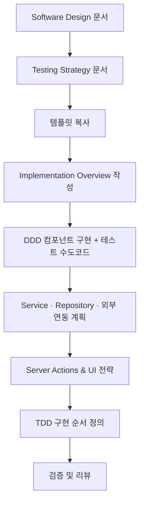

# Technical Specification 가이드라인

이 문서는 **Software Design**과 **Testing Strategy** 문서를 입력으로 받아, 주니어 개발자가 순서대로 따라 할 수 있는 **Technical Specification 작성 프로세스**를 설명합니다. 최종 산출물은 `4. technical-specification.md`이며, **TDD 기반 실제 구현 작업**의 기준점이 됩니다.

> 시작 전, `docs/event-domain-design/template/4-technical-specification-template.md` 파일을 복사해 도메인 전용 초안을 만들고, 세부 규칙은 `docs/event-domain-design/guide/code-conventions.md`를 참고하세요.

---

## 🎯 작성 시점 및 목적

**작성 시점**: Testing Strategy 완료 후, 실제 구현 시작 전  
**목적**: 
- 구현 수도코드 작성
- **테스트 수도코드 작성** ⭐️
- TDD 사이클 적용을 위한 구현 순서 명시

---

## 🔁 전체 프로세스 한눈에 보기



---

## 1단계. 준비하기

1. **필수 문서 확인**
   - Software Design 문서 (aggregate, command, event 정의)
   - **Testing Strategy 문서** (테스트 케이스, 우선순위) ⭐️
   - API Specification 문서 (외부 계약)
   - 코드 컨벤션 가이드
2. **템플릿 복사**
   - `4-technical-specification-template.md` → `domains/<domain>/4. technical-specification.md`
3. **문서 정보 기입**
   - 도메인명, 작성자, 작성일, 버전, 리뷰어 등 기본 정보 입력

**핵심**: Testing Strategy에서 정의한 테스트 케이스를 Technical Specification에서 수도코드로 구체화합니다.

---

## 2단계. Implementation Overview 작성

템플릿의 `Implementation Overview` 섹션을 활용해 개발 우선순위를 정리합니다.

- **Phase별 목표**: 핵심 기능 → 고급 기능 → 통합/최적화 순으로 구체화
- **선행조건 및 위험요소**: 공통 컴포넌트, 외부 연동 일정, 데이터 마이그레이션 여부 등
- **협업 포인트**: 다른 팀(디자인, QA, 인프라)과 공유해야 할 사항 기록

---

## 3단계. DDD 컴포넌트 구현 + 테스트 수도코드 작성

**핵심**: 각 컴포넌트마다 **"구현 수도코드"**와 **"테스트 수도코드"**를 함께 작성합니다.

### 3.1 Value Objects

#### 구현 수도코드
```typescript
class UserEmail {
  private value: string;
  
  constructor(email: string) {
    // 1. 빈 값 검증
    // 2. 이메일 형식 검증 (정규식)
    // 3. 길이 제한 검증 (255자)
    // 4. this.value 할당
  }
  
  equals(other: UserEmail): boolean {
    // 1. 값 비교
    // 2. boolean 반환
  }
}
```

#### 테스트 수도코드 ⭐️
```typescript
describe('UserEmail Value Object', () => {
  describe('생성자', () => {
    it('유효한 이메일로 생성', () => {
      // Given: 'test@example.com'
      // When: new UserEmail(email)
      // Then: userEmail.value === email
    })
    
    it('잘못된 이메일 형식 거부', () => {
      // Given: 'invalid-email'
      // When: new UserEmail(email)
      // Then: UserManagementError 발생
    })
  })
})
```

**작성 포인트**:
- Testing Strategy의 테스트 케이스를 참조
- Given-When-Then 패턴 사용
- 검증 규칙: 길이, 포맷, 허용 문자 등 상세 조건
- 예외 처리: 비즈니스 규칙 위반 시 던질 에러 타입

---

### 3.2 Entities

#### 구현 수도코드
```typescript
class User {
  constructor(
    public readonly id: UserId,
    public readonly email: UserEmail,
    public name: string,
    // ...
  ) {}
  
  updateProfile(name: string, avatarUrl: string): void {
    // 1. 입력 검증
    // 2. 이름 업데이트
    // 3. updatedAt 갱신
  }
}
```

#### 테스트 수도코드 ⭐️
```typescript
describe('User Entity', () => {
  describe('updateProfile', () => {
    it('프로필 업데이트 시 updatedAt 갱신', () => {
      // Given: user, originalUpdatedAt
      // When: user.updateProfile('New Name', 'avatar.jpg')
      // Then: user.updatedAt > originalUpdatedAt
    })
    
    it('createdAt은 변경되지 않음', () => {
      // Given: user, originalCreatedAt
      // When: user.updateProfile(...)
      // Then: user.createdAt === originalCreatedAt
    })
  })
})
```

**작성 포인트**:
- 생성자 파라미터와 불변 필드 구분
- 상태 변경 메서드와 호출 조건 (권한, 상태 체크 등)
- 비즈니스 규칙이 테스트로 검증 가능하도록 작성

---

### 3.3 Aggregates

#### 구현 수도코드
```typescript
class UserAggregate {
  private _user: User;
  private _events: DomainEvent[] = [];
  
  static createFromSupabaseAuth(supabaseUser: SupabaseUser): UserAggregate {
    // 1. 이메일 검증
    // 2. User Entity 생성
    // 3. UserProfileCreatedEvent 발행
    // 4. UserAggregate 반환
  }
  
  updateProfile(name: string, avatarUrl: string): UserUpdatedEvent {
    // 1. User Entity 업데이트
    // 2. UserUpdatedEvent 생성
    // 3. 이벤트 추가
    // 4. 이벤트 반환
  }
}
```

#### 테스트 수도코드 ⭐️
```typescript
describe('UserAggregate', () => {
  describe('createFromSupabaseAuth', () => {
    it('유효한 Supabase User로부터 생성', () => {
      // Given: validSupabaseUser
      // When: UserAggregate.createFromSupabaseAuth(supabaseUser)
      // Then: aggregate.user.email.value === supabaseUser.email
    })
    
    it('이메일 없으면 예외 발생', () => {
      // Given: supabaseUser without email
      // When: UserAggregate.createFromSupabaseAuth(supabaseUser)
      // Then: UserManagementError 발생
    })
    
    it('UserProfileCreatedEvent 발행', () => {
      // Given: validSupabaseUser
      // When: aggregate = UserAggregate.createFromSupabaseAuth(...)
      // Then: aggregate.getUncommittedEvents() contains UserProfileCreatedEvent
    })
  })
})
```

**작성 포인트**:
- 처리하는 Command, 발생시키는 Event를 표로 정리
- Invariant 검증 흐름을 단계별 또는 의사 코드로 작성
- 이벤트 발행 시점 명시
- Testing Strategy의 Process Model 매핑 참조

---

### 3.4 Commands & Events

#### 구현 수도코드
```typescript
// Command
interface CreateUserProfileCommand {
  supabaseUser: SupabaseUser;
}

// Event
class UserProfileCreatedEvent implements DomainEvent {
  constructor(
    public readonly userId: string,
    public readonly email: string,
    public readonly occurredAt: Date
  ) {}
}
```

#### 테스트 수도코드 ⭐️
```typescript
describe('UserProfileCreatedEvent', () => {
  it('이벤트 생성 및 속성 검증', () => {
    // Given: userId, email, occurredAt
    // When: event = new UserProfileCreatedEvent(...)
    // Then: event.userId, event.email, event.occurredAt 검증
  })
})
```

**작성 포인트**:
- 입력 스키마(zod 등)와 도메인 Command 변환 과정 설명
- Event payload 구조와 타입 상수 정의
- Cross-Domain 사용 여부, 이벤트 처리 우선순위 메모

---

### 3.5 Error Types

#### 구현 수도코드
```typescript
class UserManagementError extends Error {
  constructor(
    public readonly code: UserManagementErrorCode,
    public readonly message: string,
    public readonly details?: unknown
  ) {
    super(message);
  }
}

type UserManagementErrorCode = 
  | 'USER_NOT_FOUND'
  | 'INVALID_EMAIL_FORMAT'
  | 'SUPABASE_AUTH_FAILED';
```

#### 테스트 수도코드 ⭐️
```typescript
describe('UserManagementError', () => {
  it('에러 코드와 메시지로 생성', () => {
    // Given: code, message
    // When: error = new UserManagementError(code, message)
    // Then: error.code, error.message 검증
  })
})
```

**작성 포인트**:
- BusinessRuleError, SystemError 등 에러 계층 구조
- 사용자에게 노출될 메시지/코드 매핑
- 로깅 및 모니터링 정책

---

## 4단계. Service · Repository 계획 + 테스트 수도코드

### 4.1 Service 레이어

#### 구현 수도코드
```typescript
class UserManagementService {
  async createUserProfile(supabaseUser: SupabaseUser): Promise<Result<UserId>> {
    // 1. UserAggregate.createFromSupabaseAuth() 호출
    // 2. UserRepository.save() 호출
    // 3. 이벤트 발행
    // 4. Result.ok(userId) 반환
    // 5. 실패 시 Result.err(error) 반환
  }
}
```

#### 테스트 수도코드 ⭐️
```typescript
describe('UserManagementService Integration Tests', () => {
  describe('createUserProfile', () => {
    it('Supabase User로부터 프로필 생성', async () => {
      // Given: validSupabaseUser, mockRepository
      // When: result = await service.createUserProfile(supabaseUser)
      // Then: result.isOk === true, repository.save 호출됨
    })
    
    it('프로필 생성 실패 시 에러 반환', async () => {
      // Given: invalidSupabaseUser
      // When: result = await service.createUserProfile(supabaseUser)
      // Then: result.isErr === true
    })
  })
})
```

**작성 포인트**:
- 여러 Aggregate를 조율하는 비즈니스 시나리오를 단계별로 작성
- 권한/요금제/정책 검증 지점을 서술
- 실패 시 롤백, 사용자 안내 메시지, 재시도 전략
- Testing Strategy의 통합 테스트 케이스 참조

---

### 4.2 Repository 레이어

#### 구현 수도코드
```typescript
interface UserRepository {
  save(user: UserAggregate): Promise<void>;
  findById(userId: UserId): Promise<UserAggregate | null>;
  findByEmail(email: UserEmail): Promise<UserAggregate | null>;
}

class DrizzleUserRepository implements UserRepository {
  async save(user: UserAggregate): Promise<void> {
    // 1. Aggregate → DB 모델 변환
    // 2. Drizzle insert/update 실행
    // 3. RLS 정책 적용 확인
  }
}
```

#### 테스트 수도코드 ⭐️
```typescript
describe('UserRepository Integration Tests', () => {
  beforeEach(async () => {
    await cleanDatabase();
  })
  
  describe('save', () => {
    it('사용자를 데이터베이스에 저장', async () => {
      // Given: userAggregate
      // When: await repository.save(user)
      // Then: DB에 저장됨, findById로 조회 가능
    })
    
    it('RLS 정책 적용', async () => {
      // Given: user, different authenticated user
      // When: await repository.save(user)
      // Then: RLS 정책에 따라 접근 제어됨
    })
  })
})
```

**작성 포인트**:
- 메서드 시그니처, 반환 타입, 예외 상황 정의
- 낙관적 잠금·트랜잭션이 필요한 시나리오 기술
- 성능 최적화를 위한 인덱스 및 캐싱 전략
- Testing Strategy의 Repository 테스트 케이스 참조

---

### 4.3 Read Models 구현

#### 구현 수도코드
```typescript
interface UserOrganizationView {
  userId: UserId;
  ownedOrganizations: OrganizationSummary[];
  memberOrganizations: OrganizationSummary[];
}

async function getUserOrganizationView(userId: UserId): Promise<UserOrganizationView> {
  // 1. UserRepository.findById()
  // 2. OrganizationRepository.findByOwnerId()
  // 3. 데이터 조합
  // 4. UserOrganizationView 반환
}
```

#### 테스트 수도코드 ⭐️
```typescript
describe('UserOrganizationView', () => {
  it('사용자 소유 조직 목록 조회', async () => {
    // Given: userId, 3개 조직 존재
    // When: view = await getUserOrganizationView(userId)
    // Then: view.ownedOrganizations.length === 3
  })
})
```

**작성 포인트**:
- **복잡한 조회 로직**: 여러 Aggregate를 조합한 View 쿼리 설계
- **Database Views vs Repository 조합**: 성능과 유지보수성 고려한 선택
- **캐싱 전략**: Redis, 메모리 캐시 등을 활용한 성능 최적화
- **실시간 업데이트**: 도메인 이벤트 기반 Read Model 갱신 방법

---

## 5단계. 외부 연동과 Server Actions 설계 + 테스트 수도코드

### 5.1 Anti-Corruption Layer

#### 구현 수도코드
```typescript
class SupabaseAuthACL {
  toDomainUser(supabaseUser: SupabaseUser): User {
    // 1. Supabase User → 도메인 모델 변환
    // 2. 유효성 검증
    // 3. User 엔티티 반환
  }
}
```

#### 테스트 수도코드 ⭐️
```typescript
describe('SupabaseAuthACL', () => {
  it('Supabase User를 도메인 User로 변환', () => {
    // Given: supabaseUser
    // When: user = acl.toDomainUser(supabaseUser)
    // Then: user.email.value === supabaseUser.email
  })
})
```

**작성 포인트**:
- 외부 API 응답을 도메인 모델로 변환하는 규칙
- Webhook 수신 → 변환 → 도메인 이벤트 생성 흐름

---

### 5.2 Server Actions

#### 구현 수도코드
```typescript
async function createUserProfileAction(): Promise<Result<{ userId: string }>> {
  // 1. 인증 확인 (getUser())
  // 2. 입력 검증
  // 3. UserManagementService.createUserProfile() 호출
  // 4. Result 반환
}
```

#### 테스트 수도코드 ⭐️
```typescript
describe('createUserProfileAction Integration Tests', () => {
  it('인증된 사용자의 프로필 생성', async () => {
    // Given: authenticated user
    // When: result = await createUserProfileAction()
    // Then: result.isOk === true, result.data.userId 존재
  })
  
  it('미인증 사용자는 거부', async () => {
    // Given: unauthenticated user
    // When: result = await createUserProfileAction()
    // Then: result.isErr === true, error.code === 'UNAUTHORIZED'
  })
})
```

**작성 포인트**:
- 입력 검증 → 도메인 서비스 호출 → 이벤트 처리 → 응답 매핑 순서
- 에러 유형별 사용자 메시지와 HTTP 응답 전략
- Testing Strategy의 Server Actions 테스트 케이스 참조

---

### 5.3 Cross-Domain 이벤트 처리

#### 구현 수도코드
```typescript
function registerEventHandlers() {
  eventBus.subscribe('UserProfileCreated', async (event) => {
    // 1. 이벤트 수신
    // 2. 다른 도메인 서비스 호출
    // 3. 결과 처리
  });
}
```

**작성 포인트**:
- `processCrossDomainEvents`에 등록할 핸들러와 처리 책임

---

## 6단계. UI & Hook 전략

1. **React Hooks**
   - `useOptimistic`, `useTransition` 등 사용 여부와 이유
   - 낙관적 업데이트의 롤백 로직
2. **UI Component 연동**
   - Server Action과 Form/Component 연결 구조
   - 로딩/에러 상태 표시, 접근성 고려 사항

---

## 7단계. TDD 구현 순서 정의

**목표**: Testing Strategy를 바탕으로 실제 TDD 구현 순서를 명시합니다.

### 7.1 구현 우선순위

Testing Strategy의 우선순위를 참조하여 구현 순서를 정의:

```markdown
### Phase 1: Value Objects (⭐️⭐️⭐️⭐️⭐️)
1. UserEmail VO
   - 테스트 작성 (RED)
   - 최소 구현 (GREEN)
   - 리팩토링 (REFACTOR)

2. UserId, OrganizationId VO
   - 동일한 TDD 사이클 적용

### Phase 2: Entities (⭐️⭐️⭐️⭐️⭐️)
1. User Entity
2. Organization Entity

### Phase 3: Aggregates (⭐️⭐️⭐️⭐️⭐️)
1. UserAggregate
2. OrganizationAggregate

### Phase 4: Repository (⭐️⭐️⭐️⭐️)
1. UserRepository (통합 테스트)
2. OrganizationRepository (통합 테스트)

### Phase 5: Service (⭐️⭐️⭐️⭐️)
1. UserManagementService (통합 테스트)

### Phase 6: Server Actions (⭐️⭐️⭐️⭐️⭐️)
1. createUserProfileAction (통합 테스트)
2. getUserOrganizationsAction

### Phase 7: E2E Tests (⭐️⭐️⭐️⭐️⭐️)
1. 사용자 등록 플로우
2. 조직 선택 플로우
```

### 7.2 TDD 사이클 적용 방법

각 Phase마다 동일한 사이클 적용:

```bash
# 1. RED: 테스트 먼저 작성
$ touch src/domains/.../value-objects/__tests__/user-email.test.ts
# 테스트 코드 작성
$ pnpm test user-email.test.ts
# 결과: FAIL

# 2. GREEN: 최소 구현
$ touch src/domains/.../value-objects/user-email.vo.ts
# 최소 구현 코드 작성
$ pnpm test user-email.test.ts
# 결과: PASS

# 3. REFACTOR: 코드 개선
# 검증 로직 추가, 코드 정리
$ pnpm test user-email.test.ts
# 결과: PASS (리팩토링 후에도 통과)
```

### 7.3 커버리지 목표 달성 전략

Testing Strategy의 커버리지 목표를 참조:

```markdown
### 레이어별 목표
- Value Objects: 95% 이상 → RED-GREEN-REFACTOR 철저히 적용
- Entities: 95% 이상 → 모든 public 메서드 테스트
- Aggregates: 90% 이상 → 비즈니스 로직 중심 테스트
- Services: 85% 이상 → 통합 테스트로 플로우 검증
- Repositories: 80% 이상 → DB 연동 테스트
- Server Actions: 85% 이상 → 인증, 에러 처리 포함
```

### 7.4 Testing Strategy 참조

**중요**: 이미 작성된 `3.5. testing-strategy.md` 문서를 참조하세요:
- 각 컴포넌트별 테스트 케이스 목록
- Process Model → Test 매핑
- 우선순위 및 커버리지 목표
- 테스트 도구 설정

```bash
# Testing Strategy 확인
$ cat docs/event-domain-design/domains/[domain]/3.5.\ testing-strategy.md
```

---

## 8단계. 검증 및 리뷰

### 8.1 문서 완성도 확인

- [ ] Software Design과 1:1 매핑되는가?
- [ ] **Testing Strategy와 일관성이 있는가?** ⭐️
- [ ] 모든 컴포넌트에 구현 수도코드가 있는가?
- [ ] **모든 컴포넌트에 테스트 수도코드가 있는가?** ⭐️
- [ ] TDD 구현 순서가 명확한가?

### 8.2 설계 품질 확인

- [ ] 모든 Command에 입력 검증 로직이 정의되어 있는가?
- [ ] Repository가 반환하는 Entity의 불변식이 깨지지 않는가?
- [ ] 외부 연동 실패 시 사용자 경험이 명확한가?
- [ ] **테스트가 happy path와 edge case를 모두 다루는가?** ⭐️

### 8.3 TDD 준비 확인

- [ ] Testing Strategy의 우선순위가 반영되었는가?
- [ ] 각 Phase별 TDD 사이클이 명확한가?
- [ ] 커버리지 목표가 달성 가능한가?
- [ ] Given-When-Then 패턴이 일관되게 적용되었는가?

### 8.4 코드 컨벤션 확인

- [ ] 네이밍 규칙을 준수하는가?
- [ ] 폴더 구조가 DDD 레이어와 일치하는가?
- [ ] 성능·보안·장애 대응 전략이 명시되어 있는가?

---

## 📚 추가 참고 문서

### 필수 참고 문서
- **`3. software-design.md`**: Aggregate, Context 정의
- **`3.5. testing-strategy.md`**: 테스트 케이스, 우선순위 ⭐️
- `4-technical-specification-template.md`: 작성 템플릿
- `code-conventions.md`: 코드 컨벤션

### 선택 참고 문서
- API Specification 문서 (외부 계약)
- Database Schema 문서 (테이블 설계)

---

## 📊 9단계. 프로젝트 진행 상황 업데이트

### 9.1 project-progress.md 업데이트

**목표**: Technical Specification 완료 상태를 프로젝트 전체 진행 상황에 반영

**작업 과정**:
```bash
# 1. 현재 날짜 확인
date

# 2. project-progress.md 파일 열기
# docs/project-progress.md
```

**업데이트 내용**:
1. **Overall Progress Overview 테이블 업데이트**:
   ```markdown
   | [Domain Name] | ✅ Complete | ✅ Complete | ✅ Complete | ✅ Complete | ❌ Pending | **80%** |
   ```

2. **해당 도메인 섹션 업데이트**:
   ```markdown
   ### [N]. [Domain Name] Domain 🟡 **80% 완료**
   
   #### 설계 진행 상황
   - [x] **Event Storming**: `docs/event-domain-design/[domain-name]/event-storm.md`
   - [x] **Process Model**: `docs/event-domain-design/[domain-name]/process-model.md`
   - [x] **Software Design**: `docs/event-domain-design/[domain-name]/software-design.md`
   - [x] **Technical Design**:
     - [x] Database Schema: `docs/event-domain-design/[domain-name]/project-technical-design/database-schema.md`
     - [x] API Specification: `docs/event-domain-design/[domain-name]/project-technical-design/api-specification.md`
     - [x] Technical Specification: `docs/event-domain-design/[domain-name]/technical-specification.md`
   
   - [ ] **Agile Planning**: ❌ **대기 중**
   ```

3. **전체 진행률 업데이트**:
   - 해당 도메인의 진행률을 60% → 80%로 업데이트
   - Next Steps 섹션에서 해당 도메인을 Agile Planning 단계로 이동

### 9.2 Git 커밋

```bash
# 변경사항 커밋
git add docs/event-domain-design/domains/[domain-name]/4.\ technical-specification.md docs/project-progress.md
git commit -m "docs(technical-spec): complete [Domain Name] technical specification with TDD approach

- Define implementation pseudocode for all DDD components
- Add test pseudocode with Given-When-Then pattern
- Define TDD implementation order with priorities
- Include service layer and repository patterns
- Update project progress to 80% for [Domain Name] domain"

# 브랜치 푸시
git push origin domain/[번호]-[domain-name]
```

---

## 💡 핵심 포인트 정리

### Technical Specification의 역할 변화

**기존 (Before TDD)**:
- 구현 방법만 정의
- 테스트는 나중에 고려

**현재 (After TDD)** ⭐️:
- 구현 수도코드 + 테스트 수도코드 함께 작성
- Testing Strategy 기반 우선순위 적용
- TDD 사이클 명시 (RED-GREEN-REFACTOR)
- Given-When-Then 패턴 일관 적용

### 작성 순서

```
1. Software Design (3단계) 완료
2. Testing Strategy (3.5단계) 완료 ⭐️
3. Technical Specification (4단계) 작성
   - Testing Strategy 참조
   - 구현 + 테스트 수도코드 함께 작성
   - TDD 구현 순서 정의
4. 실제 TDD 구현 (5단계)
```

---

이 가이드를 따르면, Software Design과 Testing Strategy를 기반으로 **TDD 친화적인 Technical Specification**을 작성할 수 있습니다. 실제 구현 시 이 문서를 참고하여 **테스트 먼저 → 구현 → 리팩토링** 사이클을 적용하세요! 🚀
