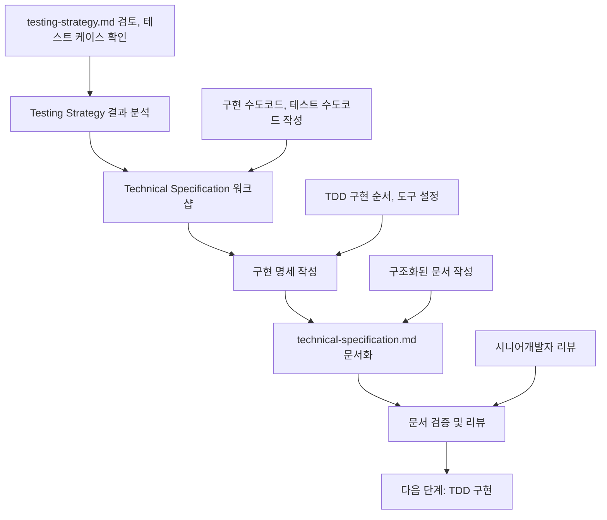

# Technical Specification 작성 가이드

이 문서는 **Testing Strategy 결과**를 바탕으로 **Technical Specification**을 정의하고 **technical-specification.md 문서 작성**까지, 의사결정 참여자들이 순서대로 따라할 수 있는 **Technical Specification 전용 프로세스**를 설명합니다.

> 시작 전, `docs/event-domain-design/template/technical-specification-template.md` 파일을 복사해 도메인 전용 `technical-specification.md` 초안을 생성한 뒤, 아래 단계에 따라 내용을 채워 넣으세요.

---

## 🔁 Technical Specification 프로세스 한눈에 보기



Technical Specification은 **Testing Strategy를 기반으로 실제 구현 가능한 수도코드**를 작성하는 핵심 단계입니다.

---

## Phase 1: Testing Strategy 결과 분석 (담당: 시니어개발자)

### 1.1 사전 준비 - 완료된 Testing Strategy 확인

#### 필수 전제 조건:
- [ ] testing-strategy.md 문서가 완성되어 있음
- [ ] Testing Strategy 워크샵이 완료되어 QA의 승인을 받음
- [ ] 모든 테스트 케이스가 정의되어 있음
- [ ] 커버리지 목표가 명확히 설정되어 있음

#### Testing Strategy 결과물 검토:
```bash
# Testing Strategy 문서 확인
cat docs/event-domain-design/domains/<domain-name>/testing-strategy.md

# 주요 확인 포인트:
# - Process Model → Test 매핑
# - Unit/Integration/E2E 테스트 케이스
# - 커버리지 목표
# - TDD 사이클 정의
```

### 1.2 테스트 케이스 목록 추출

#### 테스트 우선순위별 분류:
Testing Strategy에서 정의한 테스트 케이스를 우선순위별로 분류합니다.

**분류 기준**:
- **⭐️⭐️⭐️⭐️⭐️**: 핵심 기능, 반드시 구현
- **⭐️⭐️⭐️⭐️**: 중요 기능, 우선 구현
- **⭐️⭐️⭐️**: 보조 기능, 선택적 구현

#### 예시 결과:
```markdown
| Component | Test Case | 우선순위 | 구현 순서 |
| --------- | --------- | -------- | --------- |
| UserEmail VO | 유효한 이메일로 생성 | ⭐️⭐️⭐️⭐️⭐️ | Phase 1 |
| User Entity | 프로필 업데이트 | ⭐️⭐️⭐️⭐️⭐️ | Phase 2 |
| UserAggregate | createFromSupabaseAuth() | ⭐️⭐️⭐️⭐️⭐️ | Phase 3 |
```

### 1.3 Software Design 재검토

#### Software Design 검토:
```bash
# Software Design 문서 확인
cat docs/event-domain-design/domains/<domain-name>/software-design.md

# 주요 확인 포인트:
# - Aggregate 상세 정의
# - Command와 Event
# - Invariant
# - ACL 설계
```

### 1.4 템플릿 파일 준비
```bash
# Technical Specification 템플릿 복사 (아직 없다면)
cp docs/event-domain-design/template/technical-specification-template.md docs/event-domain-design/domains/<domain-name>/technical-specification.md
```

---

## Phase 2: Technical Specification 워크샵 진행 (담당: 시니어개발자 + 주니어개발자)

### 2.1 워크샵 참여자 및 구조

#### 필수 참여자:
- **주니어 개발자** (리드): 수도코드 작성 및 TDD 구현 준비
- **시니어 개발자** (멘토): 설계 검증 및 코드 리뷰

#### 권장 참여자:
- **다른 주니어 개발자**: 페어 프로그래밍 및 학습

#### 워크샵 시간 배분 (3-4시간):
```
- Phase 1: DDD 컴포넌트 수도코드 작성 (90-120분)
- Phase 2: Service/Repository/ACL 수도코드 작성 (60-90분)
- Phase 3: TDD 구현 순서 정의 (30분)
- 휴식 및 정리 (15-30분)
```

### 2.2 Phase 1: DDD 컴포넌트 수도코드 작성 (90-120분)

**목표**: Testing Strategy의 테스트 케이스를 기반으로 구현 수도코드를 작성합니다.

**핵심 원칙**: 각 컴포넌트마다 **구현 수도코드**를 작성하고, 테스트는 Testing Strategy에서 정의한 케이스를 참조합니다.

#### Part 1: Value Objects (30분)

**구현 수도코드 예시**:
```typescript
class UserEmail {
  private value: string;
  
  constructor(email: string) {
    // 1. 빈 값 검증
    // 2. 이메일 형식 검증 (정규식)
    // 3. 길이 제한 검증 (255자)
    // 4. this.value 할당
  }
  
  equals(other: UserEmail): boolean {
    // 1. 값 비교
    // 2. boolean 반환
  }
}
```

**작성 포인트**:
- 검증 규칙: 길이, 포맷, 허용 문자 등 상세 조건
- 예외 처리: 비즈니스 규칙 위반 시 던질 에러 타입
- **테스트는 Testing Strategy 참조**: testing-strategy.md의 Value Objects 테스트 케이스를 따름

#### Part 2: Entities (30분)

**구현 수도코드 예시**:
```typescript
class User {
  constructor(
    public readonly id: UserId,
    public readonly email: UserEmail,
    public name: string,
    // ...
  ) {}
  
  updateProfile(name: string, avatarUrl: string): void {
    // 1. 입력 검증
    // 2. 이름 업데이트
    // 3. updatedAt 갱신
  }
}
```

**작성 포인트**:
- 생성자 파라미터와 불변 필드 구분
- 상태 변경 메서드와 호출 조건 (권한, 상태 체크 등)
- **테스트는 Testing Strategy 참조**: testing-strategy.md의 Entities 테스트 케이스를 따름

#### Part 3: Aggregates (30-40분)

**구현 수도코드 예시**:
```typescript
class UserAggregate {
  private _user: User;
  private _events: DomainEvent[] = [];
  
  static createFromSupabaseAuth(supabaseUser: SupabaseUser): UserAggregate {
    // 1. 이메일 검증
    // 2. User Entity 생성
    // 3. UserProfileCreatedEvent 발행
    // 4. UserAggregate 반환
  }
  
  updateProfile(name: string, avatarUrl: string): UserUpdatedEvent {
    // 1. User Entity 업데이트
    // 2. UserUpdatedEvent 생성
    // 3. 이벤트 추가
    // 4. 이벤트 반환
  }
}
```

**작성 포인트**:
- 처리하는 Command, 발생시키는 Event를 표로 정리
- Invariant 검증 흐름을 단계별 또는 의사 코드로 작성
- 이벤트 발행 시점 명시
- **테스트는 Testing Strategy 참조**: testing-strategy.md의 Aggregates 테스트 케이스와 Process Model 매핑을 따름

#### Part 4: Commands & Events (10-20분)

**구현 수도코드 예시**:
```typescript
// Command
interface CreateUserProfileCommand {
  supabaseUser: SupabaseUser;
}

// Event
class UserProfileCreatedEvent implements DomainEvent {
  constructor(
    public readonly userId: string,
    public readonly email: string,
    public readonly occurredAt: Date
  ) {}
}
```

**작성 포인트**:
- 입력 스키마(zod 등)와 도메인 Command 변환 과정 설명
- Event payload 구조와 타입 상수 정의
- Cross-Domain 사용 여부, 이벤트 처리 우선순위 메모
- **테스트는 Testing Strategy 참조**: testing-strategy.md의 Commands & Events 테스트 케이스를 따름

#### Part 5: Error Types (10분)

**구현 수도코드 예시**:
```typescript
class UserManagementError extends Error {
  constructor(
    public readonly code: UserManagementErrorCode,
    public readonly message: string,
    public readonly details?: unknown
  ) {
    super(message);
  }
}

type UserManagementErrorCode = 
  | 'USER_NOT_FOUND'
  | 'INVALID_EMAIL_FORMAT'
  | 'SUPABASE_AUTH_FAILED';
```

**작성 포인트**:
- BusinessRuleError, SystemError 등 에러 계층 구조
- 사용자에게 노출될 메시지/코드 매핑
- 로깅 및 모니터링 정책
- **테스트는 Testing Strategy 참조**: testing-strategy.md의 Error Types 테스트 케이스를 따름

### 2.3 Phase 2: Service/Repository/ACL 수도코드 작성 (60-90분)

**목표**: 인프라 레이어와 서비스 레이어의 구현 수도코드를 작성합니다.

#### Part 1: Service 레이어 (25-30분)

**구현 수도코드 예시**:
```typescript
class UserManagementService {
  async createUserProfile(supabaseUser: SupabaseUser): Promise<Result<UserId>> {
    // 1. UserAggregate.createFromSupabaseAuth() 호출
    // 2. UserRepository.save() 호출
    // 3. 이벤트 발행
    // 4. Result.ok(userId) 반환
    // 5. 실패 시 Result.err(error) 반환
  }
}
```

**작성 포인트**:
- 여러 Aggregate를 조율하는 비즈니스 시나리오를 단계별로 작성
- 권한/요금제/정책 검증 지점을 서술
- 실패 시 롤백, 사용자 안내 메시지, 재시도 전략
- **테스트는 Testing Strategy 참조**: testing-strategy.md의 Service 통합 테스트 케이스를 따름

#### Part 2: Repository 레이어 (20-25분)

**구현 수도코드 예시**:
```typescript
interface UserRepository {
  save(user: UserAggregate): Promise<void>;
  findById(userId: UserId): Promise<UserAggregate | null>;
  findByEmail(email: UserEmail): Promise<UserAggregate | null>;
}

class DrizzleUserRepository implements UserRepository {
  async save(user: UserAggregate): Promise<void> {
    // 1. Aggregate → DB 모델 변환
    // 2. Drizzle insert/update 실행
    // 3. RLS 정책 적용 확인
  }
}
```

**작성 포인트**:
- 메서드 시그니처, 반환 타입, 예외 상황 정의
- 낙관적 잠금·트랜잭션이 필요한 시나리오 기술
- 성능 최적화를 위한 인덱스 및 캐싱 전략
- **테스트는 Testing Strategy 참조**: testing-strategy.md의 Repository 통합 테스트 케이스를 따름

#### Part 3: ACL (Anti-Corruption Layer) (15-20분)

**구현 수도코드 예시**:
```typescript
class ClerkOrganizationAdapter {
  toDomainOrganization(clerkOrg: ClerkOrganization): Organization {
    // 1. Clerk Organization → 도메인 모델 변환
    // 2. 유효성 검증
    // 3. Organization 엔티티 반환
  }
}
```

**작성 포인트**:
- 외부 API 응답을 도메인 모델로 변환하는 규칙
- Webhook 수신 → 변환 → 도메인 이벤트 생성 흐름
- **테스트는 Testing Strategy 참조**: testing-strategy.md의 ACL 테스트 케이스를 따름

#### Part 4: Read Models (10-15분)

**구현 수도코드 예시**:
```typescript
interface UserOrganizationView {
  userId: UserId;
  ownedOrganizations: OrganizationSummary[];
  memberOrganizations: OrganizationSummary[];
}

async function getUserOrganizationView(userId: UserId): Promise<UserOrganizationView> {
  // 1. UserRepository.findById()
  // 2. OrganizationRepository.findByOwnerId()
  // 3. 데이터 조합
  // 4. UserOrganizationView 반환
}
```

**작성 포인트**:
- **복잡한 조회 로직**: 여러 Aggregate를 조합한 View 쿼리 설계
- **Database Views vs Repository 조합**: 성능과 유지보수성 고려한 선택
- **캐싱 전략**: Redis, 메모리 캐시 등을 활용한 성능 최적화
- **실시간 업데이트**: 도메인 이벤트 기반 Read Model 갱신 방법
- **테스트는 Testing Strategy 참조**: testing-strategy.md의 Read Models 테스트 케이스를 따름

### 2.4 Phase 3: Server Actions 수도코드 작성 (30분)

**목표**: Server Actions와 Cross-Domain 이벤트 처리의 구현 수도코드를 작성합니다.

#### Part 1: Server Actions (20-25분)

**구현 수도코드 예시**:
```typescript
async function createUserProfileAction(supabaseUser: SupabaseUser): Promise<Result<UserDTO>> {
  // 1. Supabase Auth 인증 확인
  // 2. 의존성 주입 (Repository, Service)
  // 3. Command 생성
  // 4. 도메인 로직 실행
  // 5. DTO 직렬화 및 반환
}
```

**작성 포인트**:
- Supabase Auth를 통한 사용자 인증 확인
- 의존성 주입 패턴으로 Service Layer 활용
- Command 객체 생성 및 Service 메서드 호출
- 도메인 모델 → DTO 직렬화 (Value Object → string, Date → ISO string)
- Next.js 캐시 무효화 (revalidatePath)
- **테스트는 Testing Strategy 참조**: testing-strategy.md의 Server Actions 통합 테스트 케이스를 따름

---

## Phase 3: technical-specification.md 문서 작성 (담당: 주니어개발자)

### 3.1 문서 구조 및 작성 순서

복사한 템플릿을 기반으로 다음 순서로 작성합니다:

#### 1. 📊 Implementation Overview
- 도메인 구현 개요
- Testing Strategy와의 연결점
- TDD 구현 순서 요약

#### 2. 🧩 DDD Components
- Value Objects 수도코드 (구현 + 테스트)
- Entities 수도코드 (구현 + 테스트)
- Aggregates 수도코드 (구현 + 테스트)
- Commands & Events 수도코드
- Error Types 수도코드

#### 3. 🔧 Infrastructure Layer
- Repository 수도코드 (구현 + 테스트)
- ACL 수도코드 (구현 + 테스트)
- Read Models 수도코드

#### 4. 🚀 Application Layer
- Service 수도코드 (구현 + 테스트)
- Server Actions 수도코드 (구현 + 테스트)
- Cross-Domain 이벤트 처리

#### 5. 🎨 UI & Hook 전략
- React Hooks 사용 전략
- UI Component 연동 패턴

#### 6. 📋 TDD 구현 순서
- Phase별 구현 순서
- 커버리지 목표 달성 전략

### 3.2 TDD 구현 순서 정의

**목표**: Testing Strategy를 바탕으로 실제 TDD 구현 순서를 명시합니다.

### 7.1 구현 우선순위

Testing Strategy의 우선순위를 참조하여 구현 순서를 정의:

```markdown
### Phase 1: Value Objects (⭐️⭐️⭐️⭐️⭐️)
1. UserEmail VO
   - 테스트 작성 (RED)
   - 최소 구현 (GREEN)
   - 리팩토링 (REFACTOR)

2. UserId, OrganizationId VO
   - 동일한 TDD 사이클 적용

### Phase 2: Entities (⭐️⭐️⭐️⭐️⭐️)
1. User Entity
2. Organization Entity

### Phase 3: Aggregates (⭐️⭐️⭐️⭐️⭐️)
1. UserAggregate
2. OrganizationAggregate

### Phase 4: Repository (⭐️⭐️⭐️⭐️)
1. UserRepository (통합 테스트)
2. OrganizationRepository (통합 테스트)

### Phase 5: Service (⭐️⭐️⭐️⭐️)
1. UserManagementService (통합 테스트)

### Phase 6: Server Actions (⭐️⭐️⭐️⭐️⭐️)
1. createUserProfileAction (통합 테스트)
2. getUserOrganizationsAction

### Phase 7: E2E Tests (⭐️⭐️⭐️⭐️⭐️)
1. 사용자 등록 플로우
2. 조직 선택 플로우
```

### 7.2 TDD 사이클 적용 방법

각 Phase마다 동일한 사이클 적용:

```bash
# 1. RED: 테스트 먼저 작성
$ touch src/domains/.../value-objects/__tests__/user-email.test.ts
# 테스트 코드 작성
$ pnpm test user-email.test.ts
# 결과: FAIL

# 2. GREEN: 최소 구현
$ touch src/domains/.../value-objects/user-email.vo.ts
# 최소 구현 코드 작성
$ pnpm test user-email.test.ts
# 결과: PASS

# 3. REFACTOR: 코드 개선
# 검증 로직 추가, 코드 정리
$ pnpm test user-email.test.ts
# 결과: PASS (리팩토링 후에도 통과)
```

### 7.3 커버리지 목표 달성 전략

Testing Strategy의 커버리지 목표를 참조:

```markdown
### 레이어별 목표
- Value Objects: 95% 이상 → RED-GREEN-REFACTOR 철저히 적용
- Entities: 95% 이상 → 모든 public 메서드 테스트
- Aggregates: 90% 이상 → 비즈니스 로직 중심 테스트
- Services: 85% 이상 → 통합 테스트로 플로우 검증
- Repositories: 80% 이상 → DB 연동 테스트
- Server Actions: 85% 이상 → 인증, 에러 처리 포함
```

### 7.4 Testing Strategy 참조

**중요**: 이미 작성된 `3.5. testing-strategy.md` 문서를 참조하세요:
- 각 컴포넌트별 테스트 케이스 목록
- Process Model → Test 매핑
- 우선순위 및 커버리지 목표
- 테스트 도구 설정

```bash
# Testing Strategy 확인
$ cat docs/event-domain-design/domains/[domain]/3.5.\ testing-strategy.md
```

---

## Phase 4: 문서 검증 및 리뷰 (담당: 전체 참여자)

### 4.1 리뷰 단계별 체크포인트

#### 시니어개발자 리뷰:
- [ ] 구현 수도코드가 Software Design을 올바르게 반영하는가?
- [ ] 테스트 수도코드가 Testing Strategy를 따르는가?
- [ ] TDD 구현 순서가 합리적인가?
- [ ] 코드 컨벤션을 준수하는가?
- [ ] 모든 Command에 입력 검증 로직이 정의되어 있는가?
- [ ] Repository가 반환하는 Entity의 불변식이 깨지지 않는가?

#### 주니어개발자 리뷰:
- [ ] 수도코드를 이해하고 구현할 수 있는가?
- [ ] TDD 사이클 적용 방법이 명확한가?
- [ ] 테스트 작성 방법이 구체적인가?
- [ ] Given-When-Then 패턴이 일관되게 적용되었는가?

#### 도메인전문가 리뷰:
- [ ] 비즈니스 로직이 정확히 반영되었는가?
- [ ] Invariant 검증이 충분한가?
- [ ] 예외 상황이 적절히 고려되었는가?

### 4.2 Testing Strategy ↔ Technical Specification 일관성 검증

#### 필수 검증 포인트:
- [ ] Testing Strategy의 모든 테스트 케이스가 수도코드로 작성되었는가?
- [ ] 우선순위가 TDD 구현 순서에 반영되었는가?
- [ ] 커버리지 목표가 명확히 정의되었는가?
- [ ] 테스트가 happy path와 edge case를 모두 다루는가?

---

## ✅ Technical Specification 완료 기준

다음 모든 조건이 충족되어야 Technical Specification이 완료된 것으로 간주합니다:

### 워크샵 완료 기준:
- [ ] 모든 DDD 컴포넌트의 구현 수도코드 작성 완료
- [ ] 모든 DDD 컴포넌트의 테스트 수도코드 작성 완료
- [ ] TDD 구현 순서 정의 완료
- [ ] 커버리지 목표 달성 전략 수립 완료

### 문서 완료 기준:
- [ ] technical-specification.md의 모든 필수 섹션이 작성됨
- [ ] Testing Strategy와의 일관성이 확인됨
- [ ] 시니어개발자의 검증 완료
- [ ] TDD 구현을 위한 충분한 정보 확보
- [ ] Git에 체계적으로 커밋되고 PR이 승인됨

---

## 🚀 다음 단계: TDD 구현으로 연결

Technical Specification이 완료되면 다음 단계를 진행할 수 있습니다:

### TDD 구현 준비:
1. **TDD Implementation 가이드 참조**: `docs/event-domain-design/guide/07-tdd-implementation-guide.md`
2. **RED-GREEN-REFACTOR 사이클 적용**: Technical Specification의 수도코드를 실제 코드로 구현
3. **워크샵 참여자 유지**: 주니어개발자 (시니어개발자 멘토링)

### 연결 정보:
- **입력**: 완성된 technical-specification.md + testing-strategy.md
- **출력**: 실제 구현 코드 + 테스트 코드
- **다음 담당자**: 주니어개발자 (시니어개발자 코드 리뷰)

### TDD 구현에서 진행될 사항:
- **RED 단계**: 테스트 먼저 작성 (실패 확인)
- **GREEN 단계**: 최소 구현 (테스트 통과)
- **REFACTOR 단계**: 코드 개선 (테스트 유지)
- **커버리지 확인**: Testing Strategy의 목표 달성

---

## 📚 관련 문서 및 템플릿

### 참조 가이드:
- [Testing Strategy 가이드](./04-testing-strategy-guide.md)
- [TDD Implementation 가이드](./07-tdd-implementation-guide.md)

### 템플릿 파일:
- [Technical Specification 템플릿](../template/technical-specification-template.md)

### 예시 문서:
- [User Management Domain 예시](../domains/user-management-domain/technical-specification.md)

---

## 💡 성공을 위한 핵심 팁

### 워크샵 성공 팁:
- **주니어개발자 주도**: 실제 구현 준비를 위한 수도코드 작성
- **시니어개발자 멘토링**: 설계 검증 및 코드 리뷰
- **Testing Strategy 기반**: 모든 수도코드는 테스트와 함께 작성
- **구체적 수도코드**: 실제 구현 가능한 수준의 구체성

### 문서화 성공 팁:
- **테스트 우선**: 테스트 수도코드를 먼저 작성하고 구현 수도코드 작성
- **Given-When-Then 패턴**: 모든 테스트에 일관되게 적용
- **Testing Strategy 연결성**: Testing Strategy의 결과와 일관성 유지
- **실용적 수도코드**: 주니어개발자가 이해할 수 있는 수준

### 주의사항:
- **테스트 없는 구현 금지**: 모든 구현 수도코드에 테스트 수도코드 필수
- **과도한 세부사항 지양**: 수도코드 레벨 유지 (실제 코드 X)
- **TDD 사이클 준수**: RED-GREEN-REFACTOR 순서 명확히
- **커버리지 목표 명시**: Testing Strategy의 목표를 달성할 수 있는 전략
