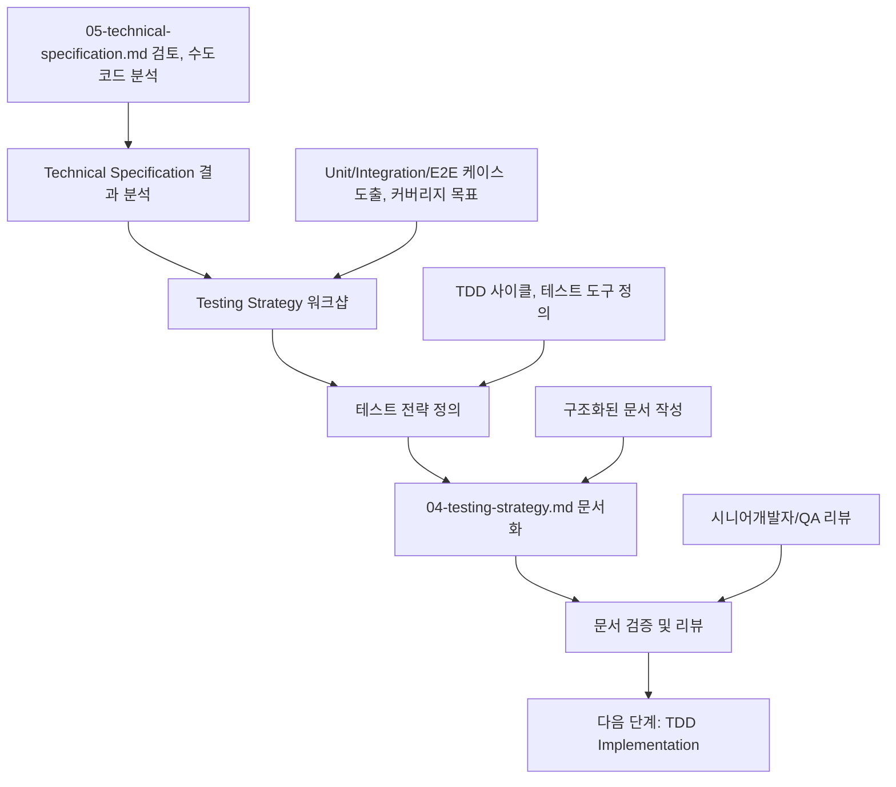

# Testing Strategy 수립 가이드

이 문서는 **Technical Specification 결과**를 바탕으로 **Testing Strategy**를 정의하고 **04-testing-strategy.md 문서 작성**까지, 의사결정 참여자들이 순서대로 따라할 수 있는 **Testing Strategy 전용 프로세스**를 설명합니다.

> 시작 전, `docs/event-domain-design/template/04-testing-strategy-template.md` 파일을 복사해 도메인 전용 `04-testing-strategy.md` 초안을 생성한 뒤, 아래 단계에 따라 내용을 채워 넣으세요.

---

## 🔁 Testing Strategy 프로세스 한눈에 보기



Testing Strategy는 **Technical Specification의 수도코드를 바탕으로 실제 테스트 전략을 수립**하는 핵심 단계입니다.

---

## Phase 1: Technical Specification 결과 분석 (담당: 시니어개발자)

### 1.1 사전 준비 - 완료된 Technical Specification 확인

#### 필수 전제 조건:
- [ ] 04-technical-specification.md 문서가 완성되어 있음
- [ ] Technical Specification 워크샵이 완료되어 시니어개발자의 승인을 받음
- [ ] 모든 DDD 컴포넌트의 수도코드가 작성되어 있음
- [ ] 기본 테스트 수도코드가 포함되어 있음

#### Technical Specification 결과물 검토:
```bash
# Technical Specification 문서 확인
cat docs/event-domain-design/domains/<domain-name>/04-technical-specification.md

# 주요 확인 포인트:
# - 모든 DDD 컴포넌트의 구현 수도코드
# - 기본 테스트 수도코드 (Given-When-Then)
# - TDD 구현 순서 정의
# - ACL 및 Infrastructure Layer 수도코드
```

### 1.2 Technical Specification 수도코드 분석

#### 구현 수도코드 분석:
Technical Specification에 정의된 모든 구현 수도코드를 분석합니다.

**분석 항목**:
- **DDD 컴포넌트**: Value Objects, Entities, Aggregates의 수도코드
- **테스트 수도코드**: Given-When-Then 패턴으로 작성된 기본 테스트
- **Infrastructure Layer**: Repository, Service, ACL의 수도코드
- **Application Layer**: Server Actions의 수도코드

#### 예시 결과:
```markdown
| Component | 구현 수도코드 | 기본 테스트 수도코드 | 우선순위 |
| --------- | ------------- | ------------------ | -------- |
| Position VO | 좌표 검증 로직 포함 | 유효/무효 좌표 테스트 | ⭐️⭐️⭐️⭐️⭐️ |
| Canvas Aggregate | 캔버스 초기화 로직 | 초기화 성공/실패 테스트 | ⭐️⭐️⭐️⭐️⭐️ |
| CanvasRepository | Drizzle ORM 연동 | 저장/조회 테스트 | ⭐️⭐️⭐️⭐️ |
```

### 1.3 Process Model 및 Technical Specification 연계 분석

#### Process Model과 Technical Specification의 연계 분석:
```bash
# Process Model 문서 확인
cat docs/event-domain-design/domains/<domain-name>/02-process-model.md
# Technical Specification 문서 확인  
cat docs/event-domain-design/domains/<domain-name>/04-technical-specification.md

# 주요 확인 포인트:
# - Process Model의 각 Scenario가 Technical Specification의 수도코드와 매핑되는지
# - 구현 수도코드가 Process Model의 모든 시나리오를 커버하는지
# - 기본 테스트 수도코드가 Process Model의 핵심 플로우를 검증하는지
```

#### 매핑 준비:
Technical Specification의 수도코드를 바탕으로 체계적인 테스트 전략을 수립할 준비를 합니다.

### 1.4 템플릿 파일 준비
```bash
# Testing Strategy 템플릿 복사 (아직 없다면)
cp docs/event-domain-design/template/05-testing-strategy-template.md docs/event-domain-design/domains/<domain-name>/05-testing-strategy.md
```

---

## Phase 2: Testing Strategy 워크샵 진행 (담당: 시니어개발자 + QA)

### 2.1 워크샵 참여자 및 구조

#### 필수 참여자:
- **시니어 개발자** (리드): 테스트 전략 설계 및 우선순위 결정
- **QA** (있는 경우): 테스트 시나리오 검증 및 E2E 테스트 설계
- **주니어 개발자**: TDD 적용 방법 학습

#### 권장 참여자:
- **도메인 전문가**: 비즈니스 규칙 검증
- **PM**: 우선순위 확인

#### 워크샵 시간 배분 (2-3시간):
```
- Phase 1: Process Model → Test 매핑 (40-50분)
- Phase 2: Unit/Integration/E2E 케이스 도출 (60-70분)
- Phase 3: 커버리지 목표 및 TDD 사이클 정의 (30-40분)
- 휴식 및 정리 (15-30분)
```

### 2.2 Phase 1: Technical Specification → Test 전략 매핑 (40-50분)

**목표**: Technical Specification의 수도코드를 바탕으로 체계적인 테스트 전략을 수립합니다.

#### 진행 방법:
1. **수도코드 분석**: Technical Specification의 모든 구현 수도코드를 확인
2. **기본 테스트 확장**: 기본 테스트 수도코드를 상세 테스트 케이스로 확장
3. **테스트 종류 할당**: Unit, Integration, E2E로 분류 및 우선순위 설정
4. **커버리지 목표**: 각 레이어별 커버리지 목표 설정

#### 매핑 템플릿:
```markdown
| Technical Specification 요소 | 테스트 종류 | 테스트 케이스 | 우선순위 |
|---------------------------|------------|-------------|---------|
| [ValueObject] VO | Unit | [ValueObject] 생성/검증 테스트 | ⭐️⭐️⭐️⭐️⭐️ |
| [Entity] Entity | Unit | [Entity] 비즈니스 로직 테스트 | ⭐️⭐️⭐️⭐️⭐️ |
| [Aggregate] Aggregate | Unit | [Aggregate] Command/Event 테스트 | ⭐️⭐️⭐️⭐️⭐️ |
| [Repository] Repository | Integration | DB 연동 테스트 | ⭐️⭐️⭐️⭐️ |
| [Service] Service | Integration | 비즈니스 플로우 테스트 | ⭐️⭐️⭐️⭐️ |
| [Action] ServerAction | Integration | 인증/권한 테스트 | ⭐️⭐️⭐️⭐️⭐️ |
| 전체 사용자 플로우 | E2E | [시나리오 설명] | ⭐️⭐️⭐️⭐️⭐️ |
```

#### 예시 결과:
```markdown
### Scenario 0: 유저 가입 및 온보딩

| Process Model 요소 | 테스트 종류 | 테스트 케이스 | 우선순위 |
|-------------------|------------|-------------|---------|
| Command: 유저 가입 처리 | Unit | UserAggregate.createFromSupabaseAuth() | ⭐️⭐️⭐️⭐️⭐️ |
| System: Profile System | Unit | UserAggregate 프로필 생성 | ⭐️⭐️⭐️⭐️⭐️ |
| Event: 유저 프로필 생성됨 | Unit | UserProfileCreatedEvent 발행 | ⭐️⭐️⭐️⭐️ |
| 전체 플로우 | Integration | processUserRegistrationAction() | ⭐️⭐️⭐️⭐️⭐️ |
| 사용자 경험 | E2E | 구글 로그인 → 프로필 생성 → 조직 선택 | ⭐️⭐️⭐️⭐️⭐️ |
```

### 2.3 Phase 2: Unit/Integration/E2E 케이스 도출 (60-70분)

**목표**: 각 테스트 레벨별로 구체적인 테스트 케이스를 도출합니다.

#### Part 1: Unit Test 케이스 (30분)

**Value Objects 테스트 케이스**:
```typescript
describe('[ValueObjectName] Value Object', () => {
  describe('생성자', () => {
    it('유효한 값으로 생성되어야 한다')
    it('잘못된 값에 대해 예외를 발생시켜야 한다')
    it('[경계값 케이스]')
  })
  
  describe('[메서드명]', () => {
    it('[기대 동작]')
  })
})
```

**Aggregates 테스트 케이스**:
```typescript
describe('[AggregateName]', () => {
  describe('[팩토리메서드]', () => {
    it('[정상 케이스]로부터 생성되어야 한다')
    it('[예외 케이스]에 대해 예외를 발생시켜야 한다')
    it('[Event]가 발행되어야 한다')
  })
  
  describe('[Command처리메서드]', () => {
    it('[비즈니스 로직]이 수행되어야 한다')
    it('[Event]가 발행되어야 한다')
    it('[불변식]이 유지되어야 한다')
  })
})
```

#### Part 2: Integration Test 케이스 (20분)

**Repository 통합 테스트**:
```typescript
describe('[RepositoryName] Integration Tests', () => {
  beforeEach(async () => {
    await cleanDatabase();
  })
  
  describe('save', () => {
    it('[Entity]를 데이터베이스에 저장해야 한다')
    it('RLS 정책이 적용되어야 한다')
  })
})
```

**Server Actions 통합 테스트**:
```typescript
describe('[actionName]', () => {
  it('인증된 사용자의 [작업]을 수행해야 한다')
  it('미인증 사용자는 거부해야 한다')
  it('성공 시 Result.ok를 반환해야 한다')
})
```

#### Part 3: E2E Test 시나리오 (10-20분)

**시나리오 작성 템플릿**:
```typescript
test('[시나리오 설명]', async ({ page }) => {
  // Given: [초기 상태]
  await page.goto('[URL]');
  
  // When: [사용자 액션]
  await page.click('[selector]');
  
  // Then: [기대 결과]
  await expect(page.locator('[selector]')).toBeVisible();
})
```

### 2.4 Phase 3: 커버리지 목표 및 TDD 사이클 정의 (30-40분)

**목표**: 레이어별 커버리지 목표를 설정하고 TDD 적용 방법을 정의합니다.

#### Part 1: 커버리지 목표 설정

**레이어별 목표**:
| 레이어 | 목표 커버리지 | 우선순위 |
|--------|--------------|---------|
| Value Objects | 95% 이상 | ⭐️⭐️⭐️⭐️⭐️ |
| Entities | 95% 이상 | ⭐️⭐️⭐️⭐️⭐️ |
| Aggregates | 90% 이상 | ⭐️⭐️⭐️⭐️⭐️ |
| Services | 85% 이상 | ⭐️⭐️⭐️⭐️ |
| Repositories | 80% 이상 | ⭐️⭐️⭐️⭐️ |
| Server Actions | 85% 이상 | ⭐️⭐️⭐️⭐️⭐️ |

#### Part 2: TDD 사이클 정의

**RED-GREEN-REFACTOR 패턴**:
```typescript
// 1. RED: 테스트 먼저 작성
describe('[Component]', () => {
  it('[기대 동작]', () => {
    // Given-When-Then
  })
})
// 실행: FAIL

// 2. GREEN: 최소 구현
// 실행: PASS

// 3. REFACTOR: 코드 개선
// 실행: PASS (여전히!)
```

---

## Phase 3: testing-strategy.md 문서 작성 (담당: 시니어개발자)

### 3.1 문서 구조 및 작성 순서

복사한 템플릿을 기반으로 다음 순서로 작성합니다:

#### 1. 📊 Testing Strategy Overview
- 테스트 전략 개요
- Process Model과의 연결점
- 커버리지 목표 요약

#### 2. 🗺️ Process Model → Test 매핑
- 워크샵에서 정의한 매핑 테이블
- 시나리오별 테스트 케이스 목록

#### 3. 🧪 Unit Tests 전략
- Value Objects 테스트 케이스
- Entities 테스트 케이스
- Aggregates 테스트 케이스

#### 4. 🔗 Integration Tests 전략
- Repository 통합 테스트
- Service 통합 테스트
- Server Actions 통합 테스트

#### 5. 🎭 E2E Tests 전략
- 핵심 사용자 시나리오
- 에러 시나리오
- 경계 케이스

#### 6. 📈 커버리지 목표 및 TDD 사이클
- 레이어별 커버리지 목표
- TDD 구현 순서
- RED-GREEN-REFACTOR 예시

#### 7. ⚙️ 테스트 도구 및 설정
- 테스트 프레임워크
- 테스트 환경
- CI/CD 설정

### 3.2 Unit Tests 전략 작성

#### Value Objects 테스트 케이스:
```typescript
describe('[ValueObjectName] Value Object', () => {
  describe('생성자', () => {
    it('유효한 값으로 생성되어야 한다')
    it('잘못된 값에 대해 예외를 발생시켜야 한다')
    it('[경계값 케이스]')
  })
  
  describe('[메서드명]', () => {
    it('[기대 동작]')
  })
})
```

**우선순위 설정**:
- ⭐️⭐️⭐️⭐️⭐️: 핵심 Value Object (ID, Email 등)
- ⭐️⭐️⭐️⭐️: 비즈니스 로직이 있는 VO
- ⭐️⭐️⭐️: 단순 래퍼 VO

#### Entities 테스트 케이스:
```typescript
describe('[EntityName] Entity', () => {
  describe('생성', () => {
    it('모든 필수 속성으로 생성되어야 한다')
    it('[특수 조건]에서 생성되어야 한다')
  })
  
  describe('[메서드명]', () => {
    it('[비즈니스 규칙]이 적용되어야 한다')
    it('[부작용]이 발생해야 한다')
  })
})
```

#### Aggregates 테스트 케이스:
```typescript
describe('[AggregateName]', () => {
  describe('[팩토리메서드]', () => {
    it('[정상 케이스]로부터 생성되어야 한다')
    it('[예외 케이스]에 대해 예외를 발생시켜야 한다')
    it('[Event]가 발행되어야 한다')
  })
  
  describe('[Command처리메서드]', () => {
    it('[비즈니스 로직]이 수행되어야 한다')
    it('[Event]가 발행되어야 한다')
    it('[불변식]이 유지되어야 한다')
  })
})
```

### 3.3 Integration Tests 전략 작성

#### Repository 통합 테스트:
```typescript
describe('[RepositoryName] Integration Tests', () => {
  beforeEach(async () => {
    await cleanDatabase();
  })
  
  describe('save', () => {
    it('[Entity]를 데이터베이스에 저장해야 한다')
    it('중복 [제약조건]은 거부해야 한다')
    it('RLS 정책이 적용되어야 한다')
  })
  
  describe('findById', () => {
    it('ID로 [Entity]를 찾아야 한다')
    it('존재하지 않는 ID는 null을 반환해야 한다')
  })
})
```

#### Service 통합 테스트:
```typescript
describe('[ServiceName] Integration Tests', () => {
  describe('[메서드명]', () => {
    it('[정상 플로우]를 완료해야 한다')
    it('[예외 상황]에서 적절히 처리해야 한다')
    it('[트랜잭션]이 올바르게 동작해야 한다')
  })
})
```

#### Server Actions 통합 테스트:
```typescript
describe('[actionName]', () => {
  it('인증된 사용자의 [작업]을 수행해야 한다')
  it('미인증 사용자는 거부해야 한다')
  it('성공 시 Result.ok를 반환해야 한다')
  it('실패 시 Result.err를 반환해야 한다')
})
```

**우선순위 설정**:
- ⭐️⭐️⭐️⭐️⭐️: Server Actions (클라이언트 접점)
- ⭐️⭐️⭐️⭐️: Service (비즈니스 로직 조율)
- ⭐️⭐️⭐️⭐️: Repository (데이터 접근)

### 3.4 E2E Tests 전략 작성

#### 핵심 시나리오 선정:
Process Model의 각 Scenario를 E2E 테스트로 전환합니다.

**선정 기준**:
- 비즈니스 크리티컬한 플로우
- 사용자가 자주 사용하는 기능
- 과거 버그가 발생했던 영역

#### 시나리오 작성 템플릿:
```typescript
test('[시나리오 설명]', async ({ page }) => {
  // Given: [초기 상태]
  await page.goto('[URL]');
  
  // When: [사용자 액션]
  await page.click('[selector]');
  
  // Then: [기대 결과]
  await expect(page.locator('[selector]')).toBeVisible();
  
  // When: [다음 액션]
  await page.fill('[selector]', '[value]');
  
  // Then: [최종 결과]
  await expect(page).toHaveURL('[expected-url]');
})
```

**우선순위 설정**:
- ⭐️⭐️⭐️⭐️⭐️: 핵심 사용자 플로우
- ⭐️⭐️⭐️⭐️: 중요 에러 시나리오
- ⭐️⭐️⭐️: 보조 기능

### 3.5 커버리지 목표 및 TDD 사이클 작성

#### 레이어별 커버리지 목표:
| 레이어 | 목표 커버리지 | 우선순위 |
|--------|--------------|---------|
| Value Objects | 95% 이상 | ⭐️⭐️⭐️⭐️⭐️ |
| Entities | 95% 이상 | ⭐️⭐️⭐️⭐️⭐️ |
| Aggregates | 90% 이상 | ⭐️⭐️⭐️⭐️⭐️ |
| Services | 85% 이상 | ⭐️⭐️⭐️⭐️ |
| Repositories | 80% 이상 | ⭐️⭐️⭐️⭐️ |
| Server Actions | 85% 이상 | ⭐️⭐️⭐️⭐️⭐️ |
| UI Components | 70% 이상 | ⭐️⭐️⭐️ |

#### TDD 구현 순서:
```markdown
### Phase 1: Value Objects (⭐️⭐️⭐️⭐️⭐️)
1. UserEmail VO → RED-GREEN-REFACTOR
2. UserId, OrganizationId VO

### Phase 2: Entities (⭐️⭐️⭐️⭐️⭐️)
1. User Entity
2. Organization Entity

### Phase 3: Aggregates (⭐️⭐️⭐️⭐️⭐️)
1. UserAggregate
2. OrganizationAggregate

### Phase 4-7: Repository, Service, Server Actions, E2E
```

#### TDD 사이클 예시:
```typescript
// 1. RED: 테스트 먼저 작성
describe('UserEmail', () => {
  it('유효한 값으로 생성되어야 한다', () => {
    const email = new UserEmail('test@example.com');
    expect(email.value).toBe('test@example.com');
  })
})
// 실행: FAIL

// 2. GREEN: 최소 구현
export class UserEmail {
  constructor(public readonly value: string) {}
}
// 실행: PASS

// 3. REFACTOR: 검증 로직 추가
export class UserEmail {
  constructor(public readonly value: string) {
    if (!this.isValid(value)) throw new Error('Invalid email');
  }
  private isValid(value: string): boolean { /* ... */ }
}
// 실행: PASS
```

### 3.6 테스트 도구 및 설정 정리

#### 테스트 프레임워크:
```markdown
### Unit & Integration Tests
- **프레임워크**: Vitest
- **Assertion**: expect (Vitest 내장)
- **Mock**: vi (Vitest 내장)
- **커버리지**: v8

### E2E Tests
- **프레임워크**: Playwright
- **브라우저**: Chromium, Firefox, WebKit
- **스크린샷**: 실패 시 자동 캡처
- **비디오**: 실패 시 자동 녹화

### 테스트 데이터베이스
- **로컬**: PostgreSQL (Docker)
- **CI/CD**: Supabase 테스트 인스턴스
- **정리 전략**: 각 테스트 후 데이터 완전 삭제
```

### 3.7 품질 검증 체크리스트

#### 일관성 검증:
- [ ] Process Model의 모든 시나리오가 테스트 케이스로 매핑되었는가?
- [ ] Software Design의 모든 Aggregate가 테스트 계획에 포함되었는가?
- [ ] 핵심 불변식이 테스트로 검증 가능한가?

#### 완전성 검증:
- [ ] 모든 Happy Path가 커버되는가?
- [ ] 주요 에러 시나리오가 테스트되는가?
- [ ] 경계값 테스트가 포함되어 있는가?
- [ ] 커버리지 목표를 달성할 수 있는가?

#### 실용성 검증:
- [ ] 테스트는 독립적으로 실행 가능한가?
- [ ] 테스트는 빠르게 실행되는가? (Unit < 100ms, Integration < 1s)
- [ ] 테스트는 반복 실행해도 동일한 결과를 내는가?
- [ ] 테스트 실패 시 원인을 명확히 알 수 있는가?

---

## Phase 4: 문서 검증 및 리뷰 (담당: 전체 참여자)

### 4.1 리뷰 단계별 체크포인트

#### 시니어개발자 리뷰:
- [ ] Process Model → Test 매핑이 정확한가?
- [ ] 테스트 우선순위가 합리적인가?
- [ ] 커버리지 목표가 달성 가능한가?
- [ ] TDD 사이클이 명확히 정의되었는가?

#### QA 리뷰 (있는 경우):
- [ ] E2E 테스트 시나리오가 실제 사용자 여정을 커버하는가?
- [ ] 에러 시나리오가 충분히 고려되었는가?
- [ ] 테스트 데이터 관리 전략이 적절한가?

#### 도메인전문가 리뷰:
- [ ] 비즈니스 규칙이 테스트로 검증 가능한가?
- [ ] Invariant 테스트가 충분한가?

#### 주니어개발자 리뷰:
- [ ] TDD 사이클을 이해하고 적용할 수 있는가?
- [ ] 테스트 작성 방법이 명확한가?

### 4.2 Software Design ↔ Testing Strategy 일관성 검증

#### 필수 검증 포인트:
- [ ] Software Design의 모든 Aggregate가 테스트에 포함되었는가?
- [ ] Invariant가 모두 테스트로 검증되는가?
- [ ] Process Model의 모든 Scenario가 E2E 테스트로 매핑되었는가?
- [ ] 동일한 도메인 언어가 일관되게 사용되고 있는가?

---

## ✅ Testing Strategy 완료 기준

다음 모든 조건이 충족되어야 Testing Strategy가 완료된 것으로 간주합니다:

### 워크샵 완료 기준:
- [ ] Technical Specification → Test 전략 매핑 완료
- [ ] Unit/Integration/E2E 테스트 케이스 도출 완료
- [ ] 커버리지 목표 설정 완료
- [ ] TDD 사이클 정의 완료

### 문서 완료 기준:
- [ ] 05-testing-strategy.md의 모든 필수 섹션이 작성됨
- [ ] Technical Specification과의 일관성이 확인됨
- [ ] 시니어개발자와 QA의 검증 완료
- [ ] TDD 구현을 위한 충분한 정보 확보
- [ ] Git에 체계적으로 커밋되고 PR이 승인됨

---

## 🚀 다음 단계: TDD Implementation으로 연결

Testing Strategy가 완료되면 다음 단계를 진행할 수 있습니다:

### TDD Implementation 준비:
1. **TDD Implementation 가이드 참조**: `docs/event-domain-design/guide/07-tdd-implementation-guide.md`
2. **RED-GREEN-REFACTOR 사이클 적용**: Technical Specification의 수도코드를 실제 코드로 구현
3. **워크샵 참여자**: 주니어개발자 (시니어개발자 코드 리뷰)

### 연결 정보:
- **입력**: 완성된 04-technical-specification.md + 05-testing-strategy.md
- **출력**: 실제 구현 코드 + 테스트 코드
- **다음 담당자**: 주니어개발자 (시니어개발자 코드 리뷰)

### TDD Implementation에서 해결될 사항:
- **RED 단계**: 테스트 먼저 작성 (실패 확인)
- **GREEN 단계**: 최소 구현 (테스트 통과)
- **REFACTOR 단계**: 코드 개선 (테스트 유지)
- **커버리지 확인**: Testing Strategy의 목표 달성

---

## 📚 관련 문서 및 템플릿

### 참조 가이드:
- [Software Design 가이드](./03-software-design-guide.md)
- [Technical Specification 가이드](./04-technical-specification-guide.md)

### 템플릿 파일:
- [Testing Strategy 템플릿](../template/05-testing-strategy-template.md)

### 예시 문서:
- [User Management Domain 예시](../domains/user-management-domain/testing-strategy.md)

---

## 💡 성공을 위한 핵심 팁

### 워크샵 성공 팁:
- **시니어개발자 주도**: 테스트 전략 및 TDD 사이클을 명확히 정의
- **QA 참여**: 실제 사용자 시나리오와 에러 케이스 검증
- **Technical Specification 기반**: 수도코드를 바탕으로 체계적인 테스트 전략 수립
- **우선순위 명확히**: 제한된 시간에 핵심 기능부터 테스트

### 문서화 성공 팁:
- **구체적 테스트 케이스**: Given-When-Then 패턴 일관 적용
- **명확한 우선순위**: 별점으로 우선순위 표시
- **Technical Specification 연결성**: 수도코드의 구현 로직을 테스트로 검증
- **실용적 목표**: 달성 가능한 커버리지 목표 설정

### 주의사항:
- **테스트 독립성**: 각 테스트는 독립적으로 실행 가능해야 함
- **빠른 실행**: Unit Test는 100ms 이하, Integration은 1s 이하
- **명확한 실패**: 테스트 실패 시 원인을 즉시 파악 가능해야 함
- **TDD 우선**: Testing Strategy 없이 구현 시작 금지