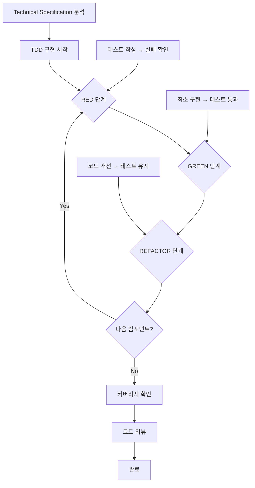

# TDD 기반 구현 가이드

이 문서는 **Technical Specification 결과**를 바탕으로 **TDD 사이클**을 적용하여 **실제 코드를 구현**하는 프로세스를 설명합니다. 주니어 개발자가 단계별로 따라할 수 있도록 작성되었습니다.

> Technical Specification 문서를 기반으로 **RED-GREEN-REFACTOR** 사이클을 적용하여 실제 코드를 작성하세요.

---

## 🔁 TDD 구현 프로세스 한눈에 보기



TDD 구현은 **Technical Specification의 수도코드를 실제 코드로 전환**하는 핵심 단계입니다.

---

## 🎯 TDD 기본 원칙

### TDD 사이클 (RED-GREEN-REFACTOR)

```
1. 🔴 RED: 실패하는 테스트 작성
   ↓
2. 🟢 GREEN: 테스트를 통과하는 최소 코드 작성
   ↓
3. 🔵 REFACTOR: 코드 개선 (테스트는 여전히 통과)
   ↓
   반복 →
```

### 핵심 규칙

1. **테스트 없이 코드를 작성하지 않는다**
2. **실패하는 테스트를 먼저 본다** (RED 확인)
3. **테스트를 통과하는 최소 코드만 작성한다**
4. **리팩토링 시 테스트가 깨지면 안 된다**
5. **커밋 전 모든 테스트를 실행한다**

---

## Phase 1: Technical Specification 분석 (담당: 주니어개발자)

### 1.1 사전 준비 - 완료된 Technical Specification 확인

#### 필수 전제 조건:
- [ ] technical-specification.md 문서가 완성되어 있음
- [ ] Technical Specification 워크샵이 완료되어 시니어개발자의 승인을 받음
- [ ] 구현 수도코드와 테스트 수도코드가 모두 작성되어 있음
- [ ] TDD 구현 순서가 명확히 정의되어 있음

#### Technical Specification 결과물 검토:
```bash
# Technical Specification 문서 확인
cat docs/event-domain-design/domains/<domain-name>/technical-specification.md

# 주요 확인 포인트:
# - DDD 컴포넌트별 구현 수도코드
# - 테스트 수도코드 (Given-When-Then)
# - TDD 구현 순서
# - 커버리지 목표
```

### 1.2 구현 순서 확인

#### Phase별 구현 순서 (Technical Specification 참조):
```markdown
Phase 1: Value Objects (⭐️⭐️⭐️⭐️⭐️)
Phase 2: Entities (⭐️⭐️⭐️⭐️⭐️)
Phase 3: Aggregates (⭐️⭐️⭐️⭐️⭐️)
Phase 4: Repository (⭐️⭐️⭐️⭐️)
Phase 5: Service (⭐️⭐️⭐️⭐️)
Phase 6: Server Actions (⭐️⭐️⭐️⭐️⭐️)
Phase 7: E2E Tests (⭐️⭐️⭐️⭐️⭐️)
```

### 1.3 개발 환경 설정

#### 테스트 도구 확인:
```bash
# Vitest 설정 확인
cat vitest.config.ts

# Playwright 설정 확인
cat playwright.config.ts

# 테스트 실행 확인
pnpm test
pnpm test:e2e
```

---

## Phase 2: TDD 사이클 적용 구현 (담당: 주니어개발자)

### 2.1 Value Objects 구현 (RED-GREEN-REFACTOR)

#### Step 1: Technical Specification 확인

**구현 수도코드 및 테스트 수도코드**:
```typescript
// 구현 수도코드
class UserEmail {
  constructor(email: string) {
    // 1. 빈 값 검증
    // 2. 이메일 형식 검증
    // 3. 길이 제한 검증
  }
}

// 테스트 수도코드
describe('UserEmail', () => {
  it('유효한 이메일로 생성', () => {
    // Given: 'test@example.com'
    // When: new UserEmail(email)
    // Then: userEmail.value === email
  })
})
```

#### Step 2: 🔴 RED - 실패하는 테스트 작성

```bash
# 1. 테스트 파일 생성
cd apps/web
mkdir -p src/domains/user-management/shared/value-objects/__tests__
touch src/domains/user-management/shared/value-objects/__tests__/user-email.test.ts
```

```typescript
// user-email.test.ts
import { describe, it, expect } from 'vitest';
import { UserEmail } from '../user-email.vo';
import { UserManagementError } from '../../errors/user-management.error';

describe('UserEmail Value Object', () => {
  describe('생성자', () => {
    it('유효한 이메일 주소로 생성되어야 한다', () => {
      // Given
      const validEmail = 'test@example.com';

      // When
      const userEmail = new UserEmail(validEmail);

      // Then
      expect(userEmail.value).toBe(validEmail);
    });

    it('잘못된 이메일 형식에 대해 예외를 발생시켜야 한다', () => {
      // Given
      const invalidEmail = 'invalid-email';

      // When & Then
      expect(() => new UserEmail(invalidEmail)).toThrow(UserManagementError);
      expect(() => new UserEmail(invalidEmail)).toThrow('Invalid email format');
    });
  });
});
```

```bash
# 2. 테스트 실행 (실패 확인)
pnpm test user-email.test.ts

# 예상 결과: ❌ FAIL
# - UserEmail 클래스를 찾을 수 없음
```

#### Step 3: 🟢 GREEN - 최소 구현

```bash
# 1. 구현 파일 생성
touch src/domains/user-management/shared/value-objects/user-email.vo.ts
```

```typescript
// user-email.vo.ts (최소 구현)
import { UserManagementError } from '../errors/user-management.error';

export class UserEmail {
  constructor(public readonly value: string) {
    // 최소한의 검증
    if (!value || value.trim().length === 0) {
      throw new UserManagementError(
        'INVALID_EMAIL_FORMAT',
        'Invalid email format'
      );
    }
    
    // 간단한 이메일 정규식
    const emailRegex = /^[^\s@]+@[^\s@]+\.[^\s@]+$/;
    if (!emailRegex.test(value)) {
      throw new UserManagementError(
        'INVALID_EMAIL_FORMAT',
        'Invalid email format'
      );
    }
  }
}
```

```bash
# 2. 테스트 실행 (통과 확인)
pnpm test user-email.test.ts

# 예상 결과: ✅ PASS
```

#### Step 4: 🔵 REFACTOR - 코드 개선

```typescript
// user-email.vo.ts (리팩토링)
import { UserManagementError } from '../errors/user-management.error';

export class UserEmail {
  private static readonly MAX_LENGTH = 255;
  private static readonly EMAIL_REGEX = /^[^\s@]+@[^\s@]+\.[^\s@]+$/;

  constructor(public readonly value: string) {
    this.validate(value);
  }

  private validate(email: string): void {
    if (!email || email.trim().length === 0) {
      throw new UserManagementError(
        'INVALID_EMAIL_FORMAT',
        'Email cannot be empty'
      );
    }

    if (email.length > UserEmail.MAX_LENGTH) {
      throw new UserManagementError(
        'INVALID_EMAIL_FORMAT',
        `Email cannot exceed ${UserEmail.MAX_LENGTH} characters`
      );
    }

    if (!UserEmail.EMAIL_REGEX.test(email)) {
      throw new UserManagementError(
        'INVALID_EMAIL_FORMAT',
        'Invalid email format'
      );
    }
  }

  equals(other: UserEmail): boolean {
    return this.value === other.value;
  }

  getDomain(): string {
    return this.value.split('@')[1];
  }
}
```

```bash
# 3. 리팩토링 후 테스트 실행
pnpm test user-email.test.ts

# 예상 결과: ✅ PASS (여전히 통과!)
```

#### Step 5: 추가 테스트 케이스 작성

```typescript
// user-email.test.ts (추가 테스트)
describe('UserEmail Value Object', () => {
  // ... 기존 테스트 ...

  it('255자를 초과하는 이메일은 거부해야 한다', () => {
    // Given
    const longEmail = 'a'.repeat(250) + '@example.com';

    // When & Then
    expect(() => new UserEmail(longEmail)).toThrow(UserManagementError);
  });

  describe('equals', () => {
    it('동일한 이메일은 같다고 판단되어야 한다', () => {
      // Given
      const email1 = new UserEmail('test@example.com');
      const email2 = new UserEmail('test@example.com');

      // When & Then
      expect(email1.equals(email2)).toBe(true);
    });
  });

  describe('getDomain', () => {
    it('이메일에서 도메인을 추출해야 한다', () => {
      // Given
      const email = new UserEmail('user@example.com');

      // When
      const domain = email.getDomain();

      // Then
      expect(domain).toBe('example.com');
    });
  });
});
```

```bash
# 4. 전체 테스트 실행
pnpm test user-email.test.ts

# 예상 결과: ✅ PASS (모든 테스트 통과)
```

#### Step 6: 커밋 및 다음 컴포넌트

```bash
# 1. 커버리지 확인
pnpm test:coverage user-email.test.ts

# 목표: Value Objects 95% 이상

# 2. Git 커밋
git add src/domains/user-management/shared/value-objects/user-email.vo.ts
git add src/domains/user-management/shared/value-objects/__tests__/user-email.test.ts
git commit -m "test(user-email): add UserEmail value object with TDD

- Implement email validation logic
- Add comprehensive test cases
- Achieve 95%+ coverage for Value Object"
```

### 2.2 Entities, Aggregates, Repository, Service, Server Actions 구현

**동일한 TDD 사이클 적용**:
각 Phase마다 동일한 RED-GREEN-REFACTOR 패턴을 적용합니다.

#### Phase 2: Entities
1. Entity 테스트 작성 (RED)
2. Entity 구현 (GREEN)
3. 비즈니스 로직 개선 (REFACTOR)
4. 커밋

#### Phase 3: Aggregates
1. Aggregate 테스트 작성 (RED)
2. Aggregate 구현 (GREEN)
3. 이벤트 발행 로직 개선 (REFACTOR)
4. 커밋

#### Phase 4-6: Repository, Service, Server Actions (통합 테스트)
1. 통합 테스트 작성 (RED)
2. 구현 (GREEN)
3. 트랜잭션/에러 처리 개선 (REFACTOR)
4. 커밋

#### Phase 7: E2E Tests
1. 사용자 시나리오 테스트 작성 (RED)
2. UI + 전체 플로우 구현 (GREEN)
3. UX 개선 (REFACTOR)
4. 커밋

### 2.3 TDD 사이클 예시: Entities 구현

#### Entity 테스트 작성 (RED)

```typescript
// user.entity.test.ts
import { describe, it, expect, beforeEach } from 'vitest';
import { User } from '../user.entity';
import { UserId } from '../value-objects/ids.vo';
import { UserEmail } from '../value-objects/user-email.vo';

describe('User Entity', () => {
  let userId: UserId;
  let userEmail: UserEmail;

  beforeEach(() => {
    userId = new UserId('user-123');
    userEmail = new UserEmail('test@example.com');
  });

  describe('생성', () => {
    it('모든 필수 속성으로 생성되어야 한다', () => {
      // Given
      const name = 'Test User';
      const avatarUrl = 'https://example.com/avatar.jpg';

      // When
      const user = new User(userId, userEmail, name, avatarUrl, new Date(), new Date());

      // Then
      expect(user.id).toBe(userId);
      expect(user.email).toBe(userEmail);
      expect(user.name).toBe(name);
      expect(user.avatarUrl).toBe(avatarUrl);
    });

    it('createdAt과 updatedAt이 같아야 한다', () => {
      // Given
      const now = new Date();

      // When
      const user = new User(userId, userEmail, 'Test User', null, now, now);

      // Then
      expect(user.createdAt.getTime()).toBe(user.updatedAt.getTime());
    });
  });

  describe('updateProfile', () => {
    it('프로필 업데이트 시 updatedAt이 갱신되어야 한다', () => {
      // Given
      const user = new User(userId, userEmail, 'Old Name', null, new Date(), new Date());
      const originalUpdatedAt = user.updatedAt;

      // 시간 차이를 만들기 위해 약간 대기
      const sleep = (ms: number) => new Promise(resolve => setTimeout(resolve, ms));
      
      // When
      user.updateProfile('New Name', 'new-avatar.jpg');

      // Then
      expect(user.name).toBe('New Name');
      expect(user.avatarUrl).toBe('new-avatar.jpg');
      expect(user.updatedAt.getTime()).toBeGreaterThan(originalUpdatedAt.getTime());
    });

    it('createdAt은 변경되지 않아야 한다', () => {
      // Given
      const user = new User(userId, userEmail, 'Old Name', null, new Date(), new Date());
      const originalCreatedAt = user.createdAt;

      // When
      user.updateProfile('New Name', 'new-avatar.jpg');

      // Then
      expect(user.createdAt).toBe(originalCreatedAt);
    });
  });
});
```

```bash
# 테스트 실행 (실패)
pnpm test user.entity.test.ts
# ❌ FAIL: User 클래스 없음
```

### 2.2 Entity 구현 (GREEN)

```typescript
// user.entity.ts
import { UserId } from '../value-objects/ids.vo';
import { UserEmail } from '../value-objects/user-email.vo';

export class User {
  constructor(
    public readonly id: UserId,
    public readonly email: UserEmail,
    public name: string,
    public avatarUrl: string | null,
    public readonly createdAt: Date,
    public updatedAt: Date
  ) {}

  updateProfile(name: string, avatarUrl: string | null): void {
    this.name = name;
    this.avatarUrl = avatarUrl;
    this.updatedAt = new Date();
  }

  updateEmail(email: UserEmail): void {
    // 타입을 readonly로 선언했으므로 실제로는 재할당 불가
    // 새로운 User 인스턴스를 생성하거나 설계 재검토 필요
    (this as any).email = email;
    this.updatedAt = new Date();
  }
}
```

```bash
# 테스트 실행 (통과)
pnpm test user.entity.test.ts
# ✅ PASS
```

---

## Phase 3: 커버리지 및 문서 업데이트 (담당: 주니어개발자)

### 3.1 커버리지 확인

#### 전체 커버리지 확인:
```bash
# 전체 테스트 실행
pnpm test

# 커버리지 리포트 생성
pnpm test:coverage

# 결과 확인
open coverage/index.html
```

#### 레이어별 커버리지 검증:
```markdown
Testing Strategy 목표 달성 여부 확인:
- [ ] Value Objects: 95% 이상 달성
- [ ] Entities: 95% 이상 달성
- [ ] Aggregates: 90% 이상 달성
- [ ] Services: 85% 이상 달성
- [ ] Repositories: 80% 이상 달성
- [ ] Server Actions: 85% 이상 달성
```

### 3.2 문서 업데이트

#### Technical Specification 업데이트:
```bash
# 구현 상태 섹션 업데이트
# - 완료된 컴포넌트 체크
# - 커버리지 달성 현황 기록
# - 미완료 항목 및 이유 기록
```

#### Testing Strategy 업데이트:
```bash
# 테스트 결과 섹션 업데이트
# - 실제 커버리지 수치 기록
# - 미달성 목표 분석
# - 개선 계획 수립
```

---

## Phase 4: 코드 리뷰 및 완료 (담당: 전체 참여자)

### 4.1 코드 리뷰 체크리스트

#### 시니어개발자 리뷰:
- [ ] TDD 사이클이 올바르게 적용되었는가?
- [ ] 모든 테스트가 독립적으로 실행되는가?
- [ ] 코드 품질이 기준을 충족하는가?
- [ ] 리팩토링이 적절히 이루어졌는가?

#### 동료 리뷰:
- [ ] 테스트가 이해하기 쉬운가?
- [ ] 코드가 읽기 쉬운가?
- [ ] 비즈니스 로직이 명확한가?

### 4.2 Testing Strategy 검증

#### 필수 검증 포인트:
- [ ] Testing Strategy의 모든 테스트 케이스가 구현되었는가?
- [ ] 커버리지 목표를 달성했는가?
- [ ] RED-GREEN-REFACTOR 사이클이 모든 컴포넌트에 적용되었는가?

---

## ✅ TDD 구현 완료 기준

다음 모든 조건이 충족되어야 TDD 구현이 완료된 것으로 간주합니다:

### 구현 완료 기준:
- [ ] 모든 Phase의 구현 완료
- [ ] 모든 테스트 통과
- [ ] 커버리지 목표 달성
- [ ] 코드 리뷰 승인 완료

### 품질 기준:
- [ ] 모든 테스트가 독립적으로 실행됨
- [ ] 테스트 실행 속도가 적절함 (Unit < 100ms)
- [ ] 린터 에러 없음
- [ ] 문서 업데이트 완료

---

## 🚀 다음 단계

TDD로 구현을 완료했다면:

1. **PR 생성 및 리뷰 요청**
   ```bash
   git push origin feature/[domain-name]
   # GitHub에서 PR 생성
   ```

2. **문서 최종 업데이트**
   - Technical Specification의 "구현 상태" 업데이트
   - Testing Strategy의 커버리지 달성 여부 체크

3. **다음 도메인으로 이동**
   - Testing Strategy의 우선순위에 따라 다음 도메인 개발

---

## 📚 관련 문서 및 템플릿

### 참조 가이드:
- [Technical Specification 가이드](./05-technical-specification-guide.md)
- [Testing Strategy 가이드](./04-testing-strategy-guide.md)

### 예시 문서:
- [User Management Domain 구현 예시](../domains/user-management-domain/)

---

## 💡 성공을 위한 핵심 팁

### TDD 성공 팁:
- **RED 먼저 확인**: 테스트가 실패하는 것을 반드시 확인
- **최소 구현**: GREEN 단계에서는 테스트만 통과하는 최소 코드
- **자신있는 리팩토링**: 테스트가 있으면 두려워하지 말고 개선
- **작은 단위**: 한 번에 하나의 메서드만 TDD

### 구현 성공 팁:
- **커밋 자주**: 각 TDD 사이클마다 의미있는 커밋
- **테스트 먼저**: 절대 구현부터 시작하지 않기
- **페어 프로그래밍**: 막힐 때는 동료와 함께
- **시니어 멘토링**: 어려운 부분은 즉시 질문

### 주의사항:
- **테스트 통과가 목적이 아님**: 품질 좋은 코드가 목적
- **과도한 목업 지양**: 실제 통합 테스트 우선
- **리팩토링 필수**: GREEN만 보고 넘어가지 말기
- **커버리지 집착 금지**: 의미있는 테스트가 중요

### 실무 팁

#### 1. 테스트 먼저의 이점 체감하기

**Before TDD**:
```
구현 → 버그 발견 → 수정 → 또 버그 → 수정 → ...
(불확실성 높음)
```

**After TDD**:
```
테스트 → 구현 → 통과 → 리팩토링 → 여전히 통과!
(확신을 가지고 개발)
```

#### 2. 작은 단계로 나누기

❌ **나쁜 예**: 한 번에 전체 클래스 구현  
✅ **좋은 예**: 하나씩 TDD 사이클 적용

#### 3. 리팩토링 두려워하지 않기

테스트가 있으면 자신있게 리팩토링 가능합니다.

#### 4. 커밋 단위

```bash
# ✅ 좋은 예: TDD 사이클마다 커밋
git commit -m "test(user-email): add UserEmail value object with basic validation"
git commit -m "refactor(user-email): extract validation logic to private method"
```

**핵심 원칙**: 
- 🔴 **RED**: 실패를 먼저 본다
- 🟢 **GREEN**: 최소한으로 통과시킨다  
- 🔵 **REFACTOR**: 자신있게 개선한다

TDD는 처음에는 느리게 느껴지지만, 버그가 적고 유지보수가 쉬운 코드를 만들어줍니다! 🎉