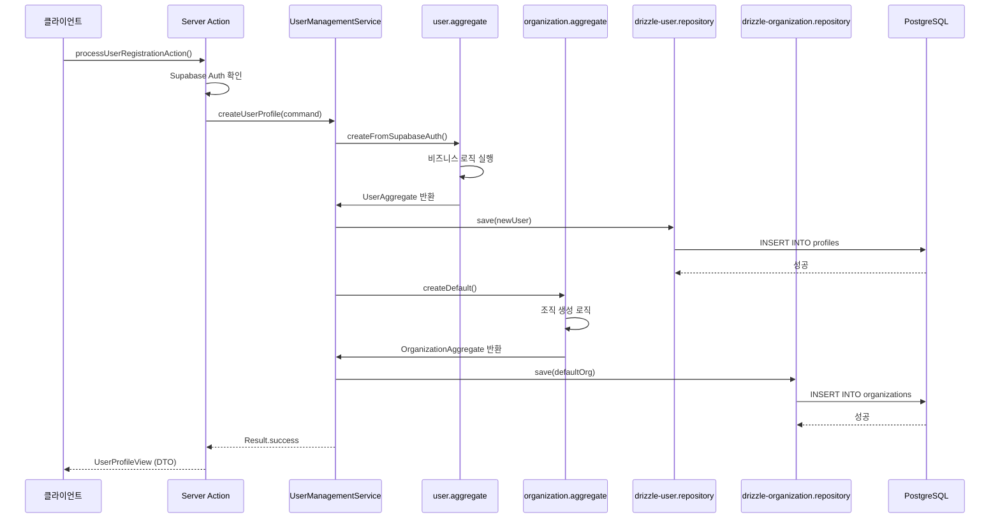
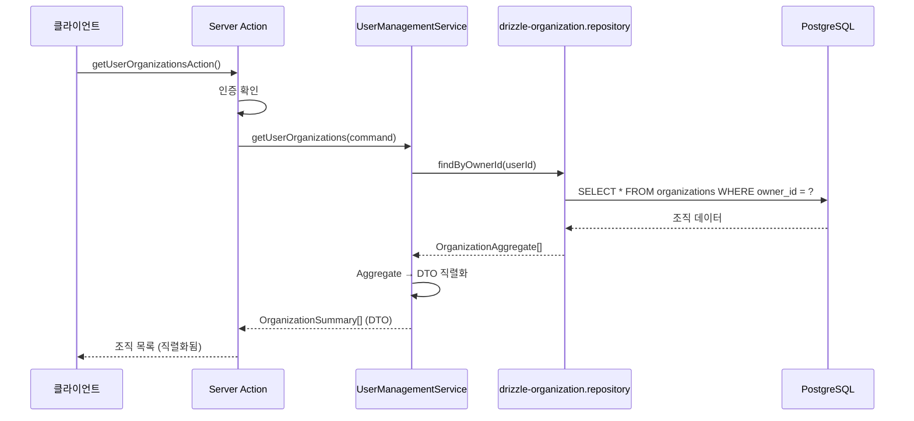

# Architecture Overview - 전체 아키텍처 개요

> 이 문서는 **DDD + CQRS + Repository Pattern** 기반의 전체 아키텍처를 설명합니다.  
> 각 레이어의 책임, 데이터 플로우, 적용된 패턴을 이해하기 위한 개요 문서입니다.

---

## 🎯 참조 가이드

| 주제 | 문서 |
|------|------|
| Event Storming | `1-event-storming-guide.md` |
| Process Model | `2-process-model-guide.md` |
| Software Design | `3-software-design-guide.md` |
| Testing Strategy | `3.5-testing-strategy-guide.md` |
| Technical Specification | `4-technical-specification-guide.md` |
| TDD Implementation | `5-tdd-implementation-guide.md` |
| Frontend Specification | `6-frontend-specification-guide.md` |

---

## 🏗️ 전체 아키텍처 다이어그램

```
┌─────────────────────────────────────────────────────────────────────────────┐
│                              🌐 Client Layer                                │
│  frontend/                                                                  │
│  ├── components/     💻 UI 컴포넌트 (dashboard-sidebar, organization-switcher) │
│  ├── contexts/       🔄 React Context (organization-context.tsx)           │
│  ├── hooks/          🪝 커스텀 훅 (use-organization.ts)                     │
│  └── utils/          🛠️ 유틸리티 (cookie-helpers.ts)                       │
└─────────────────────────────────────────────────────────────────────────────┘
                                        ▲
                            DTO (Plain Objects)
                                        │
┌─────────────────────────────────────────────────────────────────────────────┐
│                          🔗 Application Boundary                             │
│  actions/                                                                   │
│  └── user-management.actions.ts  📡 Next.js Server Actions                 │
│      • 인증 확인                                                             │
│      • 의존성 주입                                                           │
│      • 서비스 조립                                                           │
│      • DTO 반환 (이미 직렬화됨)                                               │
└─────────────────────────────────────────────────────────────────────────────┘
                                        ▲
                            DTO (Plain Objects)
                                        │
┌─────────────────────────────────────────────────────────────────────────────┐
│                           📱 Application Layer                              │
│  backend/services/                                                         │
│  └── user-management.service.ts  🎯 도메인 오케스트레이션                   │
│      • 여러 Aggregate 조율                                                   │
│      • 비즈니스 규칙 확인                                                     │
│      • 트랜잭션 경계 관리                                                     │
│      • Domain Objects → DTO 직렬화                                          │
└─────────────────────────────────────────────────────────────────────────────┘
                                        ▲
                    Domain Objects (Classes)
                                        │
┌─────────────────────────────────────────────────────────────────────────────┐
│                            🏛️ Domain Layer                                  │
│  shared/                                                                    │
│  ├── aggregates/     🧩 비즈니스 로직 핵심 (user.aggregate.ts)            │
│  ├── entities/       📦 도메인 엔티티 (user.entity.ts)                     │
│  ├── value-objects/  🔒 불변 값 객체 (ids.vo.ts, user-email.vo.ts)         │
│  ├── commands/       📋 입력 데이터 구조 (index.ts)                         │
│  ├── events/         📢 도메인 이벤트 (index.ts) - 클래스                  │
│  ├── dtos/           📨 데이터 전송 객체 (index.ts) - 인터페이스            │
│  ├── errors/         ⚠️ 도메인 에러 (user-management.error.ts)             │
│  └── types/          📝 기타 타입 (index.ts)                               │
└─────────────────────────────────────────────────────────────────────────────┘
                                        ▲
                    Domain Objects (Classes)
                                        │
┌─────────────────────────────────────────────────────────────────────────────┐
│                         🗄️ Infrastructure Layer                            │
│  backend/                                                                   │
│  ├── repositories/   💾 데이터 영속성                                      │
│  │   ├── interfaces/    📄 Repository 인터페이스                            │
│  │   └── implementations/ 🎯 Drizzle 구현체                               │
│  │       ├── drizzle-user.repository.ts                                     │
│  │       └── drizzle-organization.repository.ts                             │
│  ├── read-models/    🔍 CQRS Query Side                                   │
│  │   ├── user-profile.view.ts  (DTO 직렬화)                               │
│  │   └── user-organization.view.ts                                          │
│  └── anti-corruption-layers/ 🌉 외부 시스템 통합                          │
│      └── supabase-auth-acl.ts  (Supabase Auth 격리)                       │
└─────────────────────────────────────────────────────────────────────────────┘
                                        ▲
                        SQL Queries (Drizzle ORM)
                                        │
┌─────────────────────────────────────────────────────────────────────────────┐
│                           💾 Database Layer                                 │
│  - Supabase PostgreSQL                                                     │
│  - Drizzle ORM + Schema                                                   │
│  - RLS (Row Level Security) 정책                                           │
│  - Tables: profiles, organizations                                        │
└─────────────────────────────────────────────────────────────────────────────┘
```

---

## 📁 파일 구조 완전 분석

```
domains/user-management/
├── actions/
│   └── user-management.actions.ts        # 📡 Server Actions (Application Boundary)
├── backend/
│   ├── anti-corruption-layers/
│   │   └── supabase-auth-acl.ts          # 🌉 Supabase Auth 통합 계층
│   ├── read-models/
│   │   ├── user-profile.view.ts           # 👤 사용자 프로필 조회 모델
│   │   └── user-organization.view.ts      # 🏢 사용자 조직 조회 모델
│   ├── repositories/
│   │   ├── implementations/
│   │   │   ├── drizzle-user.repository.ts         # 💾 사용자 데이터 접근 구현
│   │   │   └── drizzle-organization.repository.ts # 💾 조직 데이터 접근 구현
│   │   └── interfaces/

│   │       ├── user.repository.interface.ts      # 📄 사용자 Repository 계약
│   │       └── organization.repository.interface.ts # 📄 조직 Repository 계약
│   └── services/
│       └── user-management.service.ts     # 🎯 도메인 서비스 (오케스트레이션)
├── frontend/
│   ├── components/
│   │   ├── dashboard-sidebar.tsx         # 📋 대시보드 사이드바
│   │   ├── organization-selector.tsx      # 🎯 조직 선택기
│   │   ├── organization-switcher.tsx      # 🔄 조직 전환기
│   │   ├── sidebar-footer-settings.tsx   # ⚙️ 사이드바 설정
│   │   └── sidebar-header-group.tsx       # 📊 사이드바 헤더
│   ├── contexts/
│   │   └── organization-context.tsx      # 🔄 조직 전역 상태 관리
│   ├── hooks/
│   │   └── use-organization.ts           # 🪝 조직 관련 커스텀 훅
│   └── utils/
│       └── cookie-helpers.ts             # 🍪 쿠키 관리 유틸리티
└── shared/
    ├── aggregates/
    │   ├── organization.aggregate.ts      # 🏢 조직 집합체 (비즈니스 로직)
    │   └── user.aggregate.ts              # 👤 사용자 집합체 (비즈니스 로직)
    ├── commands/
    │   └── index.ts                       # 📋 명령 데이터 구조
    ├── dtos/
    │   └── index.ts                       # 📨 데이터 전송 객체 (직렬화 가능)
    ├── entities/
    │   ├── organization.entity.ts         # 🏢 조직 엔티티
    │   └── user.entity.ts                # 👤 사용자 엔티티
    ├── errors/
    │   └── user-management.error.ts      # ⚠️ 사용자 관리 에러 타입
    ├── events/
    │   └── index.ts                       # 📢 도메인 이벤트 (클래스)
    ├── types/
    │   └── index.ts                       # 📝 공통 타입 정의
    └── value-objects/
        ├── ids.vo.ts                      # 🆔 ID 값 객체
        └── user-email.vo.ts               # 📧 이메일 값 객체
```

---

## 🔄 데이터 플로우 상세 분석

### 1. **Write Flow: 사용자 등록 프로세스**



### 2. **Read Flow: 조직 목록 조회 프로세스**



---

## 🎯 핵심 설계 패턴 적용

### 1. **DDD (Domain-Driven Design)**
- **✅ Aggregate**: User, Organization 집합체로 비즈니스 로직 캡슐화
- **✅ Entity**: 상태 변경과 생명주기 관리
- **✅ Value Object**: 불변 값 객체로 타입 안전성 확보
- **✅ Domain Service**: 복잡한 비즈니스 로직 조율

### 2. **CQRS (Command Query Responsibility Segregation)**
- **Command Side**: Aggregates + Repository (복잡한 비즈니스 로직)
- **Query Side**: Read Models + DTOs (읽기 최적화)

### 3. **Repository Pattern**
- **인터페이스**: 도메인과 인프라 분리
- **구현체**: Drizzle ORM을 통한 실제 데이터 접근
- **테스트 가능성**: Mock/Stub 구현 가능

### 4. **Anti-Corruption Layer**
- **Supabase Auth 통합**: 외부 시스템을 도메인으로 변환
- **데이터 변환**: 외부 API 형식 → 도메인 형식
- **의존성 격리**: Supabase 변경이 도메인에 미치는 영향 최소화

### 5. **DTO Pattern**
> 상세 내용은 `05-code-conventions.md`의 DTO 직렬화 컨벤션 섹션 참조 ⭐️

- **직렬화 경계**: Server Actions와 클라이언트 간 데이터 교환
- **타입 안전성**: Next.js 직렬화 제약 내에서 타입 보장
- **관심사 분리**: Domain Events ≠ DTOs (폴더 분리)
- **CQRS 적용**: Read Models를 DTO로 정의

---

## 🔧 기술 스택 및 도구

### Backend
- **🌐 Supabase**: 인증 및 데이터베이스
- **🗄️ Drizzle ORM**: 타입 안전한 쿼리 빌더
- **🔐 RLSU**: Row Level Security 정책
- **📊 PostgreSQL**: 관계형 데이터베이스

### Frontend
- **⚛️ React**: UI 컴포넌트 라이브러리
- **🪝 React Hooks**: 상태 및 로직 관리
- **🔄 Context API**: 전역 상태 관리
- **🆃 TypeScript**: 타입 안전성

### 통합
- **📡 Next.js Server Actions**: 서버-클라이언트 통신
- **🎯 DDD**: 도메인 중심 설계
- **📐 CQRS**: 명령-조회 분리
- **🏗️ Repository Pattern**: 데이터 접근 추상화

---

## 📈 성능 최적화 전략

### 1. **CQRS 최적화**
- **Read Models**: 복잡한 조인 쿼리 최적화
- **DTO 직렬화**: 한 번의 변환으로 모든 경계에서 재사용
- **Lazy Loading**: 필요시에만 관련 데이터 로드

### 2. **캐싱 전략**
- **클라이언트 캐싱**: Context API를 통한 메모리 캐싱
- **서버 캐싱**: Supabase의 내장 캐싱 활용
- **Invalidation**: 데이터 변경 시 적절한 무효화

### 3. **직렬화 최적화**
> 상세 내용은 `05-code-conventions.md`의 DTO 직렬화 컨벤션 섹션 참조 ⭐️

- **ISO 문자열**: Date → String 변환 표준화
- **Plain Objects**: 클래스 대신 인터페이스 사용
- **최소 데이터**: 필요한 필드만 전송
- **직렬화 레이어**: Repository/Service에서 한 번만 수행

---

## ✅ 구현 검증 체크리스트

### 기능 완성도
- [x] **사용자 등록**: Supabase Auth + 프로필 생성 완료
- [x] **조직 생성**: 기본 조직 자동 생성 완료
- [x] **조직 조회**: 소유 조직 목록 조회 완료
- [x] **직렬화**: Next.js 경계에서 데이터 교환 완료

### 아키텍처 품질
- [x] **관심사 분리**: 각 레이어의 명확한 책임 구분
- [x] **의존성 역전**: 상위 레이어가 하위 레이어에 의존
- [x] **테스트 가능성**: Mock/Stub 구현 가능한 구조
- [x] **확장성**: 새로운 기능 추가 시 기존 구조 영향 최소화

### 코드 품질
- [x] **타입 안전성**: TypeScript를 통한 컴파일 타임 검증
- [x] **에러 처리**: 명확한 에러 타입 정의
- [x] **폴더 구조**: 직관적이고 명확한 파일 조직
- [x] **네이밍**: 의도를 명확히 드러내는 이름


---

**🎯 결론**: User Management 도메인은 DDD, CQRS, Repository Pattern을 적용한 견고한 아키텍처로 시나리오 1을 완료했습니다. 확장 가능하고 유지보수하기 쉬운 구조가 구축되었습니다!
