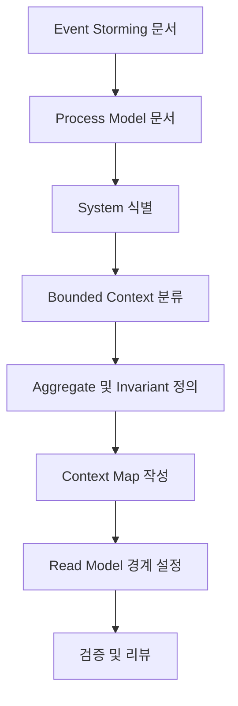

# Event Storming → Process Model → Software Design 가이드라인

이 문서는 **Event Storming**과 **Process Model** 산출물을 바탕으로, 주니어 개발자가 따라 할 수 있는 **Software Design 작성 프로세스**를 설명합니다. 최종 목표는 `software-design.md` 문서에서 확인할 수 있는 수준의 설계를 완성하는 것입니다.

> 시작 전, `docs/event-domain-design/template/software-design-template.md` 파일을 복사해 도메인 전용 `software-design.md` 초안을 생성한 뒤, 아래 단계에 따라 내용을 채워 넣으세요.

---

## 🔁 전체 프로세스 한눈에 보기



각 단계는 아래 절차를 순서대로 수행하면서 `software-design.md`를 채워넣습니다.

---

## 🛠️ 작업 시작 전 Git 브랜치 준비하기

작업을 시작하기 전에 **반드시 브랜치를 생성**하고, `CONTRIBUTING.md`의 규칙에 맞춰 커밋을 작성하세요.

```bash
# 1. 최신 스프린트 브랜치로 이동 후 동기화
git checkout sprint-<number>
git pull origin sprint-<number>

# 2. 스토리 브랜치 생성 (CONTRIBUTING.md 참고)
git checkout -b story-<epic-code>-<story-number>-<short-description>
```

문서를 완료했다면 `CONTRIBUTING.md`의 템플릿에 따라 커밋 메시지를 작성합니다. 문서 수정은 `docs` 타입을 사용하고, 문제/해결/영향을 도메인 관점에서 정리합니다.

```text
docs: update software design for <Domain>
```

---

## 1단계. Process Model에서 System 식별하기

**목표**: Process Model에 등장하는 `System`들을 나열하고, 역할/책임을 정리합니다.

1. **목록화**: Process Model의 `System` 박스를 모두 수집합니다.
2. **액터/입력/출력 메모**: 각 System이 어떤 Command를 받는지, 어떤 Event를 내보내는지 메모합니다.
3. **용어 통일**: 이벤트 스토밍에서 사용한 용어와 일치하는지 확인합니다.

```markdown
| Process Model System | 받는 Command | 발생시키는 Event | 비고 |
| -------------------- | ------------ | ----------------- | ---- |
| Workspace Manager    | Create Workspace | Workspace Created | 핵심 기능 |
| Page Migration Manager | Move Page    | Page Moved        | 페이지 이동 | 
```

> `software-design.md`의 **"Process Model에서 발견된 Systems → Aggregates"** 섹션에 반영합니다.

---

## 2단계. System을 기반으로 Bounded Context 분류하기

**목표**: 유사한 책임/언어를 공유하는 System들을 묶어 Bounded Context 후보를 도출합니다.

1. **기능별 그룹화**: 동일한 언어, 동일한 데이터 모델을 사용하는 System을 묶습니다.
2. **Core / Supporting / Generic 분류**: 비즈니스 가치에 따라 구분합니다.
3. **외부 시스템 파악**: 외부 API, 서비스가 있다면 어떤 Context와 연관되는지 기록합니다.

```markdown
### Workspace Structure Context
- 포함 System: Workspace Manager, Page Migration Manager, Page Lifecycle Manager
- 도메인 언어: Workspace, Page, 계층 구조, 휴지통 등
- 외부 연동: Clerk (ACL 필요)
```

> `software-design.md`의 **"Bounded Context 정의"** 섹션에 `Context` 별 설명과 포함된 Aggregate를 작성합니다.

---

## 3단계. Context별 Aggregate와 Invariant 정의하기

**목표**: Context 내부에서 유지해야 할 일관성 경계와 도메인 규칙을 Aggregate 단위로 정의합니다.

1. **Aggregate 후보 선정**: Bounded Context 내 System이 관리하는 핵심 엔티티를 확인합니다.
2. **Command/Event 정리**: Aggregate가 처리해야 할 주요 Command, 발행할 Event를 나열합니다.
3. **Invariant 문서화**: 반드시 지켜야 할 비즈니스 규칙(불변식)을 명시합니다.

```markdown
### Workspace Aggregate
- Commands: Create Workspace, Delete Workspace, Restore Workspace
- Events: Workspace Created, Workspace Deleted, Workspace Restored
- Invariants:
  - Workspace는 반드시 하나의 Organization에 속한다.
  - Free 플랜에서는 Organization당 최대 5개만 생성할 수 있다.
```

> `software-design.md`의 **"Aggregate 상세 정의"** 영역에 Aggregate 단위로 표/리스트를 채워 넣습니다.

---

## 4단계. Context Map으로 경계와 관계 그리기

**목표**: 각 Context가 어떤 이벤트로 연결되는지, 협력 방식은 무엇인지 시각화합니다.

1. **Context 간 이벤트 흐름 파악**: 한 Context에서 발생한 Event가 다른 Context에서 어떻게 사용되는지 나열합니다.
2. **통합 패턴 명시**: Published Language, Anti-Corruption Layer(ACL), Open Host Service 등 사용 패턴을 적습니다.
3. **도식화**: Mermaid 다이어그램이나 ASCII 아트로 관계를 표현합니다.

```markdown
Visual Canvas Context ← Workspace Structure Context → Collaboration Context
- `Page Created` → Visual Canvas에서 `Canvas Initialized`
- `Workspace Created` → Collaboration에서 기본 권한 세팅
```

> `software-design.md`의 **"Context Map"** 섹션에 다이어그램과 설명을 추가합니다.

---

## 5단계. Read Model 경계 정의하기

**목표**: 조회/리포팅을 담당하는 Read Model을 식별하고, 입력/출력 구조를 설계합니다.

1. **사용자 시나리오 수집**: 어떤 화면/기능에서 어떤 데이터를 조회하는지 정리합니다.
2. **Read Model 단위 정의**: Aggregate 데이터를 한 번에 조회해야 하는 단위를 기준으로 모델을 설계합니다.
3. **데이터 구조 설계**: TypeScript Interface 형태로 구조와 필드를 정의합니다.

```typescript
interface WorkspaceStructureView {
  workspaceId: WorkspaceId;
  name: string;
  pageTree: PageTreeNode[];
}

interface PageTreeNode {
  id: PageId;
  title: string;
  children: PageTreeNode[];
  depth: number;
}
```

> `software-design.md`의 **"Read Models"** 섹션에 목적, 구조, 최적화 포인트 등을 작성합니다.

---

## 6단계. 검증 체크리스트와 지표 작성하기

**목표**: 설계가 비즈니스 요구사항과 기술 제약을 충족하는지 확인합니다.

1. **체크리스트**: 필수 검증 과정을 TODO 형태로 정리합니다.
2. **성과 지표**: 운영 중 모니터링할 KPI를 선정합니다.

```markdown
- [ ] 페이지 이동 시 권한 검증 로직 정의 완료
- [ ] Clerk 동기화 실패 시 재시도 전략 문서화

성과 지표 예시
- 권한 오류율 < 0.1%
- 페이지 트리 로딩 시간 < 500ms (1000페이지)
```

> `software-design.md`의 **"검증 체크리스트"**와 **"성과 측정 지표"** 섹션을 채웁니다.

---

## ✅ 최종 점검 단계

- 모든 절차가 `software-design.md`에 문서화되었는지 확인합니다.
- Technical Specification 작성자는 이 문서를 입력으로 사용해 구현 세부사항을 확정합니다.
- API Specification 작성자는 요구되는 외부 계약(엔드포인트, 스키마)을 이 설계와 매칭합니다.

> 완성된 `software-design.md`는 도메인 팀/기획/시니어 개발자의 리뷰를 거쳐 확정합니다.

---

## 📚 추가 참고 문서

- `docs/event-domain-design/domains/<domain>/software-design.md`: 실제 도메인 설계 예시
- `docs/event-domain-design/guide/technical-specification-guide.md`: 구현 세부 가이드
- `docs/event-domain-design/guide/code-conventions.md`: 코드 컨벤션 안내