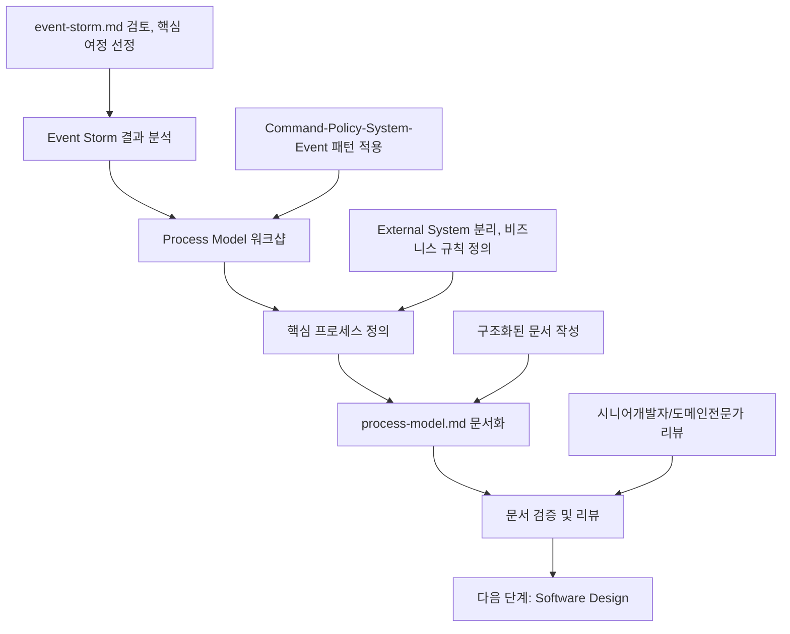

# Process Model 정의 가이드

이 문서는 **Event Storming 결과**를 바탕으로 **Process Model**을 정의하고 **process-model.md 문서 작성**까지, 의사결정 참여자들이 순서대로 따라할 수 있는 **Process Model 전용 프로세스**를 설명합니다.

> 시작 전, `docs/event-domain-design/template/process-model-template.md` 파일을 복사해 도메인 전용 `process-model.md` 초안을 생성한 뒤, 아래 단계에 따라 내용을 채워 넣으세요.

---

## 🔁 Process Model 프로세스 한눈에 보기



Process Model은 **Event Storm의 추상적 이벤트**를 **구체적 시스템 프로세스**로 전환하는 핵심 단계입니다.

---

## 🛠️ 작업 시작 전 Git 브랜치 준비하기

```bash
# Event Storming 브랜치에서 연결하거나 새 브랜치 생성
git checkout event-storm-<domain-name>

# Process Model 브랜치 생성 (Event Storm이 완료된 상태에서)
git checkout -b process-model-<domain-name>

# 예시: git checkout -b process-model-workspace-structure
```

---

## Phase 1: Event Storm 결과 분석 (담당: 시니어개발자)

### 1.1 사전 준비 - 완료된 Event Storm 확인

#### 필수 전제 조건:
- [ ] event-storm.md 문서가 완성되어 있음
- [ ] Event Storming 워크샵이 완료되어 도메인전문가의 승인을 받음
- [ ] 주요 Hotspot과 개선기회가 정리되어 있음
- [ ] Process Modeling을 위한 질문들이 준비되어 있음

#### Event Storm 결과물 검토:
```bash
# Event Storm 문서 확인
cat docs/event-domain-design/domains/<domain-name>/event-storm.md

# 주요 확인 포인트:
# - Domain Events (시간순)
# - Hotspots (문제점)
# - Process Modeling을 위한 질문들
```

### 1.2 핵심 사용자 여정 선정

#### 선정 기준:
1. **비즈니스 가치가 높은 프로세스** (Opportunity에서 식별된 것들)
2. **Hotspot으로 식별된 중요 문제가 포함된 프로세스**
3. **외부 시스템과의 통합이 필요한 프로세스**
4. **다른 도메인과의 연결점이 되는 프로세스**

#### 일반적인 선정 가이드:
- **5-7개 핵심 프로세스** 선정 (너무 많으면 복잡해짐)
- **사용자 여정의 시작부터 끝까지** 커버
- **External System 동기화** 프로세스는 필수 포함

### 1.3 템플릿 파일 준비
```bash
# Process Model 템플릿 복사 (아직 없다면)
cp docs/event-domain-design/template/process-model-template.md docs/event-domain-design/domains/<domain-name>/process-model.md
```

---

## Phase 2: Process Model 워크샵 진행 (담당: 시니어개발자 + 도메인전문가)

### 2.1 워크샵 참여자 및 구조

#### 필수 참여자:
- **시니어 개발자** (리드): 시스템 설계 및 기술적 실현성 검토
- **도메인 전문가**: 비즈니스 규칙 및 정책 검증
- **PM**: 비즈니스 우선순위 및 요구사항 확인

#### 권장 참여자:
- **기획자**: 사용자 관점에서의 프로세스 검증
- **주니어 개발자**: 구현 관점에서의 질문 및 학습

#### 워크샵 시간 배분 (2-3시간):
```
- Phase 1: External System 식별 (30분)
- Phase 2: 핵심 프로세스별 Command 정의 (60분)
- Phase 3: Policy 및 System 정의 (60분)
- 휴식 및 정리 (15-30분)
```

### 2.2 Phase 1: External System 식별 (30분)

**목표**: 도메인 외부의 시스템들을 명확히 구분하고 통합 방식 정의

#### 진행 방법:
1. **Event Storm에서 식별된 외부 액터 검토**
2. **각 외부 시스템의 역할과 책임 정의**
3. **Single Source of Truth 결정**
4. **통합 방식 선택** (Webhook, API 호출, 이벤트 기반 등)

#### External System 분류 기준:
- **SSOT (Single Source of Truth)**: 외부 시스템이 주도권을 가지는 데이터
- **Integration Pattern**: Webhook, API, Event-driven
- **Failure Strategy**: 외부 시스템 장애 시 대응 방안

#### 예시 결과:
```markdown
### 🟪 External System: Clerk
- 역할: 사용자 인증 및 Organization 관리
- SSOT: Clerk이 Organization/User의 Single Source of Truth
- 통합: Webhook을 통한 실시간 동기화
```

### 2.3 Phase 2: 핵심 프로세스별 Command 정의 (60분)

**목표**: Event Storm의 이벤트들을 트리거하는 구체적인 Command 정의

#### 진행 방법:
1. **선정된 핵심 프로세스 순서대로 진행**
2. **각 프로세스의 시작점(사용자 액션) 식별**
3. **Command 파라미터 구체화**
4. **Read Model 요구사항 정의**

#### Command 정의 패턴:
```markdown
**Command**: [Action Name] ([Technical Command Name])
- parameter1: [Type and Description]
- parameter2: [Type and Description]
- optionalParam?: [Optional Parameter]

**Read Model** (필요 정보):
- [조회해야 할 정보 1]
- [조회해야 할 정보 2]
- [권한/제약 확인 정보]
```

#### 작성 가이드:
- **명령형 동사**: "워크스페이스 생성", "페이지 이동"
- **구체적 파라미터**: 실제 구현에서 필요한 모든 정보 포함
- **Read Model**: Command 실행 전에 확인/조회해야 할 모든 정보

### 2.4 Phase 3: Policy 및 System 정의 (60분)

**목표**: 비즈니스 규칙(Policy)과 처리 시스템(System) 정의

#### Policy 정의:
비즈니스에서 **반드시 지켜야 하는 규칙**들을 구체적으로 명시

```markdown
**Policy**: [Policy Category Name]
- "[구체적이고 검증 가능한 비즈니스 규칙 1]"
- "[구체적이고 검증 가능한 비즈니스 규칙 2]"
- "[예외 상황에 대한 처리 규칙]"
```

#### Policy 작성 가이드:
- **검증 가능**: 코드로 구현 가능한 구체적 조건
- **비즈니스 중심**: 기술적 제약이 아닌 비즈니스 요구사항
- **예외 처리**: 규칙 위반 시 어떻게 처리할지 명시

#### System 정의:
Command를 실행하고 Event를 발생시키는 **책임 단위** 정의

```markdown
**System**: [System Name] Manager
```

#### System 정의 가이드:
- **단일 책임**: 하나의 명확한 비즈니스 책임
- **Manager 패턴**: "[Entity] Manager" 형태로 명명
- **Software Design의 Aggregate 후보**: System이 Aggregate가 됨

---

## Phase 3: process-model.md 문서 작성 (담당: 시니어개발자)

### 3.1 문서 구조 및 작성 순서

복사한 템플릿을 기반으로 다음 순서로 작성합니다:

#### 1. 🎯 Process Modeling Overview
- 도메인의 핵심 프로세스 개요
- External System과의 관계 명시

#### 2. 🟪 External System 정의
- 워크샵에서 정의된 외부 시스템들
- 각 시스템의 역할, SSOT, 통합 방식

#### 3. 📍 Process 0: External System 동기화
- 외부 시스템과의 동기화 프로세스 (보통 Process 0으로 작성)
- Webhook 처리, 재시도 로직 등

#### 4. 📍 Process 1~N: 핵심 비즈니스 프로세스
- 워크샵에서 정의된 각 프로세스
- Command → Policy → System → Event 패턴 일관 적용

#### 5. 💡 핵심 Policy 정리
- 워크샵에서 정의된 모든 Policy들을 카테고리별로 요약

#### 6. 🔧 기술 권장사항
- 구현 시 고려해야 할 기술적 사항들

### 3.2 각 Process 작성 가이드

각 프로세스는 다음 구조를 일관되게 따릅니다:

```markdown
## 📍 Process N: [프로세스명]

### Scenario: [사용자 상황 설명]
```
👤 사용자: "구체적인 요구사항이나 상황 설명"
```

**Command**: [명령명] ([Technical Command Name])
- parameter1: value1
- parameter2: value2

**Read Model** (필요 정보):
- 조회/확인해야 할 정보들

**Policy**: [정책명]
- "구체적인 비즈니스 규칙 1"
- "구체적인 비즈니스 규칙 2"

**System**: [System Name]

**Events**:
1. [Event 1] ([Technical Event Name])
2. [Event 2] ([Technical Event Name])
```

### 3.3 품질 검증 체크리스트

#### 일관성 검증:
- [ ] 모든 Process가 동일한 구조로 작성되었는가?
- [ ] Command-Policy-System-Event 패턴이 일관되게 적용되었는가?
- [ ] Event Storm의 주요 이벤트들이 모두 Process에 반영되었는가?

#### 완전성 검증:
- [ ] 선정된 핵심 프로세스가 모두 문서화되었는가?
- [ ] External System과의 통합점이 명확히 정의되었는가?
- [ ] Policy가 구체적이고 검증 가능하게 작성되었는가?

#### 실용성 검증:
- [ ] Software Design 작성을 위한 충분한 정보가 있는가?
- [ ] 구현팀이 이해할 수 있을 정도로 구체적인가?
- [ ] 비즈니스 의사결정자가 검증할 수 있을 정도로 명확한가?

---

## Phase 4: 문서 검증 및 리뷰 (담당: 전체 참여자)

### 4.1 리뷰 단계별 체크포인트

#### 도메인전문가 리뷰:
- [ ] 비즈니스 프로세스가 정확하게 모델링되었는가?
- [ ] Policy(비즈니스 규칙)가 실제와 일치하는가?
- [ ] 예외 상황들이 적절히 고려되었는가?
- [ ] 실제 운영 시나리오가 누락되지 않았는가?

#### 시니어개발자 리뷰:
- [ ] 시스템 경계가 합리적으로 정의되었는가?
- [ ] External System 통합 방식이 적절한가?
- [ ] Software Design 작성을 위한 정보가 충분한가?
- [ ] 기술적 실현 가능성이 고려되었는가?

#### PM 리뷰:
- [ ] 비즈니스 우선순위가 프로세스 선정에 반영되었는가?
- [ ] 사용자 가치가 명확히 드러나는가?
- [ ] 요구사항이 정확히 반영되었는가?

### 4.2 Event Storm ↔ Process Model 일관성 검증

#### 필수 검증 포인트:
- [ ] Event Storm의 핵심 이벤트들이 Process Model에 반영되었는가?
- [ ] Event Storm의 Hotspot들이 Process Model에서 해결책을 제시하고 있는가?
- [ ] Event Storm의 Context 경계와 Process Model의 System 경계가 일치하는가?
- [ ] 동일한 도메인 언어가 일관되게 사용되고 있는가?

### 4.3 Git 커밋 및 PR 생성

```bash
# Process Model 문서 커밋
git add docs/event-domain-design/domains/<domain-name>/process-model.md
git commit -m "docs(process-model): define <domain-name> core processes

- Map user scenarios to command-policy-system-event patterns
- Define business rules and constraints
- Identify system boundaries and external integrations
- Prepare foundation for software design"

# GitHub에 푸시 및 PR 생성
git push origin process-model-<domain-name>
```

### 4.4 PR 리뷰 체크리스트

**승인 조건:**
- [ ] 도메인전문가가 비즈니스 프로세스 정확성을 승인
- [ ] 시니어개발자가 시스템 설계 타당성을 승인
- [ ] PM이 요구사항 충족도를 승인
- [ ] Event Storm과의 일관성이 확인됨

---

## ✅ Process Model 완료 기준

다음 모든 조건이 충족되어야 Process Model이 완료된 것으로 간주합니다:

### 워크샵 완료 기준:
- [ ] 핵심 사용자 여정 5-7개가 Process로 정의됨
- [ ] Command-Policy-System-Event 패턴이 일관되게 적용됨
- [ ] External System과의 통합점이 명확히 정의됨
- [ ] 비즈니스 규칙(Policy)이 구체적으로 명시됨

### 문서 완료 기준:
- [ ] process-model.md의 모든 필수 섹션이 작성됨
- [ ] Event Storm과의 일관성이 확인됨
- [ ] 도메인전문가와 시니어개발자의 검증 완료
- [ ] Software Design 작성을 위한 충분한 정보 확보
- [ ] Git에 체계적으로 커밋되고 PR이 승인됨

---

## 🚀 다음 단계: Software Design로 연결

Process Model이 완료되면 다음 단계를 진행할 수 있습니다:

### Software Design 작성 준비:
1. **Software Design 가이드 참조**: `docs/event-domain-design/guide/1-software-design-guide.md`
2. **System을 Aggregate로 전환**: Process Model의 System들이 Aggregate 후보가 됨
3. **워크샵 참여자 유지**: 시니어개발자가 계속 리드

### 연결 정보:
- **입력**: 완성된 process-model.md + event-storm.md
- **출력**: software-design.md
- **다음 담당자**: 시니어개발자 (계속 유지)

### Software Design에서 해결될 사항:
- **Aggregate 정의**: Process Model의 System → Aggregate 전환
- **Bounded Context 식별**: 명확한 도메인 경계 설정
- **Context Map**: 다른 도메인과의 통합 방식
- **Anti-Corruption Layer**: External System 통합 레이어 설계

---

## 📚 관련 문서 및 템플릿

### 참조 가이드:
- [Event Storming 가이드](./1-event-storming-guide.md)
- [Software Design 작성 가이드](./1-software-design-guide.md)

### 템플릿 파일:
- [Process Model 템플릿](../template/process-model-template.md)

### 예시 문서:
- [Workspace Structure Domain 예시](../domains/workspace-structure-domain/process-model.md)

---

## 💡 성공을 위한 핵심 팁

### 워크샵 성공 팁:
- **시니어개발자 주도**: 시스템 설계 관점에서 프로세스를 구체화
- **도메인전문가와의 긴밀한 협업**: 비즈니스 규칙의 정확성 확보
- **일관된 패턴 적용**: Command-Policy-System-Event 패턴을 모든 프로세스에 일관되게 적용
- **External System 우선 처리**: 복잡한 통합 부분을 먼저 해결

### 문서화 성공 팁:
- **구체적 Policy**: 검증 가능한 비즈니스 규칙 작성
- **명확한 System 경계**: Software Design의 Aggregate 후보가 되도록 적절한 크기로 정의
- **Event Storm 연결성**: Event Storm의 결과와 일관성 유지
- **구현 가능성**: 실제 구현팀이 이해할 수 있을 정도의 구체성

### 주의사항:
- **과도한 세부사항 지양**: 구현 레벨이 아닌 비즈니스 프로세스 레벨 유지
- **External System 명확한 분리**: 도메인 내부 로직과 외부 통합 로직 구분
- **Policy의 구현 독립성**: 특정 기술에 종속되지 않는 순수한 비즈니스 규칙

---

이 가이드를 따라하면 Event Storm 결과를 바탕으로 체계적이고 완성도 높은 Process Model을 정의할 수 있습니다! 🚀
