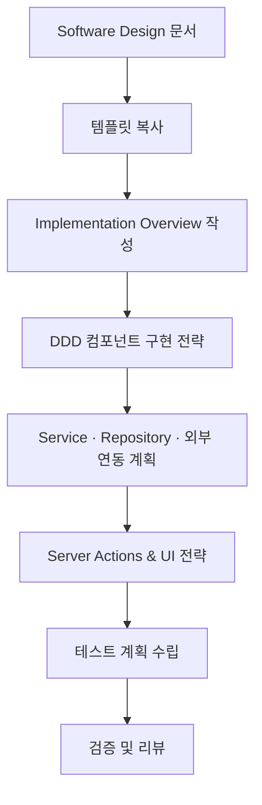

# Technical Specification 가이드라인

이 문서는 **Software Design 문서**를 입력으로 받아, 주니어 개발자가 순서대로 따라 할 수 있는 **Technical Specification 작성 프로세스**를 설명합니다. 최종 산출물은 `technical-specification.md`이며, 실제 구현 작업의 기준점이 됩니다.

> 시작 전, `docs/event-domain-design/template/technical-specification-template.md` 파일을 복사해 도메인 전용 초안을 만들고, 세부 규칙은 `docs/event-domain-design/guide/code-conventions.md`를 참고하세요.

---

## 🔁 전체 프로세스 한눈에 보기



---

## 1단계. 준비하기

1. **필수 문서 확인**
   - Software Design 문서(aggregate, command, event 정의)
   - API Specification 문서(외부 계약)
   - 코드 컨벤션 가이드
2. **템플릿 복사**
   - `technical-specification-template.md` → `domains/<domain>/technical-specification.md`
3. **문서 정보 기입**
   - 도메인명, 작성자, 작성일, 버전, 리뷰어 등 기본 정보 입력

---

## 2단계. Implementation Overview 작성

템플릿의 `Implementation Overview` 섹션을 활용해 개발 우선순위를 정리합니다.

- **Phase별 목표**: 핵심 기능 → 고급 기능 → 통합/최적화 순으로 구체화
- **선행조건 및 위험요소**: 공통 컴포넌트, 외부 연동 일정, 데이터 마이그레이션 여부 등
- **협업 포인트**: 다른 팀(디자인, QA, 인프라)과 공유해야 할 사항 기록

---

## 3단계. DDD 컴포넌트 구현 전략

Software Design에 정의된 순서대로 템플릿 섹션을 채워 넣습니다.

### 3.1 Value Objects
- 검증 규칙: 길이, 포맷, 허용 문자 등 상세 조건
- 예외 처리: 비즈니스 규칙 위반 시 던질 에러 타입
- 유틸 메서드: 슬러그, 마스킹 등 자주 쓰는 로직

### 3.2 Entities
- 생성자 파라미터와 불변 필드 구분
- 상태 변경 메서드와 호출 조건 (권한, 상태 체크 등)
- 삭제/복구 등 수명주기 관리 방법

### 3.3 Aggregates
- 처리하는 Command, 발생시키는 Event를 표로 정리
- Invariant 검증 흐름을 단계별 또는 의사 코드로 작성
- 저장소 연동 시점과 트랜잭션 범위 명시

### 3.4 Commands & Events
- 입력 스키마(zod 등)와 도메인 Command 변환 과정 설명
- Event payload 구조와 타입 상수 정의
- Cross-Domain 사용 여부, 이벤트 처리 우선순위 메모

### 3.5 Error Types
- BusinessRuleError, SystemError 등 에러 계층 구조
- 사용자에게 노출될 메시지/코드 매핑
- 로깅 및 모니터링 정책

---

## 4단계. Service · Repository 계획

### 4.1 Service 레이어
- 여러 Aggregate를 조율하는 비즈니스 시나리오를 단계별로 작성
- 권한/요금제/정책 검증 지점을 서술
- 실패 시 롤백, 사용자 안내 메시지, 재시도 전략

### 4.2 Repository 레이어
- 메서드 시그니처, 반환 타입, 예외 상황 정의
- 낙관적 잠금·트랜잭션이 필요한 시나리오 기술
- 성능 최적화를 위한 인덱스 및 캐싱 전략

### 4.3 Read Models 구현
- **복잡한 조회 로직**: 여러 Aggregate를 조합한 View 쿼리 설계
- **Database Views vs Repository 조합**: 성능과 유지보수성 고려한 선택
- **캐싱 전략**: Redis, 메모리 캐시 등을 활용한 성능 최적화
- **실시간 업데이트**: 도메인 이벤트 기반 Read Model 갱신 방법

---

## 5단계. 외부 연동과 Server Actions 설계

1. **Anti-Corruption Layer**
   - 외부 API 응답을 도메인 모델로 변환하는 규칙
   - Webhook 수신 → 변환 → 도메인 이벤트 생성 흐름
2. **Server Actions**
   - 입력 검증 → 도메인 서비스 호출 → 이벤트 처리 → 응답 매핑 순서
   - 에러 유형별 사용자 메시지와 HTTP 응답 전략
3. **Cross-Domain 이벤트 처리**
   - `processCrossDomainEvents`에 등록할 핸들러와 처리 책임

---

## 6단계. UI & Hook 전략

1. **React Hooks**
   - `useOptimistic`, `useTransition` 등 사용 여부와 이유
   - 낙관적 업데이트의 롤백 로직
2. **UI Component 연동**
   - Server Action과 Form/Component 연결 구조
   - 로딩/에러 상태 표시, 접근성 고려 사항

---

## 7단계. Testing Strategy

1. **Unit Test**
   - Aggregate, Service, Repository 별 핵심 시나리오
   - Mock/Stubs 사용 계획
2. **Integration Test**
   - Server Action, API 경로의 end-to-end 테스트
   - 외부 의존성(Clerk 등) 대신 사용할 Test Double 정의
3. **CI/CD 체크리스트**
   - 테스트 스크립트, 커버리지 기준, 지속적 통합 파이프라인 계획

---

## 8단계. 검증 및 리뷰

- Software Design과 1:1 매핑되는지 확인
- 코드 컨벤션(네이밍, 폴더 구조)을 준수하는지 체크
- 성능·보안·장애 대응 등 시니어 검토 포인트 정리

```markdown
검증 체크리스트 예시
- [ ] 모든 Command에 입력 검증 로직이 정의되어 있는가?
- [ ] Repository가 반환하는 Entity의 불변식이 깨지지 않는가?
- [ ] 외부 연동 실패 시 사용자 경험이 명확한가?
- [ ] 테스트가 happy path와 edge case를 모두 다루는가?
```

---

## 📚 추가 참고 문서

- `docs/event-domain-design/template/technical-specification-template.md`
- `docs/event-domain-design/guide/code-conventions.md`
- 해당 도메인의 `software-design.md`
- 관련 API Specification 문서

---

## 📊 9단계. 프로젝트 진행 상황 업데이트

### 9.1 project-progress.md 업데이트

**목표**: Technical Specification 완료 상태를 프로젝트 전체 진행 상황에 반영

**작업 과정**:
```bash
# 1. 현재 날짜 확인
date

# 2. project-progress.md 파일 열기
# docs/project-progress.md
```

**업데이트 내용**:
1. **Overall Progress Overview 테이블 업데이트**:
   ```markdown
   | [Domain Name] | ✅ Complete | ✅ Complete | ✅ Complete | ✅ Complete | ❌ Pending | **80%** |
   ```

2. **해당 도메인 섹션 업데이트**:
   ```markdown
   ### [N]. [Domain Name] Domain 🟡 **80% 완료**
   
   #### 설계 진행 상황
   - [x] **Event Storming**: `docs/event-domain-design/[domain-name]/event-storm.md`
   - [x] **Process Model**: `docs/event-domain-design/[domain-name]/process-model.md`
   - [x] **Software Design**: `docs/event-domain-design/[domain-name]/software-design.md`
   - [x] **Technical Design**:
     - [x] Database Schema: `docs/event-domain-design/[domain-name]/project-technical-design/database-schema.md`
     - [x] API Specification: `docs/event-domain-design/[domain-name]/project-technical-design/api-specification.md`
     - [x] Technical Specification: `docs/event-domain-design/[domain-name]/technical-specification.md`
   
   - [ ] **Agile Planning**: ❌ **대기 중**
   ```

3. **전체 진행률 업데이트**:
   - 해당 도메인의 진행률을 60% → 80%로 업데이트
   - Next Steps 섹션에서 해당 도메인을 Agile Planning 단계로 이동

### 9.2 Git 커밋

```bash
# 변경사항 커밋
git add docs/event-domain-design/[domain-name]/technical-specification.md docs/project-progress.md
git commit -m "feat(technical-spec): complete [Domain Name] domain technical specification

- Define implementation details for all DDD components
- Add service layer and repository patterns
- Include server actions and UI integration strategy
- Update project progress to 80% for [Domain Name] domain"

# 브랜치 푸시
git push origin domain/[번호]-[domain-name]
```

---

이 순서를 따르면, Software Design에서 정의한 아키텍처를 실제 코드로 구현하기 위한 Technical Specification을 빠짐없이 작성할 수 있습니다. 필요 시 시니어 개발자와 함께 리뷰하며 보완하세요.
