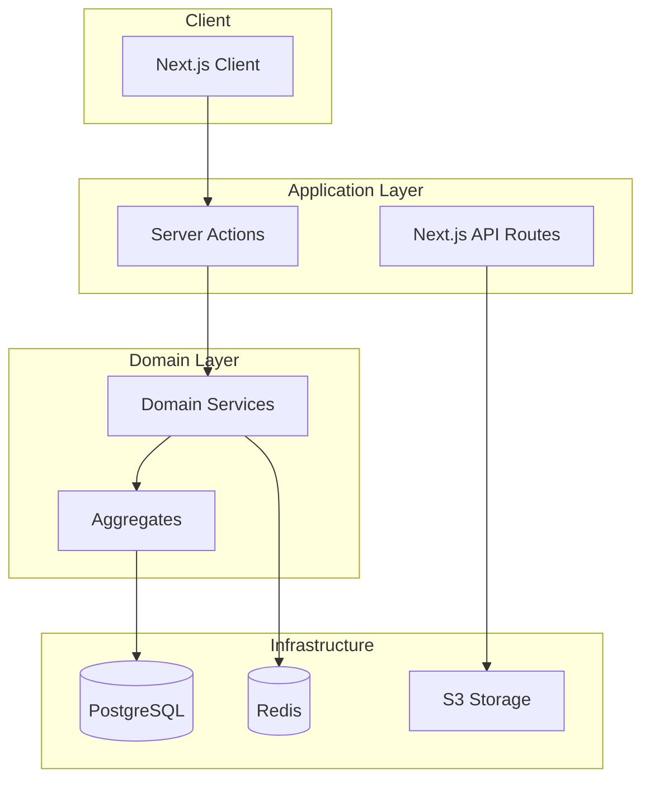

# Technical Design Guide

Event Storming과 DDD 설계 후, 구현 전에 필요한 기술적 결정사항들을 정의합니다.

---

## 📁 문서 구조

```
docs/
├── event-storming/           
│   ├── visual-canvas-domain/
│   │   ├── event-storm.md              # 비즈니스 이벤트 탐색
│   │   ├── process-model.md            # 프로세스 모델링
│   │   ├── software-design.md          # DDD 설계
│   │   ├── anti-corruption-layer.md    # ACL 패턴
│   │   └── technical-design/           # 도메인별 기술 설계
│   │       ├── database-schema.md      # DB 스키마
│   │       ├── api-specification.md    # API 명세
│   │       └── performance-sla.md      # 성능 요구사항
│   │
│   └── component-system-domain/
│       ├── event-storm.md
│       ├── process-model.md
│       ├── software-design.md
│       └── technical-design/           # 도메인별 기술 설계
│           ├── database-schema.md
│           ├── api-specification.md
│           └── sync-strategy.md
│
├── technical-design/                   # 전체 시스템 기술 설계
│   ├── architecture-overview.md        # 전체 아키텍처
│   ├── technology-stack.md             # 기술 스택 선택
│   │   ├── nextjs-patterns.md         # Next.js 패턴
│   │   ├── server-actions-guide.md     # Server Actions 가이드
│   │   ├── clerk-auth-integration.md   # Clerk 인증
│   │   ├── supabase-setup.md          # Supabase 설정
│   │   └── drizzle-orm-patterns.md    # Drizzle ORM 패턴
│   │
│   ├── infrastructure/
│   │   ├── deployment-strategy.md      # 배포 전략
│   │   ├── monitoring-setup.md         # 모니터링
│   │   └── ci-cd-pipeline.md          # CI/CD
│   │
│   └── cross-cutting-concerns/
│       ├── error-handling.md           # 에러 처리 전략
│       ├── logging-strategy.md         # 로깅 전략
│       └── security-policies.md        # 보안 정책
│
└── agile-planning/
    └── stories/
```

---

## 🔄 단계별 설계 프로세스

### Phase 1: Event Storming → DDD
**목적**: 비즈니스 이해 및 도메인 모델링
**산출물**:
- Domain Events
- Aggregates & Entities
- Bounded Contexts
- Integration Points

### Phase 2: DDD → Technical Design
**목적**: 도메인 모델을 구현 가능한 기술 설계로 변환
**산출물**:
- DB Schema (from Aggregates)
- API Contracts (from Commands/Queries)
- Event Schema (from Domain Events)
- Infrastructure Requirements

### Phase 3: Technical Design → Agile Planning
**목적**: 구현 가능한 작업 단위로 분해
**산출물**:
- User Stories with Technical Sub-tasks
- Enabler Stories for Infrastructure
- Dependency Mapping
- Sprint Planning

---

## 📊 Database Design

### 1. Aggregate → Table Mapping

```markdown
# Visual Canvas Domain - Database Schema

## Block Aggregate → Tables

### blocks table
- Aggregate Root: Block
- Derived from: Block Entity in DDD

| Column | Type | Description | Domain Mapping |
|--------|------|-------------|----------------|
| id | UUID | Primary key | BlockId Value Object |
| type | VARCHAR(50) | Block type | BlockType Value Object |
| content | JSONB | Block content | BlockContent Value Object |
| created_at | TIMESTAMP | Creation time | Audit fields |
| updated_at | TIMESTAMP | Last update | Audit fields |
| deleted_at | TIMESTAMP | Soft delete | Business rule |

### block_positions table
- Derived from: Page-specific position requirement
- Relationship: Block ↔ Page (Many-to-Many with attributes)

| Column | Type | Description | Domain Mapping |
|--------|------|-------------|----------------|
| block_id | UUID | FK to blocks | BlockId |
| page_id | UUID | FK to pages | PageId |
| x | DECIMAL | X coordinate | Position.x |
| y | DECIMAL | Y coordinate | Position.y |
| width | DECIMAL | Width | Size.width |
| height | DECIMAL | Height | Size.height |
| z_order | INTEGER | Layer order | Display order |
```

### 2. Design Decisions Documentation

```markdown
## Design Decision: JSONB for Block Content

### Context
Block content varies significantly by type (text, image, video, etc.)

### Decision
Use PostgreSQL JSONB for flexible content storage

### Consequences
- ✅ Flexible schema for different block types
- ✅ Queryable JSON (PostgreSQL features)
- ❌ Less type safety at DB level
- ❌ Requires careful migration strategy

### Alternatives Considered
1. Separate tables per block type
2. EAV (Entity-Attribute-Value) pattern
3. Single table with many nullable columns
```

---

## 🔌 API Design

### 1. Command → API Endpoint Mapping

```markdown
# API Specification

## From Domain Commands to REST/GraphQL

### Block Domain Commands → Server Actions

| Domain Command | Server Action | Input | Output |
|---------------|---------------|-------|--------|
| CreateBlock | createBlockAction | { type, content, position, pageId } | { blockId } |
| MoveBlock | moveBlockAction | { blockId, position, pageId } | { success } |
| UpdateBlockContent | updateBlockContentAction | { blockId, content } | { success } |

### Example Server Action

```typescript
// From DDD Command
class CreateBlockCommand {
  constructor(
    public type: BlockType,
    public content: BlockContent,
    public position: Position,
    public pageId: PageId
  ) {}
}

// To Server Action
async function createBlockAction(input: {
  type: string;
  content: any;
  position: { x: number; y: number };
  pageId: string;
}) {
  // Validation
  // Command creation
  // Domain logic execution
  // Return result
}
```
```

### 2. Query Requirements → Read Models

```markdown
## Read Model Design

### Canvas View Query
**Purpose**: Load all blocks for a page
**Performance Requirement**: < 200ms for 1000 blocks

```sql
-- Optimized query with indexes
CREATE INDEX idx_block_positions_page_id ON block_positions(page_id);
CREATE INDEX idx_blocks_deleted_at ON blocks(deleted_at);

-- Query
SELECT 
  b.*,
  bp.x, bp.y, bp.width, bp.height, bp.z_order
FROM blocks b
JOIN block_positions bp ON b.id = bp.block_id
WHERE bp.page_id = $1
  AND b.deleted_at IS NULL
ORDER BY bp.z_order;
```
```

---

## 🏗️ Infrastructure Design

### 1. Deployment Architecture



### 2. Performance Requirements

```markdown
## Performance SLAs

### Response Time
- Block creation: < 100ms
- Block move: < 50ms (optimistic UI)
- Canvas load (1000 blocks): < 2s
- Real-time sync: < 200ms latency

### Scalability
- Concurrent users per canvas: 50
- Max blocks per page: 10,000
- API rate limit: 1000 req/min per user
```

---

## 🔄 Technical → Story Mapping

### Enabler Story Template

```markdown
## Enabler Story: Database Schema Setup

### Description
Set up initial database schema for Visual Canvas domain

### Technical Tasks
- [ ] Create migration for blocks table
- [ ] Create migration for block_positions table
- [ ] Create migration for edges table
- [ ] Set up indexes for performance
- [ ] Create seed data for testing

### Acceptance Criteria
- All migrations run successfully
- Indexes improve query performance by 50%
- Test data includes all block types
```

### User Story with Technical Sub-tasks

```markdown
## Story: Create Text Block

### User Story
As a user, I want to create a text block on the canvas

### Technical Sub-tasks

#### Backend Domain Task
- [ ] Implement Block Entity with factory method
- [ ] Implement CreateBlock command handler
- [ ] Add domain validation rules
- [ ] Write unit tests for invariants

#### Database Task
- [ ] Verify blocks table schema
- [ ] Implement BlockRepository with Drizzle
- [ ] Add transaction support
- [ ] Write integration tests

#### API Task
- [ ] Create createBlockAction server action
- [ ] Add input validation with Zod
- [ ] Implement error handling
- [ ] Add rate limiting

#### Frontend Task
- [ ] Create block creation UI component
- [ ] Integrate with server action
- [ ] Add optimistic updates
- [ ] Handle error states

#### E2E Task
- [ ] Write Playwright test for block creation
- [ ] Verify database state after creation
- [ ] Test error scenarios
```

---

## 📋 Review Checklist

Before moving to implementation:

### Database Design
- [ ] All Aggregates mapped to tables
- [ ] Relationships properly defined
- [ ] Indexes for common queries
- [ ] Migration strategy defined
- [ ] Performance benchmarks set

### API Design
- [ ] All Commands mapped to endpoints
- [ ] All Queries defined with SLAs
- [ ] Error handling specified
- [ ] Validation rules documented
- [ ] Rate limiting defined

### Infrastructure
- [ ] Deployment architecture clear
- [ ] Monitoring strategy defined
- [ ] Security requirements met
- [ ] Backup/recovery plan
- [ ] Scaling strategy defined

### Integration with Agile
- [ ] Technical tasks properly sized
- [ ] Dependencies identified
- [ ] Enabler stories created
- [ ] Risk mitigation planned
