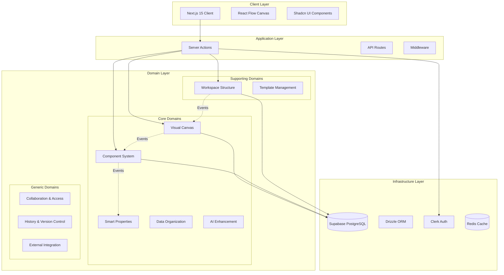
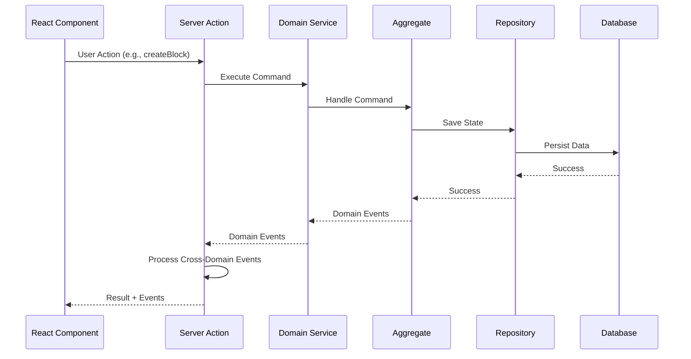
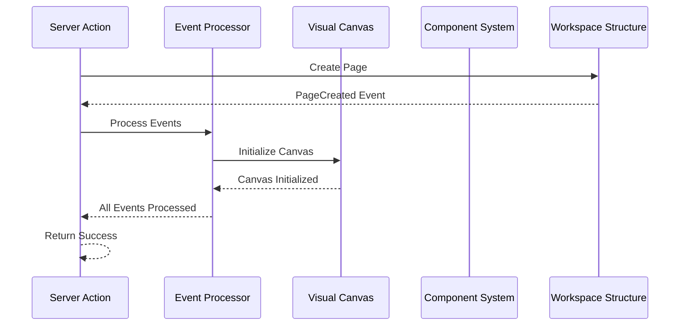
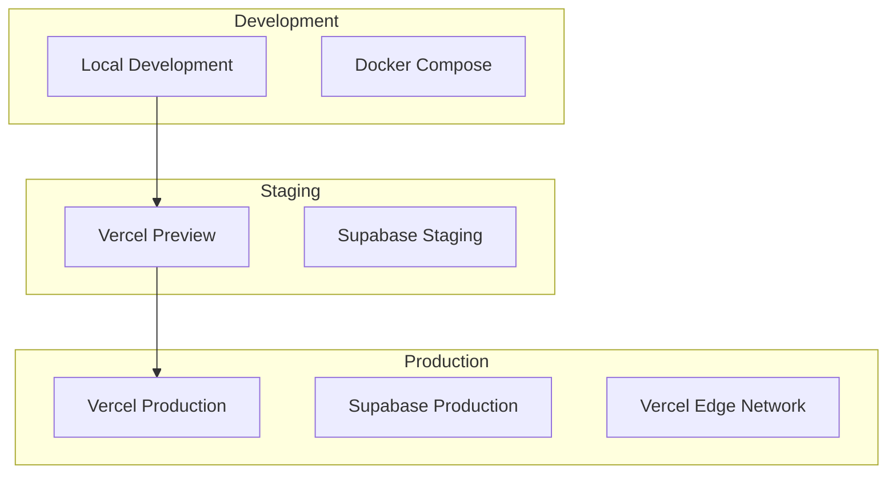

# Architecture Overview

쏘타 MVP의 전체 시스템 아키텍처와 도메인 간 이벤트 통신 방식을 정의합니다.

---

## 🏗️ System Architecture

### High-Level Architecture



---

## 🔄 Domain Event Communication

### Event-Driven Architecture Pattern

우리는 **EventBus 없이 Next.js Server Actions**를 통한 직접적인 도메인 간 통신을 사용합니다.

#### Event Flow Pattern

```typescript
// 1. Domain Service에서 Events 반환
async function domainService.executeCommand(command: Command): Promise<DomainEvent[]> {
  // Domain logic execution
  const events = aggregate.handleCommand(command);
  
  // Return events for cross-domain processing
  return events;
}

// 2. Server Action에서 Cross-Domain Events 처리
async function serverAction(input: ActionInput): Promise<ActionResult> {
  // Execute primary domain logic
  const events = await primaryDomainService.execute(input);
  
  // Process cross-domain events
  await processCrossDomainEvents(events);
  
  return result;
}

// 3. Cross-Domain Event Processing
async function processCrossDomainEvents(events: DomainEvent[]): Promise<void> {
  for (const event of events) {
    switch (event.type) {
      case 'PageCreated':
        // Trigger Visual Canvas initialization
        await visualCanvasService.initializeCanvas(event.pageId);
        break;
        
      case 'ComponentCreated':
        // Update Visual Canvas component library
        await visualCanvasService.updateComponentLibrary(event.componentId);
        break;
        
      case 'BlockCreated':
        // Update Component System usage tracking
        await componentSystemService.trackBlockUsage(event.blockId);
        break;
    }
  }
}
```

### Event Schema Definition

#### Base Event Interface

```typescript
interface DomainEvent {
  id: string;
  type: string;
  aggregateId: string;
  aggregateType: string;
  version: number;
  timestamp: Date;
  data: Record<string, any>;
  correlationId?: string;
  causationId?: string;
}

// Event Types Enum
enum DomainEventType {
  // Visual Canvas Events
  CANVAS_INITIALIZED = 'CanvasInitialized',
  BLOCK_CREATED = 'BlockCreated',
  BLOCK_MOVED = 'BlockMoved',
  BLOCK_CONTENT_UPDATED = 'BlockContentUpdated',
  BLOCK_DELETED = 'BlockDeleted',
  EDGE_CREATED = 'EdgeCreated',
  EDGE_DELETED = 'EdgeDeleted',
  
  // Component System Events
  COMPONENT_CREATED = 'ComponentCreated',
  COMPONENT_UPDATED = 'ComponentUpdated',
  INSTANCE_CREATED = 'InstanceCreated',
  INSTANCE_SYNCED = 'InstanceSynced',
  INSTANCE_DETACHED = 'InstanceDetached',
  
  // Workspace Structure Events
  WORKSPACE_CREATED = 'WorkspaceCreated',
  PAGE_CREATED = 'PageCreated',
  PAGE_MOVED = 'PageMoved',
  PAGE_DELETED = 'PageDeleted',
  ORGANIZATION_SYNCED = 'OrganizationSynced',
  
  // Smart Properties Events
  PROPERTY_DEFINED = 'PropertyDefined',
  PROPERTY_VALUE_SET = 'PropertyValueSet',
  
  // Data Organization Events
  TABLE_VIEW_CREATED = 'TableViewCreated',
  KANBAN_VIEW_CREATED = 'KanbanViewCreated',
  
  // AI Enhancement Events
  AI_SESSION_STARTED = 'AISessionStarted',
  AI_ACTION_PERFORMED = 'AIActionPerformed',
}
```

#### Specific Event Schemas

```typescript
// Visual Canvas Events
interface BlockCreatedEvent extends DomainEvent {
  type: DomainEventType.BLOCK_CREATED;
  data: {
    blockId: string;
    pageId: string;
    type: BlockType;
    position: Position;
    content: BlockContent;
    createdBy: string;
  };
}

interface BlockMovedEvent extends DomainEvent {
  type: DomainEventType.BLOCK_MOVED;
  data: {
    blockId: string;
    pageId: string;
    oldPosition: Position;
    newPosition: Position;
    movedBy: string;
  };
}

// Component System Events
interface ComponentCreatedEvent extends DomainEvent {
  type: DomainEventType.COMPONENT_CREATED;
  data: {
    componentId: string;
    workspaceId: string;
    name: string;
    properties: ComponentProperty[];
    createdBy: string;
  };
}

interface InstanceCreatedEvent extends DomainEvent {
  type: DomainEventType.INSTANCE_CREATED;
  data: {
    instanceId: string;
    componentId: string;
    blockId: string;
    overrides: PropertyOverride[];
    createdBy: string;
  };
}

// Workspace Structure Events
interface PageCreatedEvent extends DomainEvent {
  type: DomainEventType.PAGE_CREATED;
  data: {
    pageId: string;
    workspaceId: string;
    parentId?: string;
    title: string;
    createdBy: string;
  };
}

interface PageMovedEvent extends DomainEvent {
  type: DomainEventType.PAGE_MOVED;
  data: {
    pageId: string;
    sourceWorkspaceId: string;
    targetWorkspaceId: string;
    newParentId?: string;
    movedBy: string;
  };
}
```

### Cross-Domain Event Mapping

#### Event → Domain Action Mapping

```typescript
interface CrossDomainEventProcessor {
  processEvent(event: DomainEvent): Promise<void>;
}

class VisualCanvasEventProcessor implements CrossDomainEventProcessor {
  async processEvent(event: DomainEvent): Promise<void> {
    switch (event.type) {
      case DomainEventType.PAGE_CREATED:
        await this.initializeCanvas(event.data.pageId);
        break;
        
      case DomainEventType.PAGE_DELETED:
        await this.cleanupCanvas(event.data.pageId);
        break;
        
      case DomainEventType.COMPONENT_CREATED:
        await this.updateComponentLibrary(event.data.componentId);
        break;
    }
  }
  
  private async initializeCanvas(pageId: string): Promise<void> {
    // Initialize empty canvas for new page
    await this.canvasService.createEmptyCanvas(pageId);
  }
  
  private async cleanupCanvas(pageId: string): Promise<void> {
    // Remove all blocks and edges for deleted page
    await this.canvasService.deleteAllBlocks(pageId);
  }
}

class ComponentSystemEventProcessor implements CrossDomainEventProcessor {
  async processEvent(event: DomainEvent): Promise<void> {
    switch (event.type) {
      case DomainEventType.BLOCK_CREATED:
        await this.trackBlockUsage(event.data.blockId);
        break;
        
      case DomainEventType.BLOCK_DELETED:
        await this.cleanupBlockReferences(event.data.blockId);
        break;
        
      case DomainEventType.PAGE_MOVED:
        await this.updateInstanceWorkspaceContext(event.data.pageId, event.data.targetWorkspaceId);
        break;
    }
  }
}
```

### Event Processing Registry

```typescript
class EventProcessorRegistry {
  private processors: Map<string, CrossDomainEventProcessor[]> = new Map();
  
  register(eventType: string, processor: CrossDomainEventProcessor): void {
    if (!this.processors.has(eventType)) {
      this.processors.set(eventType, []);
    }
    this.processors.get(eventType)!.push(processor);
  }
  
  async processEvent(event: DomainEvent): Promise<void> {
    const processors = this.processors.get(event.type) || [];
    
    // Process events in parallel for better performance
    await Promise.all(
      processors.map(processor => processor.processEvent(event))
    );
  }
}

// Registry setup
const eventRegistry = new EventProcessorRegistry();

// Register cross-domain processors
eventRegistry.register(DomainEventType.PAGE_CREATED, new VisualCanvasEventProcessor());
eventRegistry.register(DomainEventType.PAGE_DELETED, new VisualCanvasEventProcessor());
eventRegistry.register(DomainEventType.BLOCK_CREATED, new ComponentSystemEventProcessor());
eventRegistry.register(DomainEventType.COMPONENT_CREATED, new VisualCanvasEventProcessor());
```

---

## 🔧 Technology Stack

### Core Technologies

| Category | Technology | Purpose | Version |
|----------|------------|---------|---------|
| **Framework** | Next.js | Full-stack React framework | 15.x |
| **Language** | TypeScript | Type-safe JavaScript | 5.x |
| **Database** | Supabase | PostgreSQL with real-time | Latest |
| **ORM** | Drizzle ORM | Type-safe database queries | Latest |
| **Auth** | Clerk | Authentication & organization management | Latest |
| **UI Framework** | Tailwind CSS | Utility-first CSS framework | 3.x |
| **UI Components** | Shadcn/ui | Pre-built accessible components | Latest |
| **Form Handling** | React Hook Form | Performant form library | Latest |
| **Validation** | Zod | TypeScript-first schema validation | 4.x |
| **Canvas Library** | React Flow | Node-based editor | 12.x |

### Architecture Patterns

#### 1. Domain-Driven Design (DDD)
- **Aggregates**: Business logic encapsulation
- **Entities**: Identity-based objects
- **Value Objects**: Immutable data containers
- **Domain Services**: Cross-aggregate business logic
- **Repositories**: Data access abstraction

#### 2. Clean Architecture
```
┌─────────────────────────────────────┐
│           Presentation Layer        │
│     (Next.js Components/Pages)      │
├─────────────────────────────────────┤
│          Application Layer          │
│        (Server Actions)             │
├─────────────────────────────────────┤
│            Domain Layer             │
│   (Entities, Aggregates, Services)  │
├─────────────────────────────────────┤
│         Infrastructure Layer        │
│      (Drizzle, Supabase, Clerk)     │
└─────────────────────────────────────┘
```

#### 3. Event-Driven Architecture
- **Domain Events**: Business state changes
- **Event Processing**: Cross-domain coordination
- **Eventual Consistency**: Distributed state management

---

## 🗂️ Project Structure

### Directory Organization

```
apps/web/src/
├── domains/                    # Domain Layer (DDD)
│   ├── visual-canvas/
│   │   ├── entities/          # Block, Edge, Canvas
│   │   ├── aggregates/        # CanvasAggregate
│   │   ├── services/          # CanvasService
│   │   ├── repositories/      # CanvasRepository (interface)
│   │   ├── events/            # Domain Events
│   │   └── value-objects/     # Position, Size, BlockType
│   │
│   ├── component-system/
│   │   ├── entities/          # Component, Instance
│   │   ├── aggregates/        # ComponentAggregate
│   │   ├── services/          # ComponentService
│   │   └── repositories/      # ComponentRepository
│   │
│   └── workspace-structure/
│       ├── entities/          # Workspace, Page, Organization
│       ├── aggregates/        # WorkspaceAggregate
│       └── services/          # WorkspaceService
│
├── integration/                # Cross-Domain Integration
│   ├── event-processors/      # Cross-domain event handling
│   ├── adapters/              # Anti-corruption layers
│   └── orchestrators/         # Complex workflow coordination
│
├── infrastructure/             # Infrastructure Layer
│   ├── database/
│   │   ├── schema.ts          # Drizzle schema definitions
│   │   ├── client.ts          # Database connection
│   │   └── migrations/        # Database migrations
│   │
│   ├── repositories/          # Repository implementations
│   │   ├── canvas.repository.ts
│   │   ├── component.repository.ts
│   │   └── workspace.repository.ts
│   │
│   └── external/
│       ├── clerk.client.ts    # Clerk integration
│       └── supabase.client.ts # Supabase client
│
├── server-actions/             # Application Layer
│   ├── canvas/
│   │   ├── create-block.action.ts
│   │   ├── move-block.action.ts
│   │   └── update-content.action.ts
│   │
│   ├── component/
│   │   ├── create-component.action.ts
│   │   └── create-instance.action.ts
│   │
│   └── workspace/
│       ├── create-workspace.action.ts
│       └── create-page.action.ts
│
└── components/                 # Presentation Layer
    ├── canvas/
    │   ├── canvas-editor.tsx
    │   ├── block-renderer.tsx
    │   └── edge-renderer.tsx
    │
    ├── component/
    │   ├── component-library.tsx
    │   └── instance-editor.tsx
    │
    └── workspace/
        ├── workspace-sidebar.tsx
        └── page-navigator.tsx
```

---

## 🔄 Data Flow

### Request Flow



### Cross-Domain Event Flow



---

## 🛡️ Security & Performance

### Security Measures

1. **Authentication**: Clerk JWT tokens
2. **Authorization**: Role-based access control (RBAC)
3. **Data Isolation**: Row-level security (RLS) in Supabase
4. **Input Validation**: Zod schemas for all inputs
5. **SQL Injection Prevention**: Drizzle ORM parameterized queries

### Performance Optimizations

1. **Database Indexing**: Optimized indexes for common queries
2. **Connection Pooling**: Supabase connection pool management
3. **Caching Strategy**: Redis for frequently accessed data
4. **Optimistic UI**: Immediate UI updates with rollback capability
5. **Lazy Loading**: Progressive loading for large datasets

### Monitoring & Observability

1. **Error Tracking**: Structured error logging
2. **Performance Metrics**: Response time monitoring
3. **User Analytics**: Usage pattern tracking
4. **Database Monitoring**: Query performance analysis

---

## 🚀 Deployment Architecture

### Environment Setup



### CI/CD Pipeline

1. **Code Push**: GitHub webhook triggers
2. **Testing**: Unit tests, integration tests, E2E tests
3. **Build**: Next.js application build
4. **Deploy**: Automatic deployment to Vercel
5. **Database Migration**: Automatic schema updates
6. **Health Check**: Application health verification

---

## 📋 Implementation Checklist

### Phase 1: Foundation
- [ ] Set up Next.js 15 project structure
- [ ] Configure Drizzle ORM with Supabase
- [ ] Implement Clerk authentication
- [ ] Create base domain structure
- [ ] Set up event processing system

### Phase 2: Core Domains
- [ ] Implement Visual Canvas domain
- [ ] Implement Component System domain
- [ ] Implement Workspace Structure domain
- [ ] Create cross-domain event processors

### Phase 3: Integration
- [ ] Connect React Flow with domain logic
- [ ] Implement real-time synchronization
- [ ] Add comprehensive error handling
- [ ] Performance optimization

### Phase 4: Advanced Features
- [ ] Smart Properties system
- [ ] Data Organization views
- [ ] AI Enhancement features
- [ ] External integrations

이 아키텍처는 **확장 가능하고 유지보수하기 쉬운 시스템**을 구축하기 위해 설계되었으며, **도메인 간 이벤트 통신**을 통해 느슨하게 결합된 구조를 유지합니다.
