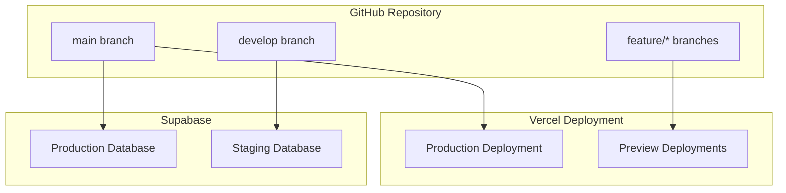

# Deployment Strategy

쏘타 MVP의 배포 전략과 환경 구성 방법을 정의합니다.

---

## 🌍 Environment Strategy

### Environment Types

| Environment | Purpose | Database | Domain | Branch |
|-------------|---------|----------|---------|--------|
| **Development** | Local development | Local PostgreSQL | `localhost:3000` | `main` |
| **Staging** | Feature testing | Supabase Staging | `staging.xbowl.app` | `develop` |
| **Production** | Live application | Supabase Production | `xbowl.app` | `main` |

### Environment Configuration

```typescript
// Environment Variables
interface EnvironmentConfig {
  // Database
  DATABASE_URL: string
  DIRECT_URL: string
  
  // Authentication
  CLERK_SECRET_KEY: string
  CLERK_PUBLISHABLE_KEY: string
  CLERK_WEBHOOK_SECRET: string
  
  // Supabase
  NEXT_PUBLIC_SUPABASE_URL: string
  NEXT_PUBLIC_SUPABASE_ANON_KEY: string
  SUPABASE_SERVICE_ROLE_KEY: string
  
  // Application
  NODE_ENV: 'development' | 'staging' | 'production'
  NEXT_PUBLIC_APP_URL: string
}
```

---

## 🚀 Deployment Architecture

### Vercel Deployment



### Deployment Flow

```yaml
# .github/workflows/deploy.yml
name: Deploy to Vercel

on:
  push:
    branches: [main, develop]
  pull_request:
    branches: [main]

jobs:
  deploy:
    runs-on: ubuntu-latest
    steps:
      - uses: actions/checkout@v4
      
      - name: Setup Node.js
        uses: actions/setup-node@v4
        with:
          node-version: '20'
          cache: 'pnpm'
      
      - name: Install dependencies
        run: pnpm install
      
      - name: Run tests
        run: pnpm test
      
      - name: Run linting
        run: pnpm lint
      
      - name: Deploy to Vercel
        uses: amondnet/vercel-action@v25
        with:
          vercel-token: ${{ secrets.VERCEL_TOKEN }}
          vercel-org-id: ${{ secrets.VERCEL_ORG_ID }}
          vercel-project-id: ${{ secrets.VERCEL_PROJECT_ID }}
          vercel-args: '--prod'
```

---

## 🗄️ Database Strategy

### Supabase Configuration

#### Production Database
```sql
-- Production Database Settings
-- Connection Pool: 100 connections
-- Compute: 2 vCPU, 4GB RAM
-- Storage: 10GB SSD
-- Backup: Daily automated backups
-- Retention: 30 days

-- Performance Settings
ALTER SYSTEM SET shared_buffers = '256MB';
ALTER SYSTEM SET effective_cache_size = '1GB';
ALTER SYSTEM SET work_mem = '4MB';
ALTER SYSTEM SET maintenance_work_mem = '64MB';
```

#### Staging Database
```sql
-- Staging Database Settings
-- Connection Pool: 20 connections
-- Compute: 1 vCPU, 2GB RAM
-- Storage: 5GB SSD
-- Backup: Weekly backups
-- Retention: 7 days
```

### Migration Strategy

#### Database Migrations with Drizzle

```typescript
// drizzle.config.ts
import { defineConfig } from 'drizzle-kit'

export default defineConfig({
  schema: './src/infrastructure/database/schema.ts',
  out: './drizzle',
  dialect: 'postgresql',
  dbCredentials: {
    url: process.env.DATABASE_URL!,
  },
  migrations: {
    prefix: 'timestamp',
  },
})

// Migration Example
// drizzle/0001_initial_schema.sql
CREATE TABLE IF NOT EXISTS "blocks" (
  "id" uuid PRIMARY KEY DEFAULT gen_random_uuid(),
  "type" varchar(50) NOT NULL,
  "content" jsonb NOT NULL,
  "created_at" timestamp DEFAULT now() NOT NULL,
  "updated_at" timestamp DEFAULT now() NOT NULL,
  "deleted_at" timestamp
);
```

#### Migration Deployment Process

```bash
# 1. Generate migration
pnpm drizzle-kit generate

# 2. Review migration files
# 3. Test migration on staging
pnpm drizzle-kit migrate

# 4. Deploy to production
pnpm drizzle-kit migrate --env production
```

---

## 🔐 Security Configuration

### Vercel Security Headers

```javascript
// next.config.js
const securityHeaders = [
  {
    key: 'X-DNS-Prefetch-Control',
    value: 'on'
  },
  {
    key: 'Strict-Transport-Security',
    value: 'max-age=63072000; includeSubDomains; preload'
  },
  {
    key: 'X-XSS-Protection',
    value: '1; mode=block'
  },
  {
    key: 'X-Frame-Options',
    value: 'SAMEORIGIN'
  },
  {
    key: 'X-Content-Type-Options',
    value: 'nosniff'
  },
  {
    key: 'Referrer-Policy',
    value: 'origin-when-cross-origin'
  }
]

module.exports = {
  async headers() {
    return [
      {
        source: '/(.*)',
        headers: securityHeaders,
      },
    ]
  },
}
```

### Supabase Row Level Security

```sql
-- Enable RLS on all tables
ALTER TABLE blocks ENABLE ROW LEVEL SECURITY;
ALTER TABLE pages ENABLE ROW LEVEL SECURITY;
ALTER TABLE workspaces ENABLE ROW LEVEL SECURITY;

-- Example RLS Policy
CREATE POLICY "Users can view blocks in their workspace" ON blocks
  FOR SELECT
  USING (
    page_id IN (
      SELECT id FROM pages 
      WHERE workspace_id IN (
        SELECT id FROM workspaces 
        WHERE organization_id IN (
          SELECT id FROM organizations 
          WHERE clerk_org_id = auth.jwt() ->> 'org_id'
        )
      )
    )
  );
```

---

## 📊 Monitoring & Observability

### Vercel Analytics

```typescript
// app/layout.tsx
import { Analytics } from '@vercel/analytics/react'

export default function RootLayout({
  children,
}: {
  children: React.ReactNode
}) {
  return (
    <html lang="en">
      <body>
        {children}
        <Analytics />
      </body>
    </html>
  )
}
```

### Error Tracking

```typescript
// lib/error-tracking.ts
import { captureException, withScope } from '@sentry/nextjs'

export function trackError(error: Error, context?: Record<string, any>) {
  withScope((scope) => {
    if (context) {
      Object.entries(context).forEach(([key, value]) => {
        scope.setContext(key, value)
      })
    }
    captureException(error)
  })
}

// Usage in Server Actions
async function createBlockAction(input: CreateBlockInput) {
  try {
    // ... domain logic
  } catch (error) {
    trackError(error, {
      action: 'createBlock',
      input,
      userId: auth().userId
    })
    throw error
  }
}
```

### Performance Monitoring

```typescript
// lib/performance.ts
import { performance } from 'perf_hooks'

export async function measurePerformance<T>(
  operation: () => Promise<T>,
  operationName: string
): Promise<T> {
  const start = performance.now()
  
  try {
    const result = await operation()
    const duration = performance.now() - start
    
    // Log performance metrics
    console.log(`${operationName} took ${duration.toFixed(2)}ms`)
    
    return result
  } catch (error) {
    const duration = performance.now() - start
    console.error(`${operationName} failed after ${duration.toFixed(2)}ms`, error)
    throw error
  }
}
```

---

## 🔄 CI/CD Pipeline

### GitHub Actions Workflow

```yaml
# .github/workflows/ci-cd.yml
name: CI/CD Pipeline

on:
  push:
    branches: [main, develop]
  pull_request:
    branches: [main]

env:
  NODE_VERSION: '20'
  PNPM_VERSION: '8'

jobs:
  # 1. Code Quality Checks
  quality:
    runs-on: ubuntu-latest
    steps:
      - uses: actions/checkout@v4
      
      - name: Setup Node.js
        uses: actions/setup-node@v4
        with:
          node-version: ${{ env.NODE_VERSION }}
          cache: 'pnpm'
      
      - name: Install pnpm
        uses: pnpm/action-setup@v2
        with:
          version: ${{ env.PNPM_VERSION }}
      
      - name: Install dependencies
        run: pnpm install --frozen-lockfile
      
      - name: Type check
        run: pnpm type-check
      
      - name: Lint
        run: pnpm lint
      
      - name: Format check
        run: pnpm format:check

  # 2. Testing
  test:
    runs-on: ubuntu-latest
    needs: quality
    steps:
      - uses: actions/checkout@v4
      
      - name: Setup Node.js
        uses: actions/setup-node@v4
        with:
          node-version: ${{ env.NODE_VERSION }}
          cache: 'pnpm'
      
      - name: Install dependencies
        run: pnpm install --frozen-lockfile
      
      - name: Run unit tests
        run: pnpm test:unit
      
      - name: Run integration tests
        run: pnpm test:integration
        env:
          DATABASE_URL: ${{ secrets.STAGING_DATABASE_URL }}

  # 3. Build
  build:
    runs-on: ubuntu-latest
    needs: [quality, test]
    steps:
      - uses: actions/checkout@v4
      
      - name: Setup Node.js
        uses: actions/setup-node@v4
        with:
          node-version: ${{ env.NODE_VERSION }}
          cache: 'pnpm'
      
      - name: Install dependencies
        run: pnpm install --frozen-lockfile
      
      - name: Build application
        run: pnpm build
        env:
          NEXT_PUBLIC_SUPABASE_URL: ${{ secrets.NEXT_PUBLIC_SUPABASE_URL }}
          NEXT_PUBLIC_SUPABASE_ANON_KEY: ${{ secrets.NEXT_PUBLIC_SUPABASE_ANON_KEY }}

  # 4. Deploy to Staging
  deploy-staging:
    runs-on: ubuntu-latest
    needs: build
    if: github.ref == 'refs/heads/develop'
    steps:
      - name: Deploy to Vercel Staging
        uses: amondnet/vercel-action@v25
        with:
          vercel-token: ${{ secrets.VERCEL_TOKEN }}
          vercel-org-id: ${{ secrets.VERCEL_ORG_ID }}
          vercel-project-id: ${{ secrets.VERCEL_PROJECT_ID }}
          vercel-args: '--env DATABASE_URL=${{ secrets.STAGING_DATABASE_URL }}'

  # 5. Deploy to Production
  deploy-production:
    runs-on: ubuntu-latest
    needs: build
    if: github.ref == 'refs/heads/main'
    environment: production
    steps:
      - name: Deploy to Vercel Production
        uses: amondnet/vercel-action@v25
        with:
          vercel-token: ${{ secrets.VERCEL_TOKEN }}
          vercel-org-id: ${{ secrets.VERCEL_ORG_ID }}
          vercel-project-id: ${{ secrets.VERCEL_PROJECT_ID }}
          vercel-args: '--prod --env DATABASE_URL=${{ secrets.PRODUCTION_DATABASE_URL }}'
      
      - name: Run database migrations
        run: pnpm drizzle-kit migrate
        env:
          DATABASE_URL: ${{ secrets.PRODUCTION_DATABASE_URL }}
```

---

## 🎯 Environment-Specific Configurations

### Development Environment

```bash
# .env.local
NODE_ENV=development
NEXT_PUBLIC_APP_URL=http://localhost:3000

# Database
DATABASE_URL=postgresql://localhost:5432/xbowl_dev
DIRECT_URL=postgresql://localhost:5432/xbowl_dev

# Clerk
CLERK_SECRET_KEY=sk_test_...
NEXT_PUBLIC_CLERK_PUBLISHABLE_KEY=pk_test_...
CLERK_WEBHOOK_SECRET=whsec_...

# Supabase
NEXT_PUBLIC_SUPABASE_URL=http://localhost:54321
NEXT_PUBLIC_SUPABASE_ANON_KEY=eyJ...
SUPABASE_SERVICE_ROLE_KEY=eyJ...
```

### Staging Environment

```bash
# Vercel Environment Variables
NODE_ENV=staging
NEXT_PUBLIC_APP_URL=https://staging.xbowl.app

# Database
DATABASE_URL=postgresql://staging-db.supabase.co:5432/postgres
DIRECT_URL=postgresql://staging-db.supabase.co:5432/postgres

# Clerk
CLERK_SECRET_KEY=sk_test_... # Staging key
NEXT_PUBLIC_CLERK_PUBLISHABLE_KEY=pk_test_...
CLERK_WEBHOOK_SECRET=whsec_...

# Supabase
NEXT_PUBLIC_SUPABASE_URL=https://staging.supabase.co
NEXT_PUBLIC_SUPABASE_ANON_KEY=eyJ...
SUPABASE_SERVICE_ROLE_KEY=eyJ...
```

### Production Environment

```bash
# Vercel Environment Variables
NODE_ENV=production
NEXT_PUBLIC_APP_URL=https://xbowl.app

# Database
DATABASE_URL=postgresql://prod-db.supabase.co:5432/postgres
DIRECT_URL=postgresql://prod-db.supabase.co:5432/postgres

# Clerk
CLERK_SECRET_KEY=sk_live_... # Production key
NEXT_PUBLIC_CLERK_PUBLISHABLE_KEY=pk_live_...
CLERK_WEBHOOK_SECRET=whsec_...

# Supabase
NEXT_PUBLIC_SUPABASE_URL=https://prod.supabase.co
NEXT_PUBLIC_SUPABASE_ANON_KEY=eyJ...
SUPABASE_SERVICE_ROLE_KEY=eyJ...
```

---

## 📋 Deployment Checklist

### Pre-Deployment

- [ ] All tests passing
- [ ] Code review completed
- [ ] Database migrations tested
- [ ] Environment variables configured
- [ ] Security headers verified
- [ ] Performance benchmarks met

### Post-Deployment

- [ ] Application health check
- [ ] Database connectivity verified
- [ ] Authentication flow tested
- [ ] Real-time features working
- [ ] Error tracking active
- [ ] Performance monitoring active

### Rollback Strategy

```bash
# Vercel Rollback
vercel rollback [deployment-url]

# Database Rollback (if needed)
pnpm drizzle-kit migrate --rollback

# Environment Variable Rollback
# Revert to previous values in Vercel dashboard
```

이 배포 전략은 **안정성**, **확장성**, **모니터링**을 모두 고려하여 설계되었으며, 빠른 개발 사이클과 안전한 프로덕션 배포를 보장합니다.
