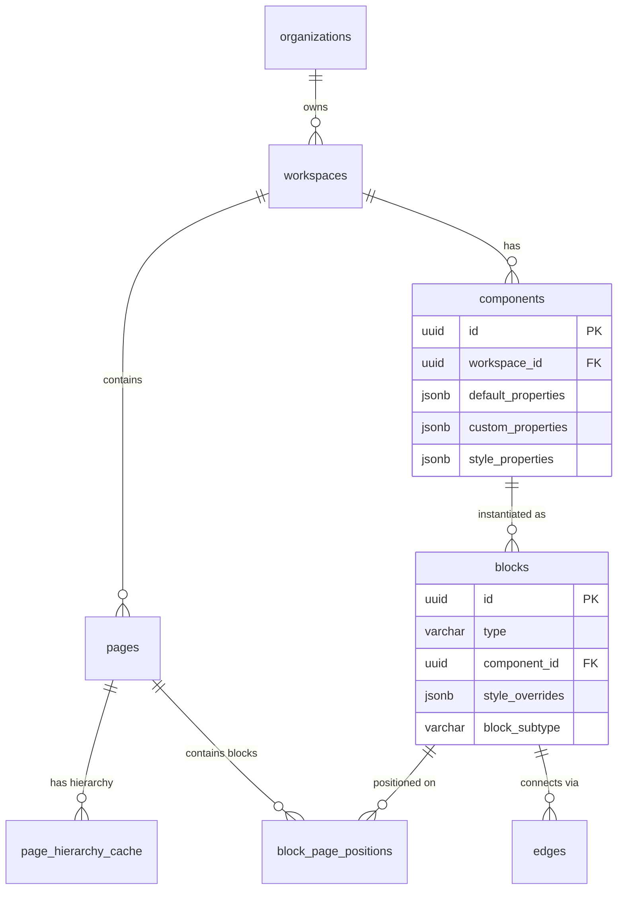

# Unified Database Schema

쏘타 MVP의 모든 도메인을 통합한 전체 데이터베이스 스키마입니다.

---

## 🎯 Schema Overview

### Domain별 테이블 구조



---

## 🏢 Workspace Structure Domain Tables

### 1. organizations

조직 정보 (Clerk 동기화)

```sql
CREATE TABLE organizations (
  -- Primary Key
  id UUID PRIMARY KEY DEFAULT gen_random_uuid(),
  
  -- Clerk Integration
  clerk_org_id VARCHAR(255) UNIQUE NOT NULL,
  
  -- Core Data
  name VARCHAR(255) NOT NULL,
  slug VARCHAR(100) UNIQUE,
  
  -- Sync Management
  sync_status VARCHAR(50) DEFAULT 'synced',
  last_sync_at TIMESTAMP DEFAULT NOW(),
  sync_retry_count INTEGER DEFAULT 0,
  
  -- Audit Fields
  created_at TIMESTAMP DEFAULT NOW(),
  updated_at TIMESTAMP DEFAULT NOW(),
  deleted_at TIMESTAMP NULL,
  
  -- Constraints
  CONSTRAINT valid_sync_status CHECK (sync_status IN ('synced', 'pending', 'failed'))
);

-- Indexes
CREATE INDEX idx_organizations_clerk_id ON organizations(clerk_org_id);
CREATE INDEX idx_organizations_sync_status ON organizations(sync_status) WHERE deleted_at IS NULL;
CREATE INDEX idx_organizations_deleted_at ON organizations(deleted_at);
```

### 2. workspaces

워크스페이스 정보

```sql
CREATE TABLE workspaces (
  -- Primary Key
  id UUID PRIMARY KEY DEFAULT gen_random_uuid(),
  
  -- Foreign Keys
  organization_id UUID NOT NULL REFERENCES organizations(id),
  
  -- Core Data
  name VARCHAR(255) NOT NULL,
  description TEXT,
  icon VARCHAR(255),
  
  -- Settings
  settings JSONB DEFAULT '{}',
  
  -- Audit Fields
  created_by UUID NOT NULL,
  created_at TIMESTAMP DEFAULT NOW(),
  updated_at TIMESTAMP DEFAULT NOW(),
  deleted_at TIMESTAMP NULL,
  scheduled_deletion_at TIMESTAMP NULL,
  
  -- Constraints
  CONSTRAINT valid_name CHECK (LENGTH(name) >= 1 AND LENGTH(name) <= 255)
);

-- Indexes
CREATE INDEX idx_workspaces_org_id ON workspaces(organization_id) WHERE deleted_at IS NULL;
CREATE INDEX idx_workspaces_created_by ON workspaces(created_by);
CREATE INDEX idx_workspaces_deleted_at ON workspaces(deleted_at);
```

### 3. pages

페이지 계층 구조

```sql
CREATE TABLE pages (
  -- Primary Key
  id UUID PRIMARY KEY DEFAULT gen_random_uuid(),
  
  -- Foreign Keys
  workspace_id UUID NOT NULL REFERENCES workspaces(id) ON DELETE CASCADE,
  parent_id UUID REFERENCES pages(id) ON DELETE CASCADE,
  
  -- Core Data
  title VARCHAR(255) NOT NULL,
  slug VARCHAR(255),
  
  -- Hierarchy (Materialized Path)
  path TEXT NOT NULL, -- "/parent1/parent2/current"
  depth INTEGER NOT NULL DEFAULT 0,
  
  -- Page Settings
  settings JSONB DEFAULT '{}',
  
  -- Audit Fields
  created_by UUID NOT NULL,
  created_at TIMESTAMP DEFAULT NOW(),
  updated_at TIMESTAMP DEFAULT NOW(),
  deleted_at TIMESTAMP NULL,
  
  -- Constraints
  UNIQUE(workspace_id, path),
  CONSTRAINT valid_depth CHECK (depth >= 0 AND depth <= 20),
  CONSTRAINT valid_title CHECK (LENGTH(title) >= 1 AND LENGTH(title) <= 255)
);

-- Indexes
CREATE INDEX idx_pages_workspace ON pages(workspace_id) WHERE deleted_at IS NULL;
CREATE INDEX idx_pages_parent ON pages(parent_id) WHERE parent_id IS NOT NULL;
CREATE INDEX idx_pages_path ON pages USING GIN (path gin_trgm_ops);
CREATE INDEX idx_pages_depth ON pages(depth);
```

### 4. page_hierarchy_cache

페이지 계층 구조 캐시 (성능 최적화)

```sql
CREATE TABLE page_hierarchy_cache (
  -- Primary Key
  ancestor_id UUID NOT NULL REFERENCES pages(id) ON DELETE CASCADE,
  descendant_id UUID NOT NULL REFERENCES pages(id) ON DELETE CASCADE,
  
  -- Hierarchy Info
  depth INTEGER NOT NULL,
  
  -- Cache Metadata
  cached_at TIMESTAMP DEFAULT NOW(),
  
  -- Constraints
  PRIMARY KEY (ancestor_id, descendant_id),
  CONSTRAINT valid_cache_depth CHECK (depth >= 0)
);

-- Indexes
CREATE INDEX idx_hierarchy_cache_ancestor ON page_hierarchy_cache(ancestor_id);
CREATE INDEX idx_hierarchy_cache_descendant ON page_hierarchy_cache(descendant_id);
CREATE INDEX idx_hierarchy_cache_depth ON page_hierarchy_cache(depth);
```

---

## 🎨 Visual Canvas Domain Tables

### 5. blocks

모든 블럭의 핵심 정보

```sql
CREATE TABLE blocks (
  -- Primary Key
  id UUID PRIMARY KEY DEFAULT gen_random_uuid(),
  
  -- Block Type
  type VARCHAR(50) NOT NULL,
  
  -- Content (JSON)
  content JSONB NOT NULL DEFAULT '{}',
  default_properties JSONB NOT NULL DEFAULT '{}',
  custom_properties JSONB NOT NULL DEFAULT '{}',
  
  -- Component System Integration
  component_instance_id UUID UNIQUE, -- NULL for regular blocks
  
  -- Audit Fields
  created_at TIMESTAMP DEFAULT NOW(),
  updated_at TIMESTAMP DEFAULT NOW(),
  deleted_at TIMESTAMP NULL,
  
  -- Constraints
  CONSTRAINT valid_type CHECK (type IN ('text', 'image', 'video', 'shape', 'component-instance', 'page'))
);

-- Indexes
CREATE INDEX idx_blocks_type ON blocks(type);
CREATE INDEX idx_blocks_deleted_at ON blocks(deleted_at) WHERE deleted_at IS NULL;
CREATE INDEX idx_blocks_component_instance ON blocks(component_instance_id) WHERE component_instance_id IS NOT NULL;
```

### 6. block_page_positions

블럭의 페이지별 위치 정보

```sql
CREATE TABLE block_page_positions (
  -- Composite Primary Key
  block_id UUID NOT NULL REFERENCES blocks(id) ON DELETE CASCADE,
  page_id UUID NOT NULL REFERENCES pages(id) ON DELETE CASCADE,
  
  -- Position & Size
  x DECIMAL(10, 2) NOT NULL,
  y DECIMAL(10, 2) NOT NULL,
  width DECIMAL(10, 2) NOT NULL DEFAULT 200,
  height DECIMAL(10, 2) NOT NULL DEFAULT 100,
  z_order INTEGER NOT NULL DEFAULT 0,
  
  -- Metadata
  updated_at TIMESTAMP DEFAULT NOW(),
  
  -- Constraints
  PRIMARY KEY (block_id, page_id),
  CONSTRAINT valid_dimensions CHECK (width > 0 AND height > 0)
);

-- Indexes
CREATE INDEX idx_block_positions_page ON block_page_positions(page_id);
CREATE INDEX idx_block_positions_z_order ON block_page_positions(page_id, z_order);
```

### 7. edges

블럭 간 연결 관계

```sql
CREATE TABLE edges (
  -- Primary Key
  id UUID PRIMARY KEY DEFAULT gen_random_uuid(),
  
  -- Connection
  source_block_id UUID NOT NULL REFERENCES blocks(id) ON DELETE CASCADE,
  target_block_id UUID NOT NULL REFERENCES blocks(id) ON DELETE CASCADE,
  page_id UUID NOT NULL REFERENCES pages(id) ON DELETE CASCADE,
  
  -- Edge Details
  source_handle VARCHAR(50),
  target_handle VARCHAR(50),
  label VARCHAR(200),
  
  -- Styling
  style JSONB DEFAULT '{}',
  
  -- Audit Fields
  created_at TIMESTAMP DEFAULT NOW(),
  updated_at TIMESTAMP DEFAULT NOW(),
  
  -- Constraints
  CONSTRAINT no_self_connection CHECK (source_block_id != target_block_id),
  UNIQUE(source_block_id, target_block_id, page_id)
);

-- Indexes
CREATE INDEX idx_edges_page ON edges(page_id);
CREATE INDEX idx_edges_source ON edges(source_block_id);
CREATE INDEX idx_edges_target ON edges(target_block_id);
```

---

## 🔧 Component System Domain Tables (Simplified)

### 8. components (단순화)

컴포넌트 정의 및 모든 속성 정보를 하나의 테이블에 저장

```sql
CREATE TABLE components (
  -- Primary Key
  id UUID PRIMARY KEY DEFAULT gen_random_uuid(),
  
  -- Basic Info
  name VARCHAR(255) NOT NULL,
  description TEXT,
  category VARCHAR(100) DEFAULT 'general',
  
  -- Workspace Context
  workspace_id UUID NOT NULL REFERENCES workspaces(id) ON DELETE CASCADE,
  
  -- Component Properties (통합된 속성 정의)
  default_properties JSONB DEFAULT '{}',    -- 기본 속성
  custom_properties JSONB DEFAULT '{}',     -- 커스텀 속성  
  style_properties JSONB DEFAULT '{}',      -- 스타일 속성
  
  -- Metadata
  version INTEGER DEFAULT 1,
  tags TEXT[] DEFAULT '{}',
  
  -- Audit Fields
  created_by UUID NOT NULL,
  created_at TIMESTAMP DEFAULT NOW(),
  updated_at TIMESTAMP DEFAULT NOW(),
  deleted_at TIMESTAMP,
  
  -- Constraints
  CONSTRAINT valid_name CHECK (LENGTH(name) >= 1 AND LENGTH(name) <= 255),
  CONSTRAINT valid_category CHECK (category IN ('general', 'ui', 'data', 'layout', 'custom'))
);

-- Indexes
CREATE INDEX idx_components_workspace ON components(workspace_id) WHERE deleted_at IS NULL;
CREATE INDEX idx_components_category ON components(category) WHERE deleted_at IS NULL;
CREATE INDEX idx_components_tags ON components USING GIN (tags);
```

### 9. blocks 테이블 확장 (Component Instance 통합)

기존 blocks 테이블에 컴포넌트 인스턴스 정보를 추가하여 단순화

```sql
-- 기존 blocks 테이블에 컴포넌트 관련 컬럼 추가
ALTER TABLE blocks ADD COLUMN IF NOT EXISTS component_id UUID REFERENCES components(id);
ALTER TABLE blocks ADD COLUMN IF NOT EXISTS style_overrides JSONB DEFAULT '{}';
ALTER TABLE blocks ADD COLUMN IF NOT EXISTS block_subtype VARCHAR(50) DEFAULT 'regular';

-- 블럭 타입 제약조건 업데이트
ALTER TABLE blocks ADD CONSTRAINT valid_block_type_extended CHECK (
  type IN ('text', 'image', 'video', 'shape', 'page', 'component-instance')
);

-- 블럭 서브타입 제약조건 추가
ALTER TABLE blocks ADD CONSTRAINT valid_block_subtype CHECK (
  block_subtype IN ('regular', 'instance', 'page')
);

-- 컴포넌트 인스턴스용 인덱스 추가
CREATE INDEX idx_blocks_component_id ON blocks(component_id) WHERE component_id IS NOT NULL;
CREATE INDEX idx_blocks_subtype ON blocks(block_subtype);
CREATE INDEX idx_blocks_component_instance ON blocks(type, component_id) WHERE type = 'component-instance';
```

**단순화된 인스턴스 관리**:
- **component_id**: NULL이면 일반 블럭, 값이 있으면 컴포넌트 인스턴스
- **style_overrides**: 스타일 속성만 오버라이드 (간단한 JSON)
- **block_subtype**: 비즈니스 로직 분류 (`regular`, `instance`, `page`)

**제거된 복잡한 테이블들**:
- ~~component_properties~~ → `components` 컬럼으로 통합
- ~~component_instances~~ → `blocks` 확장으로 통합
- ~~instance_property_overrides~~ → `blocks.style_overrides` JSON
- ~~component_sync_sessions~~ → 복잡한 동기화 제거
- ~~component_lifecycle_events~~ → 간단한 CRUD로 충분

---

## 🔐 Cross-Domain Foreign Keys

### Visual Canvas ↔ Workspace Structure

```sql
-- blocks에 component_instance 연결 정보 추가 (이미 포함됨)
ALTER TABLE blocks ADD CONSTRAINT fk_blocks_component_instance 
  FOREIGN KEY (component_instance_id) REFERENCES component_instances(id);

-- block_page_positions의 page_id는 이미 정의됨
```

### Component System ↔ Visual Canvas

```sql
-- component_instances의 block_id 연결 (이미 포함됨)
-- component_instances의 page_id 연결 (이미 포함됨)
```

### Component System ↔ Workspace Structure

```sql
-- components의 workspace_id 연결 (이미 포함됨)
```

---

## 📊 Performance Optimization

### 1. 통합 인덱스

```sql
-- Cross-domain queries
CREATE INDEX idx_blocks_component_page ON blocks(component_instance_id, id) WHERE component_instance_id IS NOT NULL;
CREATE INDEX idx_instances_component_page ON component_instances(component_id, page_id) WHERE deleted_at IS NULL;

-- Workspace access optimization
CREATE INDEX idx_components_workspace_active ON components(workspace_id, created_at) WHERE deleted_at IS NULL;
CREATE INDEX idx_pages_workspace_active ON pages(workspace_id, created_at) WHERE deleted_at IS NULL;

-- Sync optimization
CREATE INDEX idx_instances_needs_sync ON component_instances(component_id) WHERE needs_sync = TRUE;
```

### 2. 통합 Materialized Views

```sql
-- Workspace overview with statistics
CREATE MATERIALIZED VIEW workspace_overview AS
SELECT 
  w.id,
  w.name,
  w.organization_id,
  COUNT(DISTINCT p.id) as page_count,
  COUNT(DISTINCT b.id) as block_count,
  COUNT(DISTINCT c.id) as component_count,
  COUNT(DISTINCT ci.id) as instance_count,
  MAX(p.updated_at) as last_page_update,
  MAX(b.updated_at) as last_block_update,
  w.created_at,
  w.updated_at
FROM workspaces w
LEFT JOIN pages p ON w.id = p.workspace_id AND p.deleted_at IS NULL
LEFT JOIN block_page_positions bpp ON p.id = bpp.page_id
LEFT JOIN blocks b ON bpp.block_id = b.id AND b.deleted_at IS NULL
LEFT JOIN components c ON w.id = c.workspace_id AND c.deleted_at IS NULL
LEFT JOIN component_instances ci ON c.id = ci.component_id AND ci.deleted_at IS NULL
WHERE w.deleted_at IS NULL
GROUP BY w.id, w.name, w.organization_id, w.created_at, w.updated_at;

CREATE UNIQUE INDEX idx_workspace_overview_id ON workspace_overview(id);
```

---

## 🔒 Row Level Security (RLS)

### Organization-based Access Control

```sql
-- Enable RLS on all main tables
ALTER TABLE organizations ENABLE ROW LEVEL SECURITY;
ALTER TABLE workspaces ENABLE ROW LEVEL SECURITY;
ALTER TABLE pages ENABLE ROW LEVEL SECURITY;
ALTER TABLE blocks ENABLE ROW LEVEL SECURITY;
ALTER TABLE components ENABLE ROW LEVEL SECURITY;
ALTER TABLE component_instances ENABLE ROW LEVEL SECURITY;

-- Create function to get user's accessible workspaces
CREATE OR REPLACE FUNCTION get_user_workspaces(user_id UUID)
RETURNS SETOF UUID AS $$
BEGIN
  RETURN QUERY
  SELECT w.id
  FROM workspaces w
  INNER JOIN organizations o ON w.organization_id = o.id
  WHERE o.clerk_org_id IN (
    SELECT jsonb_array_elements_text(
      auth.jwt() -> 'org_memberships'
    )
  );
END;
$$ LANGUAGE plpgsql SECURITY DEFINER;

-- RLS Policies for workspaces
CREATE POLICY "Users can access workspaces in their organizations" ON workspaces
  FOR ALL USING (id IN (SELECT get_user_workspaces(auth.uid())));

-- RLS Policies for pages
CREATE POLICY "Users can access pages in their workspaces" ON pages
  FOR ALL USING (workspace_id IN (SELECT get_user_workspaces(auth.uid())));

-- Similar policies for other tables...
```

---

## 📈 Data Size Estimation

### Overall Database Size Projection

**Assumptions** (10,000 organizations):
- 100,000 workspaces
- 5,000,000 pages
- 50,000,000 blocks
- 500,000 components
- 50,000,000 component instances

**Estimated Table Sizes (Simplified)**:
- `organizations`: 10K records (~1MB)
- `workspaces`: 100K records (~20MB)
- `pages`: 5M records (~1GB)
- `page_hierarchy_cache`: 25M records (~500MB)
- `blocks`: 50M records (~18GB) *component_id, style_overrides 포함*
- `block_page_positions`: 50M records (~5GB)
- `edges`: 10M records (~1GB)
- `components`: 500K records (~100MB) *모든 속성 통합*

**Total Estimated Size**: ~26GB (core data without indexes)
**With Indexes & Cache**: ~35GB

### 단순화로 인한 개선
- **데이터 크기**: 50GB → 35GB (**30% 감소**)
- **테이블 수**: 13개 → 8개 (**38% 감소**)
- **복잡도**: 높음 → 낮음
- **쿼리 성능**: JOIN 감소로 향상

---

## 🔄 Migration Strategy

### Phase 1: Core Infrastructure
1. Workspace Structure tables
2. Basic Visual Canvas tables
3. Core RLS policies

### Phase 2: Advanced Features
1. Component System tables
2. Cross-domain foreign keys
3. Performance indexes

### Phase 3: Optimization
1. Materialized views
2. Advanced indexes
3. Performance tuning

---

## ✅ Schema Validation Checklist

- [x] All domains represented with proper table structure
- [x] Cross-domain relationships properly defined
- [x] Foreign key constraints for data integrity
- [x] Proper indexing for performance
- [x] RLS policies for security
- [x] JSONB fields for schema flexibility
- [x] Audit trails (created_at, updated_at, deleted_at)
- [x] Soft delete patterns
- [x] Performance optimization considerations
- [x] Data size estimation and planning
