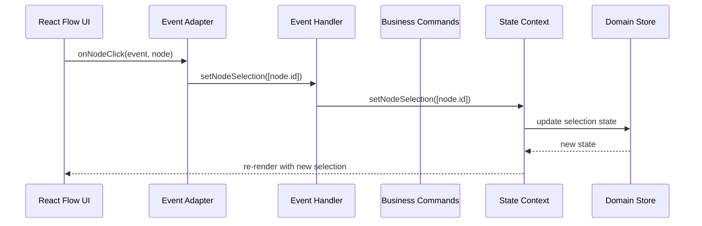
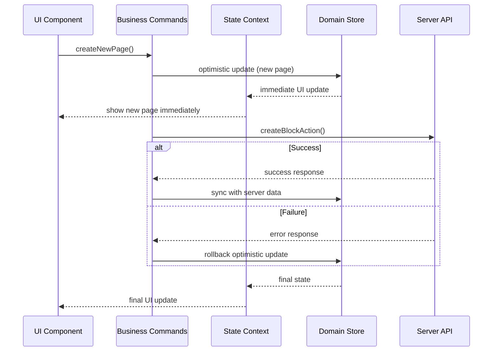

# 핸들러(Handler) vs 훅(Hook) 아키텍처 패턴

## 📚 개요

이 문서는 소프트웨어 아키텍처를 공부하는 개발자를 위해 **핸들러(Handler)**와 **훅(Hook)**의 차이점과 각각의 역할을 실제 프로젝트 사례를 통해 설명합니다. XBowl 프로젝트의 Canvas 도메인 리팩토링을 예시로 사용합니다.

## 🎯 핵심 개념

### 핸들러(Handler)란?

- **UI 이벤트를 도메인 이벤트로 변환하는 레이어**
- **"무엇을 할지"를 결정하는 역할**
- **비즈니스 로직은 포함하지 않음**

### 훅(Hook)이란?

- **복잡한 비즈니스 로직과 워크플로우를 처리하는 레이어**
- **"어떻게 할지"를 구현하는 역할**
- **서버 통신, 상태 관리, 에러 처리를 담당**

## 🏗️ 아키텍처 계층 구조

```
┌─────────────────────────────────────┐
│           UI Components             │ ← React Flow, DOM
│        (React Components)           │
├─────────────────────────────────────┤
│         Adapters Layer              │ ← 인터페이스 변환
│   (useReactFlowEventAdapter)        │
├─────────────────────────────────────┤
│         Handlers Layer              │ ← 이벤트 처리
│    (useReactFlowHandler)            │
├─────────────────────────────────────┤
│         Commands Layer              │ ← 비즈니스 로직
│     (useCanvasCommands)             │
├─────────────────────────────────────┤
│         Contexts Layer              │ ← 상태 관리
│  (CanvasDataContext, etc.)          │
├─────────────────────────────────────┤
│         Stores Layer                │ ← 순수 상태
│   (blocks.store, etc.)              │
└─────────────────────────────────────┘
```

## 📖 상세 분석

### 1. 핸들러(Handler) - 이벤트 처리 레이어

#### 역할과 책임

```typescript
// useReactFlowHandler.ts
export function useReactFlowHandler(): UseReactFlowHandlerResult {
  const data = useCanvasData();
  const sel = useCanvasSelection();

  // 단순한 이벤트 처리 - 비즈니스 로직 없음
  const onNodeClick = useCallback(
    (evt: React.MouseEvent, node: ReactFlowNode) => {
      evt.preventDefault();
      evt.stopPropagation();
      // 단순히 선택 상태만 변경
      sel.setNodeSelection([node.id]);
    },
    [sel]
  );

  const onNodeDragStop = useCallback(
    (_evt: React.MouseEvent, node: ReactFlowNode) => {
      const pos = node?.position;
      const contextId = sel.pageId || undefined;
      if (!pos || !contextId) return;
      // 단순히 위치 업데이트만
      data.updateContextPositions(contextId, [
        { id: node.id, x: pos.x, y: pos.y },
      ]);
    },
    [sel.pageId, data.updateContextPositions]
  );
}
```

#### 핸들러의 특징

- ✅ **단순성**: 복잡한 로직 없이 이벤트만 처리
- ✅ **직접성**: UI 이벤트를 즉시 도메인 상태로 변환
- ✅ **반응성**: 사용자 액션에 즉시 반응
- ❌ **비즈니스 로직 부재**: 복잡한 워크플로우 처리 불가
- ❌ **재사용성 제한**: 특정 UI 라이브러리에 종속

### 2. 훅(Hook) - 비즈니스 로직 레이어

#### 역할과 책임

```typescript
// useCanvasCommands.ts
export function useCanvasCommands({
  workspaceId,
  blocksById,
  upsertBlock,
  updateBlock,
  setPagePositions,
  selectPage,
  updateContextPositions,
  setNodeSelection,
}: {
  // ... dependencies
}) {
  // 복잡한 비즈니스 로직 - 낙관적 업데이트 + 서버 동기화
  const createNewPage = useCallback(async (): Promise<CreateStatus> => {
    const optimisticId = generateUUID();
    const now = new Date();
    const newPage: Block = {
      id: optimisticId,
      block_type: "basic_text" as any,
      slug: `new-page-${Date.now()}`,
      name: "새 페이지",
      // ... more properties
    };

    // 1. 낙관적 업데이트 (즉시 UI 반영)
    upsertBlock(newPage);
    setPagePositions(optimisticId, []);
    selectPage(optimisticId);

    // 2. 서버 동기화 (백그라운드)
    const res = await createBlockAction({
      blockType: newPage.block_type as any,
      slug: newPage.slug,
      name: newPage.name,
      // ... more properties
    });

    // 3. 성공/실패 처리
    if (isFailure(res)) {
      return { ok: false, error: String(res.error) };
    }

    // 4. 최종 상태 동기화
    const dbBlock = res.data;
    updateBlock(optimisticId, {
      id: dbBlock.id,
      created_at: new Date(dbBlock.created_at),
      updated_at: new Date(dbBlock.updated_at),
      // ... more properties
    });
    selectPage(dbBlock.id as string);
    return { ok: true };
  }, [workspaceId, upsertBlock, setPagePositions, selectPage, updateBlock]);
}
```

#### 훅의 특징

- ✅ **복잡성 처리**: 낙관적 업데이트, 서버 동기화, 에러 처리
- ✅ **재사용성**: 도메인 로직을 여러 곳에서 재사용 가능
- ✅ **테스트 용이성**: 비즈니스 로직을 독립적으로 테스트 가능
- ✅ **일관성**: 동일한 패턴으로 모든 비즈니스 로직 처리
- ❌ **복잡성**: 단순한 이벤트에는 과도한 복잡성
- ❌ **학습 곡선**: 패턴 이해와 구현에 시간 소요

### 3. 어댑터(Adapter) - 인터페이스 변환 레이어

#### 역할과 책임

```typescript
// useReactFlowEventAdapter.ts
export function useReactFlowEventAdapter({
  selectedPageId,
  updateContextPositions,
  setNodeSelection,
}: {
  selectedPageId: string | null;
  updateContextPositions: (contextId: string, updates: any[]) => void;
  setNodeSelection: (ids: string[]) => void;
}) {
  // React Flow 이벤트를 도메인 함수로 변환
  const onNodeClick = useCallback(
    (evt: React.MouseEvent, node: ReactFlowNode) => {
      evt.preventDefault();
      evt.stopPropagation();
      setNodeSelection([node.id]); // 도메인 함수 호출
    },
    [setNodeSelection]
  );

  const onPaneClick = useCallback(
    () => setNodeSelection([]),
    [setNodeSelection]
  );
}
```

#### 어댑터의 특징

- ✅ **의존성 역전**: 외부 라이브러리와 도메인 분리
- ✅ **교체 가능성**: 다른 UI 라이브러리로 쉽게 교체 가능
- ✅ **테스트 용이성**: 모킹을 통한 독립적 테스트
- ❌ **추상화 오버헤드**: 간단한 경우 불필요한 복잡성

## 🔄 데이터 흐름 예시

### 사용자가 노드를 클릭했을 때의 전체 흐름



### 사용자가 새 페이지를 생성했을 때의 전체 흐름



## 📊 비교 분석표

| 구분          | 핸들러(Handler)   | 훅(Commands)        | 어댑터(Adapter)     |
| ------------- | ----------------- | ------------------- | ------------------- |
| **주요 역할** | 이벤트 처리       | 비즈니스 로직       | 인터페이스 변환     |
| **복잡도**    | 낮음              | 높음                | 중간                |
| **의존성**    | UI 라이브러리     | 서버 액션           | 외부 라이브러리     |
| **재사용성**  | 낮음 (특정 UI)    | 높음 (도메인)       | 중간 (라이브러리별) |
| **테스트**    | 이벤트 시뮬레이션 | 비즈니스 로직 검증  | 인터페이스 검증     |
| **성능**      | 빠름 (동기)       | 느림 (비동기)       | 빠름 (동기)         |
| **에러 처리** | 기본적            | 고급 (롤백, 재시도) | 기본적              |

## 🎯 설계 원칙과 패턴

### 1. 단일 책임 원칙 (Single Responsibility Principle)

```typescript
// 핸들러: 이벤트 처리만 담당
const onNodeClick = (evt, node) => sel.setNodeSelection([node.id]);

// 훅: 비즈니스 로직만 담당
const createNewPage = async () => {
  // 낙관적 업데이트 + 서버 동기화 + 에러 처리
};

// 어댑터: 인터페이스 변환만 담당
const adapter = (externalEvent) => domainFunction(externalEvent);
```

### 2. 의존성 역전 원칙 (Dependency Inversion Principle)

```typescript
// 구체적인 UI가 추상적인 도메인에 의존
// ❌ 잘못된 설계
const handler = () => {
  reactFlowNode.setPosition(x, y); // 구체적인 React Flow API
};

// ✅ 올바른 설계
const handler = () => {
  updateNodePosition(nodeId, x, y); // 추상적인 도메인 함수
};
```

### 3. 개방-폐쇄 원칙 (Open-Closed Principle)

```typescript
// 새로운 UI 라이브러리 추가 시 어댑터만 추가
// 기존 핸들러와 훅은 수정하지 않음

// React Flow 어댑터
const reactFlowAdapter = (event) => domainEvent(event);

// 새로운 라이브러리 어댑터 (예: D3.js)
const d3Adapter = (event) => domainEvent(event);
```

## 🧪 테스트 전략

### 핸들러 테스트

```typescript
describe("useReactFlowHandler", () => {
  it("should set node selection on click", () => {
    const mockSetNodeSelection = jest.fn();
    const handler = useReactFlowHandler({
      setNodeSelection: mockSetNodeSelection,
    });

    const mockEvent = { preventDefault: jest.fn(), stopPropagation: jest.fn() };
    const mockNode = { id: "node-1" };

    handler.onNodeClick(mockEvent, mockNode);

    expect(mockSetNodeSelection).toHaveBeenCalledWith(["node-1"]);
  });
});
```

### 훅 테스트

```typescript
describe("useCanvasCommands", () => {
  it("should create page with optimistic update and server sync", async () => {
    const mockUpsertBlock = jest.fn();
    const mockCreateBlockAction = jest
      .fn()
      .mockResolvedValue({ success: true, data: { id: "db-1" } });

    const commands = useCanvasCommands({
      upsertBlock: mockUpsertBlock,
      createBlockAction: mockCreateBlockAction,
    });

    const result = await commands.createNewPage();

    expect(mockUpsertBlock).toHaveBeenCalled(); // 낙관적 업데이트
    expect(mockCreateBlockAction).toHaveBeenCalled(); // 서버 동기화
    expect(result.ok).toBe(true);
  });
});
```

### 어댑터 테스트

```typescript
describe("useReactFlowEventAdapter", () => {
  it("should convert React Flow event to domain event", () => {
    const mockSetNodeSelection = jest.fn();
    const adapter = useReactFlowEventAdapter({
      setNodeSelection: mockSetNodeSelection,
    });

    const mockEvent = { preventDefault: jest.fn(), stopPropagation: jest.fn() };
    const mockNode = { id: "node-1" };

    adapter.onNodeClick(mockEvent, mockNode);

    expect(mockSetNodeSelection).toHaveBeenCalledWith(["node-1"]);
  });
});
```

## 🚀 실제 적용 가이드

### 언제 핸들러를 사용할까?

- ✅ 단순한 UI 이벤트 처리
- ✅ 즉시 반응이 필요한 사용자 액션
- ✅ 비즈니스 로직이 없는 상태 변경

```typescript
// ✅ 핸들러 사용 예시
const onNodeClick = (evt, node) => {
  evt.preventDefault();
  sel.setNodeSelection([node.id]); // 단순한 상태 변경
};
```

### 언제 훅을 사용할까?

- ✅ 복잡한 비즈니스 워크플로우
- ✅ 서버 통신이 필요한 작업
- ✅ 낙관적 업데이트가 필요한 작업
- ✅ 에러 처리와 롤백이 필요한 작업

```typescript
// ✅ 훅 사용 예시
const createNewPage = async () => {
  // 1. 낙관적 업데이트
  const optimisticId = generateUUID();
  upsertBlock({ id: optimisticId, name: "새 페이지" });

  // 2. 서버 동기화
  const result = await createBlockAction({ name: "새 페이지" });

  // 3. 성공/실패 처리
  if (result.success) {
    updateBlock(optimisticId, result.data);
  } else {
    // 롤백 처리
    removeBlock(optimisticId);
  }
};
```

### 언제 어댑터를 사용할까?

- ✅ 외부 라이브러리와 도메인 분리
- ✅ 여러 UI 라이브러리 지원
- ✅ 테스트 용이성 확보

```typescript
// ✅ 어댑터 사용 예시
const reactFlowAdapter = {
  onNodeClick: (reactFlowEvent, reactFlowNode) => {
    const domainEvent = {
      type: "NODE_CLICK",
      nodeId: reactFlowNode.id,
      position: reactFlowNode.position,
    };
    domainEventHandler(domainEvent);
  },
};
```

## 📝 학습 체크리스트

### 기본 개념 이해

- [ ] 핸들러와 훅의 역할 차이점 이해
- [ ] 어댑터 패턴의 필요성 이해
- [ ] 계층별 책임 분리 원칙 이해

### 실무 적용

- [ ] 기존 코드에서 핸들러/훅 분리하기
- [ ] 어댑터 패턴으로 외부 라이브러리 분리하기
- [ ] 각 레이어별 테스트 코드 작성하기

### 고급 패턴

- [ ] 의존성 주입을 통한 결합도 낮추기
- [ ] 이벤트 드리븐 아키텍처 적용하기
- [ ] 상태 관리 패턴과의 통합

## 🔗 관련 자료

- [Canvas Domain Refactor](./canvas-domain-refactor.md)
- [Clean Architecture Principles](https://blog.cleancoder.com/uncle-bob/2012/08/13/the-clean-architecture.html)
- [React Hooks Best Practices](https://react.dev/learn/reusing-logic-with-custom-hooks)
- [Adapter Pattern](https://refactoring.guru/design-patterns/adapter)

---

_이 문서는 XBowl 프로젝트의 Canvas 도메인 리팩토링 과정에서 학습한 내용을 바탕으로 작성되었습니다._
