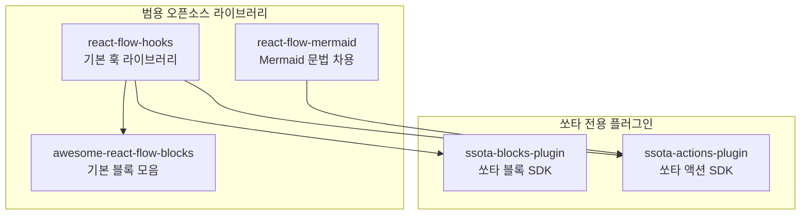

# 쏘타 오픈소스 생태계 로드맵

## 비전과 전략

### 우리의 목표

**AI 에이전트 시대의 React Flow 생태계 부흥**

모바일과 클라우드 시대에 React가 프론트엔드 생태계를 주도했던 것처럼, AI 에이전트 시대에 React Flow가 시각적 인터페이스와 캔버스 기반 서비스의 표준이 되도록 하는 것이 우리의 목표입니다.

### 전략적 가치

1. **세상에 기여하는 기술**
   - 쏘타에서 개발한 기술을 오픈소스로 공개하여 전 세계 개발자들이 활용할 수 있도록 지원
   - 단순한 기술 공유를 넘어, AI 에이전트가 쉽게 조작할 수 있는 인터페이스 제공

2. **생태계 선도**
   - React Flow 기반 서비스 개발의 표준을 제시
   - 개발자들이 쉽게 시작할 수 있는 인프라 제공
   - 커뮤니티가 성장할 수 있는 기반 마련

3. **비즈니스 가치**
   - 오픈소스 기여를 통한 브랜드 가치 향상
   - 기술 리더십 확보
   - 개발자 커뮤니티와의 강한 연결
   - 쏘타 서비스의 기술적 우수성 입증

### 역사적 맥락

- **2010년대 초반**: 모바일 시대의 도래 → React Native가 크로스 플랫폼 개발의 표준이 됨
- **2010년대 중반**: 클라우드 시대의 도래 → React가 프론트엔드 프레임워크의 표준이 됨
- **2020년대 후반**: AI 에이전트 시대의 도래 → **React Flow가 시각적 인터페이스의 표준이 되어야 함**

### 우리의 역할

쏘타는 AI 에이전트가 자연스럽게 조작할 수 있는 캔버스 인터페이스를 선도적으로 개발하고 있습니다. 이를 오픈소스로 공개함으로써:

- **개발자들이 쉽게 시작**: 복잡한 캔버스 관리 로직을 추상화하여 제공
- **AI 에이전트 친화적**: AI가 이해하고 조작하기 쉬운 인터페이스 제공
- **생태계 성장**: 더 많은 개발자와 서비스가 React Flow를 채택하도록 지원

## 개요

쏘타 프로젝트에서 개발한 React Flow 기반의 캔버스 관리 기술을 오픈소스로 공개하여, 다른 개발자들이 자신만의 React Flow 서비스를 쉽게 만들 수 있도록 지원하는 생태계를 구축합니다.

### 프로젝트 분류

**범용 오픈소스 라이브러리** (쏘타와 무관하게 사용 가능):
- `react-flow-hooks`: React Flow 캔버스 관리 핵심 훅
- `react-flow-mermaid`: Mermaid 스타일 문법 기반 AI 친화적 인터페이스
- `awesome-react-flow-blocks`: shadcn 스타일의 블록 컴포넌트 모음

**쏘타 전용 플러그인** (쏘타 서비스 내부에서만 사용):
- `ssota-blocks-plugin`: 쏘타 블록 개발 SDK
- `ssota-actions-plugin`: 쏘타 액션 개발 SDK

## 생태계 구조



> **참고**: `react-flow-hooks`, `react-flow-mermaid`, `awesome-react-flow-blocks`는 범용 오픈소스로, 쏘타와 무관하게 다른 React Flow 서비스를 만들 때 사용할 수 있습니다.  
> `ssota-blocks-plugin`과 `ssota-actions-plugin`은 쏘타 서비스 내부에서만 사용하는 플러그인입니다.

## 1. react-flow-hooks

### 개요

React Flow 기반 캔버스 서비스를 만들기 위한 핵심 훅 라이브러리입니다. 블록 라이프사이클, 블록 마운트 라이프사이클, 복제, 삭제, 이동, 가이드라인 등 캔버스 조작에 필요한 모든 훅을 제공합니다.

### 핵심 가치

- **의존성 최소화**: React Flow에만 의존하며, 백엔드 로직과 완전히 분리
- **타입 안전성**: 제네릭을 활용하여 사용자의 커스텀 블록 타입을 완전히 지원
- **Optimistic 업데이트**: 즉각적인 UI 반응을 위한 optimistic 업데이트 지원
- **플러그인 아키텍처**: TanStack Query, React 19 useOptimistic 등 다양한 전략 지원

### 주요 기능

#### 블록 관리
- 블록 생성 (`useCreateBlock`)
- 블록 삭제 (`useDeleteBlock`)
- 블록 복제 (`useDuplicateBlock`)
- 블록 이동 (`useMoveBlock`)
- 블록 크기 조정 (`useResizeBlock`)
- 블록 위치 업데이트 (`useUpdateBlockPosition`)

#### 엣지 관리
- 엣지 생성 (`useCreateEdge`)
- 엣지 삭제 (`useDeleteEdge`)
- 엣지 업데이트 (`useUpdateEdge`)

#### 캔버스 유틸리티
- 뷰포트 관리 (`useCanvasViewport`)
- 스냅 가이드라인 (`useSnapGuides`)
- 자동 위치 계산 (`useAutoPosition`)

### 사용 예시

#### 기본 사용 (콜백 기반)

```typescript
import { useBlockCanvas } from 'react-flow-hooks';

function MyCanvas() {
  const { createBlock, deleteBlock, duplicateBlock } = useBlockCanvas({
    onCreate: async (data) => {
      const res = await fetch('/api/blocks', {
        method: 'POST',
        body: JSON.stringify(data)
      });
      return res.json();
    },
    onDelete: async (id) => {
      await fetch(`/api/blocks/${id}`, { method: 'DELETE' });
    },
    onDuplicate: async (id) => {
      const res = await fetch(`/api/blocks/${id}/duplicate`, { method: 'POST' });
      return res.json();
    }
  });

  return (
    <ReactFlow>
      <button onClick={() => createBlock({ 
        blockType: 'text', 
        position: { x: 100, y: 100 } 
      })}>
        블록 생성
      </button>
    </ReactFlow>
  );
}
```

#### TanStack Query 플러그인 사용

```typescript
import { useBlockCanvas } from 'react-flow-hooks/tanstack';

// 사용자는 TanStack Query를 몰라도 됨!
// 내부적으로 useMutation과 optimistic update를 자동 처리
const { createBlock, deleteBlock } = useBlockCanvas({
  onCreate: async (data) => {
    return fetch('/api/blocks', {
      method: 'POST',
      body: JSON.stringify(data)
    }).then(r => r.json());
  },
  onDelete: async (id) => {
    await fetch(`/api/blocks/${id}`, { method: 'DELETE' });
  }
});
```

#### React 19 useOptimistic 플러그인 사용

```typescript
import { useBlockCanvas } from 'react-flow-hooks/react19';

// React 19의 useOptimistic을 내부적으로 사용
// 사용자는 동일한 API로 사용
const { createBlock, deleteBlock } = useBlockCanvas({
  onCreate: async (data) => { /* ... */ },
  onDelete: async (id) => { /* ... */ }
});
```

#### 타입 안전한 커스텀 블록 타입

```typescript
type MyBlockTypes = 'text' | 'image' | 'custom-chart';

interface MyBlockData<T extends MyBlockTypes> {
  blockType: T;
  title: string;
  properties: T extends 'text' ? TextProps : 
               T extends 'image' ? ImageProps : 
               ChartProps;
}

const { createBlock } = useBlockCanvas<MyBlockTypes, MyBlockData>({
  onCreate: async (data) => { /* ... */ }
});

// 타입 안전하게 사용
createBlock({
  blockType: 'text', // 타입 체크됨
  position: { x: 0, y: 0 },
  properties: { /* TextProps만 허용 */ }
});
```

### 패키지 구조

```
react-flow-hooks/
├── src/
│   ├── core/
│   │   ├── types/              # 공통 타입 정의
│   │   ├── hooks/              # 코어 훅들
│   │   │   ├── useBlockCanvas.ts
│   │   │   ├── useEdgeCanvas.ts
│   │   │   ├── useCanvasViewport.ts
│   │   │   └── useSnapGuides.ts
│   │   └── utils/              # 유틸리티
│   ├── plugins/
│   │   ├── tanstack/           # TanStack Query 플러그인
│   │   │   └── useBlockCanvas.ts
│   │   ├── react19/            # React 19 useOptimistic 플러그인
│   │   │   └── useBlockCanvas.ts
│   │   └── snap-guides/        # 스냅 가이드라인 플러그인
│   │       └── useSnapGuides.ts
│   └── index.ts
├── package.json
└── README.md
```

### Export 구조

- `react-flow-hooks` - 코어 기능
- `react-flow-hooks/tanstack` - TanStack Query 통합
- `react-flow-hooks/react19` - React 19 useOptimistic
- `react-flow-hooks/snap-guides` - 스냅 가이드라인

### 기술 스택

- **React Flow**: v11+
- **React**: 18+ (필수), 19 (선택)
- **TypeScript**: 5+
- **TanStack Query**: v5+ (플러그인)

### 개발 상태

- [ ] 패키지 구조 설계
- [ ] 코어 타입 시스템 구현
- [ ] 블록 관리 훅 구현
- [ ] 엣지 관리 훅 구현
- [ ] TanStack Query 플러그인 구현
- [ ] React 19 플러그인 구현
- [ ] 스냅 가이드라인 플러그인 구현
- [ ] 문서화
- [ ] npm 배포

---

## 2. react-flow-mermaid

### 개요

React Flow 기반의 Mermaid 문법을 차용한 라이브러리로, AI가 캔버스를 조작하기 쉽게 만드는 도구입니다. Mermaid DSL을 직접 사용하는 것이 아니라, Mermaid의 문법적 패턴을 참고하여 AI 친화적인 인터페이스를 제공합니다.

### 핵심 가치

- **AI 친화적**: 자연어나 Mermaid 스타일의 문법으로 캔버스 조작 가능
- **자동 레이아웃**: 그래프 구조를 React Flow 노드/엣지로 자동 변환
- **문법 차용**: Mermaid의 직관적인 문법 패턴을 참고 (완전한 호환은 아님)

### 주요 기능

- Mermaid 스타일 문법 파싱 및 React Flow 변환
- 자동 레이아웃 알고리즘
- AI 프롬프트 기반 캔버스 생성
- 그래프 구조 표현

### 설계 방향

> **중요**: Mermaid DSL과의 완전한 호환성을 목표로 하지 않습니다. 대신 Mermaid의 직관적인 문법 패턴을 차용하여, AI가 이해하기 쉽고 사용자가 자연스럽게 사용할 수 있는 문법을 제공합니다. 호환성 문제를 피하기 위해 독자적인 문법을 사용할 수 있습니다.

### 사용 예시

```typescript
import { useMermaidCanvas } from 'react-flow-mermaid';

function MyCanvas() {
  const { parseGraph, createFromPrompt } = useMermaidCanvas();

  // Mermaid 스타일 문법으로 캔버스 생성
  const nodes = parseGraph(`
    graph TD
      A[시작] --> B[처리]
      B --> C[종료]
  `);

  // AI 프롬프트로 캔버스 생성
  const nodesFromAI = createFromPrompt(
    "시작 노드에서 처리 노드로 연결하고, 처리 노드에서 종료 노드로 연결해줘"
  );
}
```

### 개발 상태

- [ ] Mermaid 스타일 문법 파서 구현
- [ ] React Flow 변환 로직
- [ ] 자동 레이아웃 알고리즘
- [ ] AI 프롬프트 통합
- [ ] 문서화 (Mermaid 호환성 명시)

---

## 3. awesome-react-flow-blocks

### 개요

shadcn/ui처럼 사용할 수 있는 React Flow 블록 컴포넌트 모음입니다. 그룹, 마크다운(TipTap), 목차, 프레임, 그래프, 프리뷰 등 자주 사용되는 블록들을 제공합니다.

### 핵심 가치

- **Copy & Paste**: 필요한 블록만 복사해서 사용
- **완전한 커스터마이징**: 모든 소스 코드 제공
- **타입 안전**: TypeScript 완전 지원
- **접근성**: WCAG 가이드라인 준수

### 제공 블록

#### 기본 블록
- 텍스트 블록
- 이미지 블록
- 링크 블록
- 파일 블록

#### 고급 블록
- 마크다운 에디터 (TipTap 기반)
- 그래프/차트 블록
- 코드 프리뷰 블록
- 목차 블록
- 그룹 블록
- 프레임 블록

### 사용 예시

```bash
# 필요한 블록만 복사
npx awesome-react-flow-blocks add markdown-editor
npx awesome-react-flow-blocks add graph-block
```

```typescript
import { MarkdownBlock } from '@/components/blocks/markdown-block';
import { GraphBlock } from '@/components/blocks/graph-block';

// react-flow-hooks와 함께 사용
const { createBlock } = useBlockCanvas({
  onCreate: async (data) => { /* ... */ }
});

createBlock({
  blockType: 'markdown',
  component: MarkdownBlock,
  // ...
});
```

### 개발 상태

- [ ] 기본 블록 컴포넌트 구현
- [ ] CLI 도구 개발
- [ ] 문서화
- [ ] 예제 프로젝트

---

## 4. ssota-blocks-plugin

> **⚠️ 쏘타 전용 플러그인**: 이 플러그인은 쏘타 서비스 내부에서만 사용하는 플러그인입니다. 범용 오픈소스가 아닙니다.

### 개요

SDK를 통해 쏘타 생태계의 다양한 블록을 만들 수 있는 플러그인입니다. Obsidian 플러그인처럼 사용자가 다운로드하여 쏘타 서비스 내에서 사용할 수 있습니다.

### 핵심 가치

- **확장성**: 개발자가 쏘타 전용 블록을 만들 수 있음
- **배포**: npm을 통해 블록 배포 가능
- **검증**: 쏘타 생태계와의 호환성 보장
- **쏘타 통합**: 쏘타 서비스와 완전히 통합된 블록 개발

### 주요 기능

- 쏘타 블록 개발 SDK
- 블록 빌드 도구
- 블록 배포 파이프라인
- 쏘타 생태계 통합

### 사용 예시

```typescript
import { createBlock } from 'ssota-blocks-plugin';

export const MyCustomBlock = createBlock({
  type: 'my-custom-block',
  name: 'My Custom Block',
  icon: MyIcon,
  component: MyBlockComponent,
  properties: {
    // 블록 속성 정의
  }
});
```

### 웹 런타임 플러그인 로딩

웹 환경에서 사용자가 만든 플러그인을 런타임에 동적으로 로드하는 방법입니다. 데스크톱 앱(VSCode, Obsidian)과 달리 웹에서는 파일 시스템 접근이 제한되므로, 다른 접근 방식이 필요합니다.

#### 핵심 개념

웹에서는 "설치"가 아니라 "참조"입니다:
1. 플러그인 개발자가 npm에 배포
2. CDN(unpkg, jsDelivr)이 자동으로 ESM 제공
3. 쏘타가 Dynamic Import로 런타임에 로드

#### 구현 방식

**Option 1: CDN + Dynamic Import (추천)**

```typescript
// 플러그인 로더
class PluginLoader {
  async loadPlugin(pluginId: string) {
    // 1. 플러그인 메타데이터 가져오기
    const meta = await fetch(`/api/plugins/${pluginId}/meta`).then(r => r.json());
    
    // 2. 검증된 CDN URL에서만 로드
    const cdnUrl = `https://cdn.jsdelivr.net/npm/${meta.package}@${meta.version}/+esm`;
    
    // 3. 동적 import
    const module = await import(/* @vite-ignore */ cdnUrl);
    
    // 4. 플러그인 검증 및 등록
    this.validatePlugin(module);
    this.registerBlock(module.default);
  }
}
```

**장점:**
- 실제로 작동하는 방식
- 보안성 높음 (CDN whitelist)
- 캐싱 가능
- npm 생태계 활용

**단점:**
- 플러그인을 npm에 배포해야 함
- 즉시 테스트가 어려움

**Option 2: iframe 격리 (보안 중요 시)**

```typescript
// 플러그인을 별도 iframe에서 실행
<iframe 
  src={`/plugin-runtime/${pluginId}`}
  sandbox="allow-scripts allow-same-origin"
/>

// postMessage로 통신
iframe.contentWindow.postMessage({
  type: 'RENDER_BLOCK',
  data: blockData
}, '*');
```

**장점:**
- 완전한 격리 (보안)
- 플러그인이 메인 앱을 망가뜨릴 수 없음

**단점:**
- 성능 오버헤드
- 통신 복잡도 증가
- 스타일링 어려움

#### 플러그인 아키텍처

```typescript
// 플러그인 인터페이스
export interface SsotaBlockPlugin {
  id: string;
  name: string;
  version: string;
  BlockComponent: React.ComponentType<BlockProps>;
  SettingsComponent?: React.ComponentType<SettingsProps>;
  icon: string;
  category: 'text' | 'media' | 'data' | 'custom';
}

// 플러그인 레지스트리
class PluginRegistry {
  async install(npmPackage: string) {
    // 1. 서버에 플러그인 정보 저장
    await fetch('/api/plugins/install', {
      method: 'POST',
      body: JSON.stringify({ npmPackage })
    });
    
    // 2. CDN URL 받기
    const { cdnUrl } = await response.json();
    
    // 3. 동적 로드
    await this.loadPlugin(cdnUrl);
  }
}
```

#### 보안 고려사항

- **CDN Whitelist**: 신뢰할 수 있는 CDN만 허용 (jsdelivr, unpkg, esm.sh)
- **플러그인 검증**: 필수 export 확인, 타입 체크
- **격리 옵션**: 신뢰할 수 없는 플러그인은 iframe 사용
- **CSP 정책**: Content Security Policy로 동적 코드 실행 제한

#### VSCode/Obsidian vs 웹의 차이

| 기능 | VSCode/Obsidian | 웹 (쏘타) |
|------|-----------------|-----------|
| 파일 시스템 | ✅ 직접 접근 | ❌ 제한적 |
| Node.js | ✅ 사용 가능 | ❌ 불가능 |
| 동적 로드 | `require()` | `import()` with CDN |
| 격리 | 프로세스 | iframe/sandbox |
| 설치 | 파일 복사 | CDN 참조 |

### 개발 상태

- [ ] SDK 설계
- [ ] 블록 템플릿 생성기
- [ ] 빌드 도구
- [ ] 배포 파이프라인
- [ ] 문서화

---

## 5. ssota-actions-plugin

> **⚠️ 쏘타 전용 플러그인**: 이 플러그인은 쏘타 서비스 내부에서만 사용하는 플러그인입니다. 범용 오픈소스가 아닙니다.

### 개요

SDK를 통해 쏘타 생태계의 다양한 블록 액션을 만들 수 있는 플러그인입니다. AI가 블록을 조작할 때 사용할 수 있는 커스텀 액션을 정의할 수 있으며, 쏘타 서비스 내에서만 동작합니다.

### 핵심 가치

- **AI 통합**: 쏘타 AI가 사용할 수 있는 액션 정의
- **수익화**: 유료 액션 제공 가능
- **확장성**: 커뮤니티가 쏘타 전용 액션을 만들고 공유
- **쏘타 통합**: 쏘타 서비스와 완전히 통합된 액션 개발

### 주요 기능

- 쏘타 액션 개발 SDK
- 쏘타 AI 프롬프트 통합
- 액션 마켓플레이스 (쏘타 내부)
- 과금 시스템

### 사용 예시

```typescript
import { createAction } from 'ssota-actions-plugin';

export const summarizeAction = createAction({
  name: 'summarize',
  description: '블록 내용을 요약합니다',
  handler: async (blockId: string) => {
    // 액션 로직
  },
  aiPrompt: '이 블록의 내용을 요약해주세요'
});
```

### 개발 상태

- [ ] SDK 설계
- [ ] AI 통합 인터페이스
- [ ] 마켓플레이스 인프라
- [ ] 과금 시스템
- [ ] 문서화

---

## 개발 우선순위

### Phase 1: 핵심 라이브러리 (Q1 2025)
1. **react-flow-hooks** 개발 및 배포
   - 코어 기능 구현
   - TanStack Query 플러그인
   - React 19 플러그인
   - 기본 문서화

### Phase 2: 확장 라이브러리 (Q2 2025)
2. **react-flow-mermaid** 개발
   - Mermaid 스타일 문법 파서 구현 (호환성 목표 아님)
   - 자동 레이아웃
   - AI 통합

3. **awesome-react-flow-blocks** 초기 버전
   - 기본 블록 5-10개
   - CLI 도구
   - 기본 문서화

### Phase 3: 쏘타 전용 플러그인 (Q3-Q4 2025)
4. **ssota-blocks-plugin** SDK (쏘타 전용)
   - 개발자 도구
   - 배포 파이프라인
   - 쏘타 서비스 통합

5. **ssota-actions-plugin** SDK (쏘타 전용)
   - 쏘타 AI 통합
   - 마켓플레이스 (쏘타 내부)
   - 과금 시스템

---

## 기술적 고려사항

### 타입 안전성
- 모든 패키지에서 TypeScript 완전 지원
- 제네릭을 활용한 커스텀 타입 지원
- 런타임 타입 검증 (선택적)

### 성능
- Optimistic 업데이트로 즉각적인 UI 반응
- 불필요한 리렌더링 방지
- 대규모 캔버스 지원 (virtualization)

### 호환성
- React Flow v11+ 지원
- React 18+ 필수, React 19 선택적
- Tree-shaking 지원

### 확장성
- 플러그인 아키텍처
- 커뮤니티 기여 지원
- 마켓플레이스 (선택)

### AI 에이전트 친화성
- 명확하고 예측 가능한 API 설계
- 자연어로 설명 가능한 인터페이스
- 일관된 패턴과 컨벤션
- 풍부한 문서화와 예제

---

## 커뮤니티

### 목표
- React Flow 생태계의 표준 라이브러리로 자리잡기
- 개발자들이 쉽게 캔버스 기반 서비스를 만들 수 있도록 지원
- AI 에이전트 시대의 React Flow 생태계 부흥에 기여
- 범용 오픈소스 라이브러리(`react-flow-hooks`, `react-flow-mermaid`, `awesome-react-flow-blocks`)의 성장과 확장

### 성공 지표

#### 단기 (6개월)
- GitHub Stars: 1,000+
- npm 다운로드: 주간 1,000+
- 커뮤니티 기여자: 10명+
- 실제 프로덕션 사용 사례: 5개+

#### 중기 (1년)
- GitHub Stars: 5,000+
- npm 다운로드: 주간 10,000+
- 커뮤니티 기여자: 50명+
- 실제 프로덕션 사용 사례: 50개+
- React Flow 생태계에서 표준 라이브러리로 인정받기

#### 장기 (2-3년)
- GitHub Stars: 20,000+
- npm 다운로드: 주간 100,000+
- 커뮤니티 기여자: 200명+
- 실제 프로덕션 사용 사례: 500개+
- **AI 에이전트 시대의 React Flow 생태계 선도**

### 기여 방법 (범용 오픈소스 라이브러리)
- 이슈 리포트
- PR 제출
- 문서 개선
- 예제 프로젝트 공유
- 블로그 포스트 작성
- 컨퍼런스 발표
- 튜토리얼 제작

### 쏘타 전용 플러그인
`ssota-blocks-plugin`과 `ssota-actions-plugin`은 쏘타 서비스 내부에서만 사용되며, 커뮤니티 기여는 쏘타 팀 내부에서 관리합니다.

---

## 라이센스

### 범용 오픈소스 라이브러리
- `react-flow-hooks`: **MIT 라이센스**
- `react-flow-mermaid`: **MIT 라이센스**
- `awesome-react-flow-blocks`: **MIT 라이센스**

### 쏘타 전용 플러그인
- `ssota-blocks-plugin`: 쏘타 서비스 내부 사용 (라이센스 미정)
- `ssota-actions-plugin`: 쏘타 서비스 내부 사용 (라이센스 미정)

---

## 비즈니스 전략

### 오픈소스 전략의 가치

세상을 바꾸는 서비스들은 오픈소스에도 정말 많이 기여합니다. 이는 단순한 기술 공유가 아니라, 생태계를 선도하고 비즈니스 가치를 창출하는 전략입니다.

#### 성공 사례
- **Vercel**: Next.js 오픈소스로 프론트엔드 생태계를 선도하며 클라우드 플랫폼 비즈니스 성공
- **Supabase**: PostgreSQL 기반 오픈소스로 Firebase 대안 생태계 구축
- **Stripe**: 오픈소스 라이브러리와 도구로 개발자 커뮤니티 구축
- **GitHub**: 오픈소스 플랫폼으로 전 세계 개발자 커뮤니티 형성

### 쏘타의 전략

#### 1. 기술 리더십 확보
- React Flow 생태계에서 기술적 우수성 입증
- AI 에이전트 시대의 표준 인터페이스 제시
- 개발자 커뮤니티에서 인정받는 기술력

#### 2. 브랜드 가치 향상
- 오픈소스 기여를 통한 브랜드 인지도 상승
- "세상을 바꾸는 기술을 만드는 회사"라는 이미지 구축
- 개발자들이 선호하는 회사로 포지셔닝

#### 3. 인재 유치
- 오픈소스 기여는 최고의 개발자들을 끌어들이는 방법
- 기술적 도전을 원하는 개발자들의 관심 유도
- 커뮤니티와의 강한 연결

#### 4. 생태계 선점
- AI 에이전트 시대가 본격화되기 전에 표준 확립
- React Flow 생태계의 선도자로 자리잡기
- 미래의 기술 트렌드에 대비

#### 5. 간접적 수익화
- 오픈소스 라이브러리 사용자 → 쏘타 서비스 사용자 전환
- 기술적 우수성 → 신뢰 → 비즈니스 기회
- 커뮤니티 기반 마케팅

### 실행 전략

#### Phase 1: 기술 공개 (Q1-Q2 2025)
- 핵심 라이브러리 오픈소스화
- 문서화와 예제 제공
- 초기 커뮤니티 형성

#### Phase 2: 생태계 구축 (Q3-Q4 2025)
- 확장 라이브러리 공개
- 커뮤니티 성장 지원
- 컨퍼런스 및 밋업 참여

#### Phase 3: 표준화 (2026)
- React Flow 생태계의 표준 라이브러리로 인정
- 대규모 프로덕션 사용 사례 축적
- AI 에이전트 시대의 React Flow 생태계 선도

### 리스크 관리

#### 경쟁자 대응
- 빠른 개발과 지속적인 개선으로 선도 유지
- 커뮤니티와의 강한 연결로 생태계 고착화
- 기술적 우수성으로 차별화

#### 리소스 관리
- 오픈소스 유지보수에 필요한 리소스 계획
- 커뮤니티 기여를 통한 부담 분산
- 우선순위 명확화

---

## 참고 자료

### 현재 구현 분석
- 블록 관리: `apps/web/src/domains/canvas-management/frontend/hooks/block/`
- 엣지 관리: `apps/web/src/domains/canvas-management/frontend/hooks/edge/`
- 타입 정의: `apps/web/src/domains/block-management/shared/types/`
- 스냅 가이드: `apps/web/src/domains/canvas-management/frontend/hooks/use-canvas-snap-guides.ts`

### 관련 문서
- [React Flow with DDD Architecture](../patterns/react-flow-with-ddd-architecture.md)
- [Next Action Framework Proposal](../patterns/next-action-framework-proposal.md)
